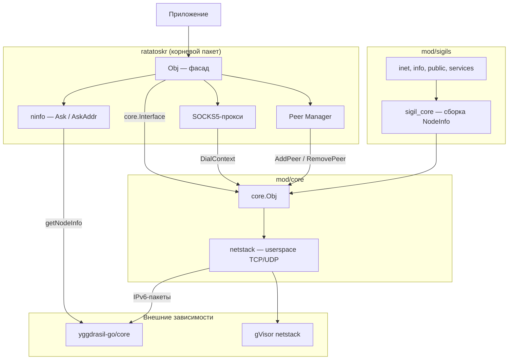
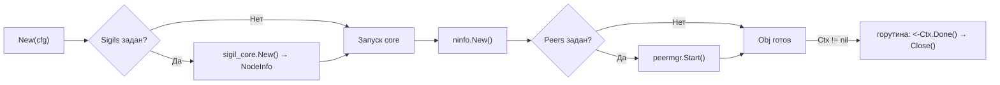
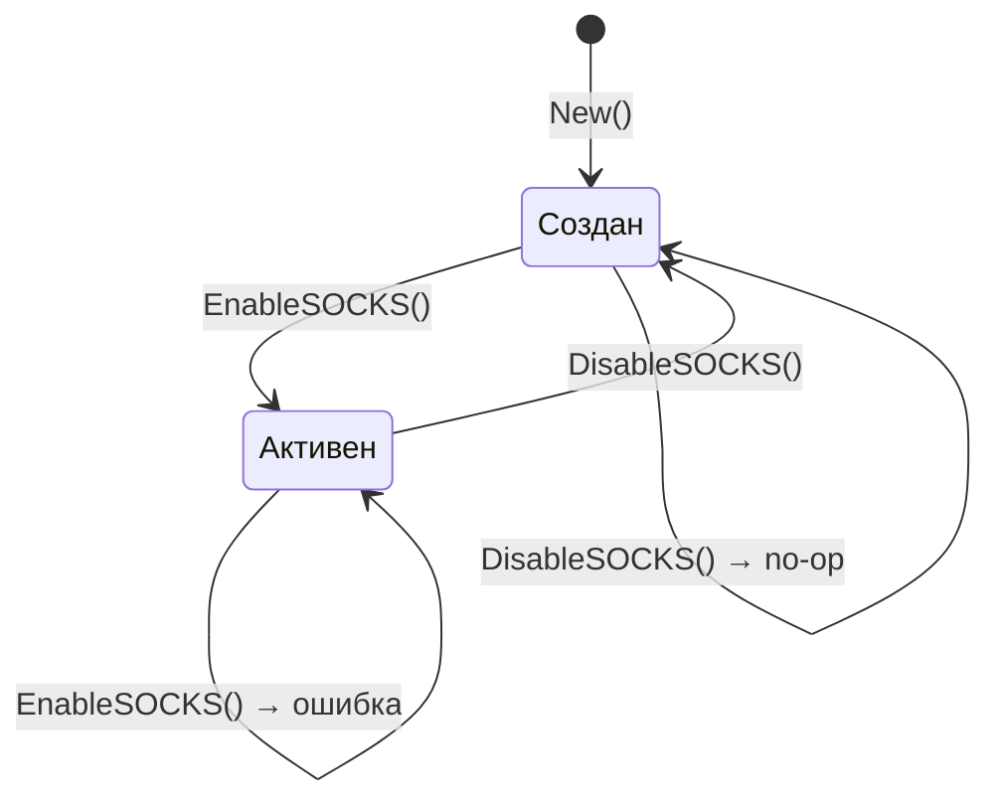
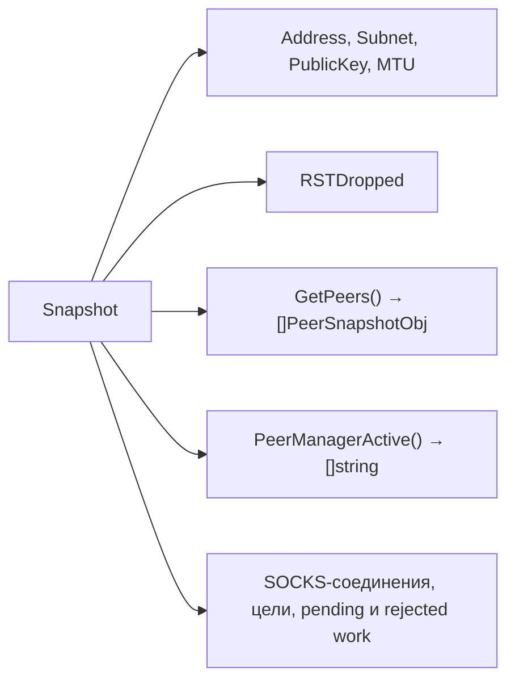
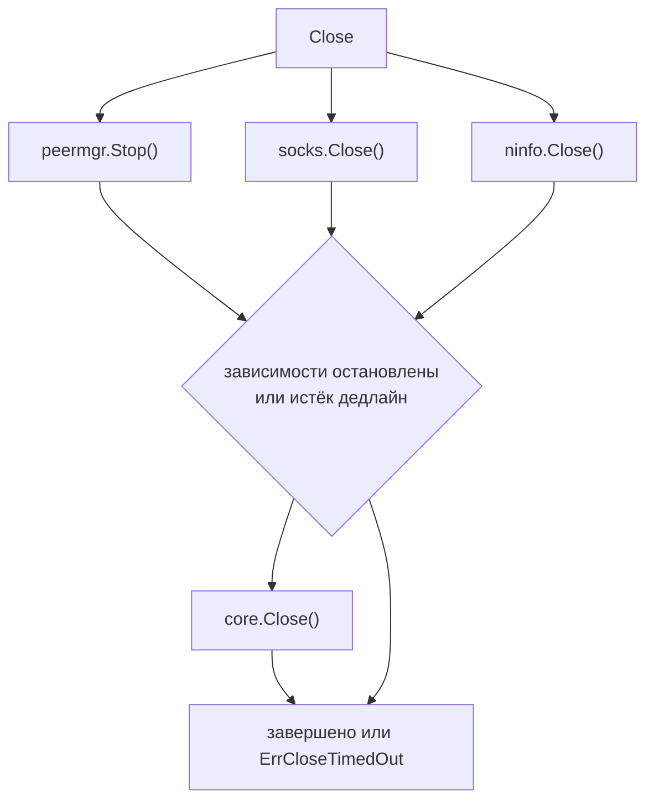
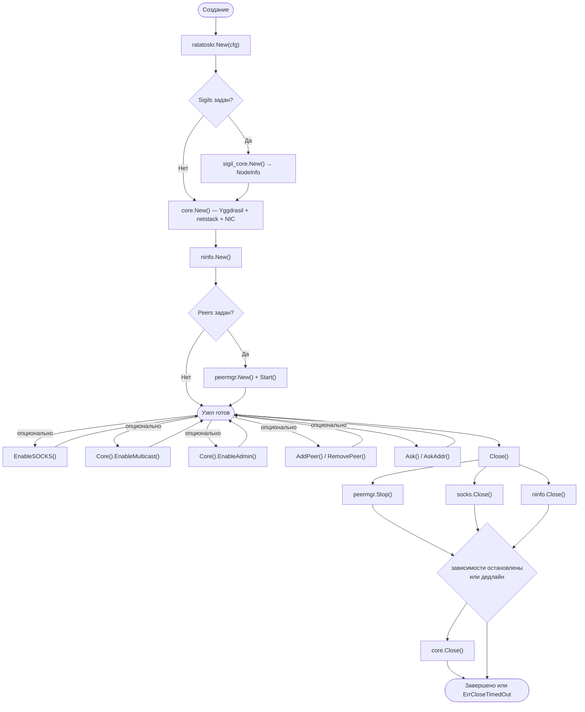

[](https://goreportcard.com/report/github.com/voluminor/ratatoskr)


# ratatoskr

> **[English version](README.md)**

Go-библиотека для встраивания узла Yggdrasil в приложение. Сетевой стек работает в userspace
на базе gVisor netstack — не требуется TUN-интерфейс, root-доступ или внешние зависимости.

- **Userspace-стек.** TCP/UDP поверх gVisor netstack, без привилегий ОС.
- **Стандартные Go-интерфейсы.** `DialContext`, `Listen`, `ListenPacket` — совместимы с `net.Conn`,
  `net.Listener`, `http.Transport` и т. д.
- **`core.Interface` как контракт.** Пакеты `socks`, `peermgr`, корневой `ratatoskr` зависят от
  интерфейса, а не от реализации `core.Obj`. Можно подставить собственную реализацию для тестов
  или нестандартных транспортов.

### ratatoskr vs yggstack

[yggstack](https://github.com/yggdrasil-network/yggstack) — готовый бинарник для конечного
пользователя (SOCKS-прокси, TCP/UDP-форвардинг через CLI-флаги). `ratatoskr` — библиотека для
разработчика: узел создаётся вызовом `ratatoskr.New()`, всё управление — через Go API.

---

## Содержание

- [Установка](#установка)
- [Быстрый старт](#быстрый-старт)
- [Архитектура](#архитектура)
- [API корневого пакета](#api-корневого-пакета)
  - [New](#new)
  - [SOCKS5-прокси](#socks5-прокси)
  - [Менеджер пиров](#менеджер-пиров)
  - [RetryPeers](#retrypeers)
  - [Ask / AskAddr](#ask--askaddr)
  - [Snapshot](#snapshot)
  - [Close](#close)
- [Конфигурация](#конфигурация)
  - [ConfigObj](#configobj)
  - [SOCKSConfigObj](#socksconfigobj)
- [Типы снимков](#типы-снимков)
- [Ошибки](#ошибки)
- [Потокобезопасность](#потокобезопасность)
- [Жизненный цикл](#жизненный-цикл)
- [Примеры использования](#примеры-использования)
- [Модули](#модули)
- [Примеры приложений](#примеры-приложений)
- [Поддерживаемые платформы](#поддерживаемые-платформы)

---

## Установка

```bash
go get github.com/voluminor/ratatoskr
```

Минимальная версия Go: **1.25**.

---

## Быстрый старт

Создать узел, подключиться к сети и сделать HTTP-запрос:

```go
package main

import (
	"context"
	"fmt"
	"io"
	"net/http"

	"github.com/voluminor/ratatoskr"
	"github.com/voluminor/ratatoskr/mod/peermgr"
)

func main() {
	ctx, cancel := context.WithCancel(context.Background())
	defer cancel()

	node, err := ratatoskr.New(ratatoskr.ConfigObj{
		Ctx: ctx,
		Peers: &peermgr.ConfigObj{
			Peers: []string{
				"tls://peer1.example.com:17117",
				"tls://peer2.example.com:17117",
			},
          MaxPerProto: 1,
		},
	})
	if err != nil {
		panic(err)
	}
	defer node.Close()

	fmt.Println("Адрес в сети:", node.Address())

	client := &http.Client{
		Transport: &http.Transport{
			DialContext: node.DialContext,
		},
	}

	resp, err := client.Get("http://[200:abcd::1]:8080/api")
	if err != nil {
		panic(err)
	}
	defer resp.Body.Close()

	body, _ := io.ReadAll(resp.Body)
	fmt.Println(string(body))
}
```

---

## Архитектура



`ratatoskr.Obj` продвигает основные сетевые и пировые методы напрямую (`DialContext`, `Listen`,
`ListenPacket`, `Address`, `Subnet`, `PublicKey`, `MTU`, `AddPeer`, `RemovePeer`, `GetPeers`). Расширенное
управление узлом (multicast, admin, retry, статистика) доступно через `Core()`. SOCKS5-прокси,
менеджер пиров и ninfo — опциональные компоненты, управляемые через методы `Obj`.

---

## API корневого пакета

### New

```go
func New(cfg ConfigObj) (*Obj, error)
```

Создаёт и запускает узел Yggdrasil. Возвращает `*Obj` — фасад с полным набором возможностей.



- Если `cfg.Config == nil` — генерируются случайные ключи
- Если `cfg.Logger == nil` — логи отбрасываются (noop-логгер)
- Циклический или вложенный глубже 64 уровней `Config.NodeInfo` отклоняется с `ErrInvalidNodeInfo`
- Если `cfg.Sigils != nil` — собирается NodeInfo из сигилов; `Config.NodeInfo` используется как база
- Если `cfg.Peers != nil` — запускается менеджер пиров; `cfg.Config.Peers` должен быть пустым
- Если `cfg.Ctx != nil` — при отмене контекста узел автоматически завершится

После успешного вызова `New` основные сетевые и пировые методы доступны напрямую через `Obj`; расширенное
управление узлом — через `Core()`:

| Метод                         | Описание                                     |
|-------------------------------|----------------------------------------------|
| `DialContext(ctx, net, addr)` | Исходящее TCP/UDP-соединение через Yggdrasil |
| `Listen(net, addr)`           | TCP-listener в сети Yggdrasil                |
| `ListenPacket(net, addr)`     | UDP-listener                                 |
| `Address()`                   | IPv6-адрес узла (200::/7)                    |
| `Subnet()`                    | Подсеть /64                                  |
| `PublicKey()`                 | Публичный ключ ed25519                       |
| `MTU()`                       | MTU стека                                    |
| `GetPeers()`                  | Список пиров с метриками                     |
| `AddPeer(uri)`                | Добавить пир                                 |
| `RemovePeer(uri)`             | Удалить пир                                  |
| `Core()`                      | Доступ к полному контракту узла (ниже)       |
| `Core().EnableMulticast()`    | mDNS-обнаружение в локальной сети            |
| `Core().DisableMulticast()`   | Остановить multicast                         |
| `Core().EnableAdmin(addr)`    | Admin-сокет (unix/tcp)                       |
| `Core().DisableAdmin()`       | Остановить admin-сокет                       |
| `Core().RetryPeers()`         | Переподключить отключённых пиров             |
| `Core().RSTDropped()`         | Счётчик отброшенных RST-пакетов              |

Предупреждение: `Core().EnableAdmin` использует upstream admin-сокет `yggdrasil-go`. Эта реализация вызывает
`os.Exit(1)` при
ошибке listen или очистки Unix-сокета. Считайте admin-доступ небезопасным операционным инструментом: проверяйте
bind-адрес перед включением и не открывайте его недоверенным пользователям.

Подробнее о сетевых операциях, компонентах и NIC — в [mod/core/README.md](mod/core/README.md).

### SOCKS5-прокси

```go
func (o *Obj) EnableSOCKS(cfg SOCKSConfigObj) error
func (o *Obj) DisableSOCKS() error
func (o *Obj) SetSOCKSMaxConnections(n int)
func (o *Obj) SOCKSMaxConnections() int
```

`EnableSOCKS` запускает SOCKS5-прокси. Резолвер создаётся автоматически на основе `cfg.Nameserver`.
`DisableSOCKS` останавливает прокси; идемпотентный.
`SetSOCKSMaxConnections` / `SOCKSMaxConnections` изменяют и читают лимит соединений во время работы.



Цикл `Enable → Disable → Enable` поддерживается. Подробнее — в [mod/socks/README.md](mod/socks/README.md).

### Менеджер пиров

```go
func (o *Obj) PeerManagerActive() []string
func (o *Obj) PeerManagerOptimize() error
```

Менеджер пиров включается через `ConfigObj.Peers` при вызове `New`. Если `Peers == nil` — методы
возвращают `nil` / `ErrPeerManagerNotEnabled`.

| Метод                   | Описание                                                           |
|-------------------------|--------------------------------------------------------------------|
| `PeerManagerActive()`   | Текущие активные пиры (копия); `nil` если менеджер не используется |
| `PeerManagerOptimize()` | Принудительная переоценка пиров (блокирует до завершения)          |

Подробнее о выборе, оконном пробинге и валидации пиров — в [mod/peermgr/README.md](mod/peermgr/README.md).

### RetryPeers

```go
node.Core().RetryPeers()
```

Инициирует немедленное переподключение отключённых пиров. `RetryPeers` находится на `core.Interface`, доступен
через `Core()`; работает независимо от менеджера пиров.

### Ask / AskAddr

```go
func (o *Obj) Ask(ctx context.Context, key ed25519.PublicKey) (*ninfo.AskResultObj, error)
func (o *Obj) AskAddr(ctx context.Context, addr string) (*ninfo.AskResultObj, error)
```

Запрос NodeInfo удалённого узла. `Ask` принимает публичный ключ, `AskAddr` — строку-адрес
(64-символьный hex, `<hex>.pk.ygg`, `[ipv6]:port` или голый IPv6). Возвращает распарсенные
метаданные, информацию о ПО и замеренный RTT.

Если удалённый узел использует `ratatoskr`, ответ автоматически разбирается на сигилы — каждый
известный сигил попадает в `AskResultObj.Node.Sigils`, остальные ключи — в `Extra`.

```go
result, err := node.AskAddr(ctx, "200:abcd::1")
if err != nil {
log.Fatal(err)
}
fmt.Printf("RTT: %s, version: %s\n", result.RTT, result.Node.Version)
if result.Software != nil {
fmt.Printf("Software: %s %s\n", result.Software.Name, result.Software.Version)
}
for name, sigil := range result.Node.Sigils {
fmt.Printf("Sigil %s: %v\n", name, sigil.Params())
}
```

Внутренне `ninfo` создаётся всегда при `New()`. Если в `ConfigObj.Sigils` переданы сигилы — они
импортируются в `ninfo` как парсеры для ответов. Подробнее — в [mod/ninfo/README.md](mod/ninfo/README.md).

### Sigils (NodeInfo)

```go
type ConfigObj struct {
// ...
Sigils []sigils.Interface
}
```

Сигилы — типизированные блоки данных для NodeInfo. Каждый сигил владеет набором ключей в NodeInfo
и умеет записывать/читать их. При передаче в `ConfigObj.Sigils`:

1. `sigil_core.New()` собирает NodeInfo из базового `Config.NodeInfo` и переданных сигилов
2. Результат записывается в `Config.NodeInfo` перед запуском core
3. Те же сигилы импортируются в `ninfo` как парсеры для `Ask`/`AskAddr`

```go
node, err := ratatoskr.New(ratatoskr.ConfigObj{
Ctx: ctx,
Sigils: []sigils.Interface{
info.New("my-node", "My cool Yggdrasil node"),
public.New(ed25519.PublicKey(pk)),
inet.New("192.168.1.1", 8080),
},
})
```

Встроенные сигилы: `info`, `public`, `inet`, `services`. Можно создавать свои, реализуя
`sigils.Interface`. Подробнее — в [mod/sigils/README.md](mod/sigils/README.md) и
[mod/sigils/sigil_core/README.md](mod/sigils/sigil_core/README.md).

### Snapshot

```go
func (o *Obj) Snapshot() SnapshotObj
```

Собирает полное состояние узла за один вызов:



Возвращает `SnapshotObj` с JSON-тегами — можно сериализовать напрямую для `/status` или `/metrics`.

### Close

```go
func (o *Obj) Close() error
```

Параллельно останавливает зависимые компоненты (`peermgr`, SOCKS и ninfo), затем
закрывает core после освобождения захваченных handler-ов и транспортов. Единый
бюджет `CloseTimeout` действует на обе фазы. Если срок истёк, teardown core всё
равно запускается best-effort, `Close()` возвращает `ErrCloseTimedOut`, а
незавершённая работа продолжается в фоне. Метод идемпотентен и безопасен для
повторных и конкурентных вызовов.



Собирает через `errors.Join` ошибки, полученные до истечения дедлайна.

---

## Конфигурация

### ConfigObj

Параметры создания узла.

| Поле           | Тип                  | По умолчанию | Описание                                                                           |
|----------------|----------------------|--------------|------------------------------------------------------------------------------------|
| `Ctx`          | `context.Context`    | `nil`        | Родительский контекст; при отмене — автоматический `Close()`. `nil` — ручное       |
| `Config`       | `*config.NodeConfig` | `nil`        | Конфигурация Yggdrasil. `nil` — случайные ключи                                    |
| `Logger`       | `yggcore.Logger`     | `nil`        | Логгер. `nil` — логи отбрасываются                                                 |
| `CloseTimeout` | `time.Duration`      | `0`          | Общий бюджет корневого shutdown. `0` — 10 с; `<0` — ошибка                         |
| `RSTQueueSize` | `int`                | `0`          | Размер отложенной очереди RST. `0` — дефолт core                                   |
| `Peers`        | `*peermgr.ConfigObj` | `nil`        | Менеджер пиров. `nil` — пиры из `Config.Peers`. Не `nil` + `Config.Peers` → ошибка |
| `Sigils`       | `[]sigils.Interface` | `nil`        | Сигилы для NodeInfo. `nil` — не используются. Комбинируется с `Config.NodeInfo`    |

### SOCKSConfigObj

Параметры SOCKS5-прокси.

| Поле                            | Тип                          | По умолчанию | Описание                                                                                                                           |
|---------------------------------|------------------------------|--------------|------------------------------------------------------------------------------------------------------------------------------------|
| `Addr`                          | string                       | обязательное | TCP `"127.0.0.1:1080"` или Unix-сокет в приватном каталоге (`0700`)                                                                |
| `Nameserver`                    | string                       | `""`         | DNS в сети Yggdrasil. `"[ipv6]:port"`. Пустая строка — только `.pk.ygg`                                                            |
| `Verbose`                       | bool                         | `false`      | Логирование каждого SOCKS-соединения                                                                                               |
| `MaxConnections`                | int                          | `0`          | Лимит одновременных соединений. `0` — безопасный дефолт, `<0` — без лимита                                                         |
| `HandshakeTimeout`              | `time.Duration`              | `0`          | Таймаут SOCKS-handshake. `0` — безопасный дефолт, `<0` — отключено                                                                 |
| `DialTimeout`                   | `time.Duration`              | `0`          | Таймаут исходящего dial. `0` — безопасный дефолт, `<0` — отключено                                                                 |
| `TunnelIdleTimeout`             | `time.Duration`              | `0`          | Таймаут простоя установленного туннеля. `0` — безопасное значение, `<0` — отключено                                                |
| `MaxAssociateTargetsPerSession` | int                          | `0`          | Лимит UDP ASSOCIATE-целей на сессию. `0` — безопасный дефолт, `<0` — без per-session лимита; per-server лимит остаётся             |
| `NameserverLookupTimeout`       | `time.Duration`              | `0`          | Таймаут DNS lookup. `0` — безопасный дефолт, `<0` — без навязанного резолвером дедлайна (действует собственный таймаут Go DNS ~5s) |
| `NameserverCacheTTL`            | `time.Duration`              | `0`          | TTL кеша успешных DNS-ответов. `0` — безопасный дефолт, `<0` — отключено                                                           |
| `NameserverCacheMaxEntries`     | int                          | `0`          | Лимит кеша успешных DNS-ответов. `0` — безопасный дефолт, `<0` — отключено                                                         |
| `Credentials`                   | `socks.CredentialsInterface` | `nil`        | Опциональная проверка username/password для SOCKS5                                                                                 |

---

## Типы снимков

### SnapshotObj

| Поле          | Тип                 | Описание                                 |
|---------------|---------------------|------------------------------------------|
| `Address`     | `string`            | IPv6-адрес узла                          |
| `Subnet`      | `string`            | Подсеть `/64`                            |
| `PublicKey`   | `string`            | Публичный ключ ed25519 (hex)             |
| `MTU`         | `uint64`            | MTU стека                                |
| `RSTDropped`  | `uint64`            | Счётчик отброшенных RST-пакетов          |
| `Peers`       | `[]PeerSnapshotObj` | Состояние каждого пира                   |
| `ActivePeers` | `[]string`          | Пиры, выбранные менеджером (`omitempty`) |
| `SOCKS`       | `SOCKSSnapshotObj`  | Состояние SOCKS5-прокси                  |

### PeerSnapshotObj

| Поле            | Тип             | Описание                       |
|-----------------|-----------------|--------------------------------|
| `URI`           | `string`        | URI подключения                |
| `Up`            | `bool`          | Подключён                      |
| `Inbound`       | `bool`          | Входящее подключение           |
| `Key`           | `string`        | Публичный ключ пира (hex)      |
| `Latency`       | `time.Duration` | Задержка                       |
| `Cost`          | `uint64`        | Стоимость маршрута             |
| `RXBytes`       | `uint64`        | Принято байт                   |
| `TXBytes`       | `uint64`        | Отправлено байт                |
| `Uptime`        | `time.Duration` | Время подключения              |
| `LastError`     | `string`        | Последняя ошибка (`omitempty`) |
| `LastErrorTime` | `time.Time`     | Время последней ошибки         |

### SOCKSSnapshotObj

| Поле                | Тип    | Описание                  |
|---------------------|--------|---------------------------|
| `Enabled`           | `bool` | Прокси запущен            |
| `Addr`              | string | Адрес (`omitempty`)       |
| `IsUnix`            | `bool` | Unix-сокет (`omitempty`)  |
| `ActiveConnections` | `int`  | Число активных соединений |

---

## Ошибки

| Переменная                 | Описание                                              |
|----------------------------|-------------------------------------------------------|
| `ErrPeersConflict`         | `Config.Peers` и `Peers` менеджер заданы одновременно |
| `ErrPeerManagerNotEnabled` | Вызван метод менеджера пиров, но менеджер не включён  |
| `ErrClosed`                | Метод вызван после закрытия узла                      |

Ошибки из `core.Interface` (`ErrNotAvailable` и т.д.) описаны в [mod/core/README.md](mod/core/README.md).

---

## Потокобезопасность

Все публичные методы `Obj` безопасны для конкурентного использования.

| Метод / группа                           | Гарантия                                                     |
|------------------------------------------|--------------------------------------------------------------|
| `DialContext`, `Listen`, `ListenPacket`  | Потокобезопасны; netstack через `atomic.Pointer`             |
| `EnableSOCKS` / `DisableSOCKS`           | Защищены мьютексом                                           |
| `Core().EnableMulticast` / `EnableAdmin` | Защищены мьютексом                                           |
| `AddPeer` / `RemovePeer`                 | Делегируют в `yggdrasil-go/core` (потокобезопасно)           |
| `PeerManagerActive`                      | Возвращает копию; защищён мьютексом                          |
| `PeerManagerOptimize`                    | Блокирует; сериализован внутри                               |
| `Ask` / `AskAddr`                        | Потокобезопасны; сетевой вызов в горутине, отменяется по ctx |
| `Close`                                  | Идемпотентный (`sync.Once`)                                  |
| `Snapshot`                               | Потокобезопасен; собирает данные из потокобезопасных методов |

---

## Жизненный цикл



Три способа завершения:

```go
// 1. Явный Close()
defer node.Close()

// 2. Через контекст
ctx, cancel := context.WithCancel(context.Background())
node, _ = ratatoskr.New(ratatoskr.ConfigObj{Ctx: ctx})
cancel() // → Close() автоматически

// 3. По сигналу ОС
ctx, stop := signal.NotifyContext(context.Background(), os.Interrupt, syscall.SIGTERM)
defer stop()
node, _ = ratatoskr.New(ratatoskr.ConfigObj{Ctx: ctx})
<-ctx.Done()
```

---

## Примеры использования

### HTTP-клиент

```go
client := &http.Client{
Transport: &http.Transport{
DialContext: node.DialContext,
},
}

resp, err := client.Get("http://[200:abcd::1]:8080/api/v1/status")
```

### TCP-сервер

```go
ln, err := node.Listen("tcp", ":8080")
if err != nil {
log.Fatal(err)
}
defer ln.Close()

fmt.Printf("http://[%s]:8080/\n", node.Address())
http.Serve(ln, handler)
```

### UDP

```go
pc, err := node.ListenPacket("udp", ":9000")
if err != nil {
log.Fatal(err)
}
defer pc.Close()

buf := make([]byte, 1500)
for {
n, addr, err := pc.ReadFrom(buf)
if err != nil {
break
}
pc.WriteTo(buf[:n], addr)
}
```

### SOCKS5-прокси

```go
err = node.EnableSOCKS(ratatoskr.SOCKSConfigObj{
Addr:           "127.0.0.1:1080",
Nameserver:     "[200:abcd::1]:53",
Verbose:        true,
MaxConnections: 128,
DialTimeout:    10 * time.Second,
})
defer node.DisableSOCKS()

// curl --proxy socks5h://127.0.0.1:1080 http://a7aa9d653b0259c67a211e7a6ccd281219db1246c75e4ebcf9edbdbdaff55924.pk.ygg/
```

Unix-сокет:

```go
dir, err := os.MkdirTemp("", "ratatoskr-socks-") // права 0700
if err != nil { return err }
err = node.EnableSOCKS(ratatoskr.SOCKSConfigObj{
Addr: filepath.Join(dir, "ygg-socks.sock"),
})
```

### Split proxy (Yggdrasil + напрямую)

SOCKS5-прокси, который маршрутизирует Yggdrasil-адреса (`200::/7`) через ноду,
а всё остальное — напрямую через обычную сеть:

```go
import (
"context"
"net"

"github.com/voluminor/ratatoskr/mod/resolver"
"github.com/voluminor/ratatoskr/mod/socks"
)

// split dialer: Yggdrasil-адреса → нода, остальное → напрямую
dial := func (ctx context.Context, network, addr string) (net.Conn, error) {
host, _, _ := net.SplitHostPort(addr)
if ip := net.ParseIP(host); ip != nil && ip[0]&0xfe == 0x02 { // 200::/7
return node.DialContext(ctx, network, addr)
}
return (&net.Dialer{}).DialContext(ctx, network, addr)
}

srv, err := socks.New(socks.ConfigObj{
Network: dialerFunc(dial),
Addr:    "127.0.0.1:1080",
Resolver: resolver.New(resolver.ConfigObj{
Dialer:     node,
Nameserver: "[200:abcd::1]:53", // DNS через Yggdrasil
}),
Logger: logger,
})
if err != nil {
return err
}
defer srv.Close()

// dialerFunc адаптирует функцию в proxy.ContextDialer
type dialerFunc func (ctx context.Context, network, addr string) (net.Conn, error)

func (f dialerFunc) DialContext(ctx context.Context, n, a string) (net.Conn, error) {
return f(ctx, n, a)
}
```

Можно использовать как system-wide SOCKS5-прокси — обычный интернет-трафик проходит
без изменений, только Yggdrasil-адреса маршрутизируются через ноду:

```bash
# Yggdrasil IPv6 — через ноду
curl --proxy socks5h://127.0.0.1:1080 http://[200:b0aa:c535:89fb:4c73:bbd:c30b:2665]/

# .pk.ygg домен — resolver конвертирует в 200::/7, затем через ноду
curl --proxy socks5h://127.0.0.1:1080 http://a7aa9d653b0259c67a211e7a6ccd281219db1246c75e4ebcf9edbdbdaff55924.pk.ygg/

# Обычный интернет — напрямую, минуя Yggdrasil
curl --proxy socks5h://127.0.0.1:1080 https://example.com/
```

### Менеджер пиров

```go
node, err := ratatoskr.New(ratatoskr.ConfigObj{
Ctx: ctx,
Peers: &peermgr.ConfigObj{
Peers: []string{
"tls://peer1.example.com:17117",
"tls://peer2.example.com:17117",
"quic://peer3.example.com:17117",
},
ProbeTimeout:    10 * time.Second,
RefreshInterval: 5 * time.Minute,
MaxPerProto:     1,
BatchSize:       2,
},
})

active := node.PeerManagerActive()
node.PeerManagerOptimize() // принудительная переоценка
```

### Snapshot → JSON

```go
snap := node.Snapshot()
data, _ := json.MarshalIndent(snap, "", "  ")
fmt.Println(string(data))
```

### Multicast и Admin

```go
// mDNS-обнаружение пиров в локальной сети
if err := node.Core().EnableMulticast(); err != nil {
log.Fatal(err)
}
defer node.Core().DisableMulticast()

// Admin-сокет
if err := node.Core().EnableAdmin("unix:///tmp/ygg-admin.sock"); err != nil {
log.Fatal(err)
}
defer node.Core().DisableAdmin()
```

`Core().EnableAdmin` делегирует upstream admin-сокету `yggdrasil-go`. Ошибки listen и очистки Unix-сокета в upstream
могут завершить процесс через `os.Exit(1)`.

### Адаптер логгера для slog

```go
type slogAdapter struct{ l *slog.Logger }

func (a slogAdapter) Infof(f string, v ...interface{})  { a.l.Info(fmt.Sprintf(f, v...)) }
func (a slogAdapter) Infoln(v ...interface{})           { a.l.Info(fmt.Sprint(v...)) }
func (a slogAdapter) Warnf(f string, v ...interface{})  { a.l.Warn(fmt.Sprintf(f, v...)) }
func (a slogAdapter) Warnln(v ...interface{})           { a.l.Warn(fmt.Sprint(v...)) }
func (a slogAdapter) Errorf(f string, v ...interface{}) { a.l.Error(fmt.Sprintf(f, v...)) }
func (a slogAdapter) Errorln(v ...interface{})          { a.l.Error(fmt.Sprint(v...)) }
func (a slogAdapter) Debugf(f string, v ...interface{}) { a.l.Debug(fmt.Sprintf(f, v...)) }
func (a slogAdapter) Debugln(v ...interface{})          { a.l.Debug(fmt.Sprint(v...)) }
func (a slogAdapter) Printf(f string, v ...interface{}) { a.l.Info(fmt.Sprintf(f, v...)) }
func (a slogAdapter) Println(v ...interface{})          { a.l.Info(fmt.Sprint(v...)) }
func (a slogAdapter) Traceln(v ...interface{})          {}

node, _ := ratatoskr.New(ratatoskr.ConfigObj{
Logger: slogAdapter{l: slog.Default()},
})
```

---

## Модули

| Модуль                                   | Описание                                                             |
|------------------------------------------|----------------------------------------------------------------------|
| [`mod/core`](mod/core/README.md)         | Ядро: узел Yggdrasil, netstack, NIC, multicast, admin                |
| [`mod/peermgr`](mod/peermgr/README.md)   | Менеджер пиров: оконный пробинг, выбор лучшего по протоколу          |
| [`mod/socks`](mod/socks/README.md)       | SOCKS5-прокси (TCP/Unix), лимит соединений                           |
| [`mod/resolver`](mod/resolver/README.md) | Резолвер: `.pk.ygg`, IP-литералы, DNS через Yggdrasil                |
| [`mod/forward`](mod/forward/README.md)   | TCP/UDP-форвардинг между локальной сетью и Yggdrasil                 |
| [`mod/probe`](mod/probe/README.md)       | Исследование топологии (BFS), трассировка маршрутов                  |
| [`mod/sigils`](mod/sigils/README.md)     | Типизированные блоки NodeInfo (info, services, public, inet)         |
| [`mod/ninfo`](mod/ninfo/README.md)       | Запрос и парсинг NodeInfo удалённых узлов, управление parse-сигилами |

---

## Примеры приложений

Готовые примеры — в [`cmd/embedded/`](cmd/embedded/):

| Пример                                | Описание                      |
|---------------------------------------|-------------------------------|
| [`http`](cmd/embedded/http)           | HTTP-сервер в сети Yggdrasil  |
| [`tiny-http`](cmd/embedded/tiny-http) | Минимальный HTTP-сервер       |
| [`tiny-chat`](cmd/embedded/tiny-chat) | Чат через Yggdrasil           |
| [`mobile`](cmd/embedded/mobile)       | Пример для мобильных платформ |

---

## Поддерживаемые платформы

Тесты запускаются на Linux (amd64, arm64), macOS (arm64) и Windows (amd64).
Кросс-сборка проверяется на каждый PR для **25 целей**:

| ОС      | Архитектуры                                                                                     |
|---------|-------------------------------------------------------------------------------------------------|
| Linux   | amd64, arm64, armv7, armv6, 386, riscv64, mips64, mips64le, mips, mipsle, ppc64, ppc64le, s390x |
| Windows | amd64, arm64, 386                                                                               |
| macOS   | amd64, arm64                                                                                    |
| FreeBSD | amd64, arm64, 386                                                                               |
| OpenBSD | amd64, arm64                                                                                    |
| NetBSD  | amd64, arm64                                                                                    |
