# ratatoskr

> **[English version](README.md)**

Go-библиотека для встраивания узла Yggdrasil в приложение. Сетевой стек работает в userspace
на базе gVisor netstack — не требуется TUN-интерфейс, root-доступ или внешние зависимости.

- **Userspace-стек.** TCP/UDP поверх gVisor netstack, без привилегий ОС.
- **Стандартные Go-интерфейсы.** `DialContext`, `Listen`, `ListenPacket` — совместимы с `net.Conn`,
  `net.Listener`, `http.Transport` и т. д.
- **`core.Interface` как контракт.** Пакеты `socks`, `peermgr`, корневой `ratatoskr` зависят от
  интерфейса, а не от реализации `core.Obj`. Можно подставить собственную реализацию для тестов
  или нестандартных транспортов.

### ratatoskr vs yggstack

[yggstack](https://github.com/yggdrasil-network/yggstack) — готовый бинарник для конечного
пользователя (SOCKS-прокси, TCP/UDP-форвардинг через CLI-флаги). `ratatoskr` — библиотека для
разработчика: узел создаётся вызовом `ratatoskr.New()`, всё управление — через Go API.

### Из коробки

- `core` — запуск узла, `DialContext`/`Listen`/`ListenPacket`, управление пирами, адрес, подсеть,
  публичный ключ
- Автоматический shutdown по `context.Context`
- Потокобезопасность, идемпотентный `Close()`

### Опционально

- **SOCKS5-прокси** — `EnableSOCKS()` / `DisableSOCKS()`
- **mDNS (multicast)** — `EnableMulticast()` / `DisableMulticast()`, обнаружение пиров в локальной сети
- **Admin-сокет** — `EnableAdmin()` / `DisableAdmin()`, unix/tcp
- **Peer manager** (`peermgr`) — ротация и оптимизация пиров; включается через `ConfigObj.Peers`
- **Resolver** (`mod/resolver`) — резолвер `.pk.ygg`-адресов
- **Forward** (`mod/forward`) — TCP/UDP-форвардинг

### Примеры

Готовые примеры — в [`cmd/embedded/`](cmd/embedded/):

| Пример                                | Описание                      |
|---------------------------------------|-------------------------------|
| [`http`](cmd/embedded/http)           | HTTP-сервер в сети Yggdrasil  |
| [`tiny-http`](cmd/embedded/tiny-http) | Минимальный HTTP-сервер       |
| [`tiny-chat`](cmd/embedded/tiny-chat) | Чат через Yggdrasil           |
| [`mobile`](cmd/embedded/mobile)       | Пример для мобильных платформ |

Также в [`cmd/yggstack/`](cmd/yggstack/) — реализация yggstack на базе ratatoskr.

## Содержание

- [Установка](#установка)
- [Быстрый старт](#быстрый-старт)
- [Архитектура](#архитектура)
- [Структура модуля](#структура-модуля)
- [Пакеты](#пакеты)
- [Конфигурация](#конфигурация)
- [Примеры использования](#примеры-использования)
- [Snapshot](#snapshot)
- [Потокобезопасность](#потокобезопасность)
- [Обработка ошибок](#обработка-ошибок)
- [Жизненный цикл](#жизненный-цикл)

## Установка

```bash
go get github.com/voluminor/ratatoskr
```

Минимальная версия Go: **1.24**.

### Поддерживаемые платформы

Тесты запускаются на Linux (amd64, arm64), macOS (arm64) и Windows (amd64).
Кросс-сборка проверяется на каждый PR для **25 целей**:

| ОС      | Архитектуры                                                                                     |
|---------|-------------------------------------------------------------------------------------------------|
| Linux   | amd64, arm64, armv7, armv6, 386, riscv64, mips64, mips64le, mips, mipsle, ppc64, ppc64le, s390x |
| Windows | amd64, arm64, 386                                                                               |
| macOS   | amd64, arm64                                                                                    |
| FreeBSD | amd64, arm64, 386                                                                               |
| OpenBSD | amd64, arm64                                                                                    |
| NetBSD  | amd64, arm64                                                                                    |

## Быстрый старт

Создать узел, подключиться к сети и сделать HTTP-запрос:

```go
package main

import (
	"context"
	"fmt"
	"io"
	"net/http"

	"github.com/voluminor/ratatoskr"
	"github.com/voluminor/ratatoskr/mod/peermgr"
)

func main() {
	ctx, cancel := context.WithCancel(context.Background())
	defer cancel()

	node, err := ratatoskr.New(ratatoskr.ConfigObj{
		// Ctx: при отмене контекста узел сам вызовет Close()
		Ctx: ctx,
		// Peers: менеджер пиров автоматически выберет лучшее подключение
		Peers: &peermgr.ConfigObj{
			Peers: []string{
				"tls://peer1.example.com:17117",
				"tls://peer2.example.com:17117",
			},
			MaxPerProto: 1, // один лучший пир на протокол
		},
	})
	if err != nil {
		panic(err)
	}
	defer node.Close()

	// IPv6-адрес узла в сети Yggdrasil (200::/7)
	fmt.Println("Адрес в сети:", node.Address())

	// Использовать узел как транспорт для стандартного http.Client
	client := &http.Client{
		Transport: &http.Transport{
			DialContext: node.DialContext,
		},
	}

	resp, err := client.Get("http://[200:abcd::1]:8080/api")
	if err != nil {
		panic(err)
	}
	defer resp.Body.Close()

	body, _ := io.ReadAll(resp.Body)
	fmt.Println(string(body))
}
```

## Архитектура

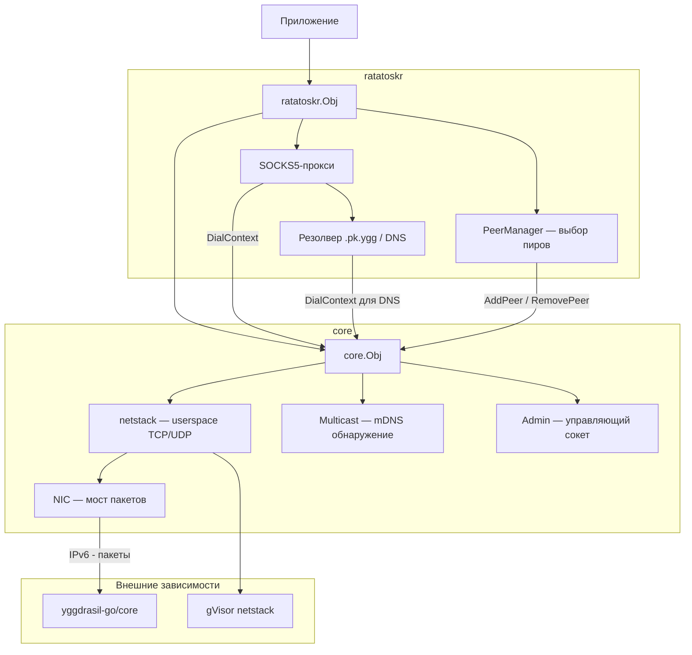

### Путь пакета

Как данные проходят через стек — от приложения до Yggdrasil-сети и обратно:

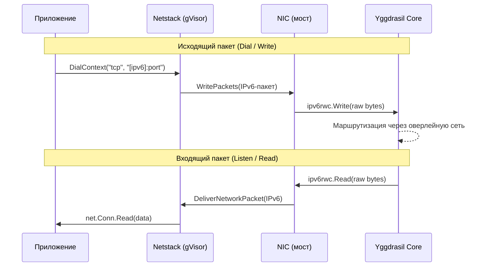

### Внутренняя архитектура NIC

NIC (`nicObj`) — мост между gVisor и Yggdrasil на уровне IPv6-пакетов.

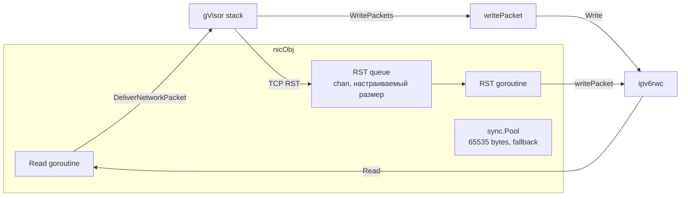

**Обработка TCP RST:** пакеты RST без payload отправляются не напрямую, а через буферизированную очередь
(`chan *PacketBuffer`). Размер очереди задаётся через `core.ConfigObj.RSTQueueSize` (по умолчанию 100).
Счётчик отброшенных RST-пакетов доступен через `core.Obj.RSTDropped()`.

**Стратегия при переполнении RST-очереди:**

1. Попытка отправить в канал
2. Если канал полон — вытеснение самого старого пакета
3. Повторная попытка отправить
4. Если снова неудача — пакет отбрасывается, инкрементируется счётчик дропов

**Запись пакетов (writePacket):** используется zero-copy через `AsViewList` — данные пакета передаются
в `ipv6rwc.Write` напрямую без копирования. Если пакет состоит из нескольких View (редкий случай),
данные собираются в буфер из `sync.Pool`. Паника в `WritePackets` перехватывается через `recover`
и логируется без краша всего стека.

## Структура модуля

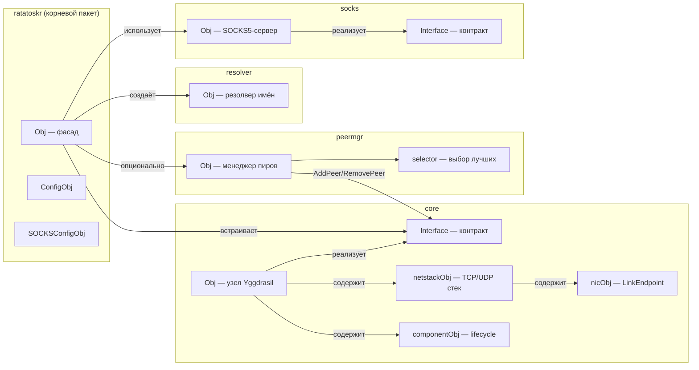

## Пакеты

### `ratatoskr` (корневой)

Фасад для встраивания. Объединяет ядро, SOCKS-прокси, резолвер и менеджер пиров в одну точку входа.

| Тип                | Назначение                                                              |
|--------------------|-------------------------------------------------------------------------|
| `Obj`              | Узел с полным набором возможностей: сетевые методы + SOCKS + управление |
| `ConfigObj`        | Контекст, конфиг Yggdrasil, логгер, таймаут, менеджер пиров             |
| `SOCKSConfigObj`   | Адрес прокси, DNS-сервер, verbose, лимит соединений                     |
| `SnapshotObj`      | Полное состояние узла: адрес, пиры, SOCKS, счётчики                     |
| `PeerSnapshotObj`  | Состояние одного пира: URI, Up, Latency, трафик                         |
| `SOCKSSnapshotObj` | Состояние SOCKS5-прокси: Enabled, Addr, IsUnix                          |

### `core`

Ядро — узел Yggdrasil с userspace сетевым стеком.

| Тип            | Назначение                                                                                                   |
|----------------|--------------------------------------------------------------------------------------------------------------|
| `Obj`          | Узел: DialContext, Listen, ListenPacket, управление пирами, multicast, admin. Ядро защищено `atomic.Pointer` |
| `Interface`    | Публичный контракт — всё, что нужно внешнему коду                                                            |
| `netstackObj`  | gVisor TCP/UDP/ICMP стек                                                                                     |
| `nicObj`       | Мост между gVisor и Yggdrasil на уровне IPv6-пакетов                                                         |
| `componentObj` | Обобщённый Enable/Disable lifecycle для multicast и admin                                                    |

### `peermgr`

Менеджер пиров — автоматический выбор и поддержание оптимального набора пиров.

| Тип              | Назначение                                                         |
|------------------|--------------------------------------------------------------------|
| `Obj`            | Менеджер: пробинг, выбор лучших, периодическое обновление          |
| `ConfigObj`      | Параметры: список кандидатов, таймауты, стратегия выбора           |
| `ValidatePeers`  | Публичная функция валидации URI: дубликаты, парсинг, проверка схем |
| `AllowedSchemes` | Допустимые транспортные схемы: `tcp`, `tls`, `quic`, `ws`, `wss`   |

**Режимы `MaxPerProto`:**

| Значение  | Поведение                                                                    |
|-----------|------------------------------------------------------------------------------|
| `0` / `1` | Один лучший пир на протокол (по умолчанию)                                   |
| `N > 1`   | Топ-N пиров на протокол, отсортированных по латентности                      |
| `-1`      | Пассивный режим: добавить всех кандидатов без выбора; пробинг не выполняется |

**Логика `optimizeActive`:**

При `BatchSize <= 1` — один батч = весь список (обратная совместимость):

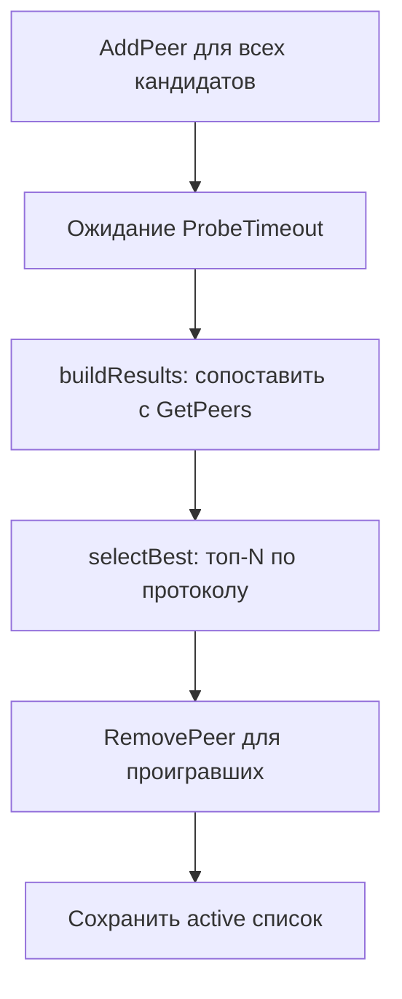

При `BatchSize >= 2` — скользящее окно, гонка на выбывание:

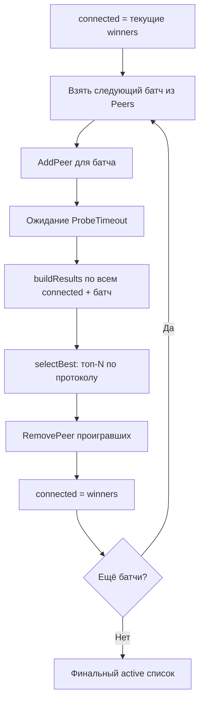

Каждый новый батч гонится с текущими победителями. Худшие отсекаются после каждого раунда — в итоге остаются лучшие из
всего списка.

### `resolver`

Резолвер имён с тремя стратегиями:

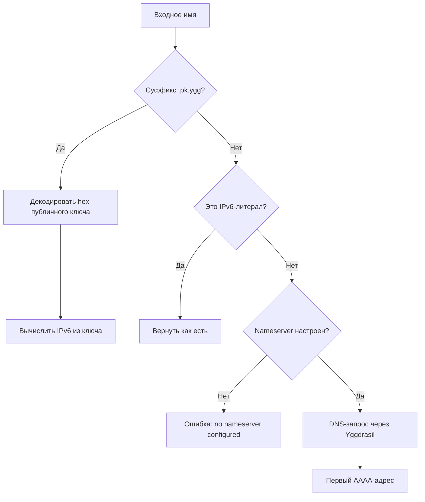

**Формат `.pk.ygg`:** `<hex-pubkey>.pk.ygg` или `subdomain.<hex-pubkey>.pk.ygg`
(при наличии поддоменов используется последний сегмент перед `.pk.ygg`).
Публичный ключ — 32 байта ed25519 в hex (64 символа).

**DNS через Yggdrasil:** если настроен `Nameserver`, DNS-запросы (`AAAA`) идут через `DialContext` ядра —
трафик не утекает в системный резолвер. Без nameserver резолвинг DNS-имён возвращает ошибку.

### `socks`

SOCKS5-прокси поверх Yggdrasil. Поддерживает TCP и Unix-сокеты. Без аутентификации.

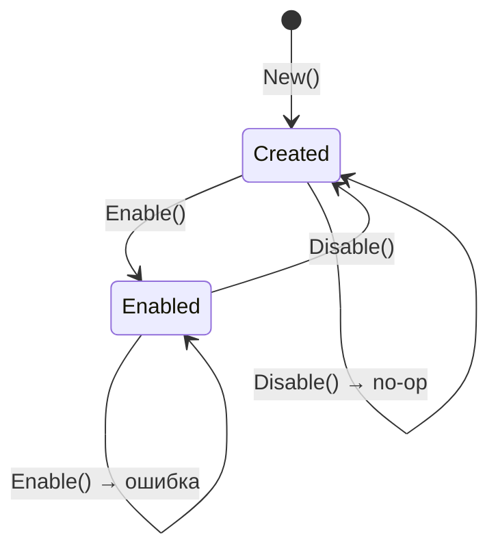

## Конфигурация

### ConfigObj (ratatoskr)

| Поле              | Тип                  | По умолчанию | Описание                                                                                                                                    |
|-------------------|----------------------|--------------|---------------------------------------------------------------------------------------------------------------------------------------------|
| `Ctx`             | `context.Context`    | `nil`        | Родительский контекст; при отмене узел автоматически вызывает `Close()`. `nil` — ручное управление                                          |
| `Config`          | `*config.NodeConfig` | `nil`        | Конфигурация Yggdrasil (ключи, listen-адреса). `nil` — генерируются случайные ключи. `Config.Peers` должен быть пустым если задан `Peers`   |
| `Logger`          | `yggcore.Logger`     | `nil`        | Логгер; `nil` — логи отбрасываются (noop). Передаётся и в ядро, и в SOCKS, и в менеджер пиров                                               |
| `CoreStopTimeout` | `time.Duration`      | `0`          | Таймаут `core.Stop()` при завершении. `0` — ожидание без ограничений                                                                        |
| `Peers`           | `*peermgr.ConfigObj` | `nil`        | Менеджер пиров. `nil` — пиры берутся из `Config.Peers` как в стандартном Yggdrasil. Не `nil` + `Config.Peers` непустой — ошибка при `New()` |

### ConfigObj (peermgr)

| Поле                 | Тип              | По умолчанию | Описание                                                                         |
|----------------------|------------------|--------------|----------------------------------------------------------------------------------|
| `Peers`              | `[]string`       | обязательное | Список URI-кандидатов: `"tls://host:port"`, `"tcp://..."`, `"quic://..."` и т.д. |
| `ProbeTimeout`       | `time.Duration`  | `10s`        | Ожидание подключения при пробинге. Игнорируется при `MaxPerProto == -1`          |
| `RefreshInterval`    | `time.Duration`  | `0`          | Интервал автоматической перепроверки. `0` — только при запуске                   |
| `MaxPerProto`        | `int`            | `1`          | Число лучших пиров на протокол. `-1` — пассивный режим                           |
| `BatchSize`          | `int`            | `0`          | Размер батча при пробинге. `0`/`1` — все сразу; `≥ 2` — скользящее окно          |
| `Logger`             | `yggcore.Logger` | обязательное | Логгер; при `nil` возвращается ошибка                                            |
| `OnNoReachablePeers` | `func()`         | `nil`        | Колбек при отсутствии доступных пиров после пробинга                             |

### Валидация пиров (peermgr)

`peermgr.ValidatePeers([]string) → ([]peerEntryObj, []error)` — публичная функция, вызывается в `New()`.
Может использоваться отдельно для предварительной проверки списка.

| Шаг           | Действие                                                                          |
|---------------|-----------------------------------------------------------------------------------|
| Пустые строки | Пропускаются без ошибки                                                           |
| Дубликаты     | Ошибка `"duplicate peer %q"`, запись отбрасывается; порядок остальных сохраняется |
| Парсинг URI   | `url.Parse`; при ошибке — запись отбрасывается                                    |
| Host          | Обязателен; `"tls://:8080"` — ошибка `"missing host"`                             |
| Схема         | Из `AllowedSchemes`: `tcp`, `tls`, `quic`, `ws`, `wss`; остальные — ошибка        |

В `New()`: каждая ошибка логируется через `Warnf`. Если после валидации не осталось ни одного пира — `New()` возвращает
ошибку.

### ConfigObj (core)

| Поле              | Тип                  | По умолчанию | Описание                                         |
|-------------------|----------------------|--------------|--------------------------------------------------|
| `Config`          | `*config.NodeConfig` | `nil`        | Конфигурация Yggdrasil. `nil` — случайные ключи  |
| `Logger`          | `yggcore.Logger`     | `nil`        | Логгер; `nil` — noop                             |
| `CoreStopTimeout` | `time.Duration`      | `0`          | Таймаут `core.Stop()`. `0` — без ограничений     |
| `RSTQueueSize`    | `int`                | `100`        | Размер очереди отложенных RST-пакетов. `0` → 100 |

### SOCKSConfigObj (ratatoskr)

| Поле             | Тип    | По умолчанию | Описание                                                                                                                    |
|------------------|--------|--------------|-----------------------------------------------------------------------------------------------------------------------------|
| `Addr`           | string | обязательное | Адрес прокси: TCP `"127.0.0.1:1080"` или Unix-сокет `"/tmp/ygg.sock"`. Путь, начинающийся с `/` или `.` — Unix              |
| `Nameserver`     | string | `""`         | DNS-сервер в сети Yggdrasil. Формат: `"[ipv6]:port"`. Пустая строка — только `.pk.ygg` и IP-литералы                        |
| `Verbose`        | bool   | `false`      | Подробное логирование каждого SOCKS-соединения                                                                              |
| `MaxConnections` | int    | `0`          | Максимум одновременных соединений. `0` — без ограничений. При достижении лимита новые соединения ожидают освобождения слота |

### Валидация адресов

Сетевые методы (`DialContext`, `Listen`, `ListenPacket`) принимают адреса в формате `"[ipv6]:port"` или `":port"`.

| Ввод                | Поведение                                     |
|---------------------|-----------------------------------------------|
| `"[200:abc::1]:80"` | Валидный IPv6 + порт                          |
| `":8080"`           | Пустой host — bind на все адреса (для Listen) |
| `":0"`              | Эфемерный порт (назначается ОС)               |
| `"localhost:80"`    | Ошибка: `invalid IP address "localhost"`      |
| `"[::1]:99999"`     | Ошибка: `port 99999 out of range 0-65535`     |
| `"bad"`             | Ошибка: `net.SplitHostPort` failed            |

Поддерживаемые сети: `tcp`, `tcp6` (для Dial/Listen), `udp`, `udp6` (для Dial/ListenPacket).

## Примеры использования

### HTTP-клиент через Yggdrasil

Простейший способ — передать `node.DialContext` как транспорт. Все TCP-соединения пойдут через Yggdrasil.

```go
client := &http.Client{
Transport: &http.Transport{
// node.DialContext маршрутизирует соединения через оверлейную сеть
DialContext: node.DialContext,
},
}

// Обращение к сервису по IPv6-адресу в сети Yggdrasil
resp, err := client.Get("http://[200:abcd::1]:8080/api/v1/status")
if err != nil {
log.Fatal(err)
}
defer resp.Body.Close()
```

### TCP-сервер в сети Yggdrasil

Узел становится виден в сети Yggdrasil по своему IPv6-адресу. `Listen` принимает соединения только из
оверлейной сети — с внешним интернетом сервер не контактирует.

```go
// ":8080" — слушать на всех адресах узла (эквивалент [200:...]:8080)
ln, err := node.Listen("tcp", ":8080")
if err != nil {
log.Fatal(err)
}
defer ln.Close()

fmt.Printf("Сервер доступен по адресу: http://[%s]:8080/\n", node.Address())

// Стандартный http.Serve работает с любым net.Listener
http.Serve(ln, http.HandlerFunc(func (w http.ResponseWriter, r *http.Request) {
fmt.Fprintf(w, "Hello from Yggdrasil node %s", node.Address())
}))
```

### UDP в сети Yggdrasil

```go
pc, err := node.ListenPacket("udp", ":9000")
if err != nil {
log.Fatal(err)
}
defer pc.Close()

buf := make([]byte, 1500)
for {
n, addr, err := pc.ReadFrom(buf)
if err != nil {
break
}
log.Printf("UDP от %s: %s", addr, buf[:n])
// Ответить отправителю
pc.WriteTo(buf[:n], addr)
}
```

### SOCKS5-прокси с DNS через Yggdrasil

SOCKS5-прокси позволяет использовать Yggdrasil из любого приложения, поддерживающего SOCKS5 (curl, браузер, git).
`socks5h://` — режим с резолвингом имён на стороне прокси.

```go
err = node.EnableSOCKS(ratatoskr.SOCKSConfigObj{
// Адрес, на котором будет слушать SOCKS5-прокси
Addr: "127.0.0.1:1080",
// DNS-сервер внутри сети Yggdrasil — имена резолвятся через оверлей
Nameserver: "[200:abcd::1]:53",
// Логировать каждое соединение (полезно для отладки)
Verbose: true,
// Максимум 128 одновременных соединений; 0 — без ограничений
MaxConnections: 128,
})
if err != nil {
log.Fatal(err)
}
defer node.DisableSOCKS()

// Использование из терминала:
// curl --proxy socks5h://127.0.0.1:1080 http://example.pk.ygg/
// curl --proxy socks5h://127.0.0.1:1080 http://[200:abcd::1]:8080/
```

#### SOCKS5-прокси через Unix-сокет

```go
err = node.EnableSOCKS(ratatoskr.SOCKSConfigObj{
// Путь, начинающийся с "/" — Unix-сокет (быстрее TCP для локального использования)
Addr:       "/tmp/ygg-socks.sock",
Nameserver: "[200:abcd::1]:53",
})
defer node.DisableSOCKS()

// curl --proxy socks5h://unix:/tmp/ygg-socks.sock http://example.pk.ygg/
```

### Менеджер пиров

#### Активный режим — выбор лучших

Менеджер пробирует всех кандидатов и оставляет N лучших по протоколу. При `RefreshInterval > 0` пробинг
повторяется периодически.

```go
node, err := ratatoskr.New(ratatoskr.ConfigObj{
Ctx: ctx,
Peers: &peermgr.ConfigObj{
Peers: []string{
"tls://peer1.example.com:17117",
"tls://peer2.example.com:17117",
"tls://peer3.example.com:17117",
"quic://peer4.example.com:17117",
},
// Ждать подключения не более 10 секунд на батч
ProbeTimeout: 10 * time.Second,
// Перепробировать каждые 5 минут
RefreshInterval: 5 * time.Minute,
// Один лучший TLS-пир и один лучший QUIC-пир
MaxPerProto: 1,
// Скользящее окно: два кандидата за раз
BatchSize: 2,
// Вызвать при отсутствии достижимых пиров
OnNoReachablePeers: func () {
log.Println("Нет доступных пиров!")
},
},
})

// Получить текущие активные пиры (выбранные менеджером)
active := node.PeerManagerActive()
log.Println("Активные пиры:", active)

// Инициировать внеплановую перепроверку (блокирует до завершения)
if err := node.PeerManagerOptimize(); err != nil {
log.Println("Оптимизация:", err)
}
```

#### Пассивный режим — добавить всех без выбора

Пассивный режим (`MaxPerProto: -1`) не выполняет пробинг и добавляет всех кандидатов сразу.
Идентично поведению стандартного Yggdrasil с `Config.Peers`.

```go
Peers: &peermgr.ConfigObj{
Peers: []string{
"tls://peer1.example.com:17117",
"tls://peer2.example.com:17117",
},
// -1 = пассивный режим, без пробинга
MaxPerProto: -1,
// Переподключать весь список каждые 10 минут
RefreshInterval: 10 * time.Minute,
},
```

#### Предварительная валидация списка пиров

```go
import "github.com/voluminor/ratatoskr/mod/peermgr"

peers := []string{
"tls://peer1.example.com:17117",
"tls://peer1.example.com:17117", // дубликат
"ftp://invalid:1234",            // неподдерживаемая схема
"", // пустая строка, будет пропущена
}

valid, errs := peermgr.ValidatePeers(peers)
for _, e := range errs {
log.Println("Ошибка пира:", e)
}
log.Printf("Валидных пиров: %d", len(valid))
```

### Управление пирами в runtime

```go
// Добавить пир вручную (без менеджера)
if err := node.AddPeer("tls://1.2.3.4:17117"); err != nil {
log.Println("AddPeer:", err)
}
if err := node.AddPeer("quic://[200:abc::1]:17117"); err != nil {
log.Println("AddPeer:", err)
}

// Удалить пир
if err := node.RemovePeer("tls://1.2.3.4:17117"); err != nil {
log.Println("RemovePeer:", err)
}

// Переподключить все отключённые пиры
node.RetryPeers()
```

### Мониторинг через Snapshot

`Snapshot()` собирает полное состояние узла за один атомарный вызов.

```go
snap := node.Snapshot()

// Базовые параметры узла
log.Printf("Адрес:      %s", snap.Address)
log.Printf("Подсеть:    %s", snap.Subnet)
log.Printf("Публ. ключ: %s", snap.PublicKey)
log.Printf("MTU:        %d", snap.MTU)
log.Printf("RST дропов: %d", snap.RSTDropped)

// Состояние пиров
for _, p := range snap.Peers {
status := "DOWN"
if p.Up {
status = fmt.Sprintf("UP, latency=%.1fms", float64(p.Latency)/float64(time.Millisecond))
}
log.Printf("  Пир %s: %s, RX=%d TX=%d", p.URI, status, p.RXBytes, p.TXBytes)
}

// Пиры, выбранные менеджером
if len(snap.ActivePeers) > 0 {
log.Println("Активные (менеджер):", snap.ActivePeers)
}

// Состояние SOCKS
if snap.SOCKS.Enabled {
log.Printf("SOCKS5: %s (unix=%v)", snap.SOCKS.Addr, snap.SOCKS.IsUnix)
}

// Сериализовать в JSON для экспорта (например, в /metrics или /status)
data, _ := json.MarshalIndent(snap, "", "  ")
fmt.Println(string(data))
```

### Логирование

`ratatoskr` принимает любой объект, реализующий `yggcore.Logger`. Пример адаптера для `log/slog`:

```go
import (
"log/slog"
"fmt"
)

type slogAdapter struct{ l *slog.Logger }

func (a slogAdapter) Infof(f string, v ...interface{})  { a.l.Info(fmt.Sprintf(f, v...)) }
func (a slogAdapter) Infoln(v ...interface{})           { a.l.Info(fmt.Sprint(v...)) }
func (a slogAdapter) Warnf(f string, v ...interface{})  { a.l.Warn(fmt.Sprintf(f, v...)) }
func (a slogAdapter) Warnln(v ...interface{})           { a.l.Warn(fmt.Sprint(v...)) }
func (a slogAdapter) Errorf(f string, v ...interface{}) { a.l.Error(fmt.Sprintf(f, v...)) }
func (a slogAdapter) Errorln(v ...interface{})          { a.l.Error(fmt.Sprint(v...)) }
func (a slogAdapter) Debugf(f string, v ...interface{}) { a.l.Debug(fmt.Sprintf(f, v...)) }
func (a slogAdapter) Debugln(v ...interface{})          { a.l.Debug(fmt.Sprint(v...)) }
func (a slogAdapter) Printf(f string, v ...interface{}) { a.l.Info(fmt.Sprintf(f, v...)) }
func (a slogAdapter) Println(v ...interface{})          { a.l.Info(fmt.Sprint(v...)) }
func (a slogAdapter) Traceln(v ...interface{})          {}

node, err := ratatoskr.New(ratatoskr.ConfigObj{
Logger: slogAdapter{l: slog.Default()},
})
```

### Multicast и Admin

```go
import (
"os"
golog "github.com/gologme/log"
)

// mDNS-обнаружение пиров в локальной сети.
// Используемые интерфейсы задаются в NodeConfig.MulticastInterfaces.
mcLogger := golog.New(os.Stderr, "[multicast] ", golog.LstdFlags)
if err := node.EnableMulticast(mcLogger); err != nil {
log.Fatal(err)
}
defer node.DisableMulticast()

// Admin-сокет — JSON API для управления узлом.
// Unix-сокет (рекомендуется для локального управления):
if err := node.EnableAdmin("unix:///tmp/ygg-admin.sock"); err != nil {
log.Fatal(err)
}
// Или TCP:
// node.EnableAdmin("tcp://127.0.0.1:9001")
defer node.DisableAdmin()
```

### Graceful shutdown

Три способа завершить работу узла:

```go
// 1. Явный вызов Close() — идемпотентный, безопасен для повторного вызова
defer node.Close()

// 2. Через контекст — Close() вызывается автоматически при отмене
ctx, cancel := context.WithCancel(context.Background())
node, _ = ratatoskr.New(ratatoskr.ConfigObj{Ctx: ctx})
// ...
cancel() // → узел завершается самостоятельно

// 3. По сигналу ОС
ctx, stop := signal.NotifyContext(context.Background(), os.Interrupt, syscall.SIGTERM)
defer stop()
node, _ = ratatoskr.New(ratatoskr.ConfigObj{Ctx: ctx})
<-ctx.Done() // ждать сигнала; узел уже закрывается
```

## Snapshot

`Snapshot()` — собирает полное состояние узла за один вызов. Возвращает `SnapshotObj` с JSON-тегами.

| Поле          | Тип                 | Описание                                          |
|---------------|---------------------|---------------------------------------------------|
| `Address`     | `string`            | IPv6-адрес узла                                   |
| `Subnet`      | `string`            | Подсеть `/64`                                     |
| `PublicKey`   | `string`            | Публичный ключ ed25519 (hex)                      |
| `MTU`         | `uint64`            | MTU стека                                         |
| `RSTDropped`  | `int64`             | Счётчик отброшенных RST-пакетов                   |
| `Peers`       | `[]PeerSnapshotObj` | Состояние каждого пира (URI, Up, Latency, трафик) |
| `ActivePeers` | `[]string`          | Пиры, выбранные менеджером (`omitempty`)          |
| `SOCKS`       | `SOCKSSnapshotObj`  | Состояние SOCKS5-прокси (Enabled, Addr, IsUnix)   |

## Потокобезопасность

Все публичные методы `Obj` и `core.Obj` безопасны для конкурентного использования.

| Метод / группа                          | Гарантия                                                                            |
|-----------------------------------------|-------------------------------------------------------------------------------------|
| `DialContext`, `Listen`, `ListenPacket` | Потокобезопасны; netstack защищён через `atomic.Pointer`                            |
| `EnableSOCKS` / `DisableSOCKS`          | Защищены мьютексом; повторный `Enable` без `Disable` — ошибка                       |
| `EnableMulticast` / `DisableMulticast`  | Защищены `sync.RWMutex`; повторный `Enable` — ошибка                                |
| `EnableAdmin` / `DisableAdmin`          | Аналогично multicast                                                                |
| `AddPeer` / `RemovePeer`                | Потокобезопасны; ядро защищено `atomic.Pointer` (делегируют в `yggdrasil-go/core`)  |
| `PeerManagerActive`                     | Защищён мьютексом внутри `peermgr.Obj`; возвращает копию списка                     |
| `PeerManagerOptimize`                   | Блокирует до завершения; сериализован с автоматическим пробингом через `optimizeMu` |
| `Close`                                 | Идемпотентный (`sync.Once`); безопасен для повторного вызова и конкурентного вызова |
| `Address`, `Subnet`, `PublicKey`, `MTU` | Потокобезопасны; ядро и netstack через `atomic.Pointer`                             |
| `Snapshot`                              | Потокобезопасен; собирает данные из потокобезопасных методов                        |

**Конкурентный Enable multicast + admin:** обработчики admin регистрируются атомарно через отдельный
`handlersMu` мьютекс после завершения `enable()`, что исключает ABBA-deadlock между компонентами.

## Обработка ошибок

### Методы возвращающие ошибки

| Метод                 | Ошибки                                                                         |
|-----------------------|--------------------------------------------------------------------------------|
| `New`                 | Ошибка создания core, конфликт `Config.Peers` + `Peers`, ошибка старта peermgr |
| `DialContext`         | `ErrNotAvailable` (узел закрыт), ошибки gVisor, невалидный адрес               |
| `Listen`              | `ErrNotAvailable`, ошибки gVisor, невалидный адрес                             |
| `ListenPacket`        | `ErrNotAvailable`, ошибки gVisor, невалидный адрес                             |
| `EnableSOCKS`         | `"SOCKS already enabled"`, ошибка listen (занят порт / невалидный путь)        |
| `DisableSOCKS`        | Ошибка закрытия listener                                                       |
| `EnableMulticast`     | `"multicast already enabled"`, невалидный regex, ошибка `multicast.New`        |
| `EnableAdmin`         | `"admin already enabled"`, невалидный адрес, `admin.New` вернул nil            |
| `AddPeer`             | Невалидный URI, ошибка ядра                                                    |
| `RemovePeer`          | Невалидный URI, ошибка ядра                                                    |
| `PeerManagerOptimize` | `"peermgr: not running"` если менеджер не запущен                              |
| `Close`               | Собирает ошибки всех компонентов через `errors.Join`; идемпотентный            |

### ErrNotAvailable

Возвращается из `DialContext`, `Listen`, `ListenPacket` если netstack уже уничтожен (после `Close()`).

```go
conn, err := node.DialContext(ctx, "tcp", "[200:abc::1]:80")
if errors.Is(err, ratatoskr.ErrNotAvailable) {
// Узел уже закрыт — не пытаться переподключиться
return
}
```

### Unix-сокет (SOCKS)

При запуске на Unix-сокете обрабатывается случай устаревшего файла:

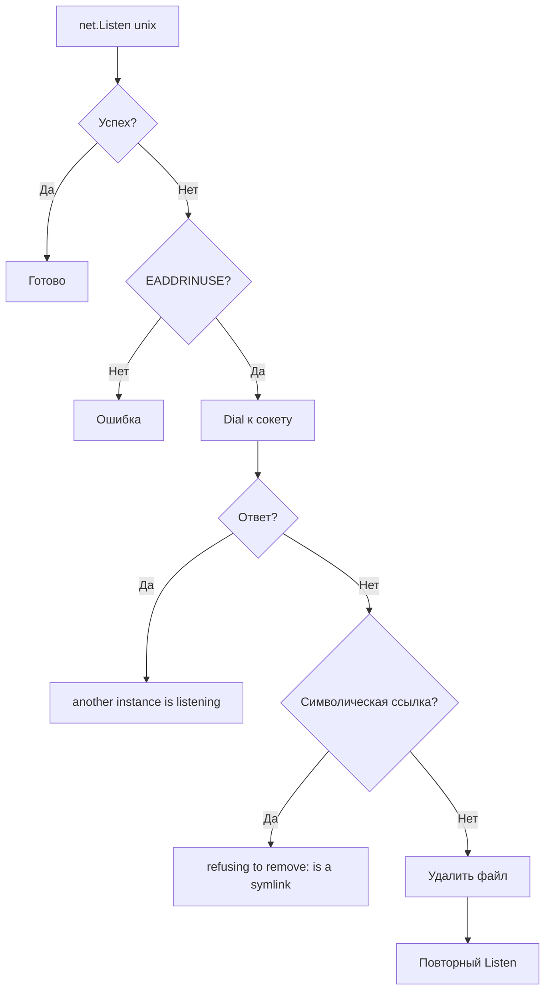

### Rate limiting (SOCKS)

При установленном `MaxConnections > 0` прокси ограничивает число одновременных соединений через семафор:

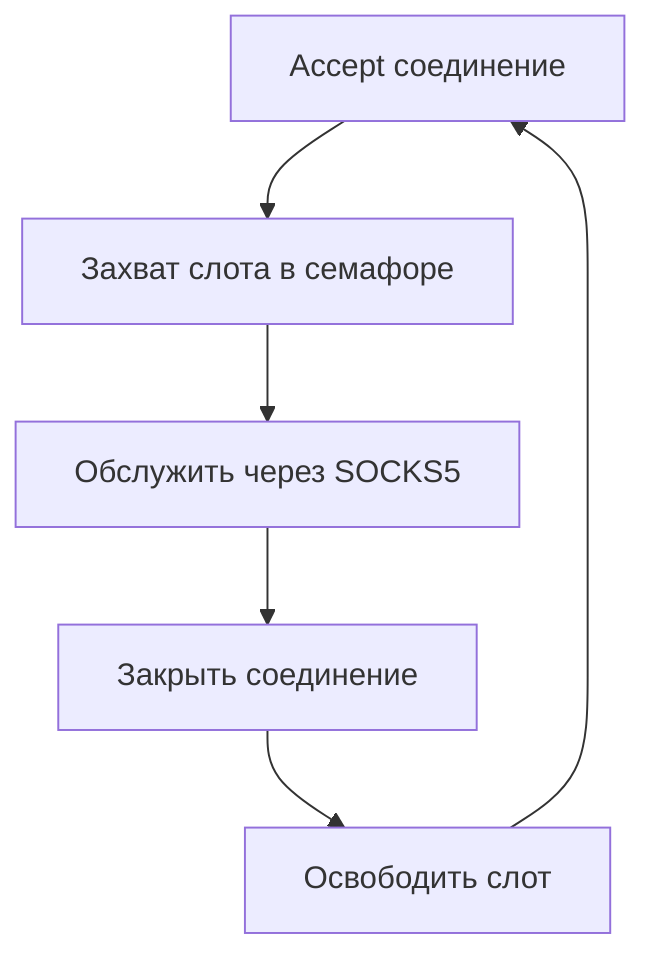

- `Accept` вызывается **до** захвата семафора — при shutdown `listener.Close()` корректно разблокирует ожидание
- Семафор блокирует обработку при достижении лимита; соединение уже принято, но ждёт слота
- Слот семафора освобождается ровно один раз при закрытии соединения (`sync.Once`)

## Жизненный цикл

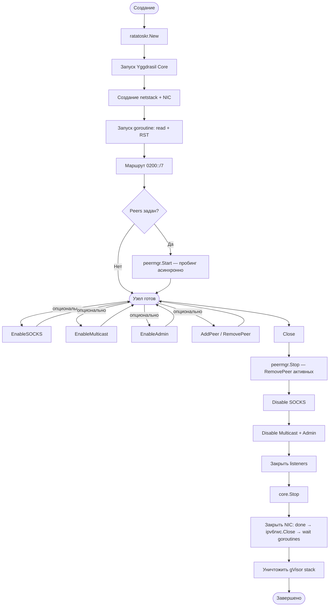

### Порядок shutdown (Close)

1. **peermgr.Stop()** — отмена контекста пробинга, ожидание горутин, `RemovePeer` всех активных пиров
2. **Disable SOCKS** — закрытие listener останавливает `Serve`, `wg.Wait()` ждёт завершения. Unix-сокет удаляется
3. **Disable Multicast + Admin** — вызов `stopFn()` каждого компонента
4. **Закрытие listeners** — все listener'ы, созданные через `Listen`/`ListenPacket`, закрываются
5. **core.Stop()** — остановка Yggdrasil core. Разблокирует `ipv6rwc.Read()` в NIC
6. **NIC Close** — `close(done)` сигнализирует горутинам, `ipv6rwc.Close()`, ожидание `readDone` и `rstDone`, очистка
   RST-очереди, `RemoveNIC`
7. **stack.Destroy()** — уничтожение gVisor стека

При наличии `CoreStopTimeout > 0`: если `core.Stop()` не завершился за указанное время,
логируется предупреждение и shutdown продолжается.

### Автозавершение через контекст

Если передан `Ctx` в `ConfigObj`, горутина слушает отмену контекста и вызывает `Close()` автоматически.
При ручном `Close()` горутина завершается через канал `done`.
