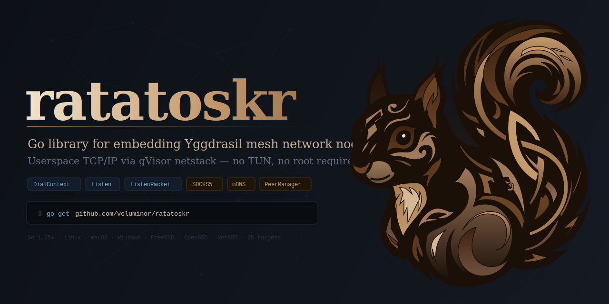
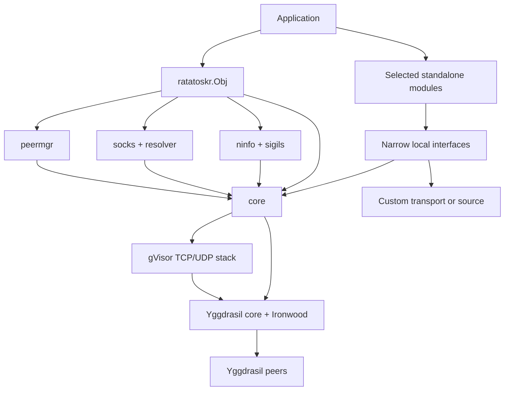
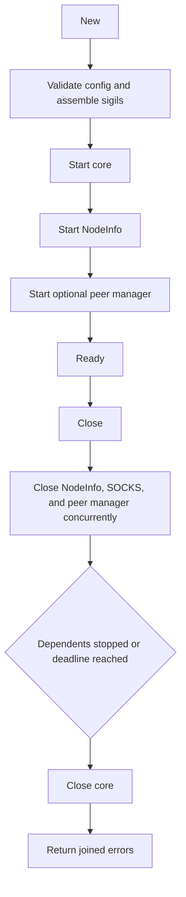

<p align="center">
  
</p>

# Ratatoskr

[](https://pkg.go.dev/github.com/voluminor/ratatoskr)
[](LICENSE)

Ratatoskr embeds a Yggdrasil node in a Go process and exposes its userspace TCP and UDP stack through standard Go
networking interfaces. Applications can use the complete root package or import only the peer manager, forwarding,
SOCKS5, resolver, NodeInfo, topology, or sigil components they need.

It does not require a TUN interface, root privileges, or an external Yggdrasil process. The main module has four direct
external module requirements: Yggdrasil core, gVisor, `golang.org/x/net`, and `go-socks5`.

## Contents

- [Imports and releases](#imports-and-releases)
  - [Canonical module](#canonical-module)
  - [Ratatoskr mirror](#ratatoskr-mirror)
  - [Install through Yggdrasil](#install-through-yggdrasil)
- [Why Ratatoskr](#why-ratatoskr)
- [Sigils](#sigils)
- [Choose a package](#choose-a-package)
- [Quick start](#quick-start)
- [Root-package recipes](#root-package-recipes)
  - [Keep a stable identity](#keep-a-stable-identity)
  - [Serve TCP and UDP](#serve-tcp-and-udp)
  - [Run a SOCKS5 endpoint](#run-a-socks5-endpoint)
  - [Publish typed NodeInfo](#publish-typed-nodeinfo)
  - [Query remote NodeInfo](#query-remote-nodeinfo)
- [Architecture](#architecture)
- [Root package contract](#root-package-contract)
  - [Configuration](#configuration)
  - [Lifecycle and errors](#lifecycle-and-errors)
  - [Admin socket](#admin-socket)
- [Modules](#modules)
- [Performance](#performance)
- [Platforms](#platforms)
- [Project documentation](#project-documentation)

## Imports and releases

Tagged releases are ready for normal Go module use. The release workflow generates the source files, tests that exact
source tree, and publishes a stripped tag containing the generated `target` package and a complete `go.mod`. Consumers
do not need the project generators, the development workspace, or `go generate`.

A checkout of the development branch is different: generated files are intentionally not tracked there. Contributors
must run the bootstrap described in [CONTRIBUTING.md](CONTRIBUTING.md).

Ratatoskr requires Go 1.25 or newer.

### Canonical module

Install the canonical GitHub module:

```bash
go get github.com/voluminor/ratatoskr@latest
```

Use the same module path in source code:

```go
import "github.com/voluminor/ratatoskr"
```

### Ratatoskr mirror

[ratatoskr.space/pkg/ratatoskr](https://www.ratatoskr.space/pkg/ratatoskr) mirrors release source, archives, metadata,
and Go proxy routes. Install its HTTPS module identity with:

```bash
GOPROXY=https://ratatoskr.space GOSUMDB=off \
  go get ratatoskr.space/pkg/ratatoskr@latest
```

Then import the mirror path:

```go
import "ratatoskr.space/pkg/ratatoskr"
```

The GitHub, HTTPS-mirror, and Yggdrasil paths are distinct Go module identities. Use one identity consistently in a
module. `GOSUMDB=off` is required for mirror identities because the public checksum database indexes the canonical
GitHub module path, not the rewritten mirror path.

### Install through Yggdrasil

When the Go command already has access to the Yggdrasil network, the same mirror is available at
`14cc7d57b5e70f679b851fe5b272ce17c70632ff4beb5b35ab64bc706b2485af.pk.ygg`:

```bash
YGG_HOST="14cc7d57b5e70f679b851fe5b272ce17c70632ff4beb5b35ab64bc706b2485af.pk.ygg"
GOPROXY="http://${YGG_HOST}" GOSUMDB=off GOINSECURE="${YGG_HOST}/*" \
  go get "${YGG_HOST}/pkg/ratatoskr@latest"
```

Imports must use that same host:

```go
import ratatoskr "14cc7d57b5e70f679b851fe5b272ce17c70632ff4beb5b35ab64bc706b2485af.pk.ygg/pkg/ratatoskr"
```

The Yggdrasil endpoint uses plain HTTP inside the encrypted overlay, so the Go command needs the explicit
`GOINSECURE` pattern shown above.

## Why Ratatoskr

- `ratatoskr.New` creates Yggdrasil core, gVisor TCP/UDP, NodeInfo querying, and optional managed peers behind one
  lifecycle.
- `DialContext`, `Listen`, and `ListenPacket` return the `net.Conn`, `net.Listener`, and `net.PacketConn` abstractions
  used by `net/http` and other Go libraries.
- The data path stays in userspace and does not require TUN setup or elevated privileges.
- Most subpackages depend on narrow local interfaces. A Ratatoskr core satisfies them, while an application can provide
  another transport or use the component without the root facade.
- The root `go.mod` declares four direct external modules, including Yggdrasil core and the gVisor stack that provide
  the network itself.
- Constructors copy mutable configuration where required. Components that accept work expose `Close() error`, and the
  root applies one bounded shutdown budget.
- Snapshots, peer state, NodeInfo queries, topology probes, and benchmark tooling are available without opening the
  upstream admin listener.

Ratatoskr is a library rather than a ready-made system proxy. Applications decide how identities are stored, which
peers are trusted, which ports are exposed, and which limits apply at public boundaries.

## Sigils

Yggdrasil NodeInfo is an open `map[string]any`. Sigils add small typed contracts to groups of NodeInfo keys without
turning NodeInfo into one fixed global schema. A sigil validates local data, publishes its owned keys, recognizes the
same shape in a remote response, and returns independent copies across package boundaries.

Their purpose is to make node metadata useful to software while preserving extension points:

1. The application creates any built-in or custom sigils it needs.
2. `ratatoskr.New` assembles all fragments before starting the node.
3. A key conflict or invalid sigil aborts construction; partial metadata is never published.
4. `Ask` and `AskAddr` parse known remote sigils and preserve unknown valid sigil names and unclaimed fields.

The generated registry connects all built-in sigils at one point. Individual sigil packages remain independently
editable and importable.

| System sigil | Purpose                                              | Detailed contract                                |
|--------------|------------------------------------------------------|--------------------------------------------------|
| `info`       | Node name, role, location, contacts, and description | [info README](mod/sigils/info/README.md)         |
| `services`   | Named Yggdrasil service ports                        | [services README](mod/sigils/services/README.md) |
| `public`     | Public peering endpoints grouped by transport        | [public README](mod/sigils/public/README.md)     |
| `inet`       | Public Internet addresses associated with the node   | [inet README](mod/sigils/inet/README.md)         |

See [mod/sigils](mod/sigils/README.md) for the interface and custom-sigil rules, and
[mod/sigils/sigil_core](mod/sigils/sigil_core/README.md) for assembly.

## Choose a package

| Goal                                       | Package                                  | Notes                                                                |
|--------------------------------------------|------------------------------------------|----------------------------------------------------------------------|
| Embed a complete node                      | [`ratatoskr`](#quick-start)              | Core, NodeInfo, optional peer manager and SOCKS5 under one lifecycle |
| Use only Yggdrasil plus gVisor sockets     | [`mod/core`](mod/core/README.md)         | No root facade or optional services                                  |
| Select low-latency peers from candidates   | [`mod/peermgr`](mod/peermgr/README.md)   | Requires only add, remove, and peer-state methods                    |
| Expose a SOCKS5 endpoint                   | [`mod/socks`](mod/socks/README.md)       | Accepts a narrow dialer and resolver contract                        |
| Resolve `.pk.ygg`, IPv6, and Yggdrasil DNS | [`mod/resolver`](mod/resolver/README.md) | Can use any `proxy.ContextDialer`                                    |
| Forward TCP or UDP in either direction     | [`mod/forward`](mod/forward/README.md)   | Accepts a five-method network interface                              |
| Query and parse remote NodeInfo            | [`mod/ninfo`](mod/ninfo/README.md)       | Coalesces concurrent queries for the same target                     |
| Explore topology and routes                | [`mod/probe`](mod/probe/README.md)       | Bounded breadth-first traversal and route tracing                    |
| Publish or parse typed NodeInfo fragments  | [`mod/sigils`](mod/sigils/README.md)     | Does not require a running node                                      |

## Quick start

This example creates an ephemeral identity, selects one peer per transport, and uses the node as an HTTP transport.
Replace the peer URIs and destination with reachable Yggdrasil endpoints.

```go
package main

import (
	"context"
	"fmt"
	"net/http"

	"github.com/voluminor/ratatoskr"
	"github.com/voluminor/ratatoskr/mod/peermgr"
)

func main() {
	ctx, cancel := context.WithCancel(context.Background())
	defer cancel()

	node, err := ratatoskr.New(ratatoskr.ConfigObj{
		Ctx: ctx,
		Peers: &peermgr.ConfigObj{
			Peers: []string{
              "tls://peer.example:17117",
              "quic://peer.example:17117",
			},
          MaxPerProto: 1,
		},
	})
	if err != nil {
		panic(err)
	}
  defer func() {
    if err := node.Close(); err != nil {
      panic(err)
    }
  }()

	client := &http.Client{
      Transport: &http.Transport{DialContext: node.DialContext},
	}
  req, err := http.NewRequestWithContext(ctx, http.MethodGet, "http://[200:db8::1]/", nil)
  if err != nil {
    panic(err)
  }
  resp, err := client.Do(req)
	if err != nil {
		panic(err)
	}
	defer resp.Body.Close()

  fmt.Println(node.Address(), resp.Status)
}
```

Passing `nil` as `ConfigObj.Config` creates new random keys and disables the admin listener. It does not add peers;
use `ConfigObj.Peers`, a Yggdrasil configuration with static peers, or multicast discovery to join a network.
A non-nil Yggdrasil configuration and its nested values are immutable for the node lifetime; prepare the complete
configuration before calling `New` and do not mutate it concurrently or afterwards.

## Root-package recipes

### Keep a stable identity

An identity is derived from the Yggdrasil private key. Load a persisted Yggdrasil configuration before calling
`ratatoskr.New`:

```go
file, err := os.Open("/etc/my-service/yggdrasil.conf")
if err != nil {
return err
}
defer file.Close()

cfg := new(config.NodeConfig)
if _, err := cfg.ReadFrom(file); err != nil {
return err
}
cfg.AdminListen = "none"

node, err := ratatoskr.New(ratatoskr.ConfigObj{Config: cfg})
```

`NodeConfig.ReadFrom` loads HJSON and follows `PrivateKeyPath` when it is configured. The configuration package also
supports loading PEM key bytes directly. Protect the private key with the same care as any long-lived service identity.
If both `Config.Peers` and `ConfigObj.Peers` are set, construction fails with `ErrPeersConflict` because two owners
would manage the same peer set.

### Serve TCP and UDP

Listeners are bound inside the Yggdrasil userspace stack and are closed when the node closes:

```go
listener, err := node.Listen("tcp", ":8080")
if err != nil {
return err
}
go func () {
_ = http.Serve(listener, handler)
}()

packets, err := node.ListenPacket("udp", ":9000")
if err != nil {
return err
}
defer packets.Close()
```

The same methods can be passed directly to libraries that accept a Go dial function or listener. Calls started after
root shutdown return `ErrClosed`.

### Run a SOCKS5 endpoint

The root service supplies its own Yggdrasil network and resolver:

```go
err := node.EnableSOCKS(ratatoskr.SOCKSConfigObj{
Addr:                "127.0.0.1:1080",
Nameserver:          "[200:db8::53]:53",
MaxConnections:      256,
HandshakeTimeout:    10 * time.Second,
DialTimeout:         15 * time.Second,
TunnelIdleTimeout:   5 * time.Minute,
})
if err != nil {
return err
}
defer node.DisableSOCKS()
```

Without `Nameserver`, the resolver accepts IP literals and canonical `<64-hex>.pk.ygg` names. The SOCKS module has
bounded defaults for connections, timeouts, DNS cache entries, and UDP target queues; negative values disable selected
limits. Read the exact semantics before exposing it beyond a trusted local boundary in the
[SOCKS5 README](mod/socks/README.md).

### Publish typed NodeInfo

```go
card, err := info.New(info.ConfigObj{
Name:        "edge-gateway",
Type:        "gateway",
Location:    "dc-a",
Description: "Yggdrasil application gateway",
})
if err != nil {
return err
}

ports, err := services.New(map[string]uint16{
"http":  80,
"https": 443,
})
if err != nil {
return err
}

node, err := ratatoskr.New(ratatoskr.ConfigObj{
Sigils: []sigils.Interface{card, ports},
})
```

Imports for that example are:

```go
import (
"github.com/voluminor/ratatoskr/mod/sigils"
"github.com/voluminor/ratatoskr/mod/sigils/info"
"github.com/voluminor/ratatoskr/mod/sigils/services"
)
```

Top-level key conflicts with `Config.NodeInfo` or between sigil fragments make `New` return an error matching
`ErrInvalidSigils`. Invalid custom parsers return the same error.

### Query remote NodeInfo

```go
result, err := node.AskAddr(ctx, "0123456789abcdef0123456789abcdef0123456789abcdef0123456789abcdef.pk.ygg")
if result != nil {
fmt.Printf("RTT: %s\n", result.RTT)
if result.Node != nil {
for name, sigil := range result.Node.Sigils {
fmt.Printf("%s: %#v\n", name, sigil.Params())
}
}
}
if err != nil {
return err
}
```

`Ask` and `AskAddr` may return a useful partial result together with an error. This lets callers choose between strict
failure and best-effort metadata. Supported address forms and result fields are documented in
[mod/ninfo](mod/ninfo/README.md).

## Architecture



The root package assembles the components. Traffic uses Yggdrasil core and the gVisor stack; Ratatoskr owns
construction, interfaces, optional components, and teardown.

## Root package contract

`Obj` exposes the common data path directly and leaves advanced core operations behind `Core()`:

| Operation                                  | Purpose                                                  |
|--------------------------------------------|----------------------------------------------------------|
| `DialContext`, `Listen`, `ListenPacket`    | Open Yggdrasil TCP and UDP endpoints                     |
| `Address`, `Subnet`, `PublicKey`, `MTU`    | Read the node identity and stack properties              |
| `AddPeer`, `RemovePeer`, `GetPeers`        | Manage or inspect direct peers                           |
| `EnableSOCKS`, `DisableSOCKS`              | Control the optional root SOCKS5 endpoint                |
| `PeerManagerActive`, `PeerManagerOptimize` | Inspect or trigger managed peer selection                |
| `Ask`, `AskAddr`                           | Query and parse remote NodeInfo                          |
| `Snapshot`                                 | Collect JSON-ready node, peer, SOCKS, and shutdown state |
| `Core()`                                   | Reach multicast, admin, retry, and low-level diagnostics |
| `Close`                                    | Stop owned components and the core                       |

### Configuration

| Field          | Meaning                                                               |
|----------------|-----------------------------------------------------------------------|
| `Ctx`          | Optional parent context; cancellation starts `Close`                  |
| `Config`       | Yggdrasil configuration; `nil` creates random keys and disables admin |
| `Logger`       | Yggdrasil logger contract; `nil` discards logs                        |
| `CloseTimeout` | Total root shutdown budget; zero is 10 seconds, negative is invalid   |
| `Peers`        | Optional managed-peer configuration; the root supplies its core       |
| `NodeInfo`     | Remote NodeInfo timing and custom parser settings                     |
| `Sigils`       | Local NodeInfo fragments and custom remote parser prototypes          |

See the exported Go types for the complete SOCKS configuration and snapshot fields. Module-specific defaults are kept
in each module README so that standalone and root users read the same contract.

### Lifecycle and errors



`Close` is safe for repeated and concurrent calls. One `CloseTimeout` budget covers dependent components followed by
the core. If the budget expires, `Close` returns an error matching `ErrCloseTimedOut`; unfinished teardown continues
best-effort instead of holding the caller indefinitely.

Error-returning root methods invoked after shutdown match `ErrClosed`. Low-level calls made through `Core()` retain
their module-specific errors. Use `errors.Is`, because construction rollback and shutdown may join more than one error.

Public methods are safe for concurrent use except for the upstream admin behavior described below. Snapshots and slice
results are copies or point-in-time views; they are not transactions across all components.

### Admin socket

`Core().EnableAdmin` is a thin pass-through to the upstream Yggdrasil admin implementation. It is deliberately not
hardened by Ratatoskr:

- invalid addresses and bind or Unix-socket cleanup failures can call `os.Exit(1)`;
- handler registration can race with incoming requests;
- the protocol has no authentication, request-size cap, or per-connection deadline;
- accepted keepalive connections can outlive `DisableAdmin`.

Do not enable it for untrusted input or expose it on a public interface. Prefer a protected Unix socket or a loopback
listener and treat access as full process control. The exact pass-through boundary is documented in
[mod/core/admin](mod/core/admin/README.md).

## Modules

Each module README contains construction, lifecycle, concurrency, limits, errors, and focused examples.

| Module                                       | Responsibility and composition boundary                                                                |
|----------------------------------------------|--------------------------------------------------------------------------------------------------------|
| [`mod/core`](mod/core/README.md)             | Yggdrasil core, gVisor NIC and sockets, identity, peers, multicast, and diagnostics                    |
| [`mod/core/admin`](mod/core/admin/README.md) | Explicitly unsafe upstream admin pass-through used by core                                             |
| [`mod/peermgr`](mod/peermgr/README.md)       | Validates candidates, probes in bounded batches, selects per protocol, and recovers degraded peer sets |
| [`mod/socks`](mod/socks/README.md)           | SOCKS5 over TCP or a protected Unix socket, with TCP and UDP ASSOCIATE limits                          |
| [`mod/resolver`](mod/resolver/README.md)     | `.pk.ygg`, IP-literal, and optional DNS resolution through a supplied dialer                           |
| [`mod/forward`](mod/forward/README.md)       | Immutable TCP and UDP mappings between local and Yggdrasil networks                                    |
| [`mod/ninfo`](mod/ninfo/README.md)           | Coalesced remote NodeInfo lookup, parsing, size limits, and custom sigil parsers                       |
| [`mod/probe`](mod/probe/README.md)           | Bounded topology discovery, spanning-tree paths, pathfinder hops, and combined traces                  |
| [`mod/sigils`](mod/sigils/README.md)         | Typed, cloneable NodeInfo fragments and custom schema contract                                         |

`forward` deserves an explicit deployment note: `MaxTCPConnections == 0` and `MaxUDPSessions == 0` mean unlimited.
Set both fields when mappings are reachable by untrusted nodes, because every accepted TCP connection or UDP source can
consume state and goroutines. See [admission limits and security](mod/forward/README.md#admission-limits-and-security).

The packages under [`cmd`](cmd/README.md) are development applications and examples, not the embeddable API. All of
their Go modules compile and pass unit tests; their README files describe target-specific build and runtime validation.

## Performance

The retained benchmark compares a direct Docker path with the complete Ratatoskr/Yggdrasil/gVisor overlay on one host:

| Protocol |            Direct Docker median |               Overlay median | Overlay/direct |
|----------|--------------------------------:|-----------------------------:|---------------:|
| TCP      | 4,808.941 MiB/s (40.340 Gbit/s) | 198.493 MiB/s (1.665 Gbit/s) |         4.128% |
| UDP      |    439.738 MiB/s (3.689 Gbit/s) |  44.502 MiB/s (0.373 Gbit/s) |        10.120% |

These are full-path measurements, not a percentage attribution to Yggdrasil or to Ratatoskr. The TCP paths selected
different best stream counts; at one stream the overlay/direct ratio was 7.244%. Saturated UDP lost packets on both
paths, with 24.228% median overlay loss, so its result is receiver goodput under overload rather than lossless capacity.

Profiles did not identify Ratatoskr control or lifecycle code as the throughput bottleneck. They showed Yggdrasil and
Ironwood cryptography and packet handling, gVisor networking, syscalls, copies, allocations, and scheduling. The test
did not isolate an exact split between those components. Two scheduler contexts reached the measured one-stream
overlay plateau; one caused severe UDP scheduler contention.

Read [THROUGHPUT_BENCHMARK.md](THROUGHPUT_BENCHMARK.md) for the 35-minute method, complete result tables, CPU scaling,
profile evidence, stability warnings, attribution limits, reproduction command, and operational guidance.

## Platforms

The module targets Go 1.25 or newer. CI uses Go 1.26.5, tests release source on Linux, macOS, and Windows, and verifies
compilation for 25 combinations across Linux, Windows, macOS, FreeBSD, OpenBSD, and NetBSD. Some optional behavior is
platform-specific, including Unix sockets and Yggdrasil transport support; use the module README for those constraints.

## Project documentation

- [Contributing](CONTRIBUTING.md): development checkout bootstrap, generation, tests, style, and pull requests.
- [Security policy](SECURITY.md): supported versions, private reporting, scope, and disclosure process.
- [Code of conduct](CODE_OF_CONDUCT.md): contributor behavior and enforcement.
- [Throughput benchmark](THROUGHPUT_BENCHMARK.md): measured TCP and UDP results and attribution limits.
- [License](LICENSE): GNU Lesser General Public License 2.1.
