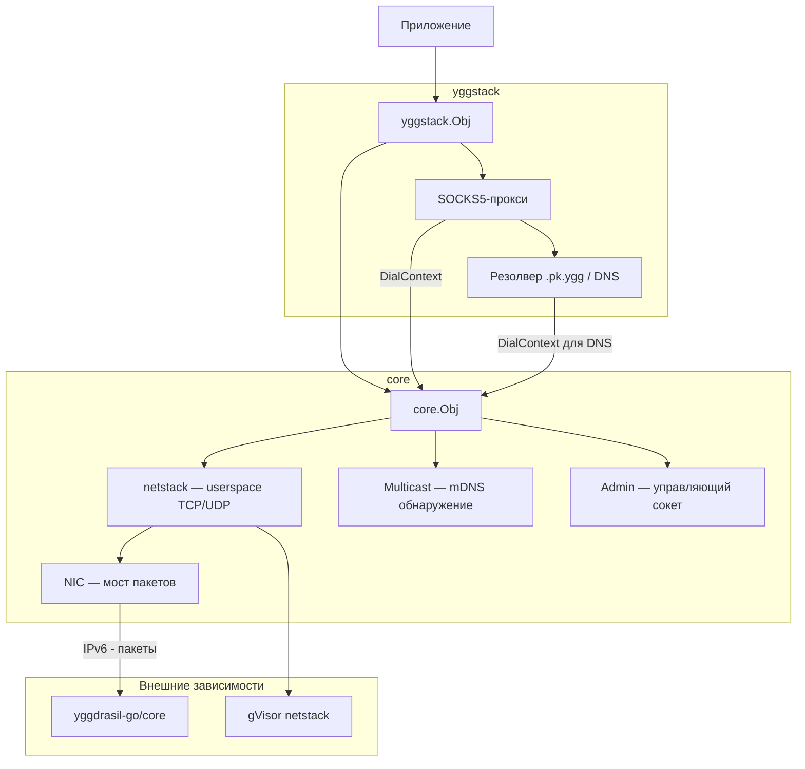
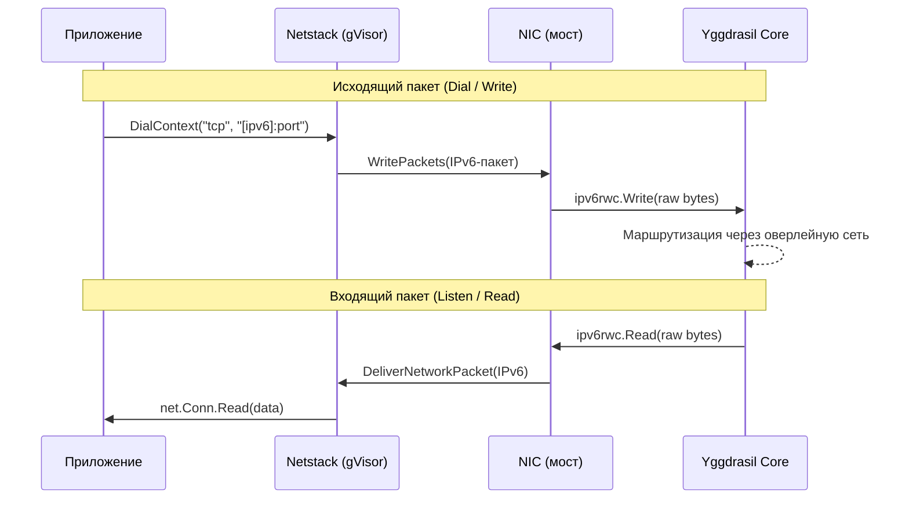
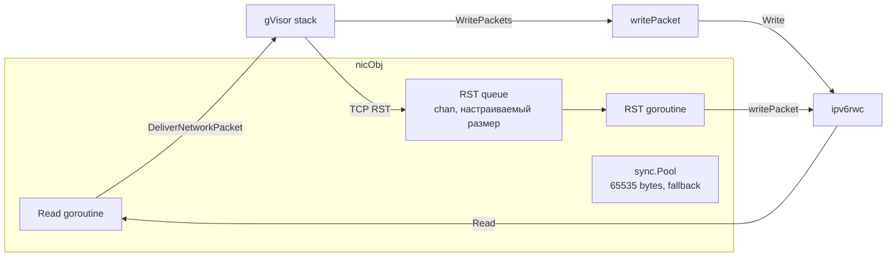
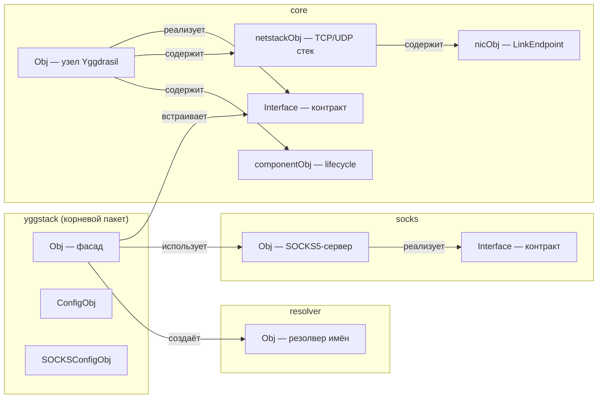
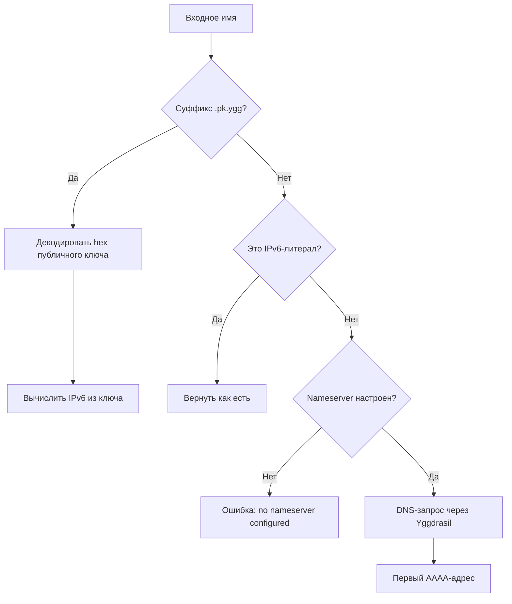
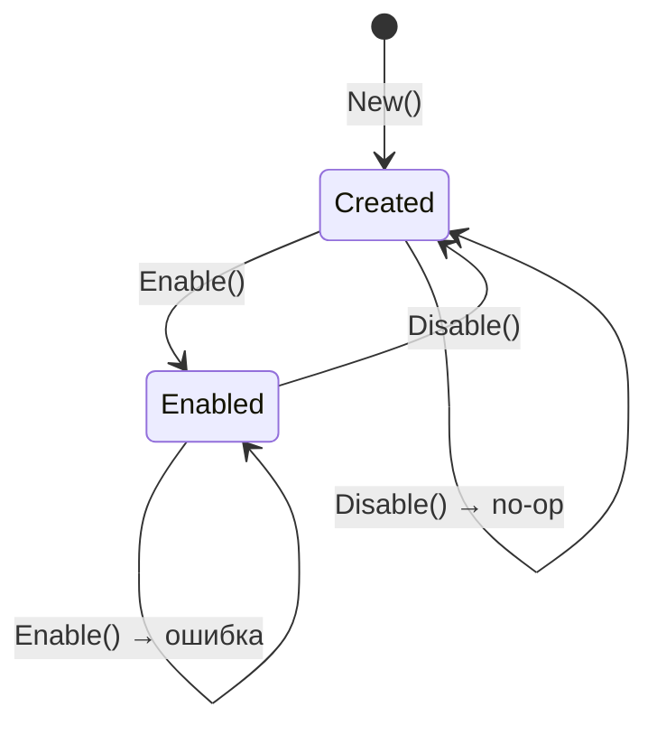
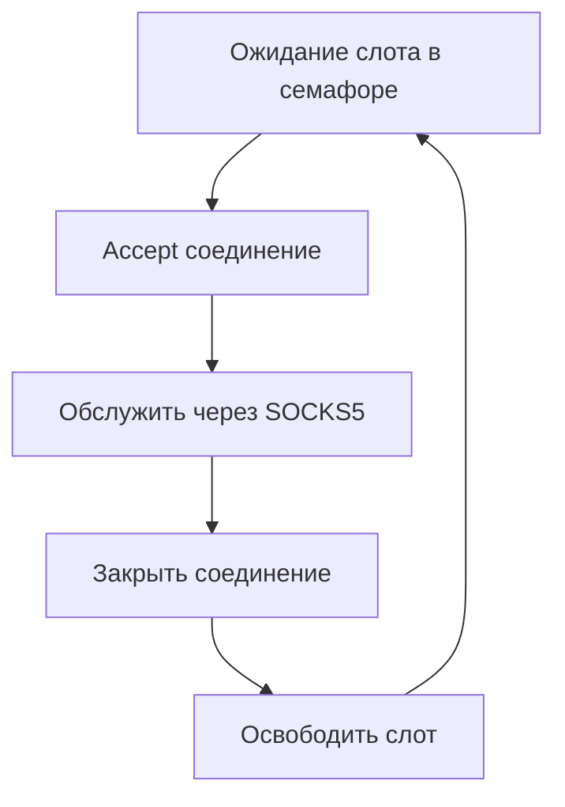
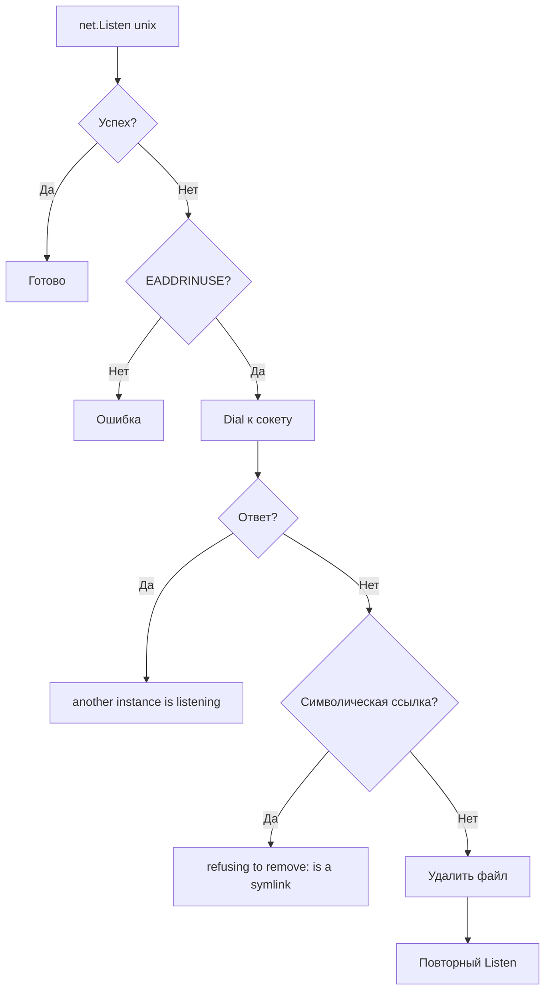
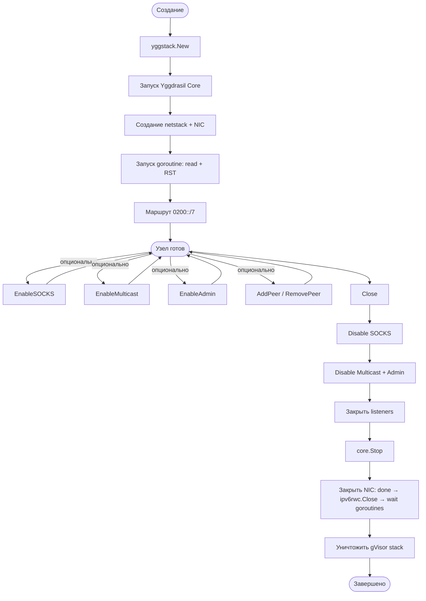

# yggstack

Go-библиотека для встраивания узла Yggdrasil в приложения. Предоставляет стандартные Go-сетевые примитивы (
`DialContext`, `Listen`, `ListenPacket`) поверх userspace TCP/IP стека (gVisor netstack), без необходимости создавать
TUN-интерфейс или получать root-права.

## Архитектура



## Путь пакета

Как данные проходят через стек — от приложения до Yggdrasil-сети и обратно:



## Внутренняя архитектура NIC

NIC (`nicObj`) — мост между gVisor и Yggdrasil на уровне IPv6-пакетов.



**Обработка TCP RST:** пакеты RST без payload отправляются не напрямую, а через буферизированную очередь
(`chan *PacketBuffer`). Размер очереди задаётся через `core.ConfigObj.RSTQueueSize` (по умолчанию 100).
Счётчик отброшенных RST-пакетов доступен через `core.Obj.RSTDropped()`.

**Стратегия при переполнении RST-очереди:**

1. Попытка отправить в канал
2. Если канал полон — вытеснение самого старого пакета с debug-логированием
3. Повторная попытка отправить
4. Если снова неудача — пакет отбрасывается, инкрементируется счётчик дропов, debug-логирование

**Запись пакетов (writePacket):** используется zero-copy через `AsViewList` — данные пакета передаются
в `ipv6rwc.Write` напрямую без копирования. Если пакет состоит из нескольких View (редкий случай),
данные собираются в буфер из `sync.Pool`. Паника в `WritePackets` перехватывается через `recover`
и логируется без краша всего стека.

## Структура модуля



## Пакеты

### `yggstack` (корневой)

Фасад для встраивания. Объединяет ядро, SOCKS-прокси и резолвер в одну точку входа.

| Тип              | Назначение                                                              |
|------------------|-------------------------------------------------------------------------|
| `Obj`            | Узел с полным набором возможностей: сетевые методы + SOCKS + управление |
| `ConfigObj`      | Контекст, конфиг Yggdrasil, логгер, таймаут                             |
| `SOCKSConfigObj` | Адрес прокси, DNS-сервер, verbose, лимит соединений                     |

### `core`

Ядро — узел Yggdrasil с userspace сетевым стеком.

| Тип            | Назначение                                                                   |
|----------------|------------------------------------------------------------------------------|
| `Obj`          | Узел: DialContext, Listen, ListenPacket, управление пирами, multicast, admin |
| `Interface`    | Публичный контракт — всё, что нужно внешнему коду                            |
| `netstackObj`  | gVisor TCP/UDP/ICMP стек                                                     |
| `nicObj`       | Мост между gVisor и Yggdrasil на уровне IPv6-пакетов                         |
| `componentObj` | Обобщённый Enable/Disable lifecycle для multicast и admin                    |

### `resolver`

Резолвер имён с тремя стратегиями:



**Формат `.pk.ygg`:** `<hex-pubkey>.pk.ygg` или `subdomain.<hex-pubkey>.pk.ygg`
(при наличии поддоменов используется последний сегмент перед `.pk.ygg`).
Публичный ключ — 32 байта ed25519 в hex (64 символа).

**DNS через Yggdrasil:** если настроен `Nameserver`, DNS-запросы (`AAAA`) идут через `DialContext` ядра —
трафик не утекает в системный резолвер. Без nameserver резолвинг DNS-имён возвращает ошибку.

### `socks`

SOCKS5-прокси поверх Yggdrasil. Поддерживает TCP и Unix-сокеты. Без аутентификации.



## Конфигурация

### ConfigObj (yggstack)

| Поле              | Тип                  | По умолчанию | Описание                                                                                           |
|-------------------|----------------------|--------------|----------------------------------------------------------------------------------------------------|
| `Ctx`             | `context.Context`    | `nil`        | Родительский контекст; при отмене узел автоматически вызывает `Close()`. `nil` — ручное управление |
| `Config`          | `*config.NodeConfig` | `nil`        | Конфигурация Yggdrasil (ключи, пиры, listen-адреса). `nil` — генерируются случайные ключи          |
| `Logger`          | `yggcore.Logger`     | `nil`        | Логгер; `nil` — логи отбрасываются (noop). Передаётся и в ядро, и в SOCKS                          |
| `CoreStopTimeout` | `time.Duration`      | `0`          | Таймаут `core.Stop()` при завершении. `0` — ожидание без ограничений                               |

### ConfigObj (core)

| Поле              | Тип                  | По умолчанию | Описание                                         |
|-------------------|----------------------|--------------|--------------------------------------------------|
| `Config`          | `*config.NodeConfig` | `nil`        | Конфигурация Yggdrasil. `nil` — случайные ключи  |
| `Logger`          | `yggcore.Logger`     | `nil`        | Логгер; `nil` — noop                             |
| `CoreStopTimeout` | `time.Duration`      | `0`          | Таймаут `core.Stop()`. `0` — без ограничений     |
| `RSTQueueSize`    | `int`                | `100`        | Размер очереди отложенных RST-пакетов. `0` → 100 |

### SOCKSConfigObj (yggstack)

| Поле             | Тип    | По умолчанию | Описание                                                                                                                    |
|------------------|--------|--------------|-----------------------------------------------------------------------------------------------------------------------------|
| `Addr`           | string | обязательное | Адрес прокси: TCP `"127.0.0.1:1080"` или Unix-сокет `"/tmp/ygg.sock"`. Путь, начинающийся с `/` или `.` — Unix              |
| `Nameserver`     | string | `""`         | DNS-сервер в сети Yggdrasil. Формат: `"[ipv6]:port"`. Пустая строка — только `.pk.ygg` и IP-литералы                        |
| `Verbose`        | bool   | `false`      | Подробное логирование каждого SOCKS-соединения (через Logger ядра)                                                          |
| `MaxConnections` | int    | `0`          | Максимум одновременных соединений. `0` — без ограничений. При достижении лимита новые соединения ожидают освобождения слота |

## Валидация адресов

Сетевые методы (`DialContext`, `Listen`, `ListenPacket`) принимают адреса в формате `"[ipv6]:port"` или `":port"`.

| Ввод                | Поведение                                     |
|---------------------|-----------------------------------------------|
| `"[200:abc::1]:80"` | Валидный IPv6 + порт                          |
| `":8080"`           | Пустой host — bind на все адреса (для Listen) |
| `":0"`              | Эфемерный порт (назначается ОС)               |
| `"localhost:80"`    | Ошибка: `invalid IP address "localhost"`      |
| `"[::1]:99999"`     | Ошибка: `port 99999 out of range 0-65535`     |
| `"bad"`             | Ошибка: `net.SplitHostPort` failed            |

Поддерживаемые сети: `tcp`, `tcp6` (для Dial/Listen), `udp`, `udp6` (для Dial/ListenPacket).

## Rate limiting (SOCKS)

При установленном `MaxConnections > 0` прокси ограничивает число одновременных соединений через семафор:



- Блокировка на семафоре **до** `Accept` — backpressure передаётся на TCP backlog ядра
- При заполненном backlog ядро само отбрасывает SYN — нет busy-loop на уровне приложения
- Слот семафора освобождается ровно один раз при закрытии соединения (`sync.Once`)

## Потокобезопасность

Все публичные методы `Obj` и `core.Obj` безопасны для конкурентного использования.

| Метод / группа                          | Гарантия                                                                            |
|-----------------------------------------|-------------------------------------------------------------------------------------|
| `DialContext`, `Listen`, `ListenPacket` | Потокобезопасны; netstack защищён через `atomic.Pointer`                            |
| `EnableSOCKS` / `DisableSOCKS`          | Защищены мьютексом; повторный `Enable` без `Disable` — ошибка                       |
| `EnableMulticast` / `DisableMulticast`  | Защищены `sync.RWMutex`; повторный `Enable` — ошибка                                |
| `EnableAdmin` / `DisableAdmin`          | Аналогично multicast                                                                |
| `AddPeer` / `RemovePeer`                | Потокобезопасны (делегируют в `yggdrasil-go/core`)                                  |
| `Close`                                 | Идемпотентный (`sync.Once`); безопасен для повторного вызова и конкурентного вызова |
| `Address`, `Subnet`, `PublicKey`, `MTU` | Потокобезопасны; только чтение                                                      |

**Конкурентный Enable multicast + admin:** обработчики admin регистрируются атомарно через отдельный
`handlersMu` мьютекс после завершения `enable()`, что исключает ABBA-deadlock между компонентами.

## Обработка ошибок

### Методы возвращающие ошибки

| Метод             | Ошибки                                                                        |
|-------------------|-------------------------------------------------------------------------------|
| `New`             | Ошибка создания core, ошибка создания netstack                                |
| `DialContext`     | `ErrNotAvailable` (узел закрыт), ошибки gVisor, невалидный адрес              |
| `Listen`          | `ErrNotAvailable`, ошибки gVisor, невалидный адрес                            |
| `ListenPacket`    | `ErrNotAvailable`, ошибки gVisor, невалидный адрес                            |
| `EnableSOCKS`     | `"SOCKS already enabled"`, ошибка listen (занят порт / невалидный путь)       |
| `DisableSOCKS`    | Ошибка закрытия listener                                                      |
| `EnableMulticast` | `"multicast already enabled"`, невалидный regex, ошибка `multicast.New`       |
| `EnableAdmin`     | `"admin already enabled"`, невалидный адрес, `admin.New` вернул nil           |
| `AddPeer`         | Невалидный URI, ошибка ядра                                                   |
| `RemovePeer`      | Невалидный URI, ошибка ядра                                                   |
| `Close`           | Всегда `nil`; ошибки компонентов логируются через `Warnf`, но не возвращаются |

### ErrNotAvailable

Возвращается из `DialContext`, `Listen`, `ListenPacket` если netstack уже уничтожен (после `Close()`).

### Unix-сокет (SOCKS)

При запуске на Unix-сокете обрабатывается случай устаревшего файла:



## Жизненный цикл



### Порядок shutdown (Close)

Порядок остановки критичен для корректного завершения без deadlock:

1. **Disable SOCKS** — закрытие listener останавливает `Serve`, `wg.Wait()` ждёт завершения. Unix-сокет удаляется
2. **Disable Multicast + Admin** — вызов `stopFn()` каждого компонента
3. **Закрытие listeners** — все listener'ы, созданные через `Listen`/`ListenPacket`, закрываются
4. **core.Stop()** — остановка Yggdrasil core. Разблокирует `ipv6rwc.Read()` в NIC
5. **NIC Close** — `close(done)` сигнализирует горутинам, `ipv6rwc.Close()`, ожидание `readDone` и `rstDone`, очистка
   RST-очереди, `RemoveNIC`
6. **stack.Destroy()** — уничтожение gVisor стека

При наличии `CoreStopTimeout > 0`: если `core.Stop()` не завершился за указанное время,
логируется предупреждение и shutdown продолжается.

### Автозавершение через контекст

Если передан `Ctx` в `ConfigObj`, горутина слушает отмену контекста и вызывает `Close()` автоматически.
При ручном `Close()` горутина завершается через канал `done`.

## Быстрый старт

```go
package main

import (
	"context"
	"fmt"
	"net/http"

	"github.com/yggdrasil-network/yggstack/temp-new"
)

func main() {
	// Создаём узел (случайные ключи)
	node, err := yggstack.New(yggstack.ConfigObj{
		Ctx: context.Background(),
	})
	if err != nil {
		panic(err)
	}
	defer node.Close()

	fmt.Println("Адрес:", node.Address())

	// HTTP-клиент через Yggdrasil
	client := &http.Client{
		Transport: &http.Transport{
			DialContext: node.DialContext,
		},
	}

	// Запрос к Yggdrasil-узлу
	resp, err := client.Get("http://[200:abcd::1]:8080/")
	if err != nil {
		panic(err)
	}
	defer resp.Body.Close()
}
```

## Запуск с SOCKS5-прокси

```go
// Включаем SOCKS5
err = node.EnableSOCKS(yggstack.SOCKSConfigObj{
Addr:           "127.0.0.1:1080",
Nameserver:     "[200:abcd::1]:53", // DNS через Yggdrasil
Verbose:        true,
MaxConnections: 128, // 0 = без ограничений
})
if err != nil {
panic(err)
}
defer node.DisableSOCKS()

// Теперь curl --proxy socks5h://127.0.0.1:1080 http://example.pk.ygg/
```

## TCP-сервер в сети Yggdrasil

```go
ln, err := node.Listen("tcp", ":8080")
if err != nil {
panic(err)
}
defer ln.Close()

fmt.Printf("Слушаю на http://[%s]:8080/\n", node.Address())
http.Serve(ln, handler)
```

## UDP в сети Yggdrasil

```go
pc, err := node.ListenPacket("udp", ":9000")
if err != nil {
panic(err)
}
defer pc.Close()

buf := make([]byte, 1500)
n, addr, err := pc.ReadFrom(buf)
```

## Управление пирами в runtime

```go
// Добавить пир
err = node.AddPeer("tcp://1.2.3.4:5678")
err = node.AddPeer("quic://[200:abc::1]:5678")

// Удалить пир
err = node.RemovePeer("tcp://1.2.3.4:5678")
```

## Multicast и Admin

```go
import golog "github.com/gologme/log"

// mDNS-обнаружение пиров в локальной сети
// Интерфейсы берутся из NodeConfig.MulticastInterfaces
mcLogger := golog.New(os.Stderr, "", golog.LstdFlags)
err = node.EnableMulticast(mcLogger)
defer node.DisableMulticast()

// Admin-сокет (JSON API для управления)
err = node.EnableAdmin("unix:///tmp/ygg-admin.sock")
// или TCP:
err = node.EnableAdmin("tcp://127.0.0.1:9001")
defer node.DisableAdmin()
```
