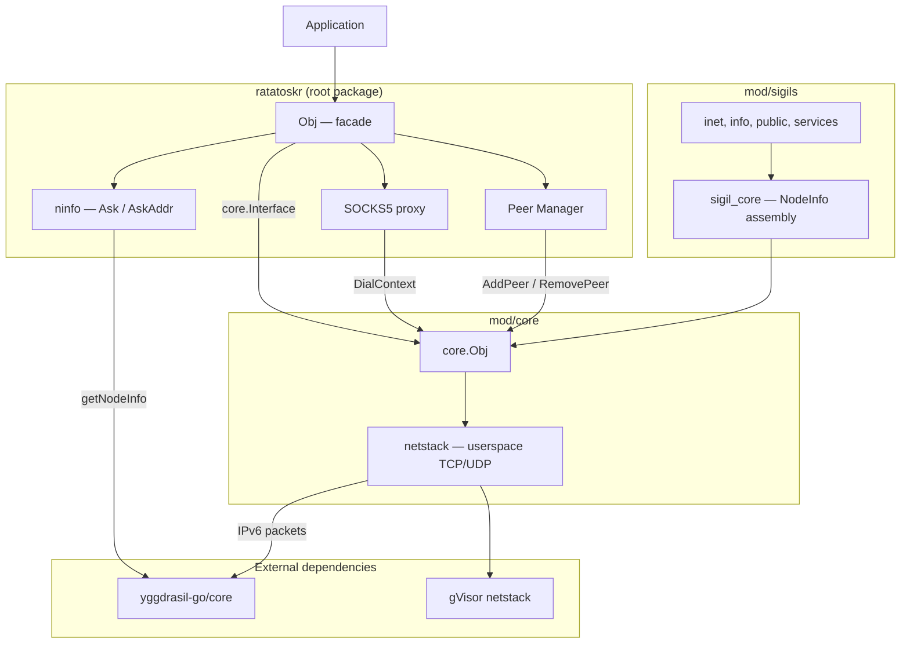
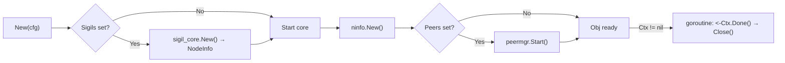
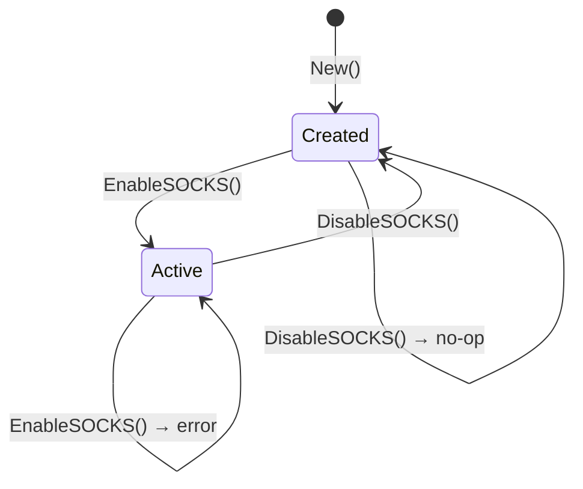
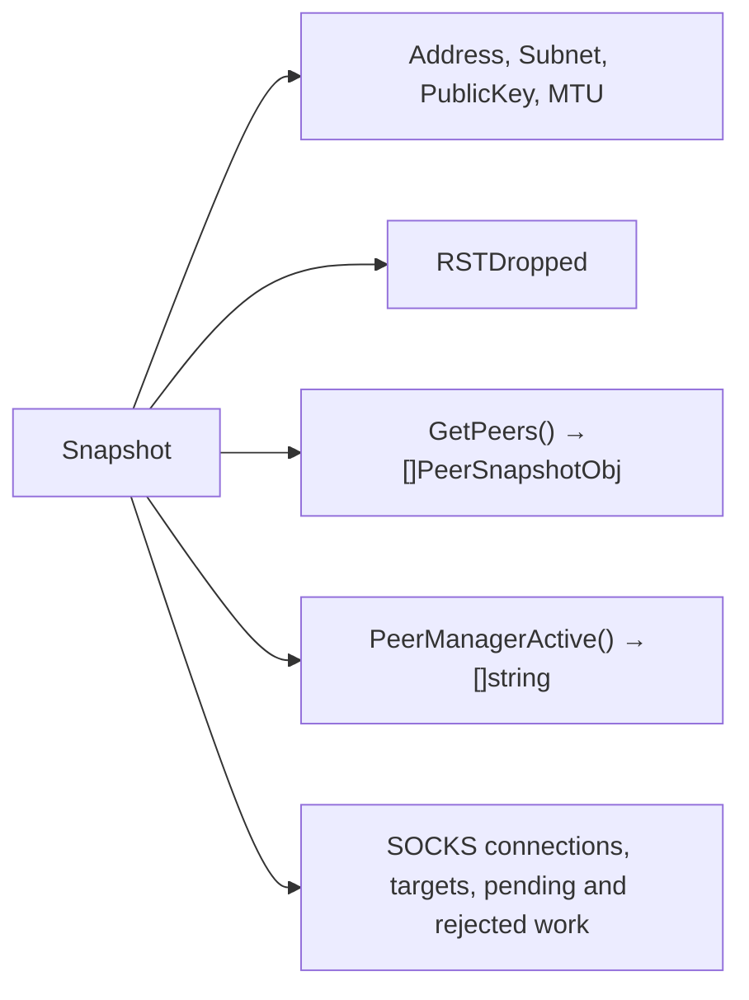
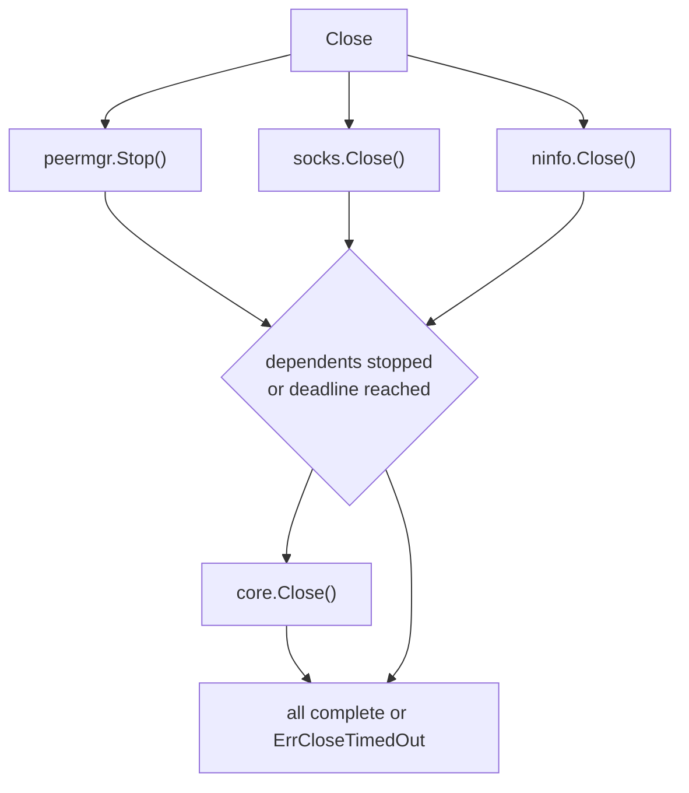
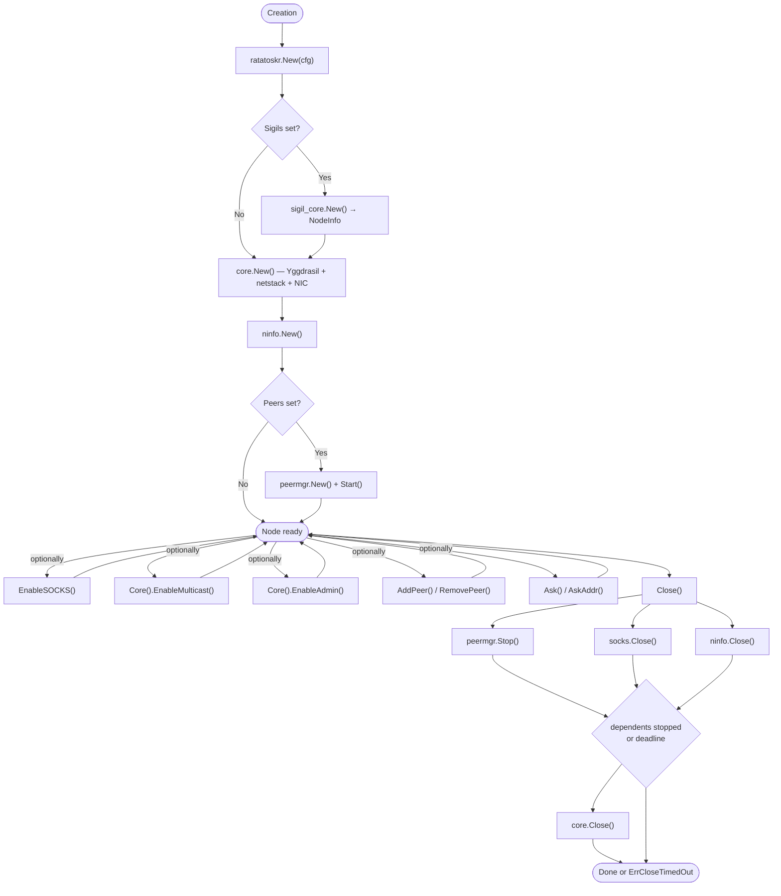

[](https://goreportcard.com/report/github.com/voluminor/ratatoskr)


# ratatoskr

> **[Русская версия](README.RU.md)**

Go library for embedding a Yggdrasil node into an application. The network stack runs in userspace
on top of gVisor netstack — no TUN interface, root access, or external dependencies required.

- **Userspace stack.** TCP/UDP over gVisor netstack, no OS privileges.
- **Standard Go interfaces.** `DialContext`, `Listen`, `ListenPacket` — compatible with `net.Conn`,
  `net.Listener`, `http.Transport`, etc.
- **`core.Interface` as a contract.** Packages `socks`, `peermgr`, and the root `ratatoskr` depend on
  the interface, not on `core.Obj` implementation. You can plug in your own implementation for testing
  or custom transports.

### ratatoskr vs yggstack

[yggstack](https://github.com/yggdrasil-network/yggstack) is a ready-made binary for end users
(SOCKS proxy, TCP/UDP forwarding via CLI flags). `ratatoskr` is a library for developers:
a node is created with `ratatoskr.New()`, everything is controlled through the Go API.

---

## Table of contents

- [Installation](#installation)
- [Quick start](#quick-start)
- [Architecture](#architecture)
- [Root package API](#root-package-api)
  - [New](#new)
  - [SOCKS5 proxy](#socks5-proxy)
  - [Peer manager](#peer-manager)
  - [RetryPeers](#retrypeers)
  - [Ask / AskAddr](#ask--askaddr)
  - [Snapshot](#snapshot)
  - [Close](#close)
- [Configuration](#configuration)
  - [ConfigObj](#configobj)
  - [SOCKSConfigObj](#socksconfigobj)
- [Snapshot types](#snapshot-types)
- [Errors](#errors)
- [Thread safety](#thread-safety)
- [Lifecycle](#lifecycle)
- [Usage examples](#usage-examples)
- [Modules](#modules)
- [Example applications](#example-applications)
- [Supported platforms](#supported-platforms)

---

## Installation

```bash
go get github.com/voluminor/ratatoskr
```

Minimum Go version: **1.25**.

---

## Quick start

Create a node, connect to the network, and make an HTTP request:

```go
package main

import (
	"context"
	"fmt"
	"io"
	"net/http"

	"github.com/voluminor/ratatoskr"
	"github.com/voluminor/ratatoskr/mod/peermgr"
)

func main() {
	ctx, cancel := context.WithCancel(context.Background())
	defer cancel()

	node, err := ratatoskr.New(ratatoskr.ConfigObj{
		Ctx: ctx,
		Peers: &peermgr.ConfigObj{
			Peers: []string{
				"tls://peer1.example.com:17117",
				"tls://peer2.example.com:17117",
			},
          MaxPerProto: 1,
		},
	})
	if err != nil {
		panic(err)
	}
	defer node.Close()

	fmt.Println("Network address:", node.Address())

	client := &http.Client{
		Transport: &http.Transport{
			DialContext: node.DialContext,
		},
	}

	resp, err := client.Get("http://[200:abcd::1]:8080/api")
	if err != nil {
		panic(err)
	}
	defer resp.Body.Close()

	body, _ := io.ReadAll(resp.Body)
	fmt.Println(string(body))
}
```

---

## Architecture



`ratatoskr.Obj` promotes the primary networking and peer methods directly (`DialContext`, `Listen`,
`ListenPacket`, `Address`, `Subnet`, `PublicKey`, `MTU`, `AddPeer`, `RemovePeer`, `GetPeers`). Advanced node
controls (multicast, admin, retry, stats) are reached via `Core()`. SOCKS5 proxy, peer manager, and ninfo are
optional components controlled through `Obj` methods.

---

## Root package API

### New

```go
func New(cfg ConfigObj) (*Obj, error)
```

Creates and starts a Yggdrasil node. Returns `*Obj` — a facade with full capabilities.



- If `cfg.Config == nil` — random keys are generated
- If `cfg.Logger == nil` — logs are discarded (noop logger)
- Cyclic or more than 64-level-deep `Config.NodeInfo` values are rejected with `ErrInvalidNodeInfo`
- If `cfg.Sigils != nil` — NodeInfo is assembled from sigils; `Config.NodeInfo` is used as the base
- If `cfg.Peers != nil` — peer manager is started; `cfg.Config.Peers` must be empty
- If `cfg.Ctx != nil` — node shuts down automatically on context cancellation

After a successful `New` call, the primary networking and peer methods are available directly on `Obj`; advanced node
controls live behind `Core()`:

| Method                        | Description                               |
|-------------------------------|-------------------------------------------|
| `DialContext(ctx, net, addr)` | Outgoing TCP/UDP connection via Yggdrasil |
| `Listen(net, addr)`           | TCP listener on the Yggdrasil network     |
| `ListenPacket(net, addr)`     | UDP listener                              |
| `Address()`                   | Node IPv6 address (200::/7)               |
| `Subnet()`                    | /64 subnet                                |
| `PublicKey()`                 | ed25519 public key                        |
| `MTU()`                       | Stack MTU                                 |
| `GetPeers()`                  | Peer list with metrics                    |
| `AddPeer(uri)`                | Add a peer                                |
| `RemovePeer(uri)`             | Remove a peer                             |
| `Core()`                      | Access the full node contract (below)     |
| `Core().EnableMulticast()`    | mDNS discovery on local network           |
| `Core().DisableMulticast()`   | Stop multicast                            |
| `Core().EnableAdmin(addr)`    | Admin socket (unix/tcp)                   |
| `Core().DisableAdmin()`       | Stop admin socket                         |
| `Core().RetryPeers()`         | Reconnect disconnected peers              |
| `Core().RSTDropped()`         | Dropped RST packet counter                |

Warning: `Core().EnableAdmin` uses the upstream `yggdrasil-go` admin socket. That implementation calls `os.Exit(1)` on
listen
failures or Unix socket cleanup failures. Treat admin access as unsafe operational tooling: validate the bind address
before enabling it and do not expose it to untrusted users.

For details on network operations, components, and NIC — see [mod/core/README.md](mod/core/README.md).

### SOCKS5 proxy

```go
func (o *Obj) EnableSOCKS(cfg SOCKSConfigObj) error
func (o *Obj) DisableSOCKS() error
func (o *Obj) SetSOCKSMaxConnections(n int)
func (o *Obj) SOCKSMaxConnections() int
```

`EnableSOCKS` starts the SOCKS5 proxy. The resolver is created automatically based on `cfg.Nameserver`.
`DisableSOCKS` stops the proxy; idempotent.
`SetSOCKSMaxConnections` / `SOCKSMaxConnections` adjust and read the connection limit at runtime.



The `Enable → Disable → Enable` cycle is supported. For details — see [mod/socks/README.md](mod/socks/README.md).

### Peer manager

```go
func (o *Obj) PeerManagerActive() []string
func (o *Obj) PeerManagerOptimize() error
```

The peer manager is enabled via `ConfigObj.Peers` when calling `New`. If `Peers == nil` — methods
return `nil` / `ErrPeerManagerNotEnabled`.

| Method                  | Description                                               |
|-------------------------|-----------------------------------------------------------|
| `PeerManagerActive()`   | Current active peers (copy); `nil` if manager is not used |
| `PeerManagerOptimize()` | Force peer re-evaluation (blocks until completion)        |

For details on selection, windowing, and peer validation —
see [mod/peermgr/README.md](mod/peermgr/README.md).

### RetryPeers

```go
node.Core().RetryPeers()
```

Triggers immediate reconnection of disconnected peers. `RetryPeers` lives on `core.Interface`, reached through
`Core()`; it works independently of the peer manager.

### Ask / AskAddr

```go
func (o *Obj) Ask(ctx context.Context, key ed25519.PublicKey) (*ninfo.AskResultObj, error)
func (o *Obj) AskAddr(ctx context.Context, addr string) (*ninfo.AskResultObj, error)
```

Query a remote node's NodeInfo. `Ask` takes a public key, `AskAddr` takes an address string
(64-char hex, `<hex>.pk.ygg`, `[ipv6]:port`, or bare IPv6). Returns parsed metadata,
software info, and measured RTT.

If the remote node uses `ratatoskr`, the response is automatically split into sigils — each
known sigil goes into `AskResultObj.Node.Sigils`, remaining keys go into `Extra`.

```go
result, err := node.AskAddr(ctx, "200:abcd::1")
if err != nil {
log.Fatal(err)
}
fmt.Printf("RTT: %s, version: %s\n", result.RTT, result.Node.Version)
if result.Software != nil {
fmt.Printf("Software: %s %s\n", result.Software.Name, result.Software.Version)
}
for name, sigil := range result.Node.Sigils {
fmt.Printf("Sigil %s: %v\n", name, sigil.Params())
}
```

Internally, `ninfo` is always created during `New()`. If `ConfigObj.Sigils` is set, the sigils
are imported into `ninfo` as parsers for responses. For details — see [mod/ninfo/README.md](mod/ninfo/README.md).

### Sigils (NodeInfo)

```go
type ConfigObj struct {
// ...
Sigils []sigils.Interface
}
```

Sigils are typed data blocks for NodeInfo. Each sigil owns a set of keys in NodeInfo
and can write/read them. When passed via `ConfigObj.Sigils`:

1. `sigil_core.New()` assembles NodeInfo from the base `Config.NodeInfo` and the provided sigils
2. The result is written to `Config.NodeInfo` before starting the core
3. The same sigils are imported into `ninfo` as parsers for `Ask`/`AskAddr`

```go
node, err := ratatoskr.New(ratatoskr.ConfigObj{
Ctx: ctx,
Sigils: []sigils.Interface{
info.New("my-node", "My cool Yggdrasil node"),
public.New(ed25519.PublicKey(pk)),
inet.New("192.168.1.1", 8080),
},
})
```

Built-in sigils: `info`, `public`, `inet`, `services`. You can create your own by implementing
`sigils.Interface`. For details — see [mod/sigils/README.md](mod/sigils/README.md) and
[mod/sigils/sigil_core/README.md](mod/sigils/sigil_core/README.md).

### Snapshot

```go
func (o *Obj) Snapshot() SnapshotObj
```

Collects full node state in a single call:



Returns `SnapshotObj` with JSON tags — can be serialized directly for `/status` or `/metrics`.

### Close

```go
func (o *Obj) Close() error
```

Stops dependent components (`peermgr`, SOCKS, and ninfo) concurrently, then
closes the core after they have released captured handlers and transports. The
single `CloseTimeout` budget covers both phases. If it expires, core teardown is
still started best-effort, `Close()` returns `ErrCloseTimedOut`, and unfinished
work continues in the background. The method is idempotent and safe for repeated
or concurrent calls.



Collects errors observed before the deadline via `errors.Join`.

---

## Configuration

### ConfigObj

Node creation parameters.

| Field          | Type                 | Default | Description                                                                       |
|----------------|----------------------|---------|-----------------------------------------------------------------------------------|
| `Ctx`          | `context.Context`    | `nil`   | Parent context; on cancellation — automatic `Close()`. `nil` — manual control     |
| `Config`       | `*config.NodeConfig` | `nil`   | Yggdrasil configuration. `nil` — random keys                                      |
| `Logger`       | `yggcore.Logger`     | `nil`   | Logger. `nil` — logs are discarded                                                |
| `CloseTimeout` | `time.Duration`      | `0`     | Total root shutdown budget. `0` — 10s; `<0` — invalid                             |
| `RSTQueueSize` | `int`                | `0`     | RST deferred queue size. `0` — core default                                       |
| `Peers`        | `*peermgr.ConfigObj` | `nil`   | Peer manager. `nil` — peers from `Config.Peers`. Non-nil + `Config.Peers` → error |
| `Sigils`       | `[]sigils.Interface` | `nil`   | Sigils for NodeInfo. `nil` — not used. Combines with `Config.NodeInfo`            |

### SOCKSConfigObj

SOCKS5 proxy parameters.

| Field                           | Type                         | Default  | Description                                                                                                         |
|---------------------------------|------------------------------|----------|---------------------------------------------------------------------------------------------------------------------|
| `Addr`                          | string                       | required | TCP `"127.0.0.1:1080"` or a Unix socket inside a private directory (`0700`)                                         |
| `Nameserver`                    | string                       | `""`     | DNS on the Yggdrasil network. `"[ipv6]:port"`. Empty — `.pk.ygg` only                                               |
| `Verbose`                       | bool                         | `false`  | Log each SOCKS connection                                                                                           |
| `MaxConnections`                | int                          | `0`      | Max concurrent connections. `0` — safe default, `<0` — unlimited                                                    |
| `HandshakeTimeout`              | `time.Duration`              | `0`      | SOCKS handshake timeout. `0` — safe default, `<0` — disabled                                                        |
| `DialTimeout`                   | `time.Duration`              | `0`      | Outbound dial timeout. `0` — safe default, `<0` — disabled                                                          |
| `TunnelIdleTimeout`             | `time.Duration`              | `0`      | Established tunnel idle timeout. `0` — safe default, `<0` — disabled                                                |
| `MaxAssociateTargetsPerSession` | int                          | `0`      | UDP ASSOCIATE target cap per session. `0` — safe default, `<0` — no per-session cap; per-server cap still applies   |
| `NameserverLookupTimeout`       | `time.Duration`              | `0`      | DNS lookup timeout. `0` — safe default, `<0` — no resolver-imposed deadline (Go DNS client's own ~5s still applies) |
| `NameserverCacheTTL`            | `time.Duration`              | `0`      | Positive DNS cache TTL. `0` — safe default, `<0` — disabled                                                         |
| `NameserverCacheMaxEntries`     | int                          | `0`      | Positive DNS cache cap. `0` — safe default, `<0` — disabled                                                         |
| `Credentials`                   | `socks.CredentialsInterface` | `nil`    | Optional SOCKS5 username/password validator                                                                         |

---

## Snapshot types

### SnapshotObj

| Field         | Type                | Description                             |
|---------------|---------------------|-----------------------------------------|
| `Address`     | `string`            | Node IPv6 address                       |
| `Subnet`      | `string`            | `/64` subnet                            |
| `PublicKey`   | `string`            | ed25519 public key (hex)                |
| `MTU`         | `uint64`            | Stack MTU                               |
| `RSTDropped`  | `uint64`            | Dropped RST packet counter              |
| `Peers`       | `[]PeerSnapshotObj` | State of each peer                      |
| `ActivePeers` | `[]string`          | Peers selected by manager (`omitempty`) |
| `SOCKS`       | `SOCKSSnapshotObj`  | SOCKS5 proxy state                      |

### PeerSnapshotObj

| Field           | Type            | Description              |
|-----------------|-----------------|--------------------------|
| `URI`           | `string`        | Connection URI           |
| `Up`            | `bool`          | Connected                |
| `Inbound`       | `bool`          | Inbound connection       |
| `Key`           | `string`        | Peer public key (hex)    |
| `Latency`       | `time.Duration` | Latency                  |
| `Cost`          | `uint64`        | Route cost               |
| `RXBytes`       | `uint64`        | Bytes received           |
| `TXBytes`       | `uint64`        | Bytes sent               |
| `Uptime`        | `time.Duration` | Connection uptime        |
| `LastError`     | `string`        | Last error (`omitempty`) |
| `LastErrorTime` | `time.Time`     | Time of last error       |

### SOCKSSnapshotObj

| Field               | Type   | Description               |
|---------------------|--------|---------------------------|
| `Enabled`           | `bool` | Proxy is running          |
| `Addr`              | string | Address (`omitempty`)     |
| `IsUnix`            | `bool` | Unix socket (`omitempty`) |
| `ActiveConnections` | `int`  | Active connection count   |

---

## Errors

| Variable                   | Description                                               |
|----------------------------|-----------------------------------------------------------|
| `ErrPeersConflict`         | `Config.Peers` and `Peers` manager are set simultaneously |
| `ErrPeerManagerNotEnabled` | Peer manager method called but manager is not enabled     |
| `ErrClosed`                | Method called after the node was closed                   |

Errors from `core.Interface` (`ErrNotAvailable`, etc.) are described in [mod/core/README.md](mod/core/README.md).

---

## Thread safety

All public methods of `Obj` are safe for concurrent use.

| Method / group                           | Guarantee                                                     |
|------------------------------------------|---------------------------------------------------------------|
| `DialContext`, `Listen`, `ListenPacket`  | Thread-safe; netstack via `atomic.Pointer`                    |
| `EnableSOCKS` / `DisableSOCKS`           | Mutex-protected                                               |
| `Core().EnableMulticast` / `EnableAdmin` | Mutex-protected                                               |
| `AddPeer` / `RemovePeer`                 | Delegate to `yggdrasil-go/core` (thread-safe)                 |
| `PeerManagerActive`                      | Returns a copy; mutex-protected                               |
| `PeerManagerOptimize`                    | Blocks; serialized internally                                 |
| `Ask` / `AskAddr`                        | Thread-safe; network call in a goroutine, cancellable via ctx |
| `Close`                                  | Idempotent (`sync.Once`)                                      |
| `Snapshot`                               | Thread-safe; collects data from thread-safe methods           |

---

## Lifecycle



Three ways to shut down:

```go
// 1. Explicit Close()
defer node.Close()

// 2. Via context
ctx, cancel := context.WithCancel(context.Background())
node, _ = ratatoskr.New(ratatoskr.ConfigObj{Ctx: ctx})
cancel() // → Close() automatically

// 3. Via OS signal
ctx, stop := signal.NotifyContext(context.Background(), os.Interrupt, syscall.SIGTERM)
defer stop()
node, _ = ratatoskr.New(ratatoskr.ConfigObj{Ctx: ctx})
<-ctx.Done()
```

---

## Usage examples

### HTTP client

```go
client := &http.Client{
Transport: &http.Transport{
DialContext: node.DialContext,
},
}

resp, err := client.Get("http://[200:abcd::1]:8080/api/v1/status")
```

### TCP server

```go
ln, err := node.Listen("tcp", ":8080")
if err != nil {
log.Fatal(err)
}
defer ln.Close()

fmt.Printf("http://[%s]:8080/\n", node.Address())
http.Serve(ln, handler)
```

### UDP

```go
pc, err := node.ListenPacket("udp", ":9000")
if err != nil {
log.Fatal(err)
}
defer pc.Close()

buf := make([]byte, 1500)
for {
n, addr, err := pc.ReadFrom(buf)
if err != nil {
break
}
pc.WriteTo(buf[:n], addr)
}
```

### SOCKS5 proxy

```go
err = node.EnableSOCKS(ratatoskr.SOCKSConfigObj{
Addr:           "127.0.0.1:1080",
Nameserver:     "[200:abcd::1]:53",
Verbose:        true,
MaxConnections: 128,
DialTimeout:    10 * time.Second,
})
defer node.DisableSOCKS()

// curl --proxy socks5h://127.0.0.1:1080 http://a7aa9d653b0259c67a211e7a6ccd281219db1246c75e4ebcf9edbdbdaff55924.pk.ygg/
```

Unix socket:

```go
dir, err := os.MkdirTemp("", "ratatoskr-socks-") // mode 0700
if err != nil { return err }
err = node.EnableSOCKS(ratatoskr.SOCKSConfigObj{
Addr: filepath.Join(dir, "ygg-socks.sock"),
})
```

### Split proxy (Yggdrasil + direct)

SOCKS5 proxy that routes Yggdrasil addresses (`200::/7`) through the node
and everything else through the regular network:

```go
import (
"context"
"net"

"github.com/voluminor/ratatoskr/mod/resolver"
"github.com/voluminor/ratatoskr/mod/socks"
)

// split dialer: Yggdrasil addresses → node, everything else → direct
dial := func (ctx context.Context, network, addr string) (net.Conn, error) {
host, _, _ := net.SplitHostPort(addr)
if ip := net.ParseIP(host); ip != nil && ip[0]&0xfe == 0x02 { // 200::/7
return node.DialContext(ctx, network, addr)
}
return (&net.Dialer{}).DialContext(ctx, network, addr)
}

srv, err := socks.New(socks.ConfigObj{
Network: dialerFunc(dial),
Addr:    "127.0.0.1:1080",
Resolver: resolver.New(resolver.ConfigObj{
Dialer:     node,
Nameserver: "[200:abcd::1]:53", // DNS over Yggdrasil
}),
Logger: logger,
})
if err != nil {
return err
}
defer srv.Close()

// dialerFunc adapts a function to proxy.ContextDialer
type dialerFunc func (ctx context.Context, network, addr string) (net.Conn, error)

func (f dialerFunc) DialContext(ctx context.Context, n, a string) (net.Conn, error) {
return f(ctx, n, a)
}
```

Can be used as a system-wide SOCKS5 proxy — regular internet traffic passes through
unaffected, only Yggdrasil addresses are routed through the node:

```bash
# Yggdrasil IPv6 — routed through the node
curl --proxy socks5h://127.0.0.1:1080 http://[200:b0aa:c535:89fb:4c73:bbd:c30b:2665]/

# .pk.ygg domain — resolver converts to 200::/7, then routed through the node
curl --proxy socks5h://127.0.0.1:1080 http://a7aa9d653b0259c67a211e7a6ccd281219db1246c75e4ebcf9edbdbdaff55924.pk.ygg/

# Regular internet — goes directly, bypassing Yggdrasil
curl --proxy socks5h://127.0.0.1:1080 https://example.com/
```

### Peer manager

```go
node, err := ratatoskr.New(ratatoskr.ConfigObj{
Ctx: ctx,
Peers: &peermgr.ConfigObj{
Peers: []string{
"tls://peer1.example.com:17117",
"tls://peer2.example.com:17117",
"quic://peer3.example.com:17117",
},
ProbeTimeout:    10 * time.Second,
RefreshInterval: 5 * time.Minute,
MaxPerProto:     1,
BatchSize:       2,
},
})

active := node.PeerManagerActive()
node.PeerManagerOptimize() // force re-evaluation
```

### Snapshot → JSON

```go
snap := node.Snapshot()
data, _ := json.MarshalIndent(snap, "", "  ")
fmt.Println(string(data))
```

### Multicast and Admin

```go
// mDNS peer discovery on local network
if err := node.Core().EnableMulticast(); err != nil {
log.Fatal(err)
}
defer node.Core().DisableMulticast()

// Admin socket
if err := node.Core().EnableAdmin("unix:///tmp/ygg-admin.sock"); err != nil {
log.Fatal(err)
}
defer node.Core().DisableAdmin()
```

`Core().EnableAdmin` delegates to the upstream `yggdrasil-go` admin socket. Upstream listen and Unix socket cleanup
failures can terminate the process with `os.Exit(1)`.

### slog logger adapter

```go
type slogAdapter struct{ l *slog.Logger }

func (a slogAdapter) Infof(f string, v ...interface{})  { a.l.Info(fmt.Sprintf(f, v...)) }
func (a slogAdapter) Infoln(v ...interface{})           { a.l.Info(fmt.Sprint(v...)) }
func (a slogAdapter) Warnf(f string, v ...interface{})  { a.l.Warn(fmt.Sprintf(f, v...)) }
func (a slogAdapter) Warnln(v ...interface{})           { a.l.Warn(fmt.Sprint(v...)) }
func (a slogAdapter) Errorf(f string, v ...interface{}) { a.l.Error(fmt.Sprintf(f, v...)) }
func (a slogAdapter) Errorln(v ...interface{})          { a.l.Error(fmt.Sprint(v...)) }
func (a slogAdapter) Debugf(f string, v ...interface{}) { a.l.Debug(fmt.Sprintf(f, v...)) }
func (a slogAdapter) Debugln(v ...interface{})          { a.l.Debug(fmt.Sprint(v...)) }
func (a slogAdapter) Printf(f string, v ...interface{}) { a.l.Info(fmt.Sprintf(f, v...)) }
func (a slogAdapter) Println(v ...interface{})          { a.l.Info(fmt.Sprint(v...)) }
func (a slogAdapter) Traceln(v ...interface{})          {}

node, _ := ratatoskr.New(ratatoskr.ConfigObj{
Logger: slogAdapter{l: slog.Default()},
})
```

---

## Modules

| Module                                   | Description                                                  |
|------------------------------------------|--------------------------------------------------------------|
| [`mod/core`](mod/core/README.md)         | Core: Yggdrasil node, netstack, NIC, multicast, admin        |
| [`mod/peermgr`](mod/peermgr/README.md)   | Peer manager: windowed probing, best-per-protocol selection  |
| [`mod/socks`](mod/socks/README.md)       | SOCKS5 proxy (TCP/Unix), connection limit                    |
| [`mod/resolver`](mod/resolver/README.md) | Resolver: `.pk.ygg`, IP literals, DNS via Yggdrasil          |
| [`mod/forward`](mod/forward/README.md)   | TCP/UDP forwarding between local network and Yggdrasil       |
| [`mod/probe`](mod/probe/README.md)       | Topology exploration (BFS), route tracing                    |
| [`mod/sigils`](mod/sigils/README.md)     | Typed NodeInfo blocks (info, services, public, inet)         |
| [`mod/ninfo`](mod/ninfo/README.md)       | Remote NodeInfo querying and parsing, parse sigil management |

---

## Example applications

Ready-made examples in [`cmd/embedded/`](cmd/embedded/):

| Example                               | Description              |
|---------------------------------------|--------------------------|
| [`http`](cmd/embedded/http)           | HTTP server on Yggdrasil |
| [`tiny-http`](cmd/embedded/tiny-http) | Minimal HTTP server      |
| [`tiny-chat`](cmd/embedded/tiny-chat) | Chat over Yggdrasil      |
| [`mobile`](cmd/embedded/mobile)       | Mobile platform example  |

---

## Supported platforms

Tests run on Linux (amd64, arm64), macOS (arm64), and Windows (amd64).
Cross-compilation is verified on every PR for **25 targets**:

| OS      | Architectures                                                                                   |
|---------|-------------------------------------------------------------------------------------------------|
| Linux   | amd64, arm64, armv7, armv6, 386, riscv64, mips64, mips64le, mips, mipsle, ppc64, ppc64le, s390x |
| Windows | amd64, arm64, 386                                                                               |
| macOS   | amd64, arm64                                                                                    |
| FreeBSD | amd64, arm64, 386                                                                               |
| OpenBSD | amd64, arm64                                                                                    |
| NetBSD  | amd64, arm64                                                                                    |
