[](https://goreportcard.com/report/github.com/voluminor/ratatoskr)


# ratatoskr

> **[Русская версия](README.RU.md)**

Go library for embedding a Yggdrasil node into an application. The network stack runs in userspace
on top of gVisor netstack — no TUN interface, root access, or external dependencies required.

- **Userspace stack.** TCP/UDP over gVisor netstack, no OS privileges.
- **Standard Go interfaces.** `DialContext`, `Listen`, `ListenPacket` — compatible with `net.Conn`,
  `net.Listener`, `http.Transport`, etc.
- **`core.Interface` as a contract.** Packages `socks`, `peermgr`, and the root `ratatoskr` depend on
  the interface, not on `core.Obj` implementation. You can plug in your own implementation for testing
  or custom transports.

### ratatoskr vs yggstack

[yggstack](https://github.com/yggdrasil-network/yggstack) is a ready-made binary for end users
(SOCKS proxy, TCP/UDP forwarding via CLI flags). `ratatoskr` is a library for developers:
a node is created with `ratatoskr.New()`, everything is controlled through the Go API.

### Out of the box

- `core` — node startup, `DialContext`/`Listen`/`ListenPacket`, peer management, address, subnet,
  public key
- Automatic shutdown via `context.Context`
- Thread safety, idempotent `Close()`

### Optional

- **SOCKS5 proxy** — `EnableSOCKS()` / `DisableSOCKS()`
- **mDNS (multicast)** — `EnableMulticast()` / `DisableMulticast()`, peer discovery on local network
- **Admin socket** — `EnableAdmin()` / `DisableAdmin()`, unix/tcp
- **Peer manager** (`peermgr`) — peer rotation and optimization; enabled via `ConfigObj.Peers`
- **Resolver** (`mod/resolver`) — `.pk.ygg` address resolver
- **Forward** (`mod/forward`) — TCP/UDP forwarding
- **Traceroute** (`mod/traceroute`) — network topology exploration and path tracing
- **Settings** (`mod/settings`) — code-generated CLI flags and multi-format config files from a YAML schema

### Examples

Ready-made examples in [`cmd/embedded/`](cmd/embedded/):

| Example                               | Description              |
|---------------------------------------|--------------------------|
| [`http`](cmd/embedded/http)           | HTTP server on Yggdrasil |
| [`tiny-http`](cmd/embedded/tiny-http) | Minimal HTTP server      |
| [`tiny-chat`](cmd/embedded/tiny-chat) | Chat over Yggdrasil      |
| [`mobile`](cmd/embedded/mobile)       | Mobile platform example  |

Also [`cmd/yggstack/`](cmd/yggstack/) — yggstack implementation built on ratatoskr.

## Table of contents

- [Installation](#installation)
- [Quick start](#quick-start)
- [Architecture](#architecture)
- [Module structure](#module-structure)
- [Packages](#packages)
    - [traceroute](#traceroute)
  - [settings](#settings)
- [Configuration](#configuration)
- [Usage examples](#usage-examples)
- [Snapshot](#snapshot)
- [Thread safety](#thread-safety)
- [Error handling](#error-handling)
- [Lifecycle](#lifecycle)

## Installation

```bash
go get github.com/voluminor/ratatoskr
```

Minimum Go version: **1.24**.

### Supported platforms

Tests run on Linux (amd64, arm64), macOS (arm64), and Windows (amd64).
Cross-compilation is verified on every PR for **25 targets**:

| OS      | Architectures                                                                                   |
|---------|-------------------------------------------------------------------------------------------------|
| Linux   | amd64, arm64, armv7, armv6, 386, riscv64, mips64, mips64le, mips, mipsle, ppc64, ppc64le, s390x |
| Windows | amd64, arm64, 386                                                                               |
| macOS   | amd64, arm64                                                                                    |
| FreeBSD | amd64, arm64, 386                                                                               |
| OpenBSD | amd64, arm64                                                                                    |
| NetBSD  | amd64, arm64                                                                                    |

## Quick start

Create a node, connect to the network, and make an HTTP request:

```go
package main

import (
	"context"
	"fmt"
	"io"
	"net/http"

	"github.com/voluminor/ratatoskr"
	"github.com/voluminor/ratatoskr/mod/peermgr"
)

func main() {
	ctx, cancel := context.WithCancel(context.Background())
	defer cancel()

	node, err := ratatoskr.New(ratatoskr.ConfigObj{
		// Ctx: when the context is cancelled, the node calls Close() automatically
		Ctx: ctx,
		// Peers: peer manager will automatically select the best connection
		Peers: &peermgr.ConfigObj{
			Peers: []string{
				"tls://peer1.example.com:17117",
				"tls://peer2.example.com:17117",
			},
			MaxPerProto: 1, // one best peer per protocol
		},
	})
	if err != nil {
		panic(err)
	}
	defer node.Close()

	// Node's IPv6 address on the Yggdrasil network (200::/7)
	fmt.Println("Network address:", node.Address())

	// Use the node as transport for the standard http.Client
	client := &http.Client{
		Transport: &http.Transport{
			DialContext: node.DialContext,
		},
	}

	resp, err := client.Get("http://[200:abcd::1]:8080/api")
	if err != nil {
		panic(err)
	}
	defer resp.Body.Close()

	body, _ := io.ReadAll(resp.Body)
	fmt.Println(string(body))
}
```

## Architecture

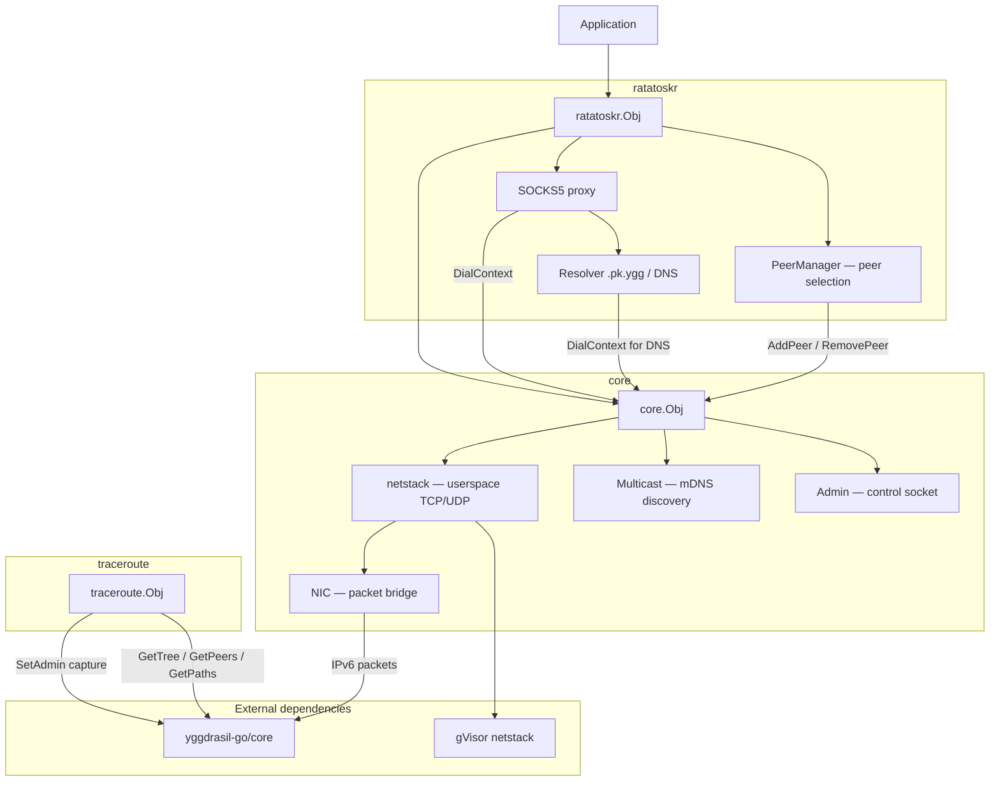

### Packet path

How data flows through the stack — from application to Yggdrasil network and back:

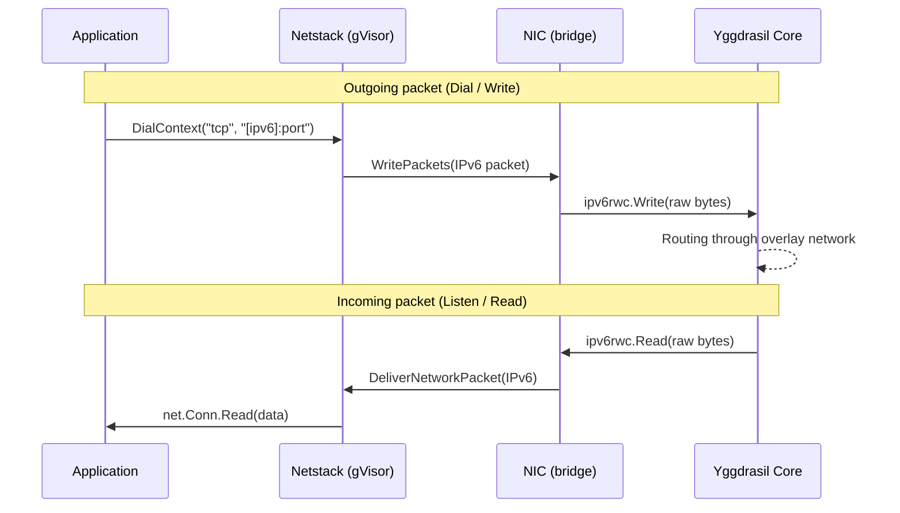

### NIC internal architecture

NIC (`nicObj`) — bridge between gVisor and Yggdrasil at the IPv6 packet level.

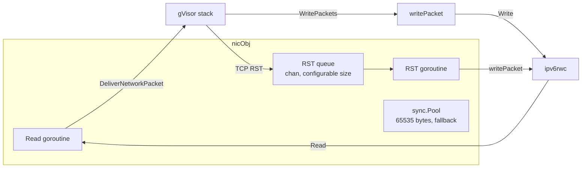

**TCP RST handling:** RST packets without payload are sent not directly but through a buffered queue
(`chan *PacketBuffer`). Queue size is set via `core.ConfigObj.RSTQueueSize` (default 100).
The counter of dropped RST packets is available via `core.Obj.RSTDropped()`.

**RST queue overflow strategy:**

1. Attempt to send to channel
2. If channel is full — evict the oldest packet
3. Retry sending
4. If still fails — packet is dropped, drop counter is incremented

**Packet writing (writePacket):** uses zero-copy via `AsViewList` — packet data is passed
to `ipv6rwc.Write` directly without copying. If a packet consists of multiple Views (rare case),
data is assembled into a buffer from `sync.Pool`. Panics in `WritePackets` are recovered
and logged without crashing the entire stack.

## Module structure

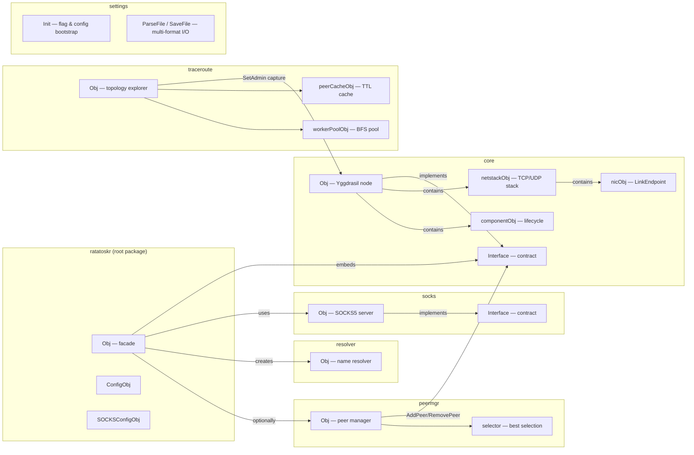

## Packages

### `ratatoskr` (root)

Facade for embedding. Combines core, SOCKS proxy, resolver, and peer manager into a single entry point.

| Type               | Purpose                                                        |
|--------------------|----------------------------------------------------------------|
| `Obj`              | Node with full capabilities: network methods + SOCKS + control |
| `ConfigObj`        | Context, Yggdrasil config, logger, timeout, peer manager       |
| `SOCKSConfigObj`   | Proxy address, DNS server, verbose, connection limit           |
| `SnapshotObj`      | Full node state: address, peers, SOCKS, counters               |
| `PeerSnapshotObj`  | Single peer state: URI, Up, Latency, traffic                   |
| `SOCKSSnapshotObj` | SOCKS5 proxy state: Enabled, Addr, IsUnix                      |

### `core`

Core — Yggdrasil node with userspace network stack.

| Type           | Purpose                                                                                              |
|----------------|------------------------------------------------------------------------------------------------------|
| `Obj`          | Node: DialContext, Listen, ListenPacket, peer management, multicast, admin. Core is `atomic.Pointer` |
| `Interface`    | Public contract — everything external code needs                                                     |
| `netstackObj`  | gVisor TCP/UDP/ICMP stack                                                                            |
| `nicObj`       | Bridge between gVisor and Yggdrasil at the IPv6 packet level                                         |
| `componentObj` | Generic Enable/Disable lifecycle for multicast and admin                                             |

### `peermgr`

Peer manager — automatic selection and maintenance of the optimal peer set.

| Type             | Purpose                                                      |
|------------------|--------------------------------------------------------------|
| `Obj`            | Manager: probing, best selection, periodic refresh           |
| `ConfigObj`      | Parameters: candidate list, timeouts, selection strategy     |
| `ValidatePeers`  | Public URI validation function: duplicates, parsing, schemes |
| `AllowedSchemes` | Allowed transport schemes: `tcp`, `tls`, `quic`, `ws`, `wss` |

**`MaxPerProto` modes:**

| Value     | Behavior                                                       |
|-----------|----------------------------------------------------------------|
| `0` / `1` | One best peer per protocol (default)                           |
| `N > 1`   | Top-N peers per protocol, sorted by latency                    |
| `-1`      | Passive mode: add all candidates without selection; no probing |

**`optimizeActive` logic:**

With `BatchSize <= 1` — one batch = entire list (backward compatibility):

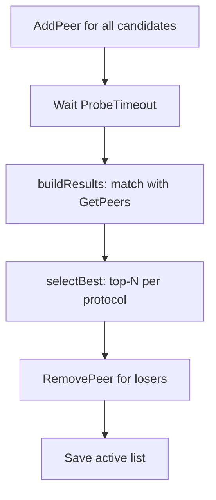

With `BatchSize >= 2` — sliding window, elimination race:

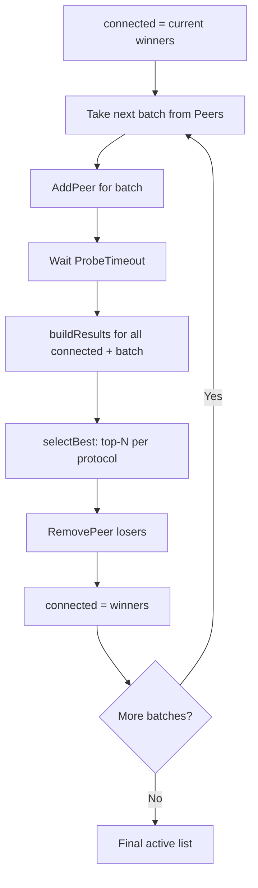

Each new batch races against current winners. Worst performers are eliminated after each round —
ultimately the best from the entire list remain.

### `resolver`

Name resolver with three strategies:

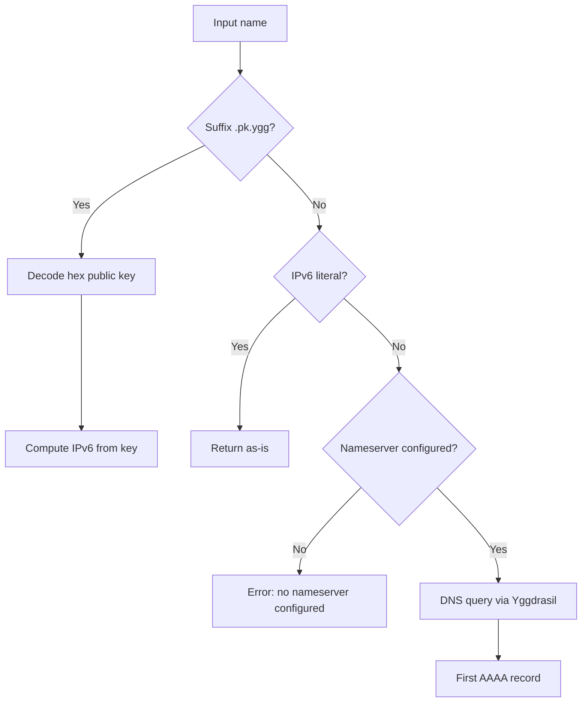

**`.pk.ygg` format:** `<hex-pubkey>.pk.ygg` or `subdomain.<hex-pubkey>.pk.ygg`
(with subdomains, the last segment before `.pk.ygg` is used).
Public key — 32 bytes ed25519 in hex (64 characters).

**DNS over Yggdrasil:** if `Nameserver` is configured, DNS queries (`AAAA`) go through the core's `DialContext` —
traffic does not leak to the system resolver. Without a nameserver, DNS name resolution returns an error.

### `socks`

SOCKS5 proxy over Yggdrasil. Supports TCP and Unix sockets. No authentication.

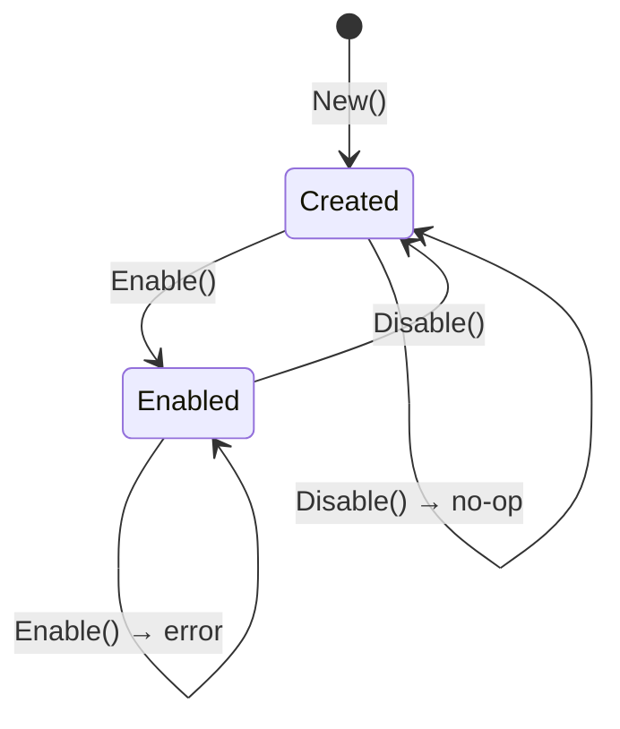

### `traceroute`

Network topology explorer and path tracer for Yggdrasil. Works directly with `yggdrasil-go/core`
(not via `core.Interface`) — captures the internal `debug_remoteGetPeers` handler via `core.SetAdmin`
without requiring a real admin socket.

| Type              | Purpose                                                                        |
|-------------------|--------------------------------------------------------------------------------|
| `Obj`             | Topology explorer: Tree (BFS), Path (spanning tree), Hops (pathfinder), Trace  |
| `NodeObj`         | Node in the topology tree. Find, Flatten, PathTo for subtree operations        |
| `HopObj`          | Single hop in port-level route. Key may be nil if port is unresolvable         |
| `TraceResultObj`  | Combined result: TreePath (spanning tree) + Hops (pathfinder). Both may be set |
| `TreeResultObj`   | BFS result: Root node + Total discovered count                                 |
| `TreeProgressObj` | Progress callback per BFS depth level: Depth, Found, Total, Done               |

#### How it works

The module combines two independent Yggdrasil routing subsystems:

1. **Spanning tree** — `core.GetTree()` returns the local view of the global spanning tree.
   `Path()` builds a tree from this data and finds the path `[root, ..., target]`.

2. **Pathfinder** — `core.GetPaths()` returns active source-routed paths.
   `Hops()` resolves port-level routes for a given key. Requires a prior `Lookup()` to trigger
   path discovery in the core.

3. **BFS topology scan** — `Tree()` uses `debug_remoteGetPeers` to query each node's peers
   and build a full topology tree. This is a network-wide scan, not local data.

**Key difference from classic traceroute:** classic traceroute sends packets with incrementing TTL
and listens for ICMP Time Exceeded replies. Yggdrasil does not support TTL or ICMP. Instead,
this module uses BFS over `debug_remoteGetPeers` for topology and `core.GetPaths()` for
port-level routes. RTT is approximate — it measures the full `debug_remoteGetPeers` round-trip
through all intermediate hops, not individual hop latency.

#### BFS algorithm (Tree)

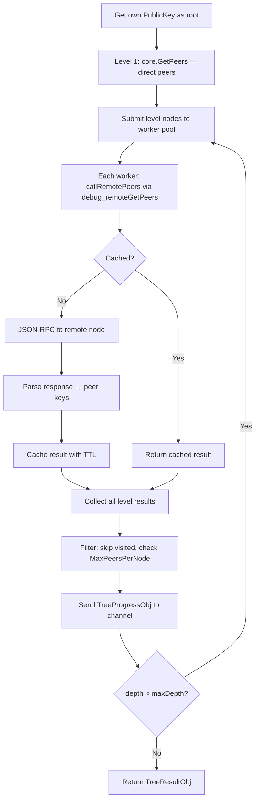

#### Trace strategy

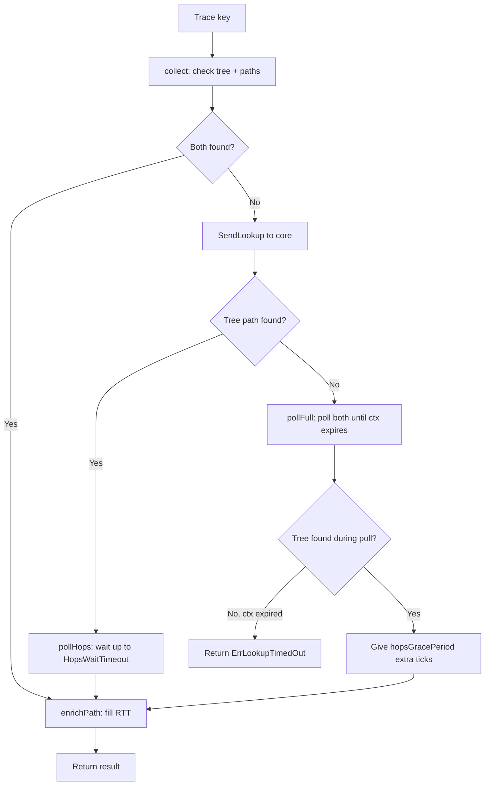

#### Cache lifecycle

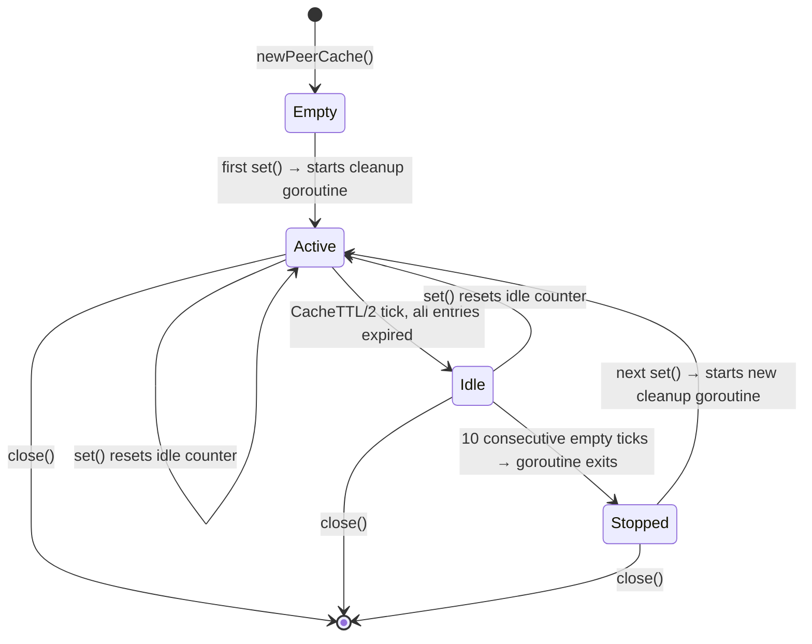

The cleanup goroutine runs every `CacheTTL / 2`, deletes expired entries, and self-terminates
after 10 consecutive iterations with an empty cache. It restarts on the next `set()` call.

#### Configuration variables

These are package-level `var` — change them before calling `New()`.

| Variable           | Type            | Default | Description                                                           |
|--------------------|-----------------|---------|-----------------------------------------------------------------------|
| `MaxPeersPerNode`  | `int`           | `65535` | Max peers from a single node. Exceeding marks the node as Unreachable |
| `CacheTTL`         | `time.Duration` | `60s`   | How long peer query results are cached. Must be ≥ 1s                  |
| `PollInterval`     | `time.Duration` | `200ms` | How often Trace polls core for results                                |
| `LookupRetryEvery` | `time.Duration` | `1s`    | How often SendLookup is retried during polling                        |
| `HopsWaitTimeout`  | `time.Duration` | `2s`    | How long Trace waits for hops when tree path is already found         |

#### API

| Method                                                                                  | Description                                                                                   |
|-----------------------------------------------------------------------------------------|-----------------------------------------------------------------------------------------------|
| `New(core, logger)`                                                                     | Create module. Captures `debug_remoteGetPeers` via `core.SetAdmin`                            |
| `Close()`                                                                               | Stop cache cleanup goroutine                                                                  |
| `FlushCache()`                                                                          | Drop all cached peer query results                                                            |
| `Tree(ctx, maxDepth, conc)`                                                             | BFS topology scan. Returns `TreeResultObj`                                                    |
| `TreeChan(ctx, maxDepth, conc, ch)`                                                     | Same as Tree, with progress via channel                                                       |
| `Path(key)`                                                                             | Path in spanning tree: `[root, ..., target]`                                                  |
| `Hops(key)`                                                                             | Port-level route. Requires prior `Lookup()`                                                   |
| `Lookup(key)`                                                                           | Trigger pathfinder search. Results appear in `Hops()` after some time                         |
| `Trace(ctx, key)`                                                                       | Combined search: tree + pathfinder + polling. **No default timeout — pass ctx with deadline** |
| `Self()`, `Address()`, `Subnet()`, `Peers()`, `Sessions()`, `SpanningTree()`, `Paths()` | Proxy methods to `yggdrasil-go/core`                                                          |

#### NodeObj methods

| Method        | Description                                                  |
|---------------|--------------------------------------------------------------|
| `Find(key)`   | Recursive search by key in subtree. Returns nil if not found |
| `Flatten()`   | Depth-first flat list of all nodes in subtree                |
| `PathTo(key)` | Returns `[root, ..., target]` or nil if key not in subtree   |

#### Caveats

- **RTT is approximate.** For remote nodes, RTT measures the full `debug_remoteGetPeers` round-trip
  through all intermediate hops. It is not the latency to that specific node.
- **No default timeout on `Trace()`.** Always pass a context with a deadline:
  `ctx, cancel := context.WithTimeout(ctx, 30*time.Second)`. Without a deadline, `Trace()` will
  poll indefinitely if the key is not found.
- **`Path()` rebuilds the tree on each call.** It calls `core.GetTree()` and `buildTree()` every time.
  For repeated lookups, consider caching the result or using `Tree()` and `NodeObj.PathTo()`.
- **Mutable globals.** `MaxPeersPerNode`, `CacheTTL`, `PollInterval`, `LookupRetryEvery`,
  `HopsWaitTimeout` are package-level `var`. Changing them during active operations is not safe.
  Set them before calling `New()`.

#### Sentinel errors

| Error                       | When                                                       |
|-----------------------------|------------------------------------------------------------|
| `ErrCoreRequired`           | `New()`: core is nil                                       |
| `ErrLoggerRequired`         | `New()`: logger is nil                                     |
| `ErrRemotePeersNotCaptured` | `New()`: `debug_remoteGetPeers` was not registered by core |
| `ErrInvalidCacheTTL`        | `New()`: `CacheTTL` < 1s                                   |
| `ErrMaxDepthRequired`       | `Tree()`: maxDepth == 0                                    |
| `ErrInvalidKeyLength`       | Key is not 32 bytes ed25519                                |
| `ErrKeyNotInTree`           | `Path()`: key not found in spanning tree                   |
| `ErrNoActivePath`           | `Hops()`: no active pathfinder route to key                |
| `ErrNodeUnreachable`        | Cached: node did not respond to peer query                 |
| `ErrRemotePeersDisabled`    | `callRemotePeers`: handler is nil                          |
| `ErrTreeEmpty`              | `buildTree`: no entries in `core.GetTree()`                |
| `ErrNoRoot`                 | `buildTree`: own key not found in tree entries             |
| `ErrLookupTimedOut`         | `Trace()`: context expired before finding the key          |

All errors can be checked with `errors.Is()`.

### `settings`

Code-generated settings pipeline. A YAML schema (`settings.yml`) is the single source of truth —
the generator (`_generate/settings`) produces Go structs, typed enums, default values, CLI flag
definitions, config file parsing, save logic, and formatted help text. The handwritten
`mod/settings` package wires the generated code into the application entry point.

#### How it works

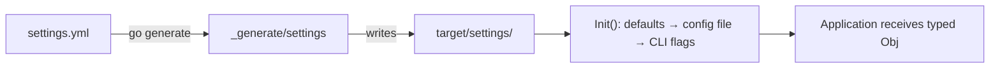

**Three-layer resolution** — each layer overrides the previous one:

1. **Defaults** — baked into `NewDefault()` at generation time.
2. **Config file** — JSON, YAML, or HJSON loaded by `ParseFile()`. Format is detected by extension.
3. **CLI flags** — `flag.FlagSet` registered by `DefineFlags()`. Always wins.

#### Advantages

- Single source of truth — one change in `settings.yml` updates everything
- Typed enums instead of raw strings
- No reflection — direct struct field access

#### Config file formats

| Extension          | Format |
|--------------------|--------|
| `.json`            | JSON   |
| `.yml` / `.yaml`   | YAML   |
| `.hjson` / `.conf` | HJSON  |

`SaveFile()` writes the current settings back in the same format, auto-detected by extension.

#### Triggers

Fields marked `trigger: true` in the schema become CLI-only boolean flags. They are never
read from or written to config files — useful for one-shot actions like `--gen_private_key`.

#### Entry point

```go
msettings.New(func (cfg msettings.Interface) error {
obj := msettings.Obj(cfg)
// obj is a fully resolved *target/settings.Obj
// ready to use with typed fields and enums
return nil
})
```

`New()` calls the generated `Init()`, handles `--help` / `--info`, and passes the resolved
settings object to the application callback. Returns `nil` on help/info (normal exit),
error on init failure.

#### Config chain resolution

`ParseFile()` supports config-to-config redirects. If a config file contains a `config` field
pointing to another file, the parser follows the chain until it reaches a terminal file
(one without `config`). Intermediate files' fields are ignored — only the terminal file is parsed.

- Relative paths resolve from the directory of the referring file
- Cycle detection via visited set
- Hard limit: 32 hops

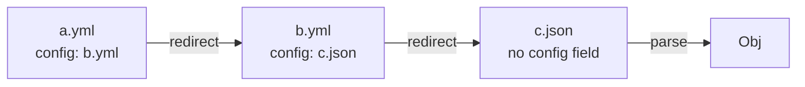

#### Duration normalization

Fields marked as `duration` in the schema are listed in the generated `DurationKeys` map.
All three parsers (JSON, YAML, HJSON) normalize duration values before unmarshalling into the struct:

1. Decode raw data into `map[string]any`
2. Walk the map, converting known duration paths to nanosecond `int64`
3. Re-encode as JSON and unmarshal into the typed `Obj`

This allows config files to use human-readable strings (`"5s"`, `"100ms"`) in any format,
while the struct always receives `time.Duration` (nanoseconds).

#### Save modes

| Function           | Field order | Comments | Type safety |
|--------------------|-------------|----------|-------------|
| `SaveFile`         | encoder     | no       | typed `Obj` |
| `SaveFilePretty`   | schema      | yes      | typed `Obj` |
| `SaveUnsafePretty` | schema      | yes      | `any`       |

All save functions strip the `config` key from output to prevent redirect loops.
Comments and field order come from the generated `Comments` and `FieldOrder` maps.

## Configuration

### ConfigObj (ratatoskr)

| Field             | Type                 | Default | Description                                                                                                                          |
|-------------------|----------------------|---------|--------------------------------------------------------------------------------------------------------------------------------------|
| `Ctx`             | `context.Context`    | `nil`   | Parent context; on cancellation the node automatically calls `Close()`. `nil` — manual control                                       |
| `Config`          | `*config.NodeConfig` | `nil`   | Yggdrasil configuration (keys, listen addresses). `nil` — random keys generated. `Config.Peers` must be empty if `Peers` is set      |
| `Logger`          | `yggcore.Logger`     | `nil`   | Logger; `nil` — logs discarded (noop). Passed to core, SOCKS, and peer manager                                                       |
| `CoreStopTimeout` | `time.Duration`      | `0`     | `core.Stop()` timeout on shutdown. `0` — wait indefinitely                                                                           |
| `Peers`           | `*peermgr.ConfigObj` | `nil`   | Peer manager. `nil` — peers come from `Config.Peers` as in standard Yggdrasil. Non-nil + `Config.Peers` non-empty — error in `New()` |

### ConfigObj (peermgr)

| Field                | Type             | Default  | Description                                                                  |
|----------------------|------------------|----------|------------------------------------------------------------------------------|
| `Peers`              | `[]string`       | required | Candidate URI list: `"tls://host:port"`, `"tcp://..."`, `"quic://..."`, etc. |
| `ProbeTimeout`       | `time.Duration`  | `10s`    | Connection timeout during probing. Ignored when `MaxPerProto == -1`          |
| `RefreshInterval`    | `time.Duration`  | `0`      | Automatic re-check interval. `0` — only at startup                           |
| `MaxPerProto`        | `int`            | `1`      | Number of best peers per protocol. `-1` — passive mode                       |
| `BatchSize`          | `int`            | `0`      | Probing batch size. `0`/`1` — all at once; `≥ 2` — sliding window            |
| `Logger`             | `yggcore.Logger` | required | Logger; `nil` returns an error                                               |
| `OnNoReachablePeers` | `func()`         | `nil`    | Callback when no reachable peers found after probing                         |

### Peer validation (peermgr)

`peermgr.ValidatePeers([]string) → ([]peerEntryObj, []error)` — public function, called in `New()`.
Can be used separately for pre-validation.

| Step          | Action                                                                     |
|---------------|----------------------------------------------------------------------------|
| Empty strings | Skipped without error                                                      |
| Duplicates    | Error `"duplicate peer %q"`, entry discarded; order of remaining preserved |
| URI parsing   | `url.Parse`; on error — entry discarded                                    |
| Host          | Required; `"tls://:8080"` — error `"missing host"`                         |
| Scheme        | From `AllowedSchemes`: `tcp`, `tls`, `quic`, `ws`, `wss`; others — error   |

In `New()`: each error is logged via `Warnf`. If no peers remain after validation — `New()` returns
an error.

### ConfigObj (core)

| Field             | Type                 | Default | Description                                  |
|-------------------|----------------------|---------|----------------------------------------------|
| `Config`          | `*config.NodeConfig` | `nil`   | Yggdrasil configuration. `nil` — random keys |
| `Logger`          | `yggcore.Logger`     | `nil`   | Logger; `nil` — noop                         |
| `CoreStopTimeout` | `time.Duration`      | `0`     | `core.Stop()` timeout. `0` — no limit        |
| `RSTQueueSize`    | `int`                | `100`   | Deferred RST packet queue size. `0` → 100    |

### SOCKSConfigObj (ratatoskr)

| Field            | Type   | Default  | Description                                                                                                         |
|------------------|--------|----------|---------------------------------------------------------------------------------------------------------------------|
| `Addr`           | string | required | Proxy address: TCP `"127.0.0.1:1080"` or Unix socket `"/tmp/ygg.sock"`. Path starting with `/` or `.` — Unix        |
| `Nameserver`     | string | `""`     | DNS server on Yggdrasil network. Format: `"[ipv6]:port"`. Empty string — only `.pk.ygg` and IP literals             |
| `Verbose`        | bool   | `false`  | Verbose logging for each SOCKS connection                                                                           |
| `MaxConnections` | int    | `0`      | Maximum concurrent connections. `0` — unlimited. When limit reached, new connections wait for a slot to be released |

### Address validation

Network methods (`DialContext`, `Listen`, `ListenPacket`) accept addresses in `"[ipv6]:port"` or `":port"` format.

| Input               | Behavior                                    |
|---------------------|---------------------------------------------|
| `"[200:abc::1]:80"` | Valid IPv6 + port                           |
| `":8080"`           | Empty host — bind to all addresses (Listen) |
| `":0"`              | Ephemeral port (assigned by OS)             |
| `"localhost:80"`    | Error: `invalid IP address "localhost"`     |
| `"[::1]:99999"`     | Error: `port 99999 out of range 0-65535`    |
| `"bad"`             | Error: `net.SplitHostPort` failed           |

Supported networks: `tcp`, `tcp6` (for Dial/Listen), `udp`, `udp6` (for Dial/ListenPacket).

## Usage examples

### HTTP client via Yggdrasil

The simplest way — pass `node.DialContext` as transport. All TCP connections will go through Yggdrasil.

```go
client := &http.Client{
Transport: &http.Transport{
// node.DialContext routes connections through the overlay network
DialContext: node.DialContext,
},
}

// Access a service by IPv6 address on the Yggdrasil network
resp, err := client.Get("http://[200:abcd::1]:8080/api/v1/status")
if err != nil {
log.Fatal(err)
}
defer resp.Body.Close()
```

### TCP server on Yggdrasil

The node becomes visible on the Yggdrasil network by its IPv6 address. `Listen` accepts connections only from
the overlay network — the server does not contact the external internet.

```go
// ":8080" — listen on all node addresses (equivalent to [200:...]:8080)
ln, err := node.Listen("tcp", ":8080")
if err != nil {
log.Fatal(err)
}
defer ln.Close()

fmt.Printf("Server available at: http://[%s]:8080/\n", node.Address())

// Standard http.Serve works with any net.Listener
http.Serve(ln, http.HandlerFunc(func (w http.ResponseWriter, r *http.Request) {
fmt.Fprintf(w, "Hello from Yggdrasil node %s", node.Address())
}))
```

### UDP on Yggdrasil

```go
pc, err := node.ListenPacket("udp", ":9000")
if err != nil {
log.Fatal(err)
}
defer pc.Close()

buf := make([]byte, 1500)
for {
n, addr, err := pc.ReadFrom(buf)
if err != nil {
break
}
log.Printf("UDP from %s: %s", addr, buf[:n])
// Reply to sender
pc.WriteTo(buf[:n], addr)
}
```

### SOCKS5 proxy with DNS over Yggdrasil

SOCKS5 proxy allows using Yggdrasil from any application supporting SOCKS5 (curl, browser, git).
`socks5h://` — mode with name resolution on the proxy side.

```go
err = node.EnableSOCKS(ratatoskr.SOCKSConfigObj{
// Address for the SOCKS5 proxy to listen on
Addr: "127.0.0.1:1080",
// DNS server inside the Yggdrasil network — names are resolved via overlay
Nameserver: "[200:abcd::1]:53",
// Log each connection (useful for debugging)
Verbose: true,
// Maximum 128 concurrent connections; 0 — unlimited
MaxConnections: 128,
})
if err != nil {
log.Fatal(err)
}
defer node.DisableSOCKS()

// Usage from terminal:
// curl --proxy socks5h://127.0.0.1:1080 http://example.pk.ygg/
// curl --proxy socks5h://127.0.0.1:1080 http://[200:abcd::1]:8080/
```

#### SOCKS5 proxy via Unix socket

```go
err = node.EnableSOCKS(ratatoskr.SOCKSConfigObj{
// Path starting with "/" — Unix socket (faster than TCP for local use)
Addr:       "/tmp/ygg-socks.sock",
Nameserver: "[200:abcd::1]:53",
})
defer node.DisableSOCKS()

// curl --proxy socks5h://unix:/tmp/ygg-socks.sock http://example.pk.ygg/
```

### Peer manager

#### Active mode — select best

The manager probes all candidates and keeps the N best per protocol. With `RefreshInterval > 0`, probing
repeats periodically.

```go
node, err := ratatoskr.New(ratatoskr.ConfigObj{
Ctx: ctx,
Peers: &peermgr.ConfigObj{
Peers: []string{
"tls://peer1.example.com:17117",
"tls://peer2.example.com:17117",
"tls://peer3.example.com:17117",
"quic://peer4.example.com:17117",
},
// Wait for connection no more than 10 seconds per batch
ProbeTimeout: 10 * time.Second,
// Re-probe every 5 minutes
RefreshInterval: 5 * time.Minute,
// One best TLS peer and one best QUIC peer
MaxPerProto: 1,
// Sliding window: two candidates at a time
BatchSize: 2,
// Call when no reachable peers found
OnNoReachablePeers: func () {
log.Println("No reachable peers!")
},
},
})

// Get current active peers (selected by manager)
active := node.PeerManagerActive()
log.Println("Active peers:", active)

// Trigger an unscheduled re-check (blocks until completion)
if err := node.PeerManagerOptimize(); err != nil {
log.Println("Optimization:", err)
}
```

#### Passive mode — add all without selection

Passive mode (`MaxPerProto: -1`) does not perform probing and adds all candidates immediately.
Identical to standard Yggdrasil behavior with `Config.Peers`.

```go
Peers: &peermgr.ConfigObj{
Peers: []string{
"tls://peer1.example.com:17117",
"tls://peer2.example.com:17117",
},
// -1 = passive mode, no probing
MaxPerProto: -1,
// Reconnect the entire list every 10 minutes
RefreshInterval: 10 * time.Minute,
},
```

#### Pre-validating the peer list

```go
import "github.com/voluminor/ratatoskr/mod/peermgr"

peers := []string{
"tls://peer1.example.com:17117",
"tls://peer1.example.com:17117", // duplicate
"ftp://invalid:1234",            // unsupported scheme
"", // empty string, will be skipped
}

valid, errs := peermgr.ValidatePeers(peers)
for _, e := range errs {
log.Println("Peer error:", e)
}
log.Printf("Valid peers: %d", len(valid))
```

### Runtime peer management

```go
// Add a peer manually (without manager)
if err := node.AddPeer("tls://1.2.3.4:17117"); err != nil {
log.Println("AddPeer:", err)
}
if err := node.AddPeer("quic://[200:abc::1]:17117"); err != nil {
log.Println("AddPeer:", err)
}

// Remove a peer
if err := node.RemovePeer("tls://1.2.3.4:17117"); err != nil {
log.Println("RemovePeer:", err)
}

// Reconnect all disconnected peers
node.RetryPeers()
```

### Monitoring via Snapshot

`Snapshot()` collects full node state in a single atomic call.

```go
snap := node.Snapshot()

// Basic node parameters
log.Printf("Address:    %s", snap.Address)
log.Printf("Subnet:     %s", snap.Subnet)
log.Printf("Public key: %s", snap.PublicKey)
log.Printf("MTU:        %d", snap.MTU)
log.Printf("RST drops:  %d", snap.RSTDropped)

// Peer state
for _, p := range snap.Peers {
status := "DOWN"
if p.Up {
status = fmt.Sprintf("UP, latency=%.1fms", float64(p.Latency)/float64(time.Millisecond))
}
log.Printf("  Peer %s: %s, RX=%d TX=%d", p.URI, status, p.RXBytes, p.TXBytes)
}

// Peers selected by manager
if len(snap.ActivePeers) > 0 {
log.Println("Active (manager):", snap.ActivePeers)
}

// SOCKS state
if snap.SOCKS.Enabled {
log.Printf("SOCKS5: %s (unix=%v)", snap.SOCKS.Addr, snap.SOCKS.IsUnix)
}

// Serialize to JSON for export (e.g., /metrics or /status)
data, _ := json.MarshalIndent(snap, "", "  ")
fmt.Println(string(data))
```

### Logging

`ratatoskr` accepts any object implementing `yggcore.Logger`. Example adapter for `log/slog`:

```go
import (
"log/slog"
"fmt"
)

type slogAdapter struct{ l *slog.Logger }

func (a slogAdapter) Infof(f string, v ...interface{})  { a.l.Info(fmt.Sprintf(f, v...)) }
func (a slogAdapter) Infoln(v ...interface{})           { a.l.Info(fmt.Sprint(v...)) }
func (a slogAdapter) Warnf(f string, v ...interface{})  { a.l.Warn(fmt.Sprintf(f, v...)) }
func (a slogAdapter) Warnln(v ...interface{})           { a.l.Warn(fmt.Sprint(v...)) }
func (a slogAdapter) Errorf(f string, v ...interface{}) { a.l.Error(fmt.Sprintf(f, v...)) }
func (a slogAdapter) Errorln(v ...interface{})          { a.l.Error(fmt.Sprint(v...)) }
func (a slogAdapter) Debugf(f string, v ...interface{}) { a.l.Debug(fmt.Sprintf(f, v...)) }
func (a slogAdapter) Debugln(v ...interface{})          { a.l.Debug(fmt.Sprint(v...)) }
func (a slogAdapter) Printf(f string, v ...interface{}) { a.l.Info(fmt.Sprintf(f, v...)) }
func (a slogAdapter) Println(v ...interface{})          { a.l.Info(fmt.Sprint(v...)) }
func (a slogAdapter) Traceln(v ...interface{})          {}

node, err := ratatoskr.New(ratatoskr.ConfigObj{
Logger: slogAdapter{l: slog.Default()},
})
```

### Multicast and Admin

```go
import (
"os"
golog "github.com/gologme/log"
)

// mDNS peer discovery on local network.
// Interfaces are set in NodeConfig.MulticastInterfaces.
mcLogger := golog.New(os.Stderr, "[multicast] ", golog.LstdFlags)
if err := node.EnableMulticast(mcLogger); err != nil {
log.Fatal(err)
}
defer node.DisableMulticast()

// Admin socket — JSON API for node management.
// Unix socket (recommended for local management):
if err := node.EnableAdmin("unix:///tmp/ygg-admin.sock"); err != nil {
log.Fatal(err)
}
// Or TCP:
// node.EnableAdmin("tcp://127.0.0.1:9001")
defer node.DisableAdmin()
```

### Traceroute

#### Topology scan

```go
import "github.com/voluminor/ratatoskr/mod/traceroute"

// Create traceroute module — requires raw yggdrasil-go/core, not core.Interface
tr, err := traceroute.New(node.UnsafeCore(), logger)
if err != nil {
log.Fatal(err)
}
defer tr.Close()

// BFS scan up to 10 hops deep, 32 concurrent workers
ctx, cancel := context.WithTimeout(context.Background(), 2*time.Minute)
defer cancel()

result, err := tr.Tree(ctx, 10, 32)
if err != nil {
log.Fatal(err)
}

log.Printf("Discovered %d nodes", result.Total)
for _, node := range result.Root.Flatten() {
log.Printf("  depth=%d key=%x unreachable=%v rtt=%s",
node.Depth, node.Key[:8], node.Unreachable, node.RTT)
}
```

#### Topology scan with progress

```go
ch := make(chan traceroute.TreeProgressObj, 10)
go func () {
for p := range ch {
if p.Done {
log.Printf("Scan complete: %d nodes total", p.Total)
} else {
log.Printf("Depth %d: found %d nodes (%d total)", p.Depth, p.Found, p.Total)
}
}
}()

result, err := tr.TreeChan(ctx, 10, 32, ch)
close(ch) // TreeChan does not close the channel
```

#### Trace a specific node

```go
// Always provide a deadline — Trace() polls indefinitely without one
ctx, cancel := context.WithTimeout(context.Background(), 30*time.Second)
defer cancel()

targetKey := ed25519.PublicKey{...} // 32-byte ed25519 public key
result, err := tr.Trace(ctx, targetKey)
if err != nil {
if errors.Is(err, traceroute.ErrLookupTimedOut) {
// Partial result may be available
if result != nil && result.TreePath != nil {
log.Println("Tree path found, but hops timed out")
}
}
log.Fatal(err)
}

// Spanning tree path
if result.TreePath != nil {
log.Println("Tree path:")
for _, n := range result.TreePath {
log.Printf("  %x (depth=%d, rtt=%s)", n.Key[:8], n.Depth, n.RTT)
}
}

// Port-level hops (pathfinder route)
if result.Hops != nil {
log.Println("Hops:")
for _, h := range result.Hops {
log.Printf("  port=%d key=%x", h.Port, h.Key[:8])
}
}
```

#### Spanning tree path and hops separately

```go
// Path from spanning tree — no network calls, instant
path, err := tr.Path(targetKey)
if errors.Is(err, traceroute.ErrKeyNotInTree) {
log.Println("Target not in current spanning tree view")
}

// Trigger pathfinder lookup
tr.Lookup(targetKey)
time.Sleep(2 * time.Second)

// Get port-level route
hops, err := tr.Hops(targetKey)
if errors.Is(err, traceroute.ErrNoActivePath) {
log.Println("No active path yet — retry later")
}
```

#### Tuning configuration

```go
// Set before calling traceroute.New()
traceroute.CacheTTL = 30 * time.Second // faster cache expiry
traceroute.MaxPeersPerNode = 1000 // lower limit for safety
traceroute.PollInterval = 100 * time.Millisecond // faster polling
traceroute.LookupRetryEvery = 500 * time.Millisecond
traceroute.HopsWaitTimeout = 5 * time.Second // wait longer for hops
```

### Graceful shutdown

Three ways to shut down a node:

```go
// 1. Explicit Close() call — idempotent, safe for repeated calls
defer node.Close()

// 2. Via context — Close() is called automatically on cancellation
ctx, cancel := context.WithCancel(context.Background())
node, _ = ratatoskr.New(ratatoskr.ConfigObj{Ctx: ctx})
// ...
cancel() // → node shuts down on its own

// 3. Via OS signal
ctx, stop := signal.NotifyContext(context.Background(), os.Interrupt, syscall.SIGTERM)
defer stop()
node, _ = ratatoskr.New(ratatoskr.ConfigObj{Ctx: ctx})
<-ctx.Done() // wait for signal; node is already shutting down
```

## Snapshot

`Snapshot()` — collects full node state in a single call. Returns `SnapshotObj` with JSON tags.

| Field         | Type                | Description                                 |
|---------------|---------------------|---------------------------------------------|
| `Address`     | `string`            | Node IPv6 address                           |
| `Subnet`      | `string`            | `/64` subnet                                |
| `PublicKey`   | `string`            | ed25519 public key (hex)                    |
| `MTU`         | `uint64`            | Stack MTU                                   |
| `RSTDropped`  | `int64`             | Dropped RST packet counter                  |
| `Peers`       | `[]PeerSnapshotObj` | Each peer state (URI, Up, Latency, traffic) |
| `ActivePeers` | `[]string`          | Peers selected by manager (`omitempty`)     |
| `SOCKS`       | `SOCKSSnapshotObj`  | SOCKS5 proxy state (Enabled, Addr, IsUnix)  |

## Thread safety

All public methods of `Obj` and `core.Obj` are safe for concurrent use.

| Method / group                          | Guarantee                                                                           |
|-----------------------------------------|-------------------------------------------------------------------------------------|
| `DialContext`, `Listen`, `ListenPacket` | Thread-safe; netstack protected via `atomic.Pointer`                                |
| `EnableSOCKS` / `DisableSOCKS`          | Mutex-protected; repeated `Enable` without `Disable` — error                        |
| `EnableMulticast` / `DisableMulticast`  | `sync.RWMutex`-protected; repeated `Enable` — error                                 |
| `EnableAdmin` / `DisableAdmin`          | Same as multicast                                                                   |
| `AddPeer` / `RemovePeer`                | Thread-safe; core protected via `atomic.Pointer` (delegates to `yggdrasil-go/core`) |
| `PeerManagerActive`                     | Mutex-protected inside `peermgr.Obj`; returns a copy of the list                    |
| `PeerManagerOptimize`                   | Blocks until completion; serialized with automatic probing via `optimizeMu`         |
| `Close`                                 | Idempotent (`sync.Once`); safe for repeated and concurrent calls                    |
| `Address`, `Subnet`, `PublicKey`, `MTU` | Thread-safe; core and netstack via `atomic.Pointer`                                 |
| `Snapshot`                              | Thread-safe; collects data from thread-safe methods                                 |

**Concurrent Enable multicast + admin:** admin handlers are registered atomically via a separate
`handlersMu` mutex after `enable()` completes, which prevents ABBA deadlock between components.

## Error handling

### Methods returning errors

| Method                | Errors                                                                                    |
|-----------------------|-------------------------------------------------------------------------------------------|
| `New`                 | Core creation error, `Config.Peers` + `Peers` conflict, peermgr start error               |
| `DialContext`         | `ErrNotAvailable` (node closed), gVisor errors, invalid address                           |
| `Listen`              | `ErrNotAvailable`, gVisor errors, invalid address                                         |
| `ListenPacket`        | `ErrNotAvailable`, gVisor errors, invalid address                                         |
| `EnableSOCKS`         | `"SOCKS already enabled"`, listen error (port busy / invalid path)                        |
| `DisableSOCKS`        | Listener close error                                                                      |
| `EnableMulticast`     | `"multicast already enabled"`, invalid regex, `multicast.New` error                       |
| `EnableAdmin`         | `"admin already enabled"`, invalid address, `admin.New` returned nil                      |
| `AddPeer`             | Invalid URI, core error                                                                   |
| `RemovePeer`          | Invalid URI, core error                                                                   |
| `PeerManagerOptimize` | `"peermgr: not running"` if manager is not started                                        |
| `Close`               | Collects errors from all components via `errors.Join`; idempotent                         |
| `traceroute.New`      | `ErrCoreRequired`, `ErrLoggerRequired`, `ErrInvalidCacheTTL`, `ErrRemotePeersNotCaptured` |
| `traceroute.Tree`     | `ErrMaxDepthRequired`, context cancellation                                               |
| `traceroute.Path`     | `ErrInvalidKeyLength`, `ErrKeyNotInTree`, `ErrTreeEmpty`, `ErrNoRoot`                     |
| `traceroute.Hops`     | `ErrInvalidKeyLength`, `ErrNoActivePath`                                                  |
| `traceroute.Trace`    | `ErrInvalidKeyLength`, `ErrLookupTimedOut` (may include partial result)                   |

### ErrNotAvailable

Returned from `DialContext`, `Listen`, `ListenPacket` if netstack is already destroyed (after `Close()`).

```go
conn, err := node.DialContext(ctx, "tcp", "[200:abc::1]:80")
if errors.Is(err, ratatoskr.ErrNotAvailable) {
// Node is already closed — don't attempt to reconnect
return
}
```

### Unix socket (SOCKS)

When starting on a Unix socket, the stale file case is handled:

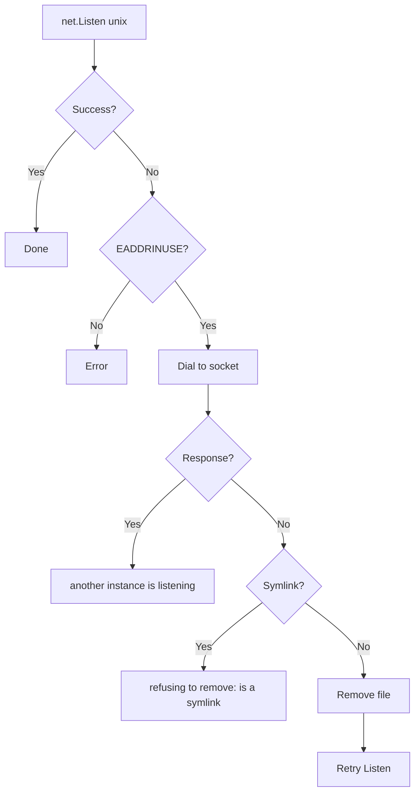

### Rate limiting (SOCKS)

With `MaxConnections > 0`, the proxy limits the number of concurrent connections via a semaphore:

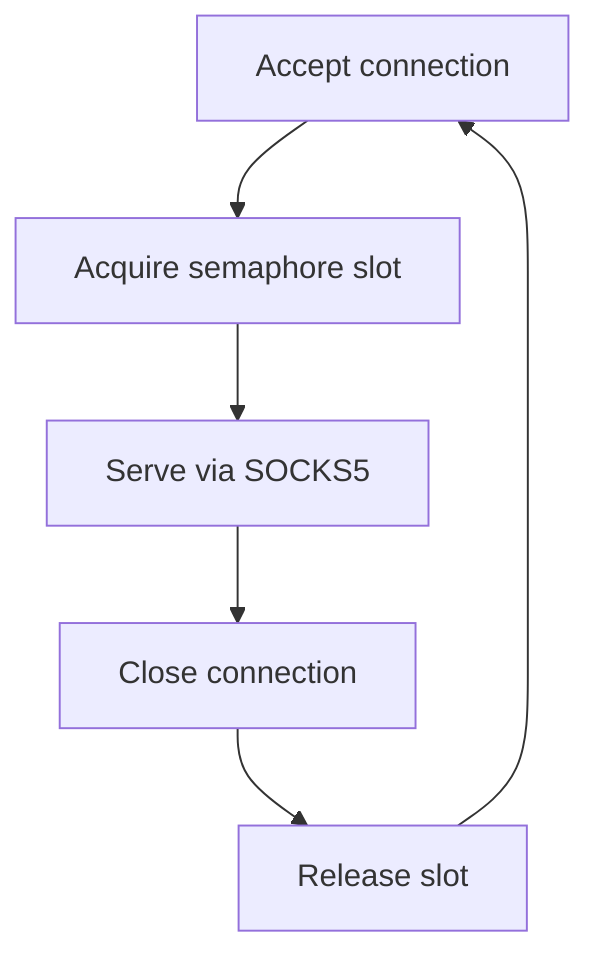

- `Accept` is called **before** acquiring the semaphore — on shutdown, `listener.Close()` correctly unblocks the wait
- The semaphore blocks processing when the limit is reached; the connection is already accepted but waits for a slot
- The semaphore slot is released exactly once on connection close (`sync.Once`)

## Lifecycle

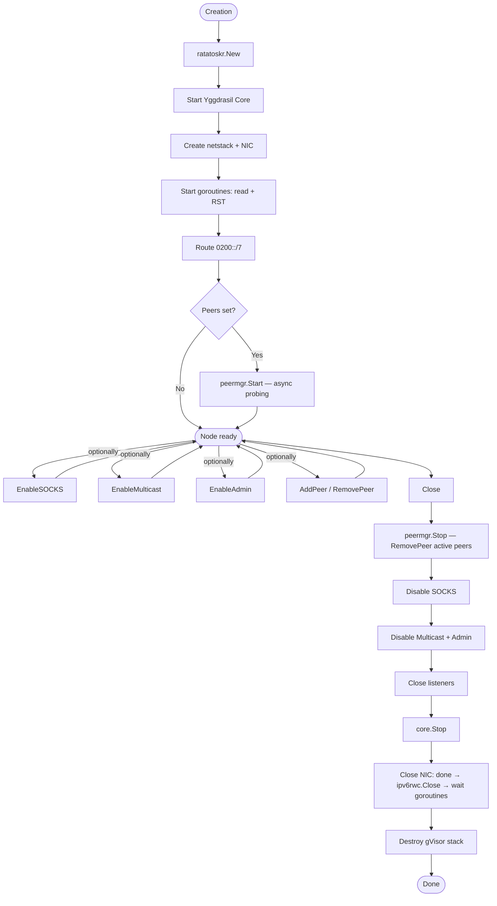

### Shutdown order (Close)

1. **peermgr.Stop()** — cancel probing context, wait for goroutines, `RemovePeer` all active peers
2. **Disable SOCKS** — closing the listener stops `Serve`, `wg.Wait()` waits for completion. Unix socket is removed
3. **Disable Multicast + Admin** — call `stopFn()` for each component
4. **Close listeners** — all listeners created via `Listen`/`ListenPacket` are closed
5. **core.Stop()** — stop Yggdrasil core. Unblocks `ipv6rwc.Read()` in NIC
6. **NIC Close** — `close(done)` signals goroutines, `ipv6rwc.Close()`, wait for `readDone` and `rstDone`, drain
   RST queue, `RemoveNIC`
7. **stack.Destroy()** — destroy gVisor stack

With `CoreStopTimeout > 0`: if `core.Stop()` does not complete within the specified time,
a warning is logged and shutdown continues.

### Auto-shutdown via context

If `Ctx` is passed in `ConfigObj`, a goroutine listens for context cancellation and calls `Close()` automatically.
On manual `Close()`, the goroutine terminates via the `done` channel.
