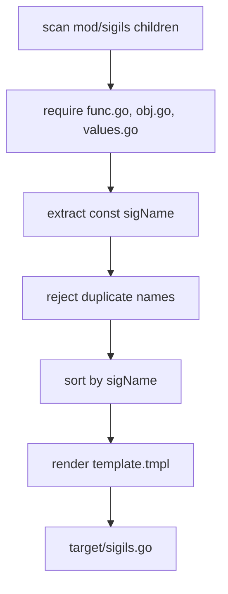

# Built-in sigil registry generator

This module discovers built-in sigil packages and generates the immutable parser registry in `target/sigils.go`. The
root `go generate` directive invokes it after metadata generation.

## Discovery contract

A directory directly under `mod/sigils` is included only when it contains all three files:

- `func.go`;
- `obj.go`;
- `values.go`.

`values.go` must contain an exact top-level declaration in this form:

```go
const sigName = "service"
```

The folder name becomes the import alias. `sigName` becomes the parser-map key. Missing required files cause the
directory to be ignored; a malformed `sigName` emits a warning and skips that directory. Duplicate names fail generation
because they would collide in the registry.

## Data flow



Sorting makes the generated imports and registry stable. The template contains no generation timestamp, so an unchanged
sigil set produces identical output.

## Run

From the repository root:

```bash
go run ./_generate/sigils
```

Or run the complete root generation chain:

```bash
go generate .
```

The complete chain also clears `target` and `tmp` and runs the metadata generator at `latest`; do not use it when
temporary work under `tmp` must be preserved.

## Verify

```bash
cd _generate/sigils
GOWORK=off go test -count=10 -shuffle=on ./...
GOWORK=off go vet ./...
GOWORK=off staticcheck ./...
```

Do not edit `target/sigils.go` manually. Change a sigil package or this generator and regenerate the file.
