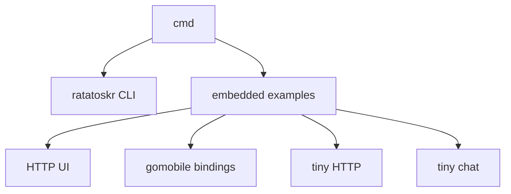

# Command and embedding examples

This tree contains experimental command-line programs and platform examples built on Ratatoskr. It is not the primary
library API.

## Current status

All modules compile against the current APIs. Build success does not make the example applications production-ready:

| Component                                    | Build status | Remaining validation boundary                        |
|----------------------------------------------|--------------|------------------------------------------------------|
| [ratatoskr CLI](ratatoskr/README.md)         | Builds       | Network commands need end-to-end validation          |
| [embedded HTTP UI](embedded/http/README.md)  | Builds       | Public HTTP and topology surfaces are not hardened   |
| [mobile bindings](embedded/mobile/README.md) | Builds       | Android and iOS artifacts need target-SDK validation |
| [tiny HTTP](embedded/tiny-http/README.md)    | Builds       | Example only; uses fixed peers and ports             |
| [tiny chat](embedded/tiny-chat/README.md)    | Builds       | Example only; interactive and unauthenticated        |

Do not use a successful workspace build as evidence that an application is hardened or its release artifact is
validated. Each component README lists its runtime and security boundaries.

## Layout

Each runnable component is a separate Go module with its own `go.mod`. Run build and test commands from that component's
directory with `GOWORK=off` when you need to verify its declared dependencies rather than a local workspace.

## Safety

These programs are development surfaces. Some bind to all interfaces, accept unauthenticated requests, use public
bootstrap peers, or expose control and diagnostic behavior. Read the component README before running it on a reachable
host.
