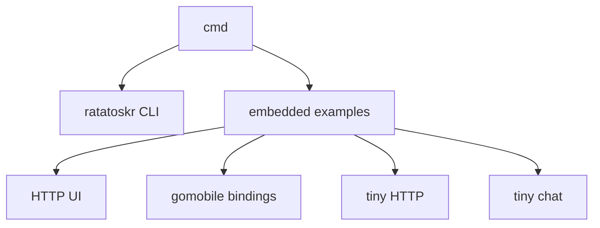

# Command and embedding examples

This tree contains experimental command-line programs and platform examples built on Ratatoskr. It is not the primary
library API.

## Current status

Several programs are not synchronized with the current module APIs:

| Component                                    | Build status | Blocking issue                                                               |
|----------------------------------------------|--------------|------------------------------------------------------------------------------|
| [ratatoskr CLI](ratatoskr/README.md)         | Broken       | Uses the previous `forward.New` and `probe.New` signatures                   |
| [embedded HTTP UI](embedded/http/README.md)  | Broken       | Uses the previous `probe.New` signature                                      |
| [mobile bindings](embedded/mobile/README.md) | Broken       | Refers to removed `forward.ManagerObj` and the previous `forward.New` result |
| [tiny HTTP](embedded/tiny-http/README.md)    | Builds       | Example only; hard-coded peer and ports                                      |
| [tiny chat](embedded/tiny-chat/README.md)    | Builds       | Example only; interactive and unauthenticated                                |

Do not use this tree as evidence that a release artifact is ready. The library packages under `mod` and the root
integration have their own tests and documentation; these programs require separate repair and end-to-end validation.

## Layout

Each runnable component is a separate Go module with its own `go.mod`. Run build and test commands from that component's
directory with `GOWORK=off` when you need to verify its declared dependencies rather than a local workspace.

## Safety

These programs are development surfaces. Some bind to all interfaces, accept unauthenticated requests, use public
bootstrap peers, or expose control and diagnostic behavior. Read the component README before running it on a reachable
host.
