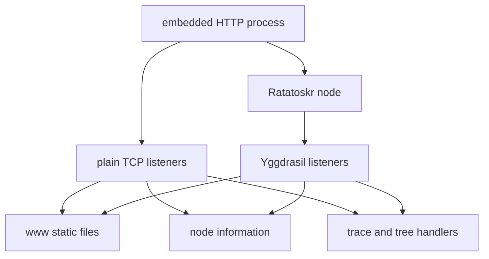

# Embedded HTTP UI

This program is intended to serve the same static UI over plain TCP and Yggdrasil while exposing node status, route
tracing, and topology scans.

## Current status

The program compiles against the current probe API. Its public listeners, route tracing, and topology handlers have not
been revalidated as a complete deployed application.

## Contents

- [Intended architecture](#intended-architecture)
- [Build](#build)
- [Configuration](#configuration)
- [HTTP surface](#http-surface)
- [Security boundaries](#security-boundaries)

## Intended architecture



## Build

```bash
cd cmd/embedded/http
GOWORK=off go test ./...
GOWORK=off go build -trimpath -o ../../../tmp/ratatoskr-http .
```

Run from the module directory so the default `www` and `conf.yml` paths resolve:

```bash
../../../tmp/ratatoskr-http -config conf.yml -www www
```

## Configuration

| YAML field    | Default     | Meaning                                                                       |
|---------------|-------------|-------------------------------------------------------------------------------|
| `private_key` | empty       | 128-character hexadecimal Ed25519 private key; empty generates a new identity |
| `hostname`    | `localhost` | Address shown in the JSON metadata                                            |
| `peers`       | empty       | Managed Yggdrasil peer URIs                                                   |
| `http_ports`  | `[8080]`    | Plain TCP HTTP ports                                                          |
| `ygg_ports`   | `[8443]`    | Yggdrasil HTTP ports                                                          |

The included [conf.yml](conf.yml) uses plain port 8080, Yggdrasil ports 80 and 443, and multiple public peers.
Auto-generated private keys change the node address at every start.

## HTTP surface

| Path                                          | Purpose                                                              |
|-----------------------------------------------|----------------------------------------------------------------------|
| `/`                                           | Static files from the selected `www` directory                       |
| `/yggdrasil-server.json`                      | Address, peers, traffic, sessions, and uptime; cached for one second |
| `/ygg-qr.png`                                 | QR code for the first Yggdrasil HTTP URL                             |
| `/probe.json?key=<64-hex>`                    | Route trace with a 6-second request timeout                          |
| `/tree.json?depth=<1..65535>&concurrency=<n>` | Topology tree with a 30-second timeout                               |
| `/tree-ws`                                    | WebSocket topology progress and results                              |

Directory listing is disabled for the plain file handler. The Yggdrasil file handler serves the configured tree through
the embedded transport.

## Security boundaries

- Plain listeners bind to `:<port>`, not host loopback.
- The HTTP surface has no authentication.
- The WebSocket handshake accepts the request origin and exposes expensive topology scans.
- A requested tree depth may be as high as 65,535; the probe layer supplies the effective concurrency and cancellation
  limits.
- Static files come from a caller-selected directory.

Run this program only on a trusted interface until authentication, origin policy, and request budgets are implemented
and tested.
