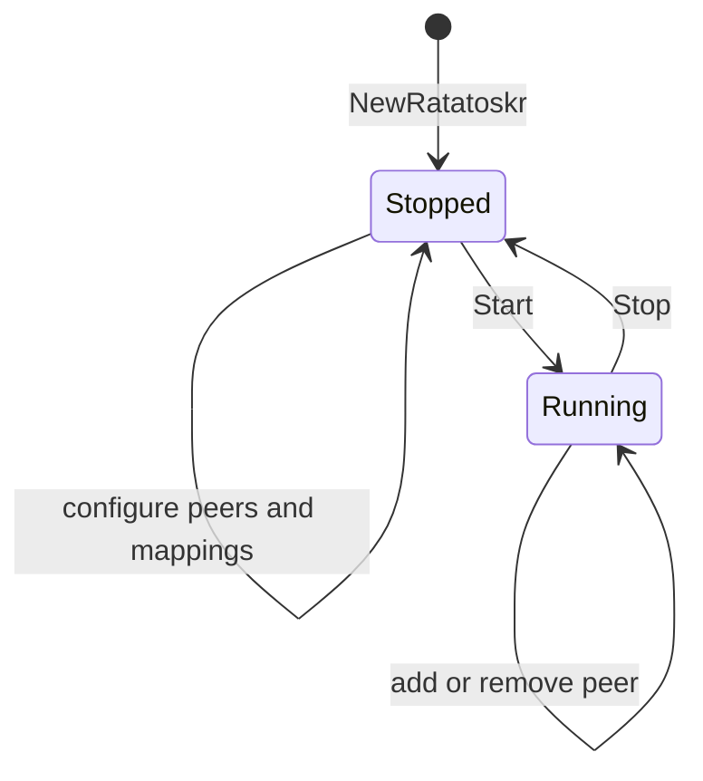

# Mobile bindings

This module is intended to expose node lifecycle, peers, SOCKS5, forwarding, callbacks, and basic diagnostics through
gomobile.

## Current status

The Go module compiles and its unit tests pass against the current immutable forwarding API. Android and iOS binding
artifacts still need builds and runtime checks with their target SDKs.

## Contents

- [Lifecycle](#lifecycle)
- [Build](#build)
- [Intended use](#intended-use)
- [Callbacks and threading](#callbacks-and-threading)
- [Configuration rules](#configuration-rules)

## Lifecycle



Mapping changes are accepted only while stopped. Concurrent `Stop` callers share one shutdown result. A stopped object
may be started again.

## Build

Requirements include Go, `gomobile`, platform SDKs, and an initialized gomobile toolchain:

```bash
go install golang.org/x/mobile/cmd/gomobile@latest
gomobile init
```

Build Android, iOS, or both:

```bash
cd cmd/embedded/mobile
bash build.sh android
bash build.sh ios
bash build.sh all
```

Android uses API level 21 and Java package `link.yggdrasil.ratatoskr`. Outputs go to `dist/ratatoskr.aar` and
`dist/Ratatoskr.xcframework`.

## Intended use

The Go form of the binding lifecycle is:

```go
node := mobile.NewRatatoskr()
node.SetCoreStopTimeout(10_000)
node.SetSessionTimeout(120_000)

if err := node.AddPeer("tls://peer.example:443"); err != nil {
    return err
}
if err := node.AddLocalTCPMapping("127.0.0.1:8080", "[200::1]:80"); err != nil {
    return err
}
if err := node.Start("127.0.0.1:1080", ""); err != nil {
    return err
}
defer node.Stop()
```

`GenerateConfig` returns JSON with a random identity and disabled admin listener. `LoadConfigJSON` accepts it only while
stopped. `GetPeers` and `GetPeersJSON` return JSON strings suitable for foreign-language bindings.

## Callbacks and threading

`LogCallbackInterface.Log` and `PeerChangeCallbackInterface.OnPeerCountChanged` must return quickly. Callbacks execute
synchronously from Go goroutines; blocking them can block logging or peer monitoring. Peer counts are sampled every 5
seconds and can also be emitted through `TriggerPeerUpdate`.

## Configuration rules

- `SetCoreStopTimeout(0)` uses the root library default.
- The initial UDP session timeout is 120,000 milliseconds.
- `SetSessionTimeout` ignores non-positive values.
- Empty `socksAddr` disables SOCKS5.
- Empty `nameserver` disables `.ygg` DNS resolution through a nameserver.
- Mapping ports must be between 1 and 65,535.
- Multicast and mappings must be configured before `Start`.
- `CheckQuicRTT` has a 10-second timeout and deliberately accepts Yggdrasil's self-signed QUIC certificate.
