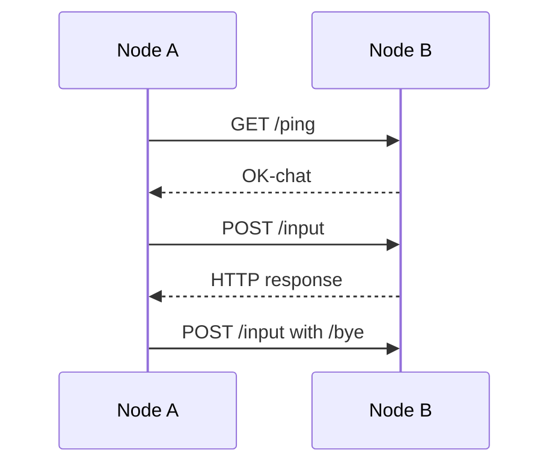

# Tiny chat example

This interactive example connects two users through HTTP over Yggdrasil. Each side starts a node, enters the same
bootstrap network, exchanges public keys out of band, and sends line-oriented messages.

## Build and run

Build on both hosts:

```bash
cd cmd/embedded/tiny-chat
GOWORK=off go test ./...
GOWORK=off go build -trimpath -o ../../../tmp/tiny-chat .
../../../tmp/tiny-chat
```

For each instance:

1. Enter a Yggdrasil peer URI.
2. Copy the printed 64-character public key to the other user.
3. Enter the other user's public key.
4. Wait for the `/ping` exchange.
5. Send lines; use `/bye` to close both sides.

## Protocol

The program derives the peer IPv6 address from its Ed25519 public key and uses Yggdrasil TCP port 9998. `/ping` returns
a fixed readiness marker. `/input` accepts at most 10 KiB and prints the body as a chat line. The HTTP client disables
keep-alive and uses a 10-second total timeout.



## Limitations

- The service has no application authentication or message encryption beyond the Yggdrasil transport.
- Anyone who can reach the node address and port can submit `/input` requests.
- Messages are not persisted, acknowledged to the user, retried, or ordered across concurrent senders.
- The process supports one interactive peer and uses global shutdown state.
- Connection polling retries every 2 seconds without a separate overall deadline; signals still cancel the process.

Use it only as a compact embedding example on a trusted test network.
