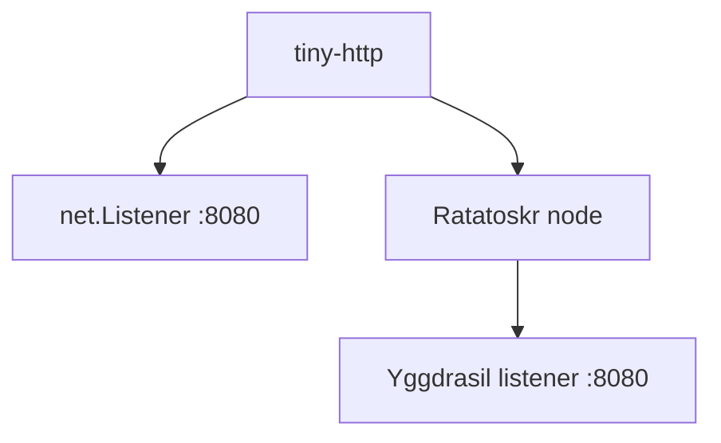

# Tiny HTTP example

This minimal program serves one HTTP response over ordinary TCP and another over an embedded Yggdrasil node.

## Build and run

```bash
cd cmd/embedded/tiny-http
GOWORK=off go test ./...
GOWORK=off go build -trimpath -o ../../../tmp/tiny-http .
../../../tmp/tiny-http
```

The program prints the plain and Yggdrasil URLs, then runs until SIGINT or SIGTERM.

## Fixed behavior

| Setting             | Value                              |
|---------------------|------------------------------------|
| Plain listener      | `:8080`                            |
| Yggdrasil listener  | node address on port `8080`        |
| Bootstrap peer      | `tls://yggdrasil.sunsung.fun:4443` |
| HTTP header timeout | 10 seconds                         |
| HTTP idle timeout   | 60 seconds                         |
| Node close budget   | 5 seconds                          |
| Admin listener      | Disabled                           |

The plain listener binds to every local interface even though the printed convenience URL uses `localhost`. There is no
TLS, authentication, configurable peer, or configurable port. Treat this as embedding source code, not a deployable
server.

## Data flow


