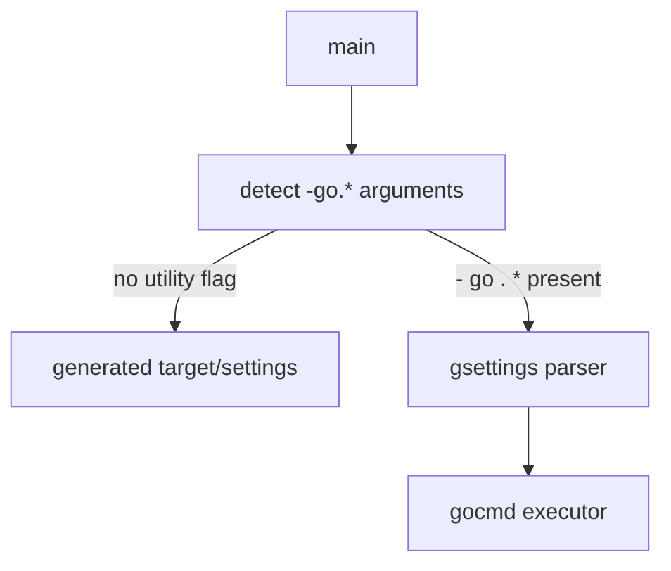

# Ratatoskr CLI

This module contains a generated-settings CLI plus key, configuration, NodeInfo, peer, forwarding, and probe utilities.

## Current status

The CLI and its subpackages compile and pass their unit tests. Network-facing commands still need live end-to-end
validation before the binary should be treated as a supported operational tool.

## Contents

- [Architecture](#architecture)
- [Generation and build](#generation-and-build)
- [Runtime configuration mode](#runtime-configuration-mode)
- [Utility command mode](#utility-command-mode)
- [Security and output](#security-and-output)
- [Subpackages](#subpackages)

## Architecture



Runtime configuration flags and `-go.*` utility flags are separate modes and cannot be combined in one invocation.

## Generation and build

The configuration schema lives in `yml/config`. `go generate` recreates `target/settings` through `goconfgen`; generated
files must not be edited manually.

```bash
cd cmd/ratatoskr
go generate .
GOWORK=off go test ./...
GOWORK=off go build -trimpath -ldflags='-s -w' -o ../../tmp/ratatoskr-cli .
```

The generator version defaults to `latest` by project policy and may be overridden through the generator's supported
environment expansion.

## Runtime configuration mode

Without `-go.*`, the CLI loads defaults, optionally merges a YAML, JSON, or HJSON configuration and flag overrides,
validates it, and prints effective JSON:

```bash
../../tmp/ratatoskr-cli \
  -config ./ratatoskr-config.yml \
  -yggdrasil.if.mtu 65535
```

Show generated flag help:

```bash
../../tmp/ratatoskr-cli -h
```

## Utility command mode

Generate a vanity key for 10 seconds:

```bash
../../tmp/ratatoskr-cli -go.key.gen 10s
```

Show the address for a hexadecimal key or PEM path:

```bash
../../tmp/ratatoskr-cli -go.key.addr key.pem
```

Generate configuration:

```bash
../../tmp/ratatoskr-cli \
  -go.conf.generate.path ../../tmp/config \
  -go.conf.generate.preset medium \
  -go.conf.generate.format yml
```

Query NodeInfo:

```bash
../../tmp/ratatoskr-cli \
  -go.ask.addr '<public-key>.pk.ygg' \
  -go.ask.peer 'tls://peer.example:443' \
  -go.ask.timeout 10s \
  -go.ask.format json
```

Inspect peers:

```bash
../../tmp/ratatoskr-cli \
  -go.peer_info.peer 'tls://peer.example:443' \
  -go.peer_info.format json
```

Forward local TCP:

```bash
../../tmp/ratatoskr-cli \
  -go.forward.from '127.0.0.1:8080' \
  -go.forward.to '[200::1]:80' \
  -go.forward.proto tcp \
  -go.forward.peer 'tls://peer.example:443'
```

Trace a route:

```bash
../../tmp/ratatoskr-cli \
  -go.probe.trace '<64-character-public-key>' \
  -go.probe.peer 'tls://peer.example:443'
```

## Security and output

- Generated and converted private-key files use mode `0600`.
- The utility logger suppresses debug/info messages and writes warnings/errors to stderr.
- Forwarding creates listeners from caller-supplied addresses; binding a wildcard exposes the service accordingly.
- Utility commands connect to caller-supplied peer URIs and should not be run with untrusted configuration.
- Generated configuration output can contain private key material.

## Subpackages

- [gsettings](gsettings/README.md): utility flag parsing and typed command values.
- [gocmd](gocmd/README.md): utility command execution.
- `target/settings`: third-party generated runtime settings. It is recreated by `go generate` and intentionally has no
  hand-written files.
