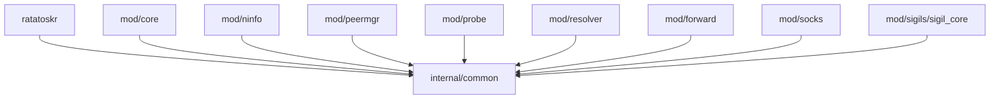
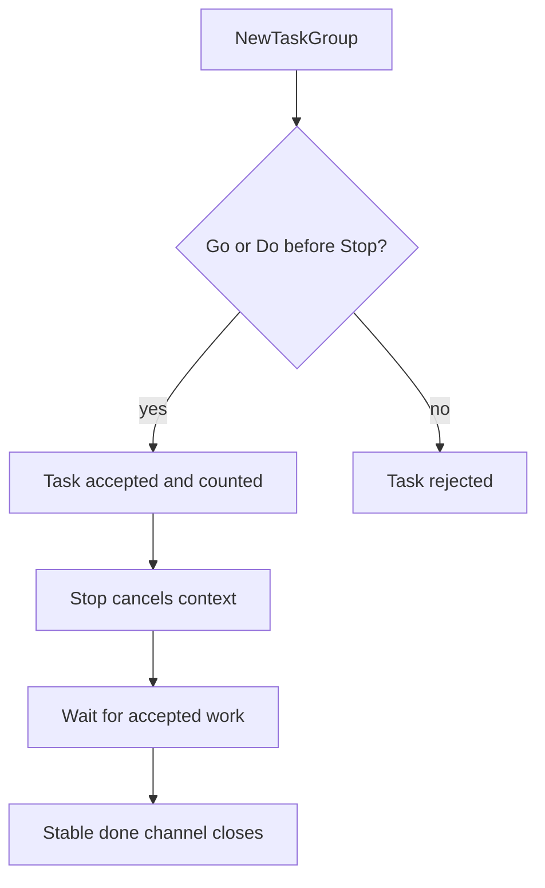
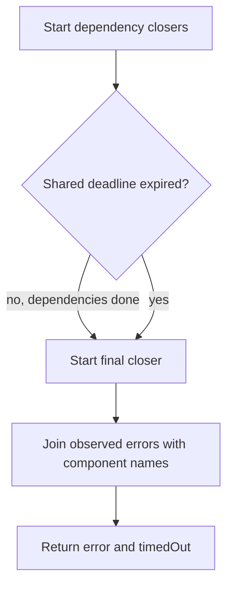

# internal/common

Shared implementation primitives used by Ratatoskr modules. This package is internal to the repository and is not an
application API.

## Contents

- [Responsibilities](#responsibilities)
- [Dependency flow](#dependency-flow)
- [Task ownership](#task-ownership)
- [Bounded shutdown](#bounded-shutdown)
- [Dynamic admission limits](#dynamic-admission-limits)
- [Deadline refresh](#deadline-refresh)
- [NodeInfo ownership](#nodeinfo-ownership)
- [Public-key domains](#public-key-domains)
- [Admin handler capture](#admin-handler-capture)
- [Logging](#logging)

## Responsibilities

The package contains small primitives with at least two repository consumers:

| File                           | Responsibility                                        |
|--------------------------------|-------------------------------------------------------|
| [`taskgroup.go`](taskgroup.go) | admission, cancellation, and completion of owned work |
| [`shutdown.go`](shutdown.go)   | ordered shutdown under one caller deadline            |
| [`limit.go`](limit.go)         | runtime-adjustable admission counting                 |
| [`deadline.go`](deadline.go)   | low-syscall idle-deadline refresh                     |
| [`nodeinfo.go`](nodeinfo.go)   | bounded deep cloning of NodeInfo data                 |
| [`publickey.go`](publickey.go) | strict `.pk.ygg` parsing                              |
| [`admin.go`](admin.go)         | capture of upstream Yggdrasil admin handlers          |
| [`logger.go`](logger.go)       | nil-safe Yggdrasil logging                            |

It does not contain module-specific policy. Defaults such as peer counts, SOCKS limits, and probe timeouts remain in
their owning modules.

## Dependency flow



`internal/common` does not import any Ratatoskr module. The only project-specific external type it accepts is the
upstream `yggcore.Logger` contract.

## Task ownership

`TaskGroupObj` closes the race between task admission and `sync.WaitGroup.Wait`:



`Go` starts owned asynchronous work. `Do` executes in the caller while making shutdown wait for it. `Stop` is idempotent
and returns the same completion channel to every waiter. `Wait` starts shutdown when needed and blocks for completion.

Accepted work must return after `Context` is cancelled. The group deliberately has no internal timeout; the root package
applies its shutdown budget separately.

## Bounded shutdown

`CloseWithDeadline` runs dependency closers concurrently, waits for them within one timeout, and then starts the final
closer. The final operation normally represents the Yggdrasil core and starts only after observed dependency completion.



An operation that exceeds the deadline continues in its goroutine. The caller receives `timedOut=true`; already observed
errors are preserved. The function does not terminate or abandon an in-progress closer.

## Dynamic admission limits

`DynamicLimitObj` tracks active slots under a mutable limit:

- a positive value is a hard cap;
- zero or a negative value is unlimited;
- `Acquire` succeeds immediately or returns `false`;
- `AcquireOrReady` returns a retry channel when admission fails;
- `Set` and `Release` close the current retry channel;
- waiters must retry because a wake-up is a state-change notification, not a reserved slot;
- extra `Release` calls at zero active slots are ignored.

The unlimited steady-state `Acquire` and `Release` path is allocation-free.

## Deadline refresh

`RefreshDeadline` avoids a deadline syscall for every packet. It arms a new deadline only after half of the configured
timeout has elapsed. Concurrent changes are serialized so an older syscall cannot complete after a newer one and shorten
the effective deadline.

Use `readOnly=true` for one-way readers that require `SetReadDeadline`. Other callers use `SetDeadline`. A non-positive
timeout clears an existing deadline and becomes a lock-free no-op once the deadline is clear.

## NodeInfo ownership

`CloneNodeInfo` accepts maps and nested Go containers used by Yggdrasil NodeInfo. It produces independent map, slice,
array, and pointer values, including typed containers such as `map[string][]string`.

The clone rejects:

- reference cycles with `ErrNodeInfoCycle`;
- nesting beyond 64 container levels with `ErrNodeInfoTooDeep`.

Shared acyclic inputs are cloned independently, so mutating one output branch cannot affect another.

## Public-key domains

`ParsePublicKeyDomain` recognizes case-insensitive `.pk.ygg` suffixes and requires exactly 64 hexadecimal characters
before the suffix. Its boolean distinguishes an unrelated hostname from a malformed `.pk.ygg` candidate:

```go
key, matched, err := common.ParsePublicKeyDomain(name)
switch {
case !matched:
// Resolve by another strategy.
case err != nil:
// Reject the malformed public-key domain.
default:
_ = key
}
```

Subdomains are rejected because the complete prefix would exceed the required key length.

## Admin handler capture

`AdminCaptureObj` implements the upstream `SetAdmin` registration surface and records callbacks by command name.
`mod/ninfo` and `mod/probe` use it during construction to obtain specific remote-debug handlers without starting an
admin socket.

The object is a construction-time collector. It does not synchronize concurrent writes and must not be reused as a live
mutable admin registry.

## Logging

`NormalizeLogger` returns the supplied `yggcore.Logger` or `DiscardLoggerObj` for nil. Modules can therefore log without
repeated nil checks while preserving silent defaults.
