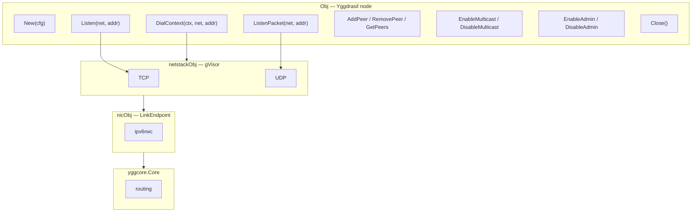
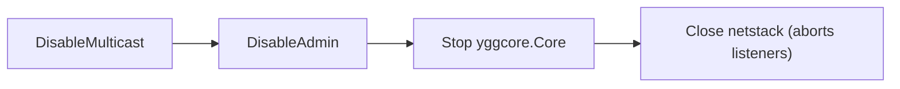

# mod/core

Yggdrasil node with a userspace TCP/UDP stack. Wraps `yggcore.Core` and gVisor netstack, providing standard
Go interfaces for networking: `net.Conn`, `net.Listener`, `net.PacketConn`.

## Contents

- [Overview](#overview)
- [Initialization](#initialization)
- [Network operations](#network-operations)
    - [DialContext](#dialcontext)
    - [Listen](#listen)
    - [ListenPacket](#listenpacket)
- [Node information](#node-information)
- [Peer management](#peer-management)
- [Components](#components)
    - [Multicast](#multicast)
    - [Admin socket](#admin-socket)
- [Shutdown](#shutdown)
- [Errors](#errors)

---

## Overview



Layers from bottom to top:

1. **yggcore.Core** — routing and peer management
2. **ipv6rwc** — packet I/O between Yggdrasil and NIC
3. **nicObj** — implements gVisor `stack.LinkEndpoint`, bridges ipv6rwc and netstack
4. **netstackObj** — TCP/UDP protocols on top of gVisor
5. **Obj** — public API, lifecycle, component management

---

## Initialization

```go
obj, err := core.New(core.ConfigObj{
Config: nodeCfg, // *config.NodeConfig; nil — random keys
Logger: logger, // nil — logs are discarded
})
defer obj.Close()
```

`New` creates a `yggcore.Core`, then sets up netstack with gVisor. After successful creation the node is ready to accept
connections and connect to peers.

---

## Network operations

All methods are compatible with standard Go interfaces. Supported networks: `tcp`, `tcp6`, `udp`, `udp6`.

### DialContext

```go
DialContext(ctx context.Context, network, address string) (net.Conn, error)
```

Connects to an Yggdrasil address. Compatible with `http.Transport.DialContext`.

### Listen

```go
Listen(network, address string) (net.Listener, error)
```

Creates a TCP listener. Address format: `:port` or `[ipv6]:port`. The listener is automatically closed on `Close()`.

### ListenPacket

```go
ListenPacket(network, address string) (net.PacketConn, error)
```

Creates a UDP listener. Address format is the same as `Listen`. Automatically closed on `Close()`.

---

## Node information

| Method        | Returns             | Description                                |
|---------------|---------------------|--------------------------------------------|
| `Address()`   | `net.IP`            | Node's IPv6 address in the `200::/7` range |
| `Subnet()`    | `net.IPNet`         | Routable `/64` subnet                      |
| `PublicKey()` | `ed25519.PublicKey` | Node's public key (32 bytes)               |
| `MTU()`       | `uint64`            | Network interface MTU                      |

---

## Peer management

```go
obj.AddPeer("tls://203.0.113.55:443")
obj.RemovePeer("tls://203.0.113.55:443")
peers := obj.GetPeers() // []yggcore.PeerInfo
obj.RetryPeers()        // re-trigger connection attempts to configured peers
```

URI formats: `tcp://`, `tls://`, `quic://`, `ws://`, `wss://`.

---

## Components

Multicast and Admin socket are toggleable components with double-enable protection. Each component
is thread-safe
and supports the `Enable → Disable → Enable` cycle.

### Multicast

```go
obj.EnableMulticast() // mDNS discovery on the local network
obj.DisableMulticast()
```

Interfaces for discovery are taken from `NodeConfig.MulticastInterfaces`. Interface patterns are compiled as
regular
expressions.

### Admin socket

```go
obj.EnableAdmin("unix:///tmp/ygg.sock")
obj.EnableAdmin("tcp://127.0.0.1:9001")
obj.DisableAdmin()
```

`EnableAdmin` delegates through [`mod/core/admin`](admin/README.md), a thin pass-through to the upstream Yggdrasil
admin socket. It intentionally inherits upstream behavior instead of maintaining a second server implementation.

The socket is unsafe operational tooling: it has no authentication, deadlines, or request-size limit; handler
registration can race with requests; accepted keepalive connections survive `DisableAdmin`; and bind or Unix-socket
cleanup failures can terminate the process with `os.Exit(1)`. Use only a protected Unix socket or loopback endpoint
with trusted clients. The admin package README documents the complete limitations.

---

## Shutdown

```go
err := obj.Close() // safe for repeated calls
```

Shutdown order:



As a standalone module, `Close` waits for upstream `core.Stop()` to finish. The
root `ratatoskr` package adds the optional total shutdown deadline used by embedded
applications.

---

## Errors

| Variable                     | Description                              |
|------------------------------|------------------------------------------|
| `ErrNotAvailable`            | Netstack is not initialized              |
| `ErrAlreadyEnabled`          | Component is already enabled             |
| `ErrAdminDisabled`           | Admin socket is not active               |
| `ErrUnsupportedNetwork`      | Unsupported network type (not tcp/udp)   |
| `ErrPortRequired`            | Address is missing a port                |
| `ErrPortOutOfRange`          | Port is out of the 0–65535 range         |
| `ErrInvalidAddress`          | Invalid IP address                       |
| `ErrIPv6Only`                | Only IPv6 addresses are supported        |
| `ErrInvalidAllowedPublicKey` | Malformed AllowedPublicKeys entry        |
