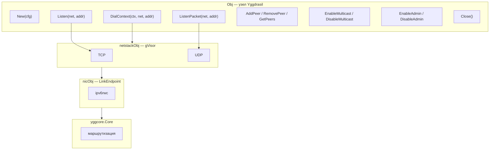
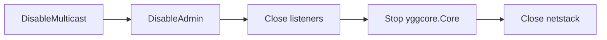

# mod/core

Узел Yggdrasil с userspace TCP/UDP стеком. Оборачивает `yggcore.Core` и gVisor netstack, предоставляя стандартные
Go-интерфейсы для работы с сетью: `net.Conn`, `net.Listener`, `net.PacketConn`.

## Содержание

- [Обзор](#обзор)
- [Инициализация](#инициализация)
- [Сетевые операции](#сетевые-операции)
    - [DialContext](#dialcontext)
    - [Listen](#listen)
    - [ListenPacket](#listenpacket)
- [Информация об узле](#информация-об-узле)
- [Управление пирами](#управление-пирами)
- [Компоненты](#компоненты)
    - [Multicast](#multicast)
    - [Admin socket](#admin-socket)
- [Завершение работы](#завершение-работы)
- [Ошибки](#ошибки)

---

## Обзор



Слои снизу вверх:

1. **yggcore.Core** — маршрутизация и управление пирами
2. **ipv6rwc** — пакетный I/O между Yggdrasil и NIC
3. **nicObj** — реализует `stack.LinkEndpoint` gVisor, мост между ipv6rwc и netstack
4. **netstackObj** — TCP/UDP протоколы поверх gVisor
5. **Obj** — публичный API, жизненный цикл, управление компонентами

---

## Инициализация

```go
obj, err := core.New(core.ConfigObj{
Config:          nodeCfg, // *config.NodeConfig; nil — случайные ключи
Logger:          logger,  // nil — логи отбрасываются
CoreStopTimeout: 5 * time.Second,
RSTQueueSize:    100, // 0 → 100 по умолчанию
})
defer obj.Close()
```

`New` создаёт `yggcore.Core`, затем поднимает netstack с gVisor. После успешного создания узел готов принимать
соединения и подключаться к пирам.

---

## Сетевые операции

Все методы совместимы со стандартными Go-интерфейсами. Поддерживаемые сети: `tcp`, `tcp6`, `udp`, `udp6`.

### DialContext

```go
DialContext(ctx context.Context, network, address string) (net.Conn, error)
```

Подключается к Yggdrasil-адресу. Совместим с `http.Transport.DialContext`.

### Listen

```go
Listen(network, address string) (net.Listener, error)
```

Создаёт TCP-листенер. Формат адреса: `:port` или `[ipv6]:port`. Листенер автоматически закрывается при `Close()`.

### ListenPacket

```go
ListenPacket(network, address string) (net.PacketConn, error)
```

Создаёт UDP-листенер. Формат аналогичен `Listen`. Автоматически закрывается при `Close()`.

---

## Информация об узле

| Метод          | Возвращает          | Описание                              |
|----------------|---------------------|---------------------------------------|
| `Address()`    | `net.IP`            | IPv6-адрес узла в диапазоне `200::/7` |
| `Subnet()`     | `net.IPNet`         | Маршрутизируемая `/64` подсеть        |
| `PublicKey()`  | `ed25519.PublicKey` | Публичный ключ узла (32 байта)        |
| `MTU()`        | `uint64`            | MTU сетевого интерфейса               |
| `RSTDropped()` | `int64`             | Количество отброшенных RST-пакетов    |

---

## Управление пирами

```go
obj.AddPeer("tls://203.0.113.55:443")
obj.RemovePeer("tls://203.0.113.55:443")
peers := obj.GetPeers() // []yggcore.PeerInfo
```

URI-форматы: `tcp://`, `tls://`, `quic://`, `ws://`, `wss://`.

---

## Компоненты

Multicast и Admin socket — это переключаемые компоненты с защитой от двойного включения. Каждый компонент
потокобезопасен
и поддерживает цикл `Enable → Disable → Enable`.

### Multicast

```go
obj.EnableMulticast(logger) // mDNS-обнаружение в локальной сети
obj.DisableMulticast()
```

Интерфейсы для обнаружения берутся из `NodeConfig.MulticastInterfaces`. Паттерны интерфейсов компилируются как
регулярные
выражения.

### Admin socket

```go
obj.EnableAdmin("unix:///tmp/ygg.sock")
obj.EnableAdmin("tcp://127.0.0.1:9001")
obj.DisableAdmin()
```

После включения регистрирует обработчики для межкомпонентного взаимодействия.

---

## Завершение работы

```go
err := obj.Close() // безопасен для повторного вызова
```

Порядок остановки:



Если `CoreStopTimeout` задан и core не успевает остановиться за это время — возвращается `ErrCloseTimedOut`.

---

## Ошибки

| Переменная              | Описание                                 |
|-------------------------|------------------------------------------|
| `ErrNotAvailable`       | Netstack не инициализирован              |
| `ErrCloseTimedOut`      | Core не остановился за `CoreStopTimeout` |
| `ErrAlreadyEnabled`     | Компонент уже включён                    |
| `ErrAdminDisabled`      | Admin socket не активен                  |
| `ErrUnsupportedNetwork` | Неподдерживаемый тип сети (не tcp/udp)   |
| `ErrPortOutOfRange`     | Порт вне диапазона 0–65535               |
| `ErrInvalidAddress`     | Невалидный IP-адрес                      |
