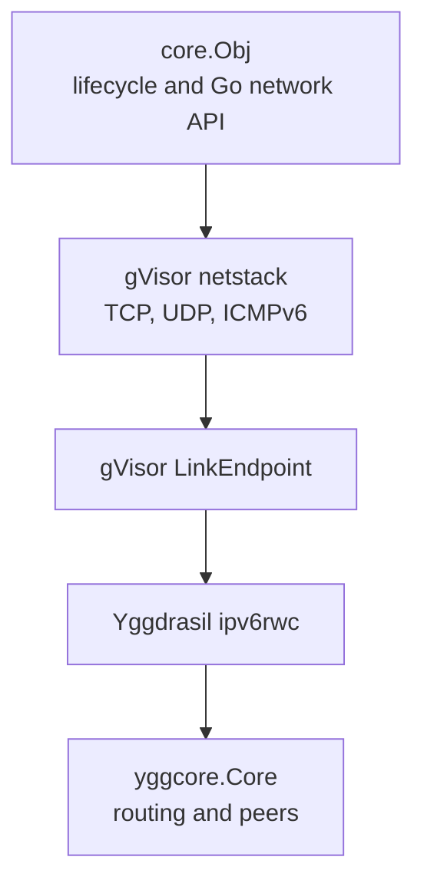
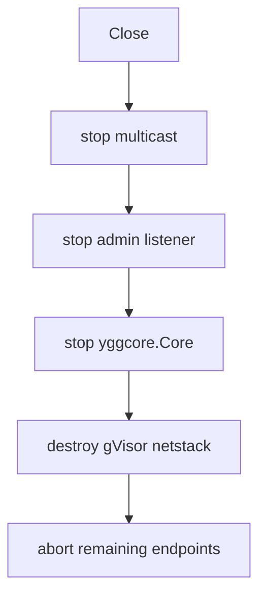

# Core

Package `core` embeds a Yggdrasil node and exposes TCP and UDP through standard
Go networking interfaces backed by gVisor.

Key contracts:

- `DialContext`, `Listen`, and `ListenPacket` operate on Yggdrasil IPv6 addresses.
- `Close() error` is idempotent and closes owned listeners and packet endpoints.
- `ConfigObj.Config` may be nil; this generates a node with random keys.
- the optional admin socket is an unsafe upstream pass-through; read the
  [admin warning](admin/README.md) before enabling it.

## Contents

- [Architecture](#architecture)
- [Construction](#construction)
- [Networking](#networking)
- [Identity and peers](#identity-and-peers)
- [Optional components](#optional-components)
  - [Multicast](#multicast)
  - [Admin socket](#admin-socket)
- [Shutdown](#shutdown)
- [Concurrency and ownership](#concurrency-and-ownership)
- [Errors](#errors)

## Architecture



The implementation is separated by responsibility:

- [`node.go`](node.go) owns construction, shutdown, networking, and identity.
- [`peers.go`](peers.go) contains runtime peer operations.
- [`multicast.go`](multicast.go) controls local peer discovery.
- [`admin.go`](admin.go) connects the core to the admin adapter.
- [`netstack.go`](netstack.go) and [`nic.go`](nic.go) bridge gVisor to Yggdrasil.
- [`options.go`](options.go) translates `config.NodeConfig` into upstream options.

## Construction

```go
package main

import (
  "log"

  ratcore "github.com/voluminor/ratatoskr/mod/core"
  "github.com/yggdrasil-network/yggdrasil-go/src/config"
)

func main() {
  nodeConfig := config.GenerateConfig()
  nodeConfig.AdminListen = "none"

  node, err := ratcore.New(ratcore.ConfigObj{Config: nodeConfig})
  if err != nil {
    log.Fatal(err)
  }
  defer func() {
    if err := node.Close(); err != nil {
      log.Printf("close node: %v", err)
    }
  }()
}
```

`Logger == nil` discards logs. Construction copies the node-config struct,
copies `MulticastInterfaces`, and deep-clones JSON-shaped `NodeInfo`. Cyclic or
unsupported `NodeInfo` values return `ErrInvalidNodeInfo`.

The configured MTU is clamped to the upstream maximum. A non-zero value below
the IPv6 minimum of 1280 is raised to 1280 unless the upstream maximum itself is
lower. Zero selects the upstream maximum.

## Networking

Supported network names and address forms:

| Method         | Networks                     | Address examples          |
|----------------|------------------------------|---------------------------|
| `DialContext`  | `tcp`, `tcp6`, `udp`, `udp6` | `[200:...]:443`           |
| `Listen`       | `tcp`, `tcp6`                | `:8080`, `[200:...]:8080` |
| `ListenPacket` | `udp`, `udp6`                | `:9000`, `[200:...]:9000` |

```go
listener, err := node.Listen("tcp", ":8080")
if err != nil {
return err
}
defer listener.Close()

conn, err := node.DialContext(ctx, "tcp", "[200:db8::1]:8080")
if err != nil {
return err
}
defer conn.Close()
```

An omitted `DialContext` context is treated as `context.Background()`. Closing
the node aborts endpoints owned by the gVisor stack. Networking calls made after
shutdown return `ErrNotAvailable`.

## Identity and peers

| Method        | Result                         |
|---------------|--------------------------------|
| `Address()`   | node address in `200::/7`      |
| `Subnet()`    | routable `/64` in `300::/7`    |
| `PublicKey()` | owned 32-byte Ed25519 key copy |
| `MTU()`       | active virtual-interface MTU   |

After shutdown these accessors return their zero values.

```go
if err := node.AddPeer("tls://203.0.113.10:443"); err != nil {
return err
}
peers := node.GetPeers()
if err := node.RemovePeer("tls://203.0.113.10:443"); err != nil {
return err
}
```

`RetryPeers` asks upstream Yggdrasil to retry configured peers immediately.
`GetPeers` includes configured and connected peers.

## Optional components

Multicast and admin use the same lifecycle contract:

- enabling an active component returns `ErrAlreadyEnabled`;
- disabling an inactive component succeeds;
- a component can be enabled again after disable;
- a stop error is returned, but the component is still marked inactive.

### Multicast

`EnableMulticast` uses `Config.MulticastInterfaces`. Each `Regex` is compiled
when multicast starts, so an invalid pattern is returned to the caller rather
than ignored.

```go
if err := node.EnableMulticast(); err != nil {
return err
}
defer node.DisableMulticast()
```

### Admin socket

```go
if err := node.EnableAdmin("unix:///run/ratatoskr/admin.sock"); err != nil {
return err
}
defer node.DisableAdmin()
```

Admin has no authentication, deadlines, or request-size limit. Handler
registration can race with requests, accepted keepalive connections survive
`DisableAdmin`, and upstream bind or Unix-socket cleanup failures can terminate
the host process with `os.Exit(1)`. Use only a protected local endpoint. The
[admin package README](admin/README.md) lists the complete inherited behavior.

## Shutdown



Standalone `core.Obj.Close` waits for upstream `Core.Stop`. Applications that
need a total shutdown deadline should use the root package lifecycle wrapper.

## Concurrency and ownership

Public operations are safe to race with `Close`; unavailable operations return
zero values or `ErrNotAvailable` as described above. Component transitions are
serialized. `PublicKey` returns a copy.

`SetAdmin` is intentionally unsafe. Upstream handler registration is not
synchronized with request processing. Call it only during trusted construction,
never concurrently with `EnableAdmin` or `EnableMulticast`.

## Errors

All errors support `errors.Is` when wrapped.

| Error                        | Meaning                                        |
|------------------------------|------------------------------------------------|
| `ErrNotAvailable`            | node or netstack is unavailable                |
| `ErrAlreadyEnabled`          | optional component is already active           |
| `ErrAdminDisabled`           | upstream treated the admin address as disabled |
| `ErrUnsupportedNetwork`      | network name is unsupported for the operation  |
| `ErrPortRequired`            | address omitted its port                       |
| `ErrPortOutOfRange`          | port is outside `0..65535`                     |
| `ErrInvalidAddress`          | host is not an IP literal                      |
| `ErrIPv6Only`                | host is IPv4                                   |
| `ErrInvalidNodeInfo`         | NodeInfo cannot be safely cloned               |
| `ErrInvalidAllowedPublicKey` | allowlist key is invalid hex or not 32 bytes   |
