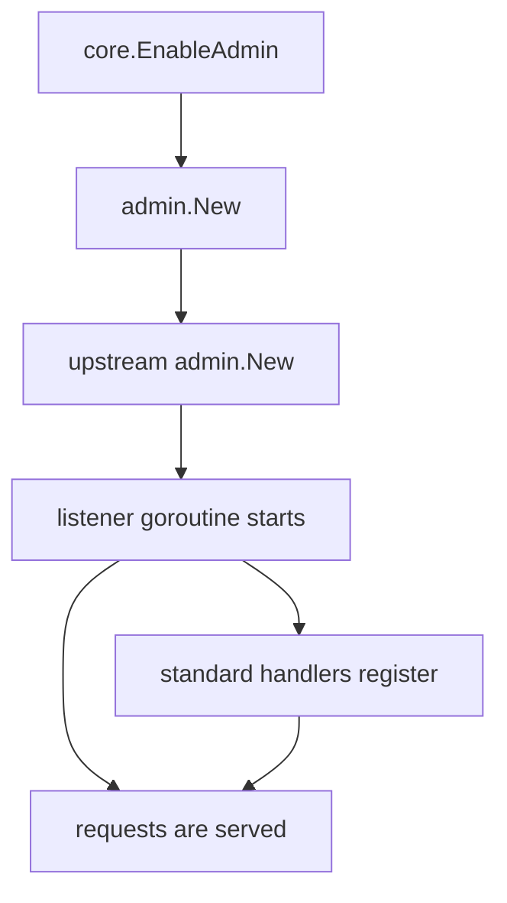

# Admin adapter

Package `admin` is the adapter through which [`mod/core`](../README.md) starts
the upstream Yggdrasil admin socket. It deliberately delegates to
`github.com/yggdrasil-network/yggdrasil-go/src/admin` instead of maintaining a
second protocol implementation.

This package is not a security boundary. It inherits upstream process-exit,
concurrency, connection-lifecycle, and resource-limit behavior.

## Integration

`core.Obj.EnableAdmin` is the intended entry point:

```go
if err := node.EnableAdmin("unix:///run/ratatoskr/admin.sock"); err != nil {
return err
}
defer node.DisableAdmin()
```

Internally, `admin.New(ConfigObj)` calls upstream `admin.New`, registers the
standard handlers, and returns a small object with `AttachMulticast` and `Stop`.
Direct imports are possible but are not a supported standalone integration
surface.



The listener starts before handler registration completes. The diagram shows
the resulting overlap; an early request can race with the handler-map writes.

## Security and stability limits

The adapter inherits all of these upstream properties:

- no authentication, authorization, or transport encryption;
- bind failures, occupied Unix sockets, and Unix-socket cleanup failures may
  terminate the host process through `os.Exit(1)`;
- standard handlers are registered after the listener starts;
- later handler registration mutates the same map without synchronization;
- multicast restart can leave its admin command attached to an older instance;
- requests have no read deadline, write deadline, or JSON size limit;
- persistent `Accept` errors have no retry backoff;
- stopping closes the listener but not accepted keepalive connections;
- peer-management and debug handlers expose privileged operations.

Consequences include process crashes from races, retained goroutines and file
descriptors, excessive memory use from large requests, CPU spin after persistent
accept errors, and continued access through an existing keepalive connection
after `DisableAdmin` returns.

## Operational rules

Prefer a protected Unix socket. If TCP is unavoidable, bind to protected
loopback and restrict access outside the process. Do not expose the socket to an
untrusted network or client. Treat `DisableAdmin` as listener shutdown, not as
revocation of already accepted sessions.

`SetAdmin` and `AttachMulticast` must not run concurrently with request handling.
The current adapter cannot enforce this because the upstream handler registry is
not synchronized.
