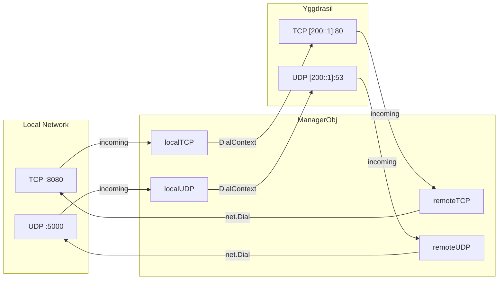
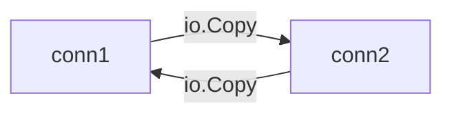
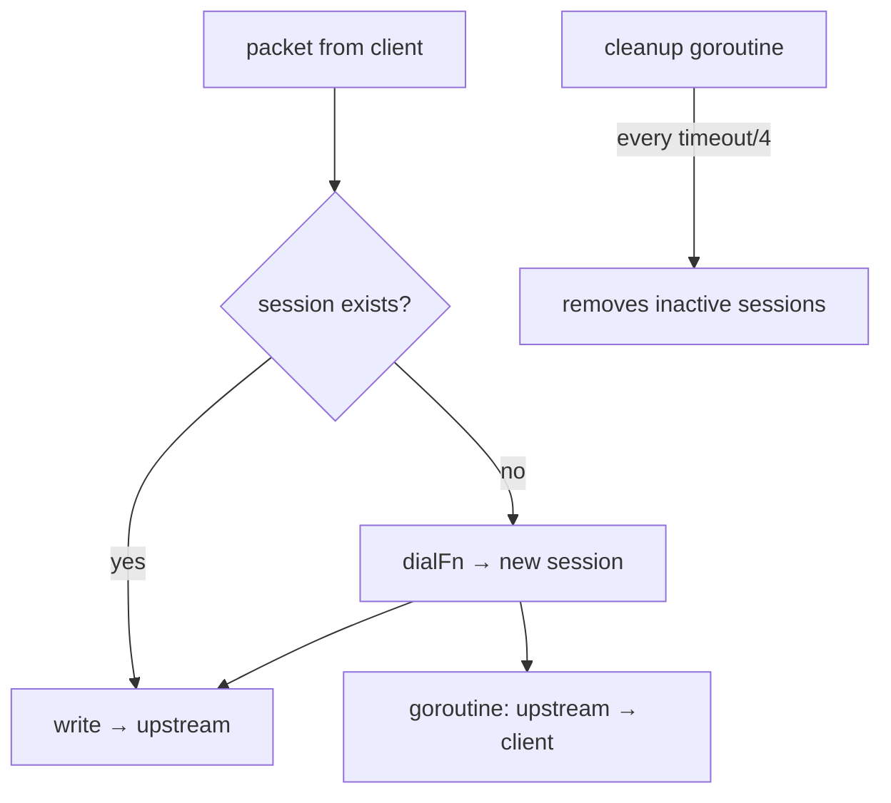

# mod/forward

TCP/UDP port forwarding between local network and Yggdrasil.

The module manages mappings in both directions: incoming traffic from local ports is forwarded to Yggdrasil, and vice
versa —
traffic from Yggdrasil is forwarded to local addresses.

## Table of Contents

- [Overview](#overview)
- [Initialization](#initialization)
- [Mappings](#mappings)
    - [TCP](#tcp)
    - [UDP](#udp)
- [Start and Stop](#start-and-stop)
- [TCP Proxying](#tcp-proxying)
- [UDP Sessions](#udp-sessions)
- [Settings](#settings)

---

## Overview



Four forwarding directions:

| Direction  | Listens on    | Connects to   |
|------------|---------------|---------------|
| Local TCP  | Local TCP     | Yggdrasil TCP |
| Remote TCP | Yggdrasil TCP | Local TCP     |
| Local UDP  | Local UDP     | Yggdrasil UDP |
| Remote UDP | Yggdrasil UDP | Local UDP     |

---

## Initialization

```go
mgr := forward.New(logger, 30*time.Second) // UDP session timeout
```

`New` creates a manager. `sessionTimeout` is the inactivity timeout for UDP sessions (required, > 0).

---

## Mappings

Mappings are configured before calling `Start()`.

### TCP

```go
mgr.AddLocalTCP(forward.TCPMappingObj{
Listen: &net.TCPAddr{IP: net.IPv4(127, 0, 0, 1), Port: 8080},
Mapped: &net.TCPAddr{IP: net.ParseIP("200::1"), Port: 80},
})

mgr.AddRemoteTCP(forward.TCPMappingObj{
Listen: &net.TCPAddr{Port: 80}, // listen on Yggdrasil
Mapped: &net.TCPAddr{IP: net.IPv4(127, 0, 0, 1), Port: 8080}, // forward locally
})
```

### UDP

```go
mgr.AddLocalUDP(forward.UDPMappingObj{
Listen: &net.UDPAddr{IP: net.IPv4(127, 0, 0, 1), Port: 5000},
Mapped: &net.UDPAddr{IP: net.ParseIP("200::1"), Port: 53},
})

mgr.AddRemoteUDP(forward.UDPMappingObj{
Listen: &net.UDPAddr{Port: 53},
Mapped: &net.UDPAddr{IP: net.IPv4(127, 0, 0, 1), Port: 5353},
})
```

---

## Start and Stop

```go
ctx, cancel := context.WithCancel(context.Background())

mgr.Start(ctx, node) // starts goroutines for all mappings
// ...
cancel() // stops all listeners
mgr.Wait() // waits for all goroutines to finish
```

`Start` launches one goroutine per mapping. Cancelling the context stops all listeners and terminates active
connections.

---

## TCP Proxying

```go
forward.ProxyTCP(c1, c2, 30*time.Second)
```

Bidirectional TCP proxy between two connections. Two goroutines copy data in both directions. If an error occurs in one
direction, both connections are closed. `closeTimeout` is the time to wait for the second goroutine after the first
error.



---

## UDP Sessions

UDP traffic is proxied through sessions. Each unique sender address gets a separate session with its own
connection to the target address.



`RunUDPLoop` is the main UDP proxying loop. `ReverseProxyUDP` is the reverse channel: reads responses from upstream and
sends them
to the client.

---

## Settings

All settings are called before `Start()`:

| Method                  | Description                                  | Default      |
|-------------------------|----------------------------------------------|--------------|
| `SetTimeout(d)`         | UDP session inactivity timeout               | from `New()` |
| `SetTCPCloseTimeout(d)` | Time to wait for TCP peer after disconnect   | 30 seconds   |
| `SetMaxUDPSessions(n)`  | Max UDP sessions per mapping (0 — unlimited) | 0            |
| `ClearLocal()`          | Clear all local mappings                     | —            |
| `ClearRemote()`         | Clear all remote mappings                    | —            |
