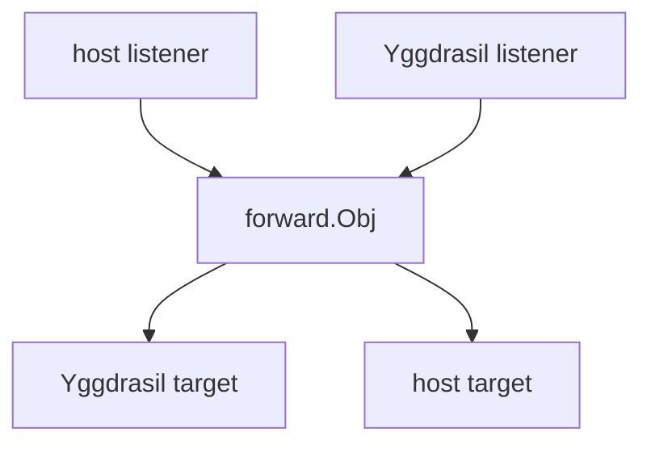

# Forward

Package `forward` proxies TCP and UDP between the host network and Yggdrasil.
Construction is transactional and starts the immutable rule set immediately.
TCP and UDP admission default to unlimited, so public listeners require explicit
positive limits.

## Contents

- [Overview](#overview)
- [Initialization](#initialization)
- [Lifecycle](#lifecycle)
- [Admission limits and security](#admission-limits-and-security)
- [TCP forwarding](#tcp-forwarding)
- [UDP forwarding](#udp-forwarding)
- [Configuration](#configuration)
- [Snapshot](#snapshot)
- [Errors](#errors)

## Overview

The package supports four directions:

| Configuration field | Listens on    | Connects to   |
|---------------------|---------------|---------------|
| `LocalTCP`          | Local TCP     | Yggdrasil TCP |
| `RemoteTCP`         | Yggdrasil TCP | Local TCP     |
| `LocalUDP`          | Local UDP     | Yggdrasil UDP |
| `RemoteUDP`         | Yggdrasil UDP | Local UDP     |

`ConfigObj.Node` implements the package-local `NetworkInterface`: `DialContext`, `Listen`, `ListenPacket`, `Address`,
and `MTU`. A `*core.Obj` satisfies this interface structurally; `mod/forward` does not import `mod/core`.



## Initialization

Mappings are immutable configuration. `New` deep-copies all mapping slices, addresses, and IP bytes, validates the
complete configuration, binds every listener, and starts forwarding.

```go
obj, err := forward.New(forward.ConfigObj{
Logger:            logger,
Node:              node,
UDPTimeout:        30 * time.Second,
MaxTCPConnections: 2048,
MaxUDPSessions:    2048,
LocalTCP: []forward.TCPMappingObj{{
Listen: &net.TCPAddr{IP: net.IPv4(127, 0, 0, 1), Port: 8080},
Mapped: &net.TCPAddr{IP: net.ParseIP("200::1"), Port: 80},
}},
RemoteUDP: []forward.UDPMappingObj{{
Listen: &net.UDPAddr{Port: 53},
Mapped: &net.UDPAddr{IP: net.IPv4(127, 0, 0, 1), Port: 5353},
}},
})
if err != nil {
return err
}
defer func () { _ = obj.Close() }()
```

Do not omit positive `MaxTCPConnections` and `MaxUDPSessions` on untrusted or publicly reachable listeners: zero means
unlimited and permits one traffic source to consume all available process and backend resources.

Construction is transactional. If any mapping is invalid or a listener cannot be bound, `New` closes every listener
opened earlier in the same call and returns an error. Retry by fixing the cause and calling `New` again with the desired
configuration; a failed constructor never returns a partial object.

`UDPTimeout` must be positive whenever `LocalUDP` or `RemoteUDP` is non-empty. TCP-only and empty configurations do not
require it.

## Lifecycle

`New` starts one listener loop per mapping. `Close` is terminal and idempotent: it cancels all forwarding work, closes
listeners and active sessions, and waits for every owned goroutine. To restart or change mappings, create a new object.
Custom `NetworkInterface` implementations must honor `DialContext` cancellation and return closable listeners and
packet connections; otherwise no wrapper can guarantee bounded shutdown of their code.

There is deliberately no separate builder or `Start` state. Callers assemble ordinary mapping slices before `New`, and
the returned object is either fully running or not returned at all.

## Admission limits and security

`MaxTCPConnections` and `MaxUDPSessions` are shared across every mapping in one object:

- `0` means unlimited;
- a positive value is the object-wide cap;
- a negative value makes `New` return `ErrInvalidLimit`.

> **Security warning:** both limits default to unlimited. On an untrusted or publicly reachable listener, an attacker
> can create many TCP connections or UDP sessions and exhaust file descriptors, memory, goroutines, or backend capacity.
> Set positive limits whenever the deployment does not provide a stricter trusted boundary. Because each limit is shared
> by all mappings in the object, traffic to one mapping can consume the full budget and temporarily starve the others.

The limits cover active connections and sessions, not packet queues. Each UDP session queue and each mapping's reverse
queue remains individually bounded even when admission is unlimited. Their aggregate memory is bounded only when
`MaxUDPSessions` is positive, because every admitted session owns a separate queue.

## TCP forwarding

`LocalTCP` listens with the host network and dials the mapped address through `Node.DialContext`. `RemoteTCP` listens
through `Node.Listen` and dials the mapped address through the host network. Backend dials occur outside the accept
loop,
so one slow dial does not stop later accepts.

The object-wide TCP admission counter is acquired before a backend dial. When the cap is exhausted, the accepted
connection is closed without starting another dial.

`ProxyTCP` and `ProxyTCPContext` are also available as standalone helpers. They copy in both directions and support TCP
half-close. After one clean half-close, the fixed 30-second close timeout applies only to idle time in the remaining
direction; an active response may continue longer.

## UDP forwarding

Each unique sender address gets a separate UDP session and upstream connection. New sessions reserve admission before
dialing. Packets that arrive while the dial is in progress enter a bounded per-session queue and are dropped when it is
full. Responses from all sessions in one mapping pass through one bounded reverse queue and writer.

The approximate per-session queue budget is 64 KiB and at most 64 packets. With a 65535-byte maximum packet size it
becomes one packet. UDP remains intentionally lossy under per-session overload. The queue bounds cap memory for a fixed
session count; total memory remains unbounded when `MaxUDPSessions` is unlimited. A packet refreshes session activity
only after its queue accepts it, so traffic dropped by a full queue cannot keep an otherwise idle session alive.

`RunUDPLoop` and `ReverseProxyUDP` remain available for standalone use. `UDPLoopConfigObj.MaxSessions` follows the same
limit contract: zero is unlimited and a negative value returns `ErrInvalidLimit`.

## Configuration

| `ConfigObj` field   | Description                                              | Default    |
|---------------------|----------------------------------------------------------|------------|
| `Node`              | Required forwarding network                              | required   |
| `LocalTCP`          | Local-to-Yggdrasil TCP mappings                          | none       |
| `RemoteTCP`         | Yggdrasil-to-local TCP mappings                          | none       |
| `LocalUDP`          | Local-to-Yggdrasil UDP mappings                          | none       |
| `RemoteUDP`         | Yggdrasil-to-local UDP mappings                          | none       |
| `UDPTimeout`        | UDP session inactivity timeout; `>0` with UDP mappings   | required   |
| `DialTimeout`       | Backend dial timeout; `0` default, `<0` disabled         | 10 seconds |
| `TCPIdleTimeout`    | Established TCP idle timeout; `0` default, `<0` disabled | 5 minutes  |
| `MaxTCPConnections` | Object-wide TCP session cap; `0` unlimited, `<0` invalid | unlimited  |
| `MaxUDPSessions`    | Object-wide UDP session cap; `0` unlimited, `<0` invalid | unlimited  |
| `UDPMaxPacketSize`  | Maximum UDP payload; `0` node MTU, `<0` max datagram     | node MTU   |
| `UDPWriteTimeout`   | Reverse UDP write timeout; `0` default, `<0` disabled    | 5 seconds  |

`UDPWriteTimeout < 0` disables the reverse write deadline. `UDPMaxPacketSize` is clamped to the maximum UDP datagram
size.

## Snapshot

`Snapshot` returns lock-free counters without resetting them. It remains useful after `Close` as the final snapshot.

| Field             | Description                                    |
|-------------------|------------------------------------------------|
| `ActiveTCP`       | Current object-owned TCP sessions              |
| `ActiveUDP`       | Current object-owned UDP sessions              |
| `SessionUDPDrops` | Packets rejected by a full or retiring session |
| `ReverseUDPDrops` | Responses lost to queue pressure or write I/O  |
| `TerminalErrors`  | Mapping loops stopped by a terminal I/O error  |

## Errors

| Variable                   | Description                                                  |
|----------------------------|--------------------------------------------------------------|
| `ErrInvalidLimit`          | `New`/`RunUDPLoop`: a TCP or UDP admission limit is negative |
| `ErrInvalidSessionTimeout` | `New`: UDP mappings require a positive session timeout       |
| `ErrNodeRequired`          | `New`: the forwarding network is nil                         |
| `ErrInvalidMapping`        | `New`: a mapping has a nil listen or destination address     |
