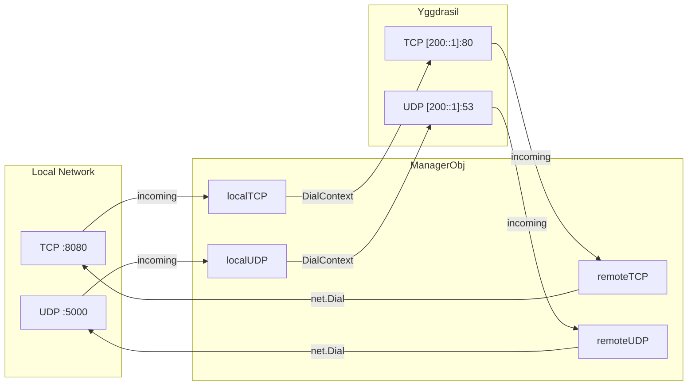
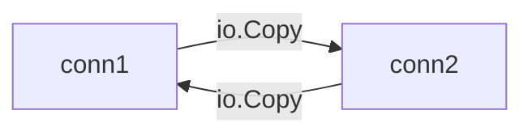
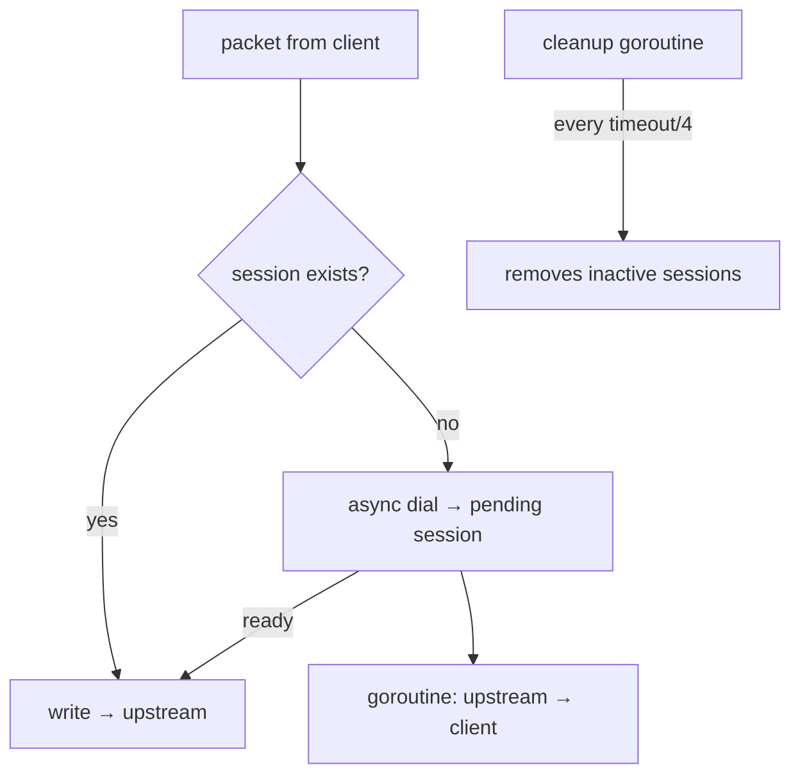

# mod/forward

TCP/UDP port forwarding between local network and Yggdrasil.

The module manages mappings in both directions: incoming traffic from local ports is forwarded to Yggdrasil, and vice
versa —
traffic from Yggdrasil is forwarded to local addresses.

## Table of Contents

- [Overview](#overview)
- [Initialization](#initialization)
- [Mappings](#mappings)
    - [TCP](#tcp)
    - [UDP](#udp)
- [Start and Stop](#start-and-stop)
- [TCP Proxying](#tcp-proxying)
- [UDP Sessions](#udp-sessions)
- [Settings](#settings)

---

## Overview



Four forwarding directions:

| Direction  | Listens on    | Connects to   |
|------------|---------------|---------------|
| Local TCP  | Local TCP     | Yggdrasil TCP |
| Remote TCP | Yggdrasil TCP | Local TCP     |
| Local UDP  | Local UDP     | Yggdrasil UDP |
| Remote UDP | Yggdrasil UDP | Local UDP     |

---

## Initialization

```go
mgr := forward.New(forward.ConfigObj{
Logger:     logger,
Node:       node,
UDPTimeout: 30 * time.Second,
})
```

`New` creates a manager. `UDPTimeout` is the inactivity timeout for UDP sessions (required, > 0;
a non-positive value is reported as an error by `Start()`).
Optional limits can be supplied in the same `ConfigObj`:

```go
mgr := forward.New(forward.ConfigObj{
Logger:            logger,
Node:              node,
UDPTimeout:        30 * time.Second,
DialTimeout:       10 * time.Second,
MaxTCPConnections: 2048,
MaxUDPSessions:    2048,
})
```

---

## Mappings

Mappings are configured before calling `Start()`.

### TCP

```go
mgr.AddLocalTCP(forward.TCPMappingObj{
Listen: &net.TCPAddr{IP: net.IPv4(127, 0, 0, 1), Port: 8080},
Mapped: &net.TCPAddr{IP: net.ParseIP("200::1"), Port: 80},
})

mgr.AddRemoteTCP(forward.TCPMappingObj{
Listen: &net.TCPAddr{Port: 80}, // listen on Yggdrasil
Mapped: &net.TCPAddr{IP: net.IPv4(127, 0, 0, 1), Port: 8080}, // forward locally
})
```

### UDP

```go
mgr.AddLocalUDP(forward.UDPMappingObj{
Listen: &net.UDPAddr{IP: net.IPv4(127, 0, 0, 1), Port: 5000},
Mapped: &net.UDPAddr{IP: net.ParseIP("200::1"), Port: 53},
})

mgr.AddRemoteUDP(forward.UDPMappingObj{
Listen: &net.UDPAddr{Port: 53},
Mapped: &net.UDPAddr{IP: net.IPv4(127, 0, 0, 1), Port: 5353},
})
```

---

## Start and Stop

```go
ctx, cancel := context.WithCancel(context.Background())

if err := mgr.Start(ctx); err != nil { // starts goroutines for all mappings
// invalid session timeout
}
// ...
cancel() // stops all listeners
mgr.Wait() // waits for all goroutines to finish
```

`Start` launches one goroutine per mapping. Cancelling the context stops all listeners and terminates active
connections. `Wait` also waits for active TCP proxy sessions started by the manager.

---

## TCP Proxying

```go
forward.ProxyTCP(c1, c2, 30*time.Second)
```

Bidirectional TCP proxy between two connections. Two goroutines copy data in both directions. If an error occurs in one
direction, both connections are closed. After a clean TCP half-close, `closeTimeout` is an idle timeout for the
remaining
direction: active response streams may run longer, but a silent peer is closed.

Manager-created TCP proxies use `ProxyTCPContext`, so context cancellation unblocks idle TCP tunnels. Backend dials are
performed outside the accept loop and are bounded by `DialTimeout`.



---

## UDP Sessions

UDP traffic is proxied through sessions. Each unique sender address gets a separate session with its own
connection to the target address.



`RunUDPLoop` is the main UDP proxying loop. `ReverseProxyUDP` is the reverse channel: reads responses from upstream and
sends them
to the client.

New sessions reserve a slot and dial asynchronously. Packets received before the upstream connection is ready are
queued in the session buffer and are dropped only if that buffer is full or the session is cancelled.
The buffer is sized by an approximate 64 KiB per-session byte budget, capped at 64 packets. Manager-created UDP
mappings use a safe default session cap.

---

## Settings

All tunables are immutable and set once through `ConfigObj` at `New()`. Except for the required `ConfigObj.UDPTimeout`,
optional fields use the same convention: `0` means default, and negative values mean disabled or unlimited where that
is meaningful.

| `ConfigObj` field         | Description                                                | Default    |
|---------------------------|------------------------------------------------------------|------------|
| `UDPTimeout`              | UDP session inactivity timeout; must be `> 0`              | required   |
| `DialTimeout`             | Backend dial timeout; `0` default, `<0` disabled           | 10 seconds |
| `TCPIdleTimeout`          | Established TCP idle timeout; `0` default, `<0` disabled   | 5 minutes  |
| `MaxTCPConnections`       | Max TCP sessions per mapping; `0` default, `<0` unlimited  | 1024       |
| `MaxUDPSessions`          | Max UDP sessions per mapping; `0` default, `<0` unlimited  | 1024       |
| `UDPMaxPacketSize`        | Max UDP payload bytes; `0` node MTU, `<0` max datagram     | node MTU   |

The TCP half-close idle timeout is fixed at 30 seconds. UDP writes go to the kernel send buffer and carry no
per-write deadline, so a single lock-free `net.PacketConn` is shared across all reverse sessions.

Mapping helpers remain available before `Start()`:

| Method          | Description               |
|-----------------|---------------------------|
| `ClearLocal()`  | Clear all local mappings  |
| `ClearRemote()` | Clear all remote mappings |
