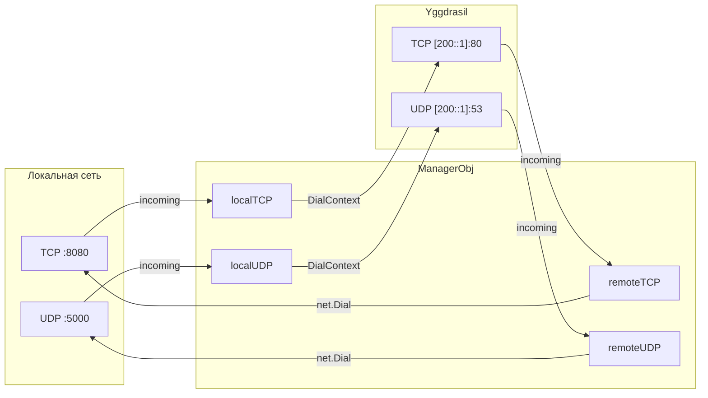
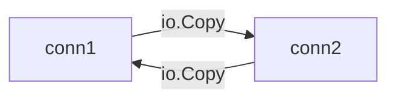
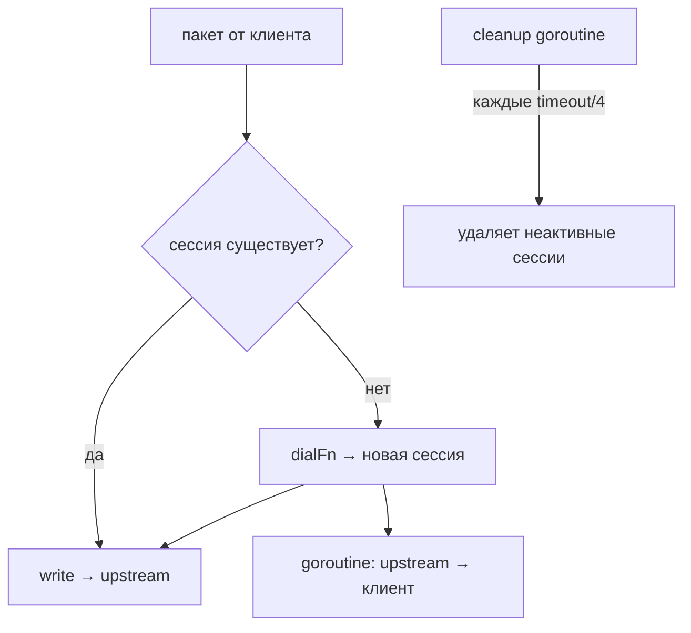

# mod/forward

Проброс TCP/UDP портов между локальной сетью и Yggdrasil.

Модуль управляет маппингами в обе стороны: входящий трафик с локальных портов перенаправляется в Yggdrasil, и наоборот —
трафик из Yggdrasil перенаправляется на локальные адреса.

## Содержание

- [Обзор](#обзор)
- [Инициализация](#инициализация)
- [Маппинги](#маппинги)
    - [TCP](#tcp)
    - [UDP](#udp)
- [Запуск и остановка](#запуск-и-остановка)
- [TCP-проксирование](#tcp-проксирование)
- [UDP-сессии](#udp-сессии)
- [Настройки](#настройки)

---

## Обзор



Четыре направления проброса:

| Направление | Слушает       | Подключается к |
|-------------|---------------|----------------|
| Local TCP   | Локальный TCP | Yggdrasil TCP  |
| Remote TCP  | Yggdrasil TCP | Локальный TCP  |
| Local UDP   | Локальный UDP | Yggdrasil UDP  |
| Remote UDP  | Yggdrasil UDP | Локальный UDP  |

---

## Инициализация

```go
mgr := forward.New(logger, 30*time.Second) // UDP session timeout
```

`New` создаёт менеджер. `sessionTimeout` — таймаут неактивности UDP-сессий (обязателен, > 0).

---

## Маппинги

Маппинги задаются до вызова `Start()`.

### TCP

```go
mgr.AddLocalTCP(forward.TCPMappingObj{
Listen: &net.TCPAddr{IP: net.IPv4(127, 0, 0, 1), Port: 8080},
Mapped: &net.TCPAddr{IP: net.ParseIP("200::1"), Port: 80},
})

mgr.AddRemoteTCP(forward.TCPMappingObj{
Listen: &net.TCPAddr{Port: 80}, // слушать в Yggdrasil
Mapped: &net.TCPAddr{IP: net.IPv4(127, 0, 0, 1), Port: 8080}, // пробросить локально
})
```

### UDP

```go
mgr.AddLocalUDP(forward.UDPMappingObj{
Listen: &net.UDPAddr{IP: net.IPv4(127, 0, 0, 1), Port: 5000},
Mapped: &net.UDPAddr{IP: net.ParseIP("200::1"), Port: 53},
})

mgr.AddRemoteUDP(forward.UDPMappingObj{
Listen: &net.UDPAddr{Port: 53},
Mapped: &net.UDPAddr{IP: net.IPv4(127, 0, 0, 1), Port: 5353},
})
```

---

## Запуск и остановка

```go
ctx, cancel := context.WithCancel(context.Background())

mgr.Start(ctx, node) // запускает горутины для всех маппингов
// ...
cancel() // останавливает все листенеры
mgr.Wait() // ждёт завершения всех горутин
```

`Start` запускает по одной горутине на каждый маппинг. Отмена контекста останавливает все листенеры и завершает активные
соединения.

---

## TCP-проксирование

```go
forward.ProxyTCP(c1, c2, 30*time.Second)
```

Двунаправленный TCP-прокси между двумя соединениями. Две горутины копируют данные в обе стороны. При ошибке в одном
направлении — оба соединения закрываются. `closeTimeout` — время ожидания второй горутины после первой ошибки.



---

## UDP-сессии

UDP-трафик проксируется через сессии. Каждый уникальный адрес отправителя получает отдельную сессию с собственным
соединением к целевому адресу.



`RunUDPLoop` — основной цикл UDP-проксирования. `ReverseProxyUDP` — обратный канал: читает ответы от upstream и
отправляет
клиенту.

---

## Настройки

Все настройки вызываются до `Start()`:

| Метод                   | Описание                                             | По умолчанию |
|-------------------------|------------------------------------------------------|--------------|
| `SetTimeout(d)`         | Таймаут неактивности UDP-сессии                      | из `New()`   |
| `SetTCPCloseTimeout(d)` | Время ожидания TCP-пира после отключения             | 30 секунд    |
| `SetMaxUDPSessions(n)`  | Максимум UDP-сессий на маппинг (0 — без ограничений) | 0            |
| `ClearLocal()`          | Очистить все локальные маппинги                      | —            |
| `ClearRemote()`         | Очистить все удалённые маппинги                      | —            |
