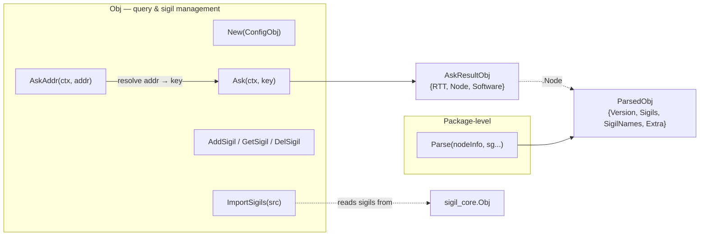
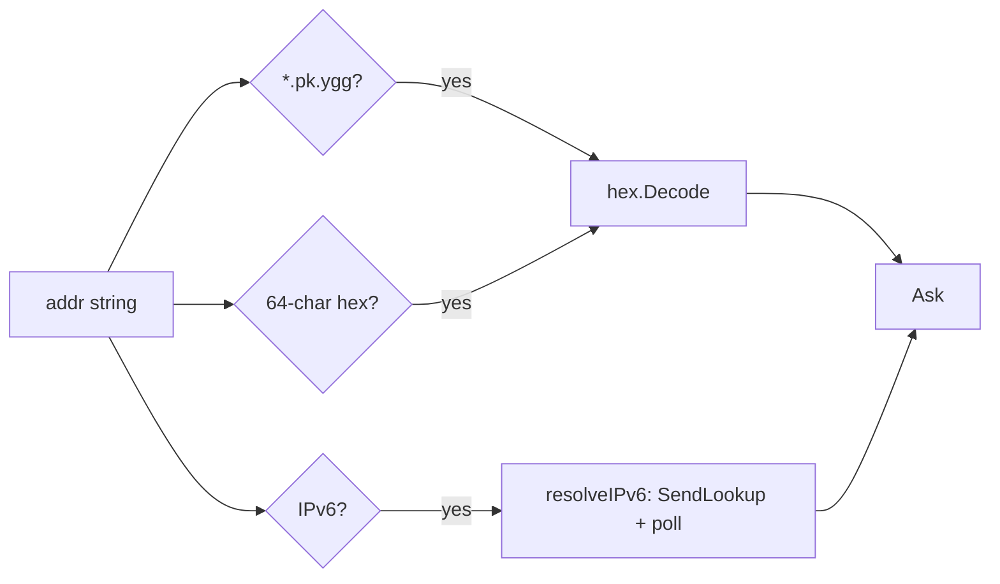

# mod/ninfo

NodeInfo operations for Yggdrasil nodes: querying remote nodes, parsing responses, and managing parse sigils.

The module captures the `getNodeInfo` handler from `yggcore.Core`, wraps it with address resolution, sigil extraction,
and ratatoskr metadata parsing. Publishing (assembling local NodeInfo) is handled by `sigil_core`.

## Table of contents

- [Overview](#overview)
- [Initialization](#initialization)
- [Querying remote nodes](#querying-remote-nodes)
    - [Ask](#ask)
    - [AskAddr](#askaddr)
    - [Address formats](#address-formats)
    - [Result structure](#result-structure)
- [Parsing](#parsing)
    - [Parse](#parse)
    - [ParsedObj](#parsedobj)
- [Sigil management](#sigil-management)
    - [AddSigil / GetSigil / DelSigil](#addsigil--getsigil--delsigil)
    - [ImportSigils](#importsigils)
- [Errors](#errors)

---

## Overview



---

## Initialization

```go
obj, err := ninfo.New(ninfo.ConfigObj{
    Source: coreNode,
})
```

`New` captures the `getNodeInfo` handler from the configured `Source` via `SetAdmin`. Returns `ErrCoreRequired` when
`Source` is nil, or `ErrNodeInfoNotCaptured` when the handler is absent. Query timing is tunable through `ConfigObj`
(`MaxAskTime`, `AskRetryPause`, `LookupInterval`, `MaxLookupTime`); a zero field falls back to its internal default.

`Close()` cancels the shared module context. `Ask` runs in the caller's goroutine, so there is nothing to join: any
in-flight or later `Ask` observes the cancellation and returns `ErrClosed`.

---

## Querying remote nodes

### Ask

```go
Ask(ctx context.Context, key ed25519.PublicKey) (*AskResultObj, error)
```

Sends a `getNodeInfo` request to the node identified by `key`. Returns parsed metadata with measured RTT. Uses sigils
registered via `AddSigil`/`ImportSigils` for response parsing.

The captured `getNodeInfo` handler is called synchronously in the caller's goroutine and retried after `AskRetryPause`
until a response arrives, `ctx` expires, or the module closes. Each attempt is also bounded by Yggdrasil's own internal
handler timeout, which often fires before routing converges on a freshly started node, so retrying is what lets the
address eventually resolve. On `ctx` expiry `Ask` returns the last attempt's error; on `Close` it returns `ErrClosed`.

### AskAddr

```go
AskAddr(ctx context.Context, addr string) (*AskResultObj, error)
```

Resolves `addr` to a public key, then calls `Ask`.

### Address formats

| Format           | Example              | Resolution                        |
|------------------|----------------------|-----------------------------------|
| `<64hex>.pk.ygg` | `abcd...1234.pk.ygg` | Hex-decode the key directly       |
| Raw 64-char hex  | `abcd...1234`        | Hex-decode the key directly       |
| `[ipv6]:port`    | `[200:abcd::1]:8080` | Network lookup via yggdrasil core |
| Bare IPv6        | `200:abcd::1`        | Network lookup via yggdrasil core |

IPv6 resolution works by deriving a partial key from the address and calling `SendLookup`, then polling peers, sessions,
and paths until a match is found or the context expires. The poll starts at `LookupInterval` (default 100ms) and backs
off exponentially up to 1s between lookups; when the caller sets no deadline the total wait is bounded by
`MaxLookupTime`
(default 30s) so a lookup for an offline node cannot run forever.



### Result structure

```go
type AskResultObj struct {
RTT      time.Duration
Node     *ParsedObj
Software *SoftwareObj // nil when NodeInfoPrivacy is on
}
```

`Software` is extracted from build keys (`buildname`, `buildversion`, `buildplatform`, `buildarch`) and removed from
`Node.Extra`. When all four are empty (privacy enabled), `Software` is `nil`.

```go
type SoftwareObj struct {
Name     string
Version  string
Platform string
Arch     string
}
```

---

## Parsing

### Parse

```go
Parse(nodeInfo map[string]any, sg ...sigils.Interface) *ParsedObj
```

Inspects arbitrary NodeInfo received from a remote node. Always returns a non-nil `*ParsedObj`.

1. Copies all keys from `nodeInfo` into `Extra`.
2. Looks for the `ratatoskr` metadata key. If missing or malformed — returns early with everything in `Extra`.
3. Parses the metadata string via `sigil_core.ParseInfo` to get the version and sigil list.
4. For each declared sigil, looks up a parser: built-in parsers via `target.Parse` first, falling back to
   user-provided `sg` (built-in names are reserved, so user sigils cannot override them).
5. Matched sigils are stored in `Sigils`; their keys are removed from `Extra`.

User-provided sigils are cloned via `Clone()` before parsing, so the caller's template objects remain untouched.

### ParsedObj

```go
type ParsedObj struct {
Version string
Sigils  map[string]sigils.Interface
// SigilNames preserves valid metadata names this build cannot parse.
SigilNames []string
Extra      map[string]any
}
```

| Method     | Signature           | Description                                                          |
|------------|---------------------|----------------------------------------------------------------------|
| `NodeInfo` | `() map[string]any` | Reassembles `Extra` + sigil params + ratatoskr key into a single map |
| `String`   | `() string`         | JSON representation of `NodeInfo()`                                  |

---

## Sigil management

`Obj` maintains a separate set of **parse sigils** used by `Ask`/`AskAddr` when parsing remote responses.

### AddSigil / GetSigil / DelSigil

```go
AddSigil(seq iter.Seq[sigils.Interface]) []error
GetSigil(name string) sigils.Interface
DelSigil(name string) error
```

`AddSigil` consumes a sequence of sigils, each self-naming via `GetName()`. It validates names via `sigils.ValidateName`
and rejects nil, invalid, reserved (built-in), duplicate, and non-cloneable sigils; each rejection is skipped and
reported as a per-sigil error. Accepted sigils are stored as clones. `GetSigil` returns a clone of the named sigil, or
nil.

### ImportSigils

```go
ImportSigils(src *sigil_core.Obj) []error
```

Appends the non-reserved sigils from a `sigil_core.Obj` into the parse set. Reserved built-in names are skipped
silently; names already present are kept and reported as conflict errors, as are a nil source or a nil sigil.

---

## Errors

| Variable                 | Description                                                |
|--------------------------|------------------------------------------------------------|
| `ErrCoreRequired`        | `New`: core argument is nil                                |
| `ErrNodeInfoNotCaptured` | `New`: getNodeInfo handler not found in core               |
| `ErrInvalidKeyLength`    | `Ask`: public key has wrong length                         |
| `ErrUnexpectedResponse`  | `callNodeInfo`: response is not `GetNodeInfoResponse`      |
| `ErrEmptyResponse`       | `callNodeInfo`: response map is empty                      |
| `ErrNodeInfoTooLarge`    | `parseAskResponse`: response exceeds the 16 KB cap         |
| `ErrUnresolvableAddr`    | `resolveIPv6`: lookup timed out                            |
| `ErrInvalidAddr`         | `resolveAddr`: address does not match any supported format |
| `ErrClosed`              | `Ask` / `AskAddr`: the module has been closed              |
