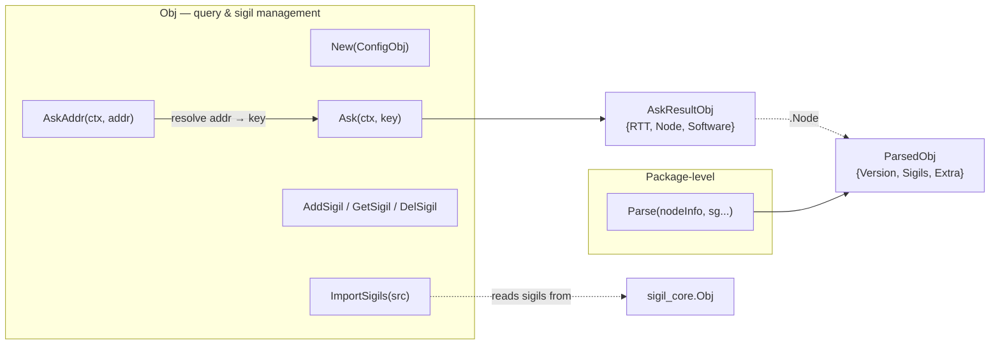
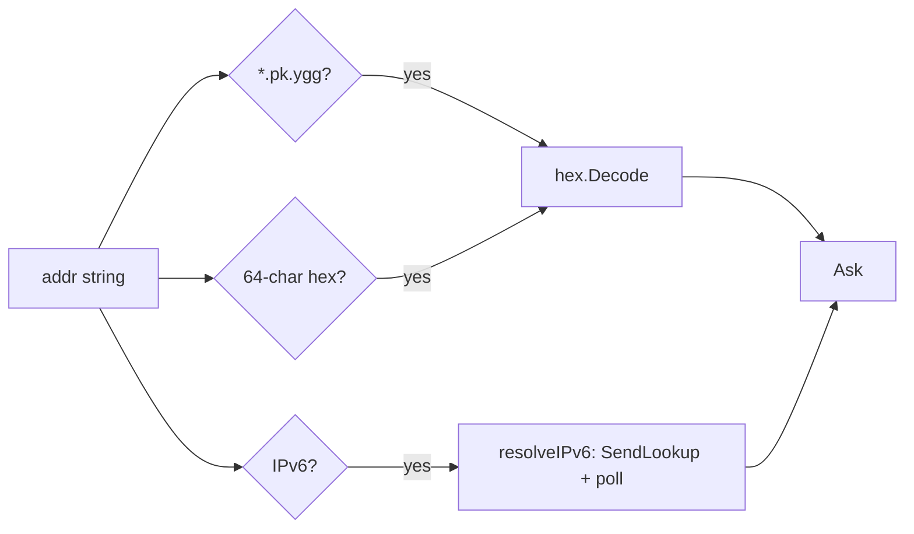

# mod/ninfo

NodeInfo operations for Yggdrasil nodes: querying remote nodes, parsing responses, and managing parse sigils.

The module captures the `getNodeInfo` handler from `yggcore.Core`, wraps it with address resolution, sigil extraction,
and ratatoskr metadata parsing. Publishing (assembling local NodeInfo) is handled by `sigil_core`.

## Table of contents

- [Overview](#overview)
- [Initialization](#initialization)
- [Querying remote nodes](#querying-remote-nodes)
    - [Ask](#ask)
    - [AskAddr](#askaddr)
    - [Address formats](#address-formats)
    - [Result structure](#result-structure)
- [Parsing](#parsing)
    - [Parse](#parse)
    - [ParsedObj](#parsedobj)
- [Sigil management](#sigil-management)
    - [AddSigil / GetSigil / DelSigil](#addsigil--getsigil--delsigil)
    - [ImportSigils](#importsigils)
- [Errors](#errors)

---

## Overview



---

## Initialization

```go
obj, err := ninfo.New(ninfo.ConfigObj{
    Source: coreNode,
})
```

`New` captures the `getNodeInfo` handler from `core.NodeInfoSourceInterface` via `SetAdmin`. Returns `ErrCoreRequired`
or `ErrNodeInfoNotCaptured` on failure. NodeInfo timing and limits are fixed internal defaults; there are no tuning
knobs.

`Close()` cancels the module context, waits for in-flight `Ask` handlers to finish, and makes future `Ask` calls return
`ErrClosed`.

---

## Querying remote nodes

### Ask

```go
Ask(ctx context.Context, key ed25519.PublicKey) (*AskResultObj, error)
```

Sends a `getNodeInfo` request to the node identified by `key`. Returns parsed metadata with measured RTT. Uses sigils
registered via `AddSigil`/`ImportSigils` for response parsing.

The underlying network call runs in a goroutine. Cancelling `ctx` returns immediately with `ctx.Err()`, while the
handler itself remains bounded by the module concurrency limit and is joined by `Close`.

### AskAddr

```go
AskAddr(ctx context.Context, addr string) (*AskResultObj, error)
```

Resolves `addr` to a public key, then calls `Ask`.

### Address formats

| Format           | Example              | Resolution                        |
|------------------|----------------------|-----------------------------------|
| `<64hex>.pk.ygg` | `abcd...1234.pk.ygg` | Hex-decode the key directly       |
| Raw 64-char hex  | `abcd...1234`        | Hex-decode the key directly       |
| `[ipv6]:port`    | `[200:abcd::1]:8080` | Network lookup via yggdrasil core |
| Bare IPv6        | `200:abcd::1`        | Network lookup via yggdrasil core |

IPv6 resolution works by deriving a partial key from the address and calling `SendLookup`, then polling peers, sessions,
and paths until a match is found or the context expires. The poll interval is a fixed 100ms, and a fixed 30s cap
bounds the total wait even when the caller's context has no deadline.



### Result structure

```go
type AskResultObj struct {
RTT      time.Duration
Node     *ParsedObj
Software *SoftwareObj // nil when NodeInfoPrivacy is on
}
```

`Software` is extracted from build keys (`buildname`, `buildversion`, `buildplatform`, `buildarch`) and removed from
`Node.Extra`. When all four are empty (privacy enabled), `Software` is `nil`.

```go
type SoftwareObj struct {
Name     string
Version  string
Platform string
Arch     string
}
```

---

## Parsing

### Parse

```go
Parse(nodeInfo map[string]any, sg ...sigils.Interface) *ParsedObj
```

Inspects arbitrary NodeInfo received from a remote node. Always returns a non-nil `*ParsedObj`.

1. Copies all keys from `nodeInfo` into `Extra`.
2. Looks for the `ratatoskr` metadata key. If missing or malformed — returns early with everything in `Extra`.
3. Parses the metadata string via `sigil_core.ParseInfo` to get the version and sigil list.
4. For each declared sigil, looks up a parser: built-in parsers via `target.Parse` first, falling back to
   user-provided `sg` (built-in names are reserved, so user sigils cannot override them).
5. Matched sigils are stored in `Sigils`; their keys are removed from `Extra`.

User-provided sigils are cloned via `Clone()` before parsing, so the caller's template objects remain untouched.

### ParsedObj

```go
type ParsedObj struct {
Version string
Sigils  map[string]sigils.Interface
Extra   map[string]any
}
```

| Method     | Signature           | Description                                                          |
|------------|---------------------|----------------------------------------------------------------------|
| `NodeInfo` | `() map[string]any` | Reassembles `Extra` + sigil params + ratatoskr key into a single map |
| `String`   | `() string`         | JSON representation of `NodeInfo()`                                  |

---

## Sigil management

`Obj` maintains a separate set of **parse sigils** used by `Ask`/`AskAddr` when parsing remote responses.

### AddSigil / GetSigil / DelSigil

```go
AddSigil(sg ...sigils.Interface) []error
GetSigil(name string) sigils.Interface
DelSigil(name string) error
```

`AddSigil` validates names via `sigils.ValidateName` and rejects duplicates. Invalid or duplicate sigils are skipped and
collected as errors.

### ImportSigils

```go
ImportSigils(src *sigil_core.Obj) []error
```

Appends sigils from a `sigil_core.Obj` into parse sigils. Existing names are preserved and returned as conflict errors.

---

## Errors

| Variable                 | Description                                                |
|--------------------------|------------------------------------------------------------|
| `ErrCoreRequired`        | `New`: core argument is nil                                |
| `ErrNodeInfoNotCaptured` | `New`: getNodeInfo handler not found in core               |
| `ErrInvalidKeyLength`    | `Ask`: public key has wrong length                         |
| `ErrUnexpectedResponse`  | `callNodeInfo`: response is not `GetNodeInfoResponse`      |
| `ErrEmptyResponse`       | `callNodeInfo`: response map is empty                      |
| `ErrUnresolvableAddr`    | `resolveIPv6`: lookup timed out                            |
| `ErrInvalidAddr`         | `resolveAddr`: address does not match any supported format |
