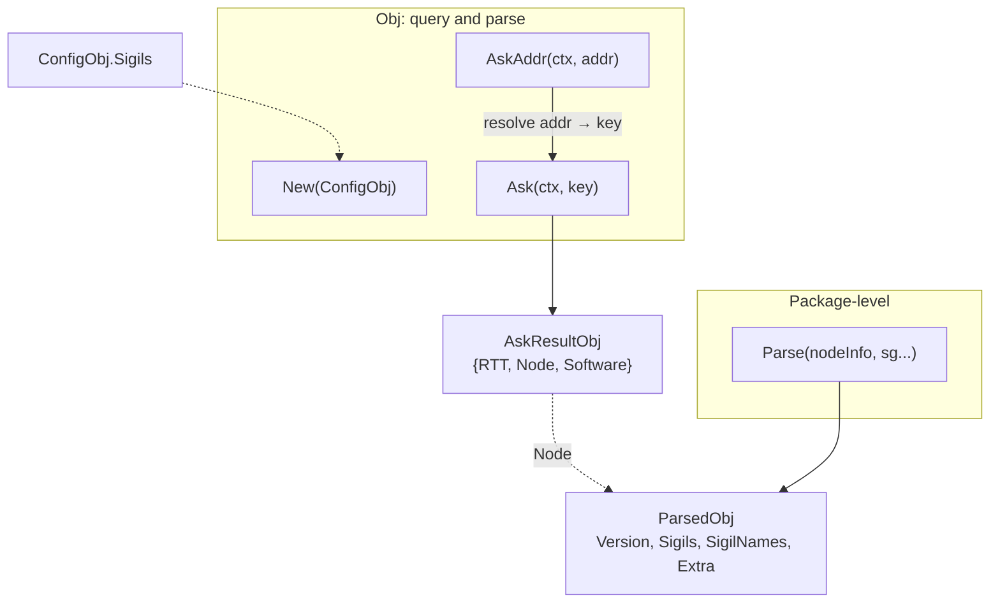
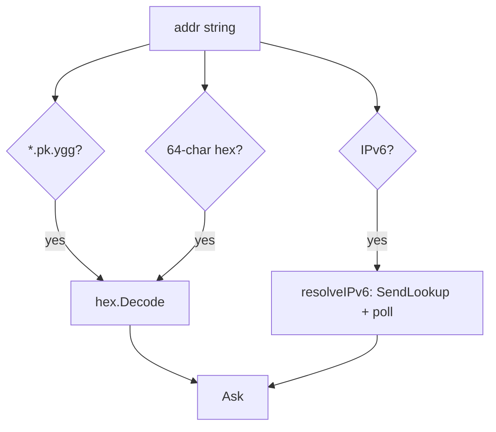

# NodeInfo

NodeInfo operations for Yggdrasil nodes: querying remote nodes and parsing responses with built-in or custom sigils.

The module captures the `getNodeInfo` handler from `yggcore.Core`, then adds
address resolution, bounded shared queries, and sigil parsing. Publishing local
NodeInfo is handled by [`sigil_core`](../sigils/sigil_core/README.md).

Key limits are 64 distinct NodeInfo queries, 64 distinct address lookups, and
16 KiB per NodeInfo response. Same-key callers share work while at least one
caller is waiting.

## Table of contents

- [Overview](#overview)
- [Initialization](#initialization)
- [Shutdown](#shutdown)
- [Querying remote nodes](#querying-remote-nodes)
    - [Ask](#ask)
    - [AskAddr](#askaddr)
    - [Address formats](#address-formats)
    - [Result structure](#result-structure)
- [Parsing](#parsing)
    - [Parse](#parse)
    - [ParsedObj](#parsedobj)
- [Custom sigil parsers](#custom-sigil-parsers)
- [Errors](#errors)

---

## Overview



---

## Initialization

```go
obj, err := ninfo.New(ninfo.ConfigObj{
    Source: coreNode,
    Sigils: []sigils.Interface{customParser},
})
```

`New` captures the `getNodeInfo` handler from the configured `Source` via `SetAdmin`. Returns `ErrSourceRequired` when
`Source` is nil, or `ErrNodeInfoNotCaptured` when the handler is absent. Query timing is tunable through `ConfigObj`
(`MaxAskTime`, `AskRetryPause`, `LookupInterval`, `MaxLookupTime`); a zero field falls back to its internal default.
`LookupInterval` must not be negative.
Negative `MaxAskTime` or `MaxLookupTime` disables that flight deadline, and negative `AskRetryPause` disables retries.
These limits belong to shared flights, not to an individual caller's context. `MaxAskTime` prevents further retries
after its deadline, but the synchronous upstream `getNodeInfo` handler cannot be interrupted and may delay flight
completion by one in-progress upstream call (currently about six seconds). `Sigils` contains immutable parser prototypes
for custom remote metadata; `New` validates and clones them before accepting work.

## Shutdown

`Close()` rejects new work, cancels the shared module context, and waits for
accepted `Ask` and IPv6-resolution flights. The root `ratatoskr.Obj` applies its
aggregate close timeout; standalone `ninfo.Close` deliberately waits.

---

## Querying remote nodes

### Ask

```go
Ask(ctx context.Context, key ed25519.PublicKey) (*AskResultObj, error)
```

Sends a `getNodeInfo` request to the node identified by `key`. Returns parsed metadata with measured RTT. Custom
metadata is parsed with the prototypes supplied through `ConfigObj.Sigils`.

Concurrent calls for the same public key share one flight. Canceling one caller detaches only that waiter while others
remain. When the last waiter leaves, the flight is canceled and does not retry. An upstream handler call already in
progress is allowed to finish because upstream exposes no cancellation hook; until it returns, the abandoned flight
continues to count toward the 64-flight limit. A new caller for the same key waits for that flight to retire, then
starts
fresh work instead of joining canceled work. Otherwise the handler retries after `AskRetryPause` until it succeeds,
reaches `MaxAskTime`, or the module closes. Another distinct key beyond the limit returns `ErrAskBusy`.

### AskAddr

```go
AskAddr(ctx context.Context, addr string) (*AskResultObj, error)
```

Resolves `addr` to a public key, then calls `Ask`.

### Address formats

| Format           | Example              | Resolution                        |
|------------------|----------------------|-----------------------------------|
| `<64hex>.pk.ygg` | `abcd...1234.pk.ygg` | Hex-decode the key directly       |
| Raw 64-char hex  | `abcd...1234`        | Hex-decode the key directly       |
| `[ipv6]:port`    | `[200:abcd::1]:8080` | Network lookup via yggdrasil core |
| Bare IPv6        | `200:abcd::1`        | Network lookup via yggdrasil core |

IPv6 may be a node address or any host inside a routable Yggdrasil `/64`. Subnet hosts are canonicalized to their
`/64`, so different host literals in the same subnet share one lookup flight. Resolution derives a partial key and
calls `SendLookup`. Peers and sessions are scanned once; subsequent polls scan only paths, where lookup results arrive.
There is no result cache.
At most 64 distinct address flights run at once, and excess distinct addresses return `ErrResolveBusy`. Caller
cancellation detaches only that waiter while others remain. The last departing waiter cancels polling immediately; a
new caller for the same address waits for that flight to retire before starting a replacement. Active flights are also
bounded by `MaxLookupTime` (default 30s) or `Close`.



### Result structure

```go
type AskResultObj struct {
    RTT      time.Duration
    Node     *ParsedObj
    Software *SoftwareObj
}
```

`Software` is extracted from build keys (`buildname`, `buildversion`, `buildplatform`, `buildarch`) and removed from
`Node.Extra`. When all four are empty (privacy enabled), `Software` is `nil`.

```go
type SoftwareObj struct {
    Name     string
    Version  string
    Platform string
    Arch     string
}
```

---

## Parsing

### Parse

```go
Parse(nodeInfo map[string]any, sg ...sigils.Interface) *ParsedObj
```

Inspects arbitrary NodeInfo received from a remote node. Always returns a non-nil `*ParsedObj`.

1. Copies all keys from `nodeInfo` into `Extra`.
2. Looks for the `ratatoskr` metadata key. If it is missing or malformed, parsing returns early with everything in
   `Extra`.
3. Parses the metadata string via `sigil_core.ParseInfo` to get the version and sigil list.
4. For each declared sigil, looks up a parser: built-in parsers via `target.Parse` first, falling back to
   user-provided `sg` (built-in names are reserved, so user sigils cannot override them).
5. Matched sigils are stored in `Sigils`; their keys are removed from `Extra`.

User-provided sigils are cloned via `Clone()` before parsing, so the caller's template objects remain untouched.

### ParsedObj

```go
type ParsedObj struct {
    Version    string
    Sigils     map[string]sigils.Interface
    SigilNames []string
    Extra      map[string]any
}
```

| Method     | Signature           | Description                                                          |
|------------|---------------------|----------------------------------------------------------------------|
| `NodeInfo` | `() map[string]any` | Reassembles `Extra` + sigil params + ratatoskr key into a single map |
| `String`   | `() string`         | JSON representation of `NodeInfo()`                                  |

---

## Custom sigil parsers

`ConfigObj.Sigils` is the complete set of custom parser prototypes used by `Ask` and `AskAddr`. The set is immutable
after `New`, so parsing does not need a registry lock and cannot race with runtime mutation.

`New` rejects nil parsers, invalid or reserved names, duplicates, and parsers whose `Clone` method returns nil. It
returns `ErrInvalidSigil` joined with the details and does not construct a partially configured object. Every accepted
prototype is cloned once for ownership. `Parse` clones that stored prototype again before calling `Match`, so one
response cannot mutate the parser used by another response.

Built-in names are always handled by `target.Parse` and cannot be overridden. Valid metadata names without a known
parser remain in `ParsedObj.SigilNames`, while their raw values remain in `Extra`. Custom implementations are trusted
application code: their parsing semantics and internal safety are the responsibility of their author.

---

## Errors

| Variable                   | Description                                                |
|----------------------------|------------------------------------------------------------|
| `ErrSourceRequired`        | `New`: `ConfigObj.Source` is nil                           |
| `ErrNodeInfoNotCaptured`   | `New`: getNodeInfo handler not found in core               |
| `ErrInvalidKeyLength`      | `Ask`: public key has wrong length                         |
| `ErrUnexpectedResponse`    | `callNodeInfo`: response is not `GetNodeInfoResponse`      |
| `ErrEmptyResponse`         | `callNodeInfo`: response map is empty                      |
| `ErrNodeInfoTooLarge`      | `parseAskResponse`: response exceeds the 16 KB cap         |
| `ErrUnresolvableAddr`      | `resolveIPv6`: lookup timed out                            |
| `ErrInvalidAddr`           | `resolveAddr`: address does not match any supported format |
| `ErrClosed`                | `Ask` / `AskAddr`: the module has been closed              |
| `ErrAskBusy`               | 64 distinct NodeInfo key flights are already active        |
| `ErrResolveBusy`           | 64 distinct IPv6 resolution flights are already active     |
| `ErrInvalidLookupInterval` | `New`: `LookupInterval` is negative                        |
| `ErrInvalidSigil`          | `New`: a custom parser prototype is invalid                |
