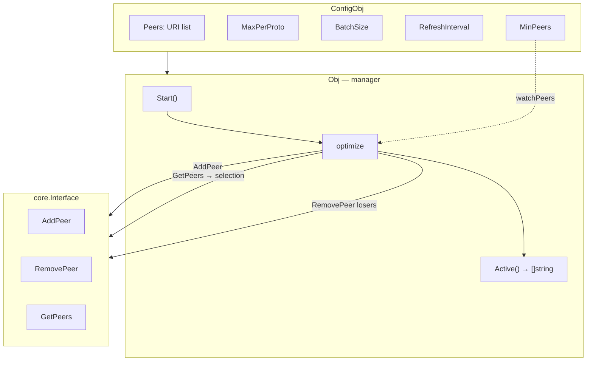
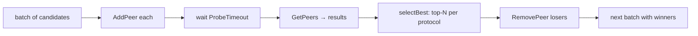
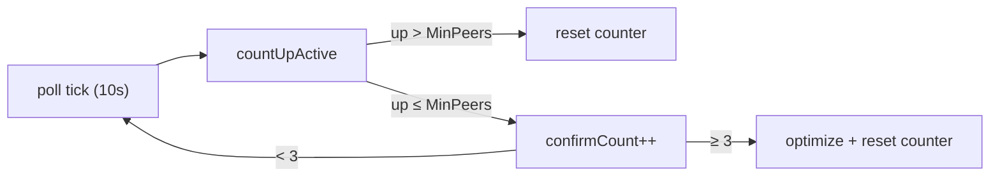

# mod/peermgr

Peer manager for Yggdrasil. Automatically selects the strongest responsive peers by protocol and observed latency,
supports active (with selection) and passive (all peers) modes.

## Table of Contents

- [Overview](#overview)
- [Initialization](#initialization)
- [Operating Modes](#operating-modes)
  - [Active Mode](#active-mode)
  - [Passive Mode](#passive-mode)
- [Batching](#batching)
- [Control](#control)
- [Peer Validation](#peer-validation)
- [Errors](#errors)

---

## Overview



---

## Initialization

```go
mgr, err := peermgr.New(node, peermgr.ConfigObj{
Peers:           []string{"tls://peer1:443", "tcp://peer2:8443"},
Logger:          logger,
MaxPerProto:     1, // best peer per protocol
ProbeTimeout:    10 * time.Second,
RefreshInterval: 5 * time.Minute,
BatchSize:       0, // bounded default batch size
OnNoReachablePeers: func () {
log.Warn("no reachable peers")
},
})
```

`New` validates peers and configuration. Invalid URIs are skipped with a warning; an error is returned only if there are
no valid peers at all.

| Field                 | Description                                                             | Default  |
|-----------------------|-------------------------------------------------------------------------|----------|
| `Peers`               | List of candidate URIs                                                  | required |
| `Logger`              | Logger                                                                  | required |
| `MaxPerProto`         | Best peers per protocol; `-1` — passive mode                            | `1`      |
| `ProbeTimeout`        | Connection timeout per batch                                            | `10s`    |
| `RefreshInterval`     | Re-evaluation interval; `0` — only at start; tiny positives are clamped | `0`      |
| `BatchSize`           | Batch size; `0`/`1` — bounded default, large values are capped          | `32`     |
| `MinPeers`            | Active peer threshold for watch (active mode only)                      | `0`      |
| `OnNoReachablePeers`  | Fire-and-forget callback if no peers responded after probing            | `nil`    |
| `OnActiveChange`      | Fire-and-forget callback when the active peer set changes               | `nil`    |

---

## Operating Modes

### Active Mode

`MaxPerProto >= 0`. The manager gives each batch a full `ProbeTimeout` window, measures latency among peers that are
up at the end of that window, and keeps the selected peers per protocol.



Selection algorithm:

1. Candidates are split into batches
2. Each batch is added via `AddPeer`
3. Wait the full `ProbeTimeout` window for that batch
4. `selectBest` groups by protocol, sorts by latency, picks top-N
5. Losers are removed via `RemovePeer`
6. The next batch operates only with previous winners

### Passive Mode

`MaxPerProto == -1`. The manager adds all candidates without selection.

On each `RefreshInterval` — a full cycle: remove all, then re-add all. `ProbeTimeout` and `BatchSize`
are ignored.

---

## Batching

`BatchSize` controls probing concurrency:

| Value    | Behavior                                                                      |
|----------|-------------------------------------------------------------------------------|
| `0`/`1`  | Safe default batch size                                                       |
| `N >= 2` | Sliding tournament: N new candidates per full probe window, capped internally |

When `BatchSize >= 2`, each subsequent batch includes winners from previous batches plus N new candidates. This keeps
large candidate lists bounded while still comparing new candidates against already selected ones. Very large values are
clamped to avoid dial floods.

---

## Control

```go
mgr.Start() // start the background goroutine
mgr.Active()         // current active peers (copy)
mgr.Optimize()       // force re-evaluation (blocking call)
mgr.Stop() // stop and remove all peers
```

`Start` launches a goroutine that immediately performs optimization and then schedules repeats via `RefreshInterval`.
`ProbeTimeout` and `RefreshInterval` are immutable: set them once through `ConfigObj` at `New`. To change them, create a
new manager. `Optimize()` remains available at runtime to force an immediate re-evaluation. Positive `RefreshInterval`
values below the safety floor are clamped.

`Optimize` can be called manually — it blocks until completion. It is serialized: no more than one optimization runs at
a time. A cycle is bounded only by `Stop` (which cancels the context) — a cycle interrupted mid-tournament rolls its
partial state back into the active set so `Stop` tears every managed peer down cleanly.

`Stop` cancels the context, waits for the manager goroutine, then removes all managed peers via `RemovePeer`. User
feedback callbacks (`OnNoReachablePeers`, `OnActiveChange`) are fire-and-forget: `Stop` never waits for them, so
shutdown latency does not depend on arbitrary user code and a callback may safely re-enter `Stop`/`Optimize`. Both
callbacks are dispatched on their own goroutine with panic recovery; a panic is logged and never crashes the manager.
`OnActiveChange` receives a private copy of the active URIs and fires only when the set actually changes
(order-insensitive); copy the slice if you retain it beyond the call.

---

## MinPeers Watch

When `MinPeers > 0` (active mode only), a background goroutine polls `GetPeers` every 10s and counts active (Up) peers.
If the count stays at or below the threshold for 3 consecutive ticks, an unscheduled optimize is triggered. This gives
self-healing on peer loss without the churn of a short `RefreshInterval`. The poll interval (10s) and confirmation count
(3) are fixed internal defaults — only the `MinPeers` threshold is caller-tunable.



- A nonsensical `MinPeers` (e.g. above the reachable peer count) just re-optimizes often — that is the caller's choice.
- Ignored in passive mode (`MaxPerProto == -1`); reset to 0 with a warning.
- `RefreshInterval` of `0` disables periodic refresh, so scheduled optimization runs only at start (the watch still
  reacts to peer loss).

---

## Peer Validation

```go
entries, errs := peermgr.ValidatePeers(uris)
```

`ValidatePeers` accepts the Yggdrasil transport schemes `tcp`, `tls`, `quic`, `ws`, `wss`
and checks each URI:

- Empty strings are skipped
- Duplicates by normalized URI (query and fragment stripped) → error
- Scheme and host presence are validated
- Order is preserved

---

## Errors

| Variable               | Description                            |
|------------------------|----------------------------------------|
| `ErrNoPeers`           | No valid peers                         |
| `ErrAlreadyRunning`    | `Start` called more than once          |
| `ErrNotRunning`        | `Optimize` called without `Start`      |
| `ErrDuplicatePeer`     | Duplicate URI                          |
| `ErrInvalidURI`        | Invalid URI                            |
| `ErrMissingHost`       | Host missing in URI                    |
| `ErrUnsupportedScheme` | Unsupported scheme (not tcp/tls/...)   |
