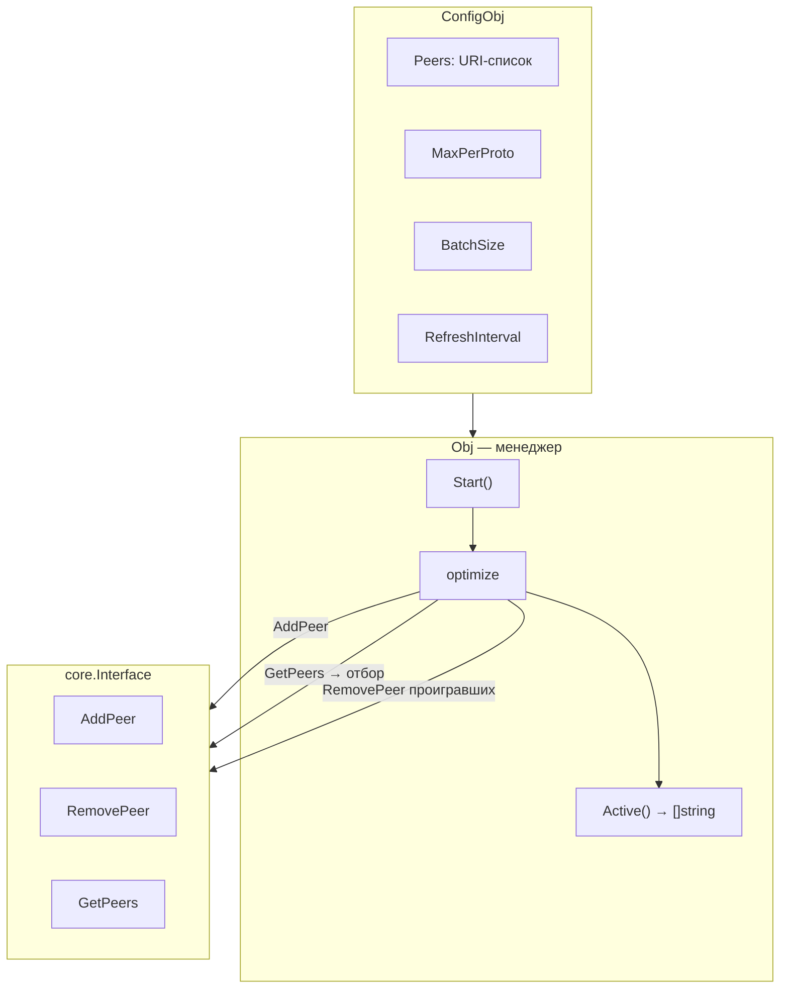
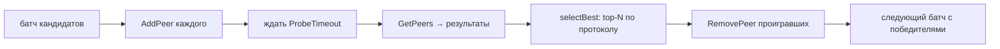

# mod/peermgr

Менеджер пиров для Yggdrasil. Автоматически выбирает лучших пиров по задержке, поддерживает активный (с отбором) и
пассивный (все подряд) режимы.

## Содержание

- [Обзор](#обзор)
- [Инициализация](#инициализация)
- [Режимы работы](#режимы-работы)
    - [Активный режим](#активный-режим)
    - [Пассивный режим](#пассивный-режим)
- [Батчинг](#батчинг)
- [Управление](#управление)
- [Валидация пиров](#валидация-пиров)
- [Ошибки](#ошибки)

---

## Обзор



---

## Инициализация

```go
mgr, err := peermgr.New(node, peermgr.ConfigObj{
Peers:           []string{"tls://peer1:443", "tcp://peer2:8443"},
Logger:          logger,
MaxPerProto:     1, // лучший пир на протокол
ProbeTimeout:    10 * time.Second,
RefreshInterval: 5 * time.Minute,
BatchSize:       0, // все кандидаты одним батчем
OnNoReachablePeers: func () {
log.Warn("no reachable peers")
},
})
```

`New` валидирует пиров и конфигурацию. Невалидные URI пропускаются с предупреждением; ошибка — только если ни одного
валидного пира нет.

| Поле                 | Описание                                           | По умолчанию |
|----------------------|----------------------------------------------------|--------------|
| `Peers`              | Список URI кандидатов                              | обязателен   |
| `Logger`             | Логгер                                             | обязателен   |
| `MaxPerProto`        | Лучших пиров на протокол; `-1` — пассивный режим   | `1`          |
| `ProbeTimeout`       | Таймаут ожидания подключения на батч               | `10s`        |
| `RefreshInterval`    | Интервал переоценки; `0` — только при старте       | `0`          |
| `BatchSize`          | Размер батча; `0`/`1` — все кандидаты одним батчем | `1`          |
| `OnNoReachablePeers` | Колбэк, если после проверки ни один пир не ответил | `nil`        |

---

## Режимы работы

### Активный режим

`MaxPerProto >= 0`. Менеджер пробует кандидатов, измеряет задержку и оставляет только лучших.



Алгоритм отбора:

1. Кандидаты разбиваются на батчи
2. Каждый батч добавляется через `AddPeer`
3. После `ProbeTimeout` — опрос `GetPeers` для получения статуса и задержки
4. `selectBest` группирует по протоколу, сортирует по задержке, берёт top-N
5. Проигравшие удаляются через `RemovePeer`
6. Следующий батч работает только с победителями предыдущих

### Пассивный режим

`MaxPerProto == -1`. Менеджер добавляет всех кандидатов без отбора.

При каждом `RefreshInterval` — полный цикл: удалить всех, добавить всех заново. `ProbeTimeout` и `BatchSize`
игнорируются.

---

## Батчинг

`BatchSize` управляет конкурентностью проверки:

| Значение | Поведение                                                |
|----------|----------------------------------------------------------|
| `0`/`1`  | Все кандидаты в одном батче                              |
| `N >= 2` | Скользящее окно: N кандидатов за раз, гонка на выбывание |

При `BatchSize >= 2` каждый следующий батч включает победителей предыдущих батчей плюс N новых кандидатов. Это позволяет
сравнивать новых кандидатов с уже отобранными.

---

## Управление

```go
mgr.Start() // запустить фоновую горутину
mgr.Active()         // текущие активные пиры (копия)
mgr.Optimize()       // принудительная переоценка (блокирующий вызов)
mgr.Stop() // остановка и удаление всех пиров
```

`Start` запускает горутину, которая сразу выполняет оптимизацию и затем планирует повторные через `RefreshInterval`.

`Optimize` можно вызвать вручную — блокирует до завершения. Сериализован: одновременно выполняется не более одной
оптимизации.

`Stop` отменяет контекст, ждёт завершения горутины, затем удаляет все управляемые пиры через `RemovePeer`.

---

## Валидация пиров

```go
peermgr.AllowedSchemes // ["tcp", "tls", "quic", "ws", "wss"]

entries, errs := peermgr.ValidatePeers(uris)
```

`ValidatePeers` проверяет каждый URI:

- Пустые строки пропускаются
- Дубликаты → ошибка (остальные обрабатываются)
- Валидируется схема, наличие хоста
- Порядок сохраняется

---

## Ошибки

| Переменная             | Описание                              |
|------------------------|---------------------------------------|
| `ErrLoggerRequired`    | Логгер не задан                       |
| `ErrNoPeers`           | Ни одного валидного пира              |
| `ErrAlreadyRunning`    | `Start` вызван повторно               |
| `ErrNotRunning`        | `Optimize` вызван без `Start`         |
| `ErrDuplicatePeer`     | Дубликат URI                          |
| `ErrInvalidURI`        | Невалидный URI                        |
| `ErrMissingHost`       | Отсутствует хост в URI                |
| `ErrUnsupportedScheme` | Неподдерживаемая схема (не tcp/tls/…) |
