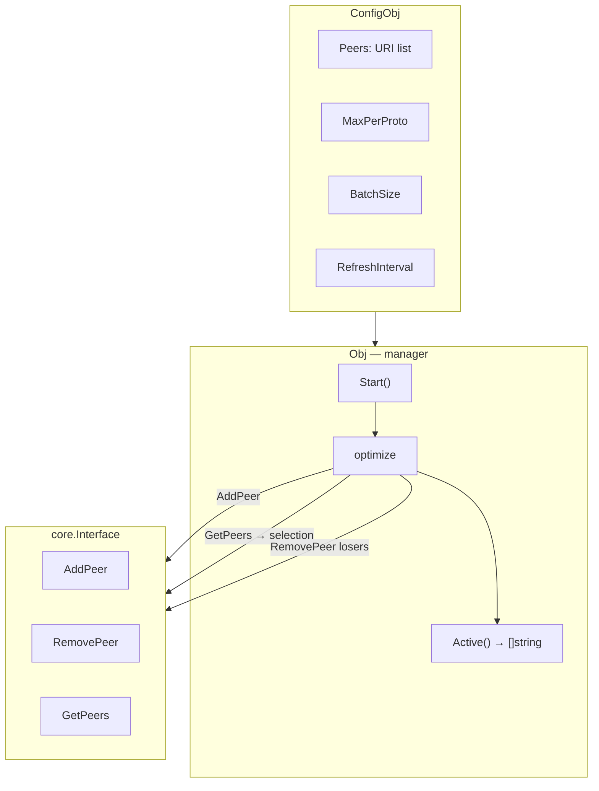
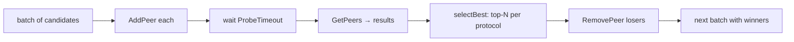

# mod/peermgr

Peer manager for Yggdrasil. Automatically selects the best peers by latency, supports active (with selection) and
passive (all peers) modes.

## Table of Contents

- [Overview](#overview)
- [Initialization](#initialization)
- [Operating Modes](#operating-modes)
  - [Active Mode](#active-mode)
  - [Passive Mode](#passive-mode)
- [Batching](#batching)
- [Control](#control)
- [Peer Validation](#peer-validation)
- [Errors](#errors)

---

## Overview



---

## Initialization

```go
mgr, err := peermgr.New(node, peermgr.ConfigObj{
Peers:           []string{"tls://peer1:443", "tcp://peer2:8443"},
Logger:          logger,
MaxPerProto:     1, // best peer per protocol
ProbeTimeout:    10 * time.Second,
RefreshInterval: 5 * time.Minute,
BatchSize:       0, // all candidates in a single batch
OnNoReachablePeers: func () {
log.Warn("no reachable peers")
},
})
```

`New` validates peers and configuration. Invalid URIs are skipped with a warning; an error is returned only if there are
no valid peers at all.

| Field                | Description                                       | Default  |
|----------------------|---------------------------------------------------|----------|
| `Peers`              | List of candidate URIs                            | required |
| `Logger`             | Logger                                            | required |
| `MaxPerProto`        | Best peers per protocol; `-1` — passive mode      | `1`      |
| `ProbeTimeout`       | Connection timeout per batch                      | `10s`    |
| `RefreshInterval`    | Re-evaluation interval; `0` — only at start       | `0`      |
| `BatchSize`          | Batch size; `0`/`1` — all candidates in one batch | `1`      |
| `OnNoReachablePeers` | Callback if no peers responded after probing      | `nil`    |

---

## Operating Modes

### Active Mode

`MaxPerProto >= 0`. The manager probes candidates, measures latency, and keeps only the best ones.



Selection algorithm:

1. Candidates are split into batches
2. Each batch is added via `AddPeer`
3. After `ProbeTimeout` — poll `GetPeers` to obtain status and latency
4. `selectBest` groups by protocol, sorts by latency, picks top-N
5. Losers are removed via `RemovePeer`
6. The next batch operates only with previous winners

### Passive Mode

`MaxPerProto == -1`. The manager adds all candidates without selection.

On each `RefreshInterval` — a full cycle: remove all, then re-add all. `ProbeTimeout` and `BatchSize`
are ignored.

---

## Batching

`BatchSize` controls probing concurrency:

| Value    | Behavior                                                    |
|----------|-------------------------------------------------------------|
| `0`/`1`  | All candidates in a single batch                            |
| `N >= 2` | Sliding window: N candidates at a time, elimination contest |

When `BatchSize >= 2`, each subsequent batch includes winners from previous batches plus N new candidates. This allows
comparing new candidates against already selected ones.

---

## Control

```go
mgr.Start() // start the background goroutine
mgr.Active()         // current active peers (copy)
mgr.Optimize()       // force re-evaluation (blocking call)
mgr.Stop() // stop and remove all peers
```

`Start` launches a goroutine that immediately performs optimization and then schedules repeats via `RefreshInterval`.

`Optimize` can be called manually — it blocks until completion. It is serialized: no more than one optimization runs at
a time.

`Stop` cancels the context, waits for the goroutine to finish, then removes all managed peers via `RemovePeer`.

---

## Peer Validation

```go
peermgr.AllowedSchemes // ["tcp", "tls", "quic", "ws", "wss"]

entries, errs := peermgr.ValidatePeers(uris)
```

`ValidatePeers` checks each URI:

- Empty strings are skipped
- Duplicates → error (remaining entries are still processed)
- Scheme and host presence are validated
- Order is preserved

---

## Errors

| Variable               | Description                          |
|------------------------|--------------------------------------|
| `ErrLoggerRequired`    | Logger not provided                  |
| `ErrNoPeers`           | No valid peers                       |
| `ErrAlreadyRunning`    | `Start` called more than once        |
| `ErrNotRunning`        | `Optimize` called without `Start`    |
| `ErrDuplicatePeer`     | Duplicate URI                        |
| `ErrInvalidURI`        | Invalid URI                          |
| `ErrMissingHost`       | Host missing in URI                  |
| `ErrUnsupportedScheme` | Unsupported scheme (not tcp/tls/...) |
