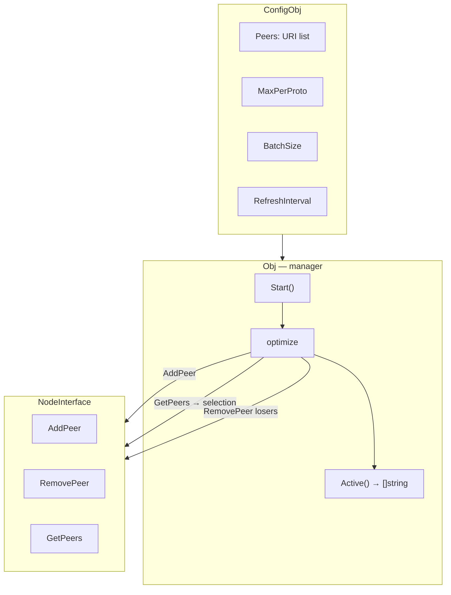
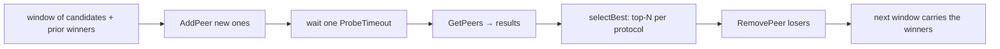

# mod/peermgr

Peer manager for Yggdrasil. Automatically selects the strongest responsive peers by protocol and observed latency,
probing candidates in bounded windows and keeping the best per protocol.

## Table of Contents

- [Overview](#overview)
- [Initialization](#initialization)
- [Selection](#selection)
- [Windowing](#windowing)
- [Control](#control)
- [Peer Validation](#peer-validation)
- [Errors](#errors)

---

## Overview

peermgr depends only on a minimal node contract — `NodeInterface` (`AddPeer` / `RemovePeer` / `GetPeers`) — not on the
full core surface. Any node implementation satisfying that contract can be supplied, which is convenient for tests or
substituting your own node.



---

## Initialization

```go
mgr, err := peermgr.New(node, peermgr.ConfigObj{
Peers:           []string{"tls://peer1:443", "tcp://peer2:8443"},
Logger:          logger,
MaxPerProto:     1, // best peer per protocol
ProbeTimeout:    10 * time.Second,
RefreshInterval: 5 * time.Minute,
BatchSize:       0, // default window size (64)
})
```

`node` is any value implementing `NodeInterface` (`AddPeer` / `RemovePeer` / `GetPeers`); a `*core.Obj` satisfies it,
but
so can your own node implementation. `New` validates peers and configuration. Invalid URIs are skipped with a warning;
an
error is returned only if there are no valid peers at all. A negative `MaxPerProto` is rejected with
`ErrInvalidMaxPerProto`.

| Field             | Description                                                              | Default  |
|-------------------|--------------------------------------------------------------------------|----------|
| `Peers`           | List of candidate URIs                                                   | required |
| `Logger`          | Logger                                                                   | required |
| `MaxPerProto`     | Best peers per protocol; `0`/`1` — one best, `N>1` — top-N, `<0` → error | `1`      |
| `ProbeTimeout`    | Connection wait timeout per probe window                                 | `10s`    |
| `RefreshInterval` | Re-evaluation interval; `0` — only at start; tiny positives are clamped  | `0`      |
| `BatchSize`       | Max peers probed simultaneously per window; `0`/`1` — default, capped    | `64`     |

---

## Selection

The manager gives each window a single `ProbeTimeout`, measures latency among peers that are up at the end of that
window, and keeps the best per protocol. `MaxPerProto` controls how many winners survive per protocol: `0` or `1` keep
one best, `N > 1` keeps the top N.



Selection algorithm:

1. Candidates are the currently active peers plus any peer whose backoff window has elapsed.
2. They are processed in windows of at most `BatchSize` peers.
3. Each window adds its new candidates via `AddPeer`, alongside the winners carried from earlier windows.
4. After a single `ProbeTimeout`, `selectBest` groups the up peers by protocol, sorts by latency, and picks the top N.
5. Losers are removed via `RemovePeer`; winners carry into the next window, so the final selection is global.

A peer list that fits in one window is evaluated in a single `ProbeTimeout` — there is no per-batch timeout stacking.
Peers that stay down accumulate an exponential, capped backoff, so dead URIs are re-probed less often.

---

## Windowing

`BatchSize` bounds how many peers are connected at once during probing:

| Value    | Behavior                                       |
|----------|------------------------------------------------|
| `0`/`1`  | Default window size (64)                       |
| `N >= 2` | Up to N peers probed per window, capped at 256 |

Each window connects at most `BatchSize` new candidates plus the winners already selected, waits one `ProbeTimeout`,
then prunes. This keeps large candidate lists from flooding the node with simultaneous dials while still comparing every
candidate against the current winners. Values above 256 are clamped.

---

## Control

```go
mgr.Start()    // start the background goroutine
mgr.Active()   // current active peers (copy)
mgr.Optimize() // force re-evaluation (blocking call)
mgr.Stop()     // stop and remove all peers
```

`Start` launches a goroutine that immediately performs optimization and then schedules repeats via `RefreshInterval`.
`ProbeTimeout` and `RefreshInterval` are immutable: set them once through `ConfigObj` at `New`. To change them, create a
new manager. `Optimize()` remains available at runtime to force an immediate re-evaluation. Positive `RefreshInterval`
values below the safety floor are clamped.

`Optimize` can be called manually — it blocks until completion. It is serialized: no more than one optimization runs at
a time. A cycle is bounded only by `Stop` (which cancels the context). A cancelled cycle is not rolled back: it leaves
every peer it added in the active set, so `Stop` tears them all down cleanly.

`Stop` cancels the context, waits for the manager goroutine, then removes all managed peers via `RemovePeer`. It is safe
to call multiple times; shutdown does not depend on any user callback.

---

## Peer Validation

```go
entries, errs := peermgr.ValidatePeers(uris)
```

`ValidatePeers` accepts the Yggdrasil transport schemes `tcp`, `tls`, `quic`, `ws`, `wss`
and checks each URI:

- Empty strings are skipped
- Duplicates by normalized URI (query and fragment stripped) → error
- Scheme and host presence are validated
- Order is preserved

---

## Errors

| Variable                | Description                          |
|-------------------------|--------------------------------------|
| `ErrNodeRequired`       | `New` called with a nil node         |
| `ErrNoPeers`            | No valid peers                       |
| `ErrInvalidMaxPerProto` | `MaxPerProto` is negative            |
| `ErrAlreadyRunning`     | `Start` called more than once        |
| `ErrNotRunning`         | `Optimize` called without `Start`    |
| `ErrDuplicatePeer`      | Duplicate URI                        |
| `ErrInvalidURI`         | Invalid URI                          |
