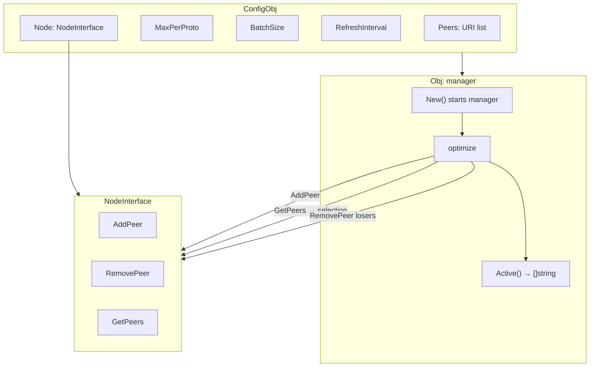
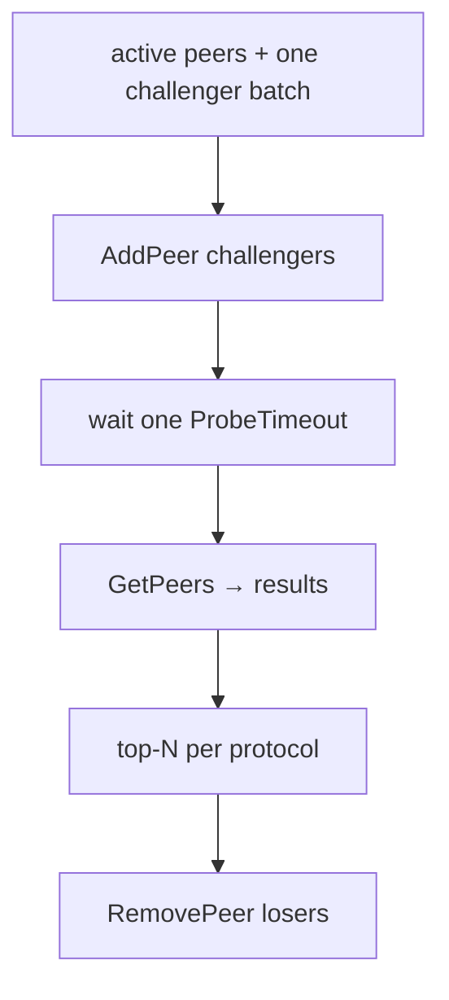

# Peer manager

Package `peermgr` probes bounded candidate batches and keeps the lowest-latency
responsive peers for each transport protocol.

The default new-connection budget is 64 per cycle, the hard batch cap is 256,
failure backoff tops out at 10 minutes, and reachable selection losers are held
for 30 minutes by default.

## Contents

- [Overview](#overview)
- [Initialization](#initialization)
- [Selection](#selection)
- [Batching](#batching)
- [Control](#control)
- [Peer validation](#peer-validation)
- [Errors](#errors)

---

## Overview

peermgr depends only on the minimal `NodeInterface` contract (`AddPeer`, `RemovePeer`, and `GetPeers`), not on the
full core surface. Any node implementation satisfying that contract can be supplied, which is convenient for tests or
substituting your own node.



---

## Initialization

```go
mgr, err := peermgr.New(peermgr.ConfigObj{
    Node:            node,
    Peers:           []string{"tls://peer1:443", "tcp://peer2:8443"},
    Logger:          logger,
    MaxPerProto:     1,
    ProbeTimeout:    10 * time.Second,
    RefreshInterval: 5 * time.Minute,
    BatchSize:       0, // at most 64 new candidates per cycle
    HealthInterval:  0, // check outages and MinPeers every 10s
    ReprobeInterval: 0, // hold reachable losers for 30m before reconnecting
})
if err != nil {
    return err
}
defer func() {
    if err := mgr.Close(); err != nil {
        logger.Errorf("close peer manager: %v", err)
    }
}()
```

`Node` is any value implementing `NodeInterface` (`AddPeer` / `RemovePeer` / `GetPeers`); a `*core.Obj` satisfies it,
as can a custom node implementation. `New` validates the complete configuration and then starts the manager
asynchronously. Invalid URIs are skipped with a warning; an error is returned only if there are no valid peers at all.
Negative values are rejected for `MaxPerProto`,
`ProbeTimeout`, `BatchSize`, `MinPeers`, and `MinPeersConfirmations`; intervals that explicitly document a negative
disable value retain that behavior.

| Field                   | Description                                                                 | Default  |
|-------------------------|-----------------------------------------------------------------------------|----------|
| `Node`                  | Peer-capable node implementing `NodeInterface`                              | required |
| `Peers`                 | List of candidate URIs                                                      | required |
| `Logger`                | Logger; nil discards logs                                                   | `nil`    |
| `MaxPerProto`           | Best peers per protocol; `0`/`1` means one, `<0` is invalid                 | `1`      |
| `ProbeTimeout`          | Connection wait; `0` means 10s, `<0` is invalid                             | `10s`    |
| `RefreshInterval`       | Scheduled refresh; `<=0` disables it                                        | disabled |
| `BatchSize`             | New candidate budget; `0`/`1` means 64, `<0` invalid, max 256               | `64`     |
| `Passive`               | Keep all configured peers and skip latency selection                        | `false`  |
| `MinPeers`              | Trigger early optimize at or below this Up count; `0` disables              | disabled |
| `HealthInterval`        | Outage and `MinPeers` checks; `0` means 10s, `<0` disables                  | `10s`    |
| `MinPeersConfirmations` | Consecutive low-count checks; `0` means 3, `<0` is invalid                  | `3`      |
| `ReprobeInterval`       | Holdoff before reconnecting a reachable loser; `0` means 30m, `<0` disables | `30m`    |
| `NoReachablePeers`      | Best-effort notification channel after a cycle finds no reachable peer      | `nil`    |

---

## Selection

Each cycle re-evaluates the active peers and connects at most one `BatchSize` of challengers. It waits one
`ProbeTimeout` only if at least one new `AddPeer` succeeds, then keeps the best peers per protocol. A cycle that starts
no connection selects immediately. `MaxPerProto` controls how many winners survive: `0` or `1` keeps one, and `N > 1`
keeps the top N. A positive latency always sorts ahead of zero, because Yggdrasil uses zero for an up peer whose
latency has not been measured yet.



Selection algorithm:

1. A normal cycle includes every active peer and up to `BatchSize` non-active candidates whose backoff has elapsed.
2. A round-robin cursor advances through the configured list across cycles.
3. After successful new connections get one `ProbeTimeout`, responsive peers are grouped by protocol and sorted by
   measured latency.
4. Losers are removed; winners remain managed for the next cycle.

Peers that stay down accumulate an exponential backoff capped at 10 minutes. A reachable peer that loses selection
is held for `ReprobeInterval` instead of being connected and disconnected again on every refresh. Winners clear their
schedule. The normal refresh path respects both delays.

---

## Batching

`BatchSize` is the complete new-connection budget for one startup, scheduled, manual, or outage cycle:

| Value    | Behavior                              |
|----------|---------------------------------------|
| `0`/`1`  | Up to 64 new candidates               |
| `N >= 2` | Up to N new candidates, capped at 256 |
| `N < 0`  | Configuration error                   |

Active peers do not consume this budget. Large lists are covered over multiple cycles; startup does not walk the full
list. This is an anti-spam and load-shedding boundary, not only a concurrency hint.

---

## Control

```go
mgr.Active()   // current active peers (copy)
mgr.Optimize() // force re-evaluation (blocking call)
mgr.Close()    // terminally stop and remove all managed peers
```

`New` starts asynchronously and immediately schedules one bounded cycle. A positive `RefreshInterval` schedules normal
cycles. In active mode, one `HealthInterval` ticker handles recovery. A complete outage (`Up == 0`) immediately runs one
bounded cycle that bypasses the reachable-loser holdoff. After `MinPeersConfirmations` partial-degradation checks
(`0 < Up <= MinPeers`), recovery targets only protocols below `MaxPerProto` and attempts no more candidates per protocol
than its vacant slots. This prevents healthy protocols and surplus reachable losers from entering a repeated
connect/select/disconnect cycle. A missing managed peer reserves a recovery slot because the same cycle reconnects it;
a present-but-down managed peer does not block a replacement.

Failure backoff is always respected, including during a complete outage, so dead candidates decay up to the 10-minute
cap instead of being redialed on every health check. The round-robin cursor advances after the last attempted candidate,
so bounded recovery cycles rotate fairly through alternatives. Scheduled and manual cycles respect both delays. A
negative `HealthInterval` disables health recovery; passive mode does not run the health ticker.

Configuration is immutable after `New`; create a new manager to change it. `Optimize()` forces one normal bounded cycle.

`NoReachablePeers` is caller-owned and never blocks the manager. Use a channel with capacity one to coalesce repeated
notifications while the receiver is busy:

```go
noPeers := make(chan struct{}, 1)
cfg.NoReachablePeers = noPeers
```

If the channel is unbuffered, full, or otherwise not ready, that notification is dropped. The manager does not start a
callback goroutine and does not close the caller-owned channel. The caller must not close it before `Close` returns.

`Optimize` can be called manually and blocks until completion. It is serialized: no more than one optimization runs at
a time. A cycle is bounded only by `Close` (which cancels the context). A cancelled cycle is not rolled back: it leaves
every peer it added in the active set, so `Close` tears them all down cleanly.

`Close` terminally cancels the manager, waits for accepted work, then removes all managed peers via `RemovePeer`. The
object cannot be restarted; create a new manager instead. Repeated or concurrent calls are safe. A failed removal stays
owned and is retried by the next `Close`; successfully removed peers are never removed twice. Shutdown does not depend
on notification delivery. `NodeInterface` has no context-aware peer methods, so a custom node must eventually return
from an in-flight `AddPeer`, `RemovePeer`, or `GetPeers`; the manager cannot forcibly interrupt code inside that
implementation. The bundled core satisfies this expectation.

---

## Peer validation

```go
entries, errs := peermgr.ValidatePeers(uris)
```

Each accepted `PeerEntryObj` contains the preserved connection `URI`, its
selection `Scheme`, and a normalized `MatchURI` with userinfo, query, and
fragment removed. Use `MatchURI` for identity and logs, not for connecting.

`ValidatePeers` normalizes and deduplicates Yggdrasil peer URIs (schemes such as `tcp`, `tls`, `quic`, `ws`, `wss`)
and checks each URI:

- Empty strings are skipped
- Malformed URIs (`url.Parse` failure) → error
- Duplicates by normalized URI (query and fragment stripped) → error
- Scheme and host are not restricted here: the scheme only groups peers per protocol, and `AddPeer` rejects genuinely
  bad URIs at probe time
- Order is preserved

---

## Errors

| Variable                          | Description                                                  |
|-----------------------------------|--------------------------------------------------------------|
| `ErrNodeRequired`                 | `New` called with a nil node                                 |
| `ErrNoPeers`                      | No valid peers                                               |
| `ErrClosed`                       | `Optimize` called after `Close` started                      |
| `ErrInvalidMaxPerProto`           | `MaxPerProto` is negative                                    |
| `ErrInvalidProbeTimeout`          | `ProbeTimeout` is negative                                   |
| `ErrInvalidBatchSize`             | `BatchSize` is negative                                      |
| `ErrInvalidMinPeers`              | `MinPeers` is negative                                       |
| `ErrInvalidMinPeersConfirmations` | `MinPeersConfirmations` is negative                          |
| `ErrMinPeersTooHigh`              | `MinPeers` is not below the selectable per-protocol capacity |
| `ErrDuplicatePeer`                | Duplicate URI                                                |
| `ErrInvalidURI`                   | Invalid URI                                                  |
