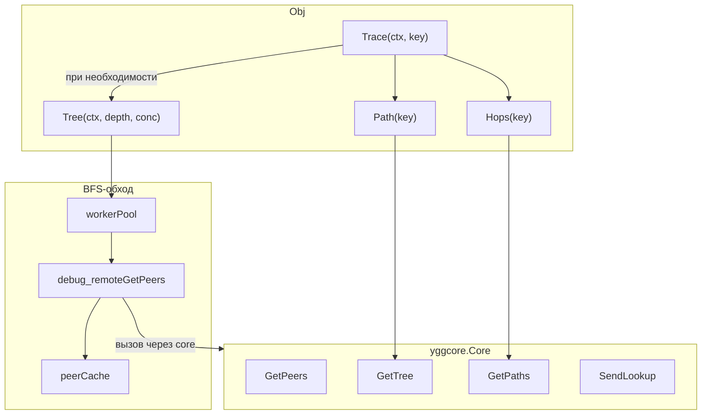
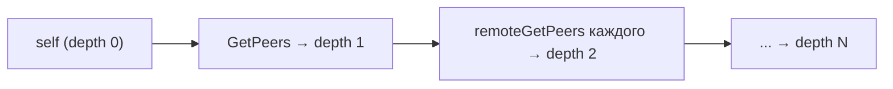
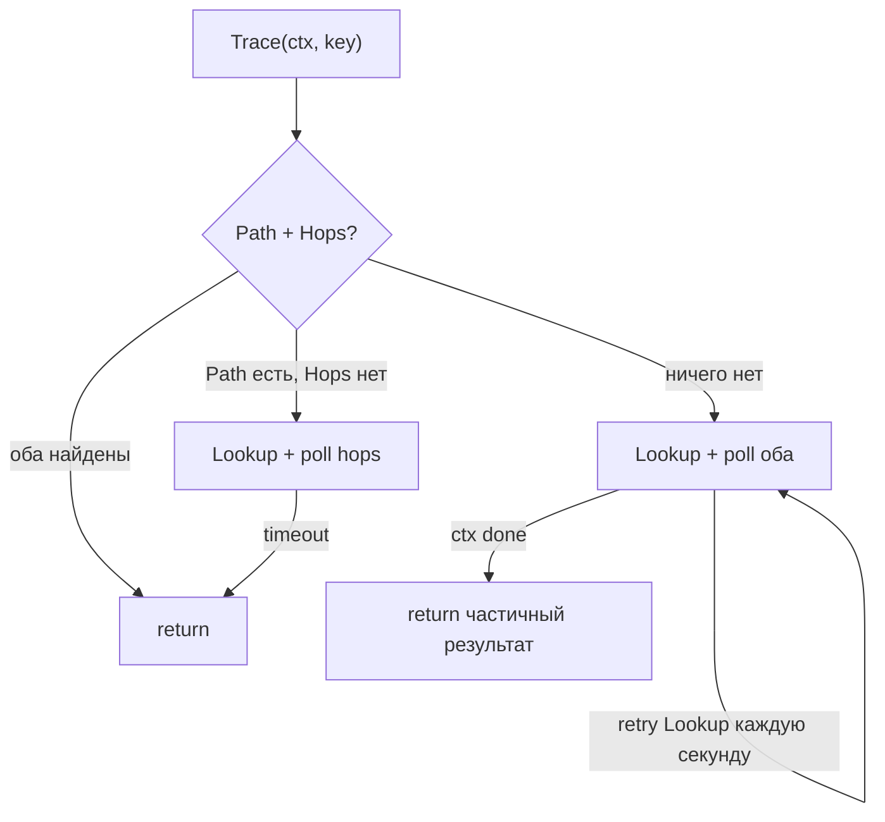

# mod/probe

Исследование топологии сети Yggdrasil. Строит дерево пиров через BFS, находит маршруты через spanning tree и
pathfinder —
без необходимости admin socket.

## Содержание

- [Обзор](#обзор)
- [Инициализация](#инициализация)
- [Исследование топологии](#исследование-топологии)
    - [Tree](#tree)
    - [TreeChan](#treechan)
- [Поиск маршрутов](#поиск-маршрутов)
    - [Path](#path)
    - [Hops](#hops)
    - [Trace](#trace)
- [Информация об узле](#информация-об-узле)
- [Кэширование](#кэширование)
- [Настраиваемые параметры](#настраиваемые-параметры)
- [Структуры данных](#структуры-данных)
- [Ошибки](#ошибки)

---

## Обзор



---

## Инициализация

```go
p, err := probe.New(yggCore, logger)
defer p.Close()
```

`New` перехватывает обработчик `debug_remoteGetPeers` из core через фейковый admin socket. Это позволяет делать запросы
к удалённым узлам без реального admin socket.

`Close` останавливает фоновую горутину очистки кэша.

---

## Исследование топологии

### Tree

```go
result, err := p.Tree(ctx, maxDepth, concurrency)
// result.Root  — корневой узел (self)
// result.Total — общее количество обнаруженных узлов
```

BFS-обход сети от текущего узла. На каждом уровне глубины параллельно опрашивает пиров удалённых узлов через worker
pool.



- `maxDepth` — максимальная глубина BFS (обязателен, > 0)
- `concurrency` — размер worker pool (0 → 16 по умолчанию)
- Узлы, не ответившие на запрос или превысившие `MaxPeersPerNode`, помечаются как `Unreachable`
- Дубликаты отсекаются по публичному ключу

### TreeChan

```go
ch := make(chan probe.TreeProgressObj)
result, err := p.TreeChan(ctx, maxDepth, concurrency, ch)
```

То же, что `Tree`, но отправляет прогресс в канал после каждого уровня глубины:

```go
type TreeProgressObj struct {
Depth int // текущий уровень
Found int // найдено на этом уровне
Total int // всего найдено
Done  bool // true на последнем сообщении
}
```

---

## Поиск маршрутов

### Path

```go
nodes, err := p.Path(key) // [root, ..., target]
```

Возвращает путь от корня spanning tree до целевого узла. Строит дерево из `core.GetTree()` и ищет ключ рекурсивно.

### Hops

```go
hops, err := p.Hops(key)
```

Возвращает маршрут на уровне портов из pathfinder (`core.GetPaths()`). Требует предварительного `Lookup(key)`.

```go
type HopObj struct {
Key   ed25519.PublicKey // nil если порт не разрешился
Port  uint64
Index int
}
```

### Trace

```go
result, err := p.Trace(ctx, key)
// result.TreePath — путь через spanning tree (может быть nil)
// result.Hops     — маршрут через pathfinder (может быть nil)
```

Комплексный поиск маршрута. Комбинирует несколько стратегий:



- Если оба найдены сразу — возвращает немедленно
- Если есть путь, но нет hops — делает `Lookup` и опрашивает с таймаутом `HopsWaitTimeout`
- Если ничего нет — полный цикл с повторными `Lookup` каждую `LookupRetryEvery`
- RTT заполняется для промежуточных узлов через удалённые вызовы

---

## Информация об узле

| Метод            | Возвращает                | Описание                  |
|------------------|---------------------------|---------------------------|
| `Self()`         | `yggcore.SelfInfo`        | Информация о себе         |
| `Address()`      | `net.IP`                  | IPv6-адрес узла           |
| `Subnet()`       | `net.IPNet`               | Подсеть `/64`             |
| `Peers()`        | `[]yggcore.PeerInfo`      | Список пиров              |
| `Sessions()`     | `[]yggcore.SessionInfo`   | Активные сессии           |
| `SpanningTree()` | `[]yggcore.TreeEntryInfo` | Записи spanning tree      |
| `Paths()`        | `[]yggcore.PathEntryInfo` | Маршруты pathfinder       |
| `Lookup(key)`    | —                         | Инициирует поиск маршрута |
| `FlushCache()`   | —                         | Сброс кэша запросов пиров |

---

## Кэширование

Результаты `debug_remoteGetPeers` кэшируются по публичному ключу узла. Кэш автоматически очищается каждые `CacheTTL/2`.
Недоступные узлы (не ответившие) кэшируются как `nil` — повторный запрос в пределах TTL сразу вернёт
`ErrNodeUnreachable`.

Горутина очистки останавливается автоматически после 10 итераций без данных.

---

## Настраиваемые параметры

Пакетные переменные, которые можно менять до использования:

| Переменная         | Описание                                        | По умолчанию |
|--------------------|-------------------------------------------------|--------------|
| `MaxPeersPerNode`  | Лимит пиров на узел; превышение → `Unreachable` | `65535`      |
| `CacheTTL`         | Время жизни записей в кэше                      | `60s`        |
| `PollInterval`     | Интервал опроса core в `Trace`                  | `200ms`      |
| `LookupRetryEvery` | Интервал повторного `SendLookup` в `Trace`      | `1s`         |
| `HopsWaitTimeout`  | Ожидание hops когда tree path уже найден        | `2s`         |

---

## Структуры данных

### NodeObj

Узел в дереве топологии.

| Поле          | Тип                 | Описание                                 |
|---------------|---------------------|------------------------------------------|
| `Key`         | `ed25519.PublicKey` | Публичный ключ узла                      |
| `Parent`      | `ed25519.PublicKey` | Ключ родителя                            |
| `Sequence`    | `uint64`            | Номер последовательности (spanning tree) |
| `Depth`       | `int`               | Расстояние от корня                      |
| `RTT`         | `time.Duration`     | Время отклика                            |
| `Unreachable` | `bool`              | Не ответил на запрос (только Tree)       |
| `Children`    | `[]*NodeObj`        | Дочерние узлы                            |

Методы: `Find(key)`, `Flatten()`, `PathTo(key)`.

### TreeResultObj

```go
type TreeResultObj struct {
Root  *NodeObj // корневой узел (self)
Total int      // всего обнаруженных узлов
}
```

### TraceResultObj

```go
type TraceResultObj struct {
TreePath []*NodeObj // путь через spanning tree
Hops     []HopObj  // маршрут через pathfinder
}
```

---

## Ошибки

| Переменная                  | Описание                                        |
|-----------------------------|-------------------------------------------------|
| `ErrCoreRequired`           | Core не передан в `New`                         |
| `ErrLoggerRequired`         | Логгер не передан в `New`                       |
| `ErrRemotePeersNotCaptured` | Обработчик `debug_remoteGetPeers` не перехвачен |
| `ErrInvalidCacheTTL`        | `CacheTTL` меньше 1 секунды                     |
| `ErrMaxDepthRequired`       | `maxDepth` должен быть > 0                      |
| `ErrInvalidKeyLength`       | Публичный ключ не 32 байта                      |
| `ErrKeyNotInTree`           | Ключ не найден в spanning tree                  |
| `ErrNoActivePath`           | Нет активного маршрута в pathfinder             |
| `ErrNodeUnreachable`        | Узел недоступен (кэширован)                     |
| `ErrRemotePeersDisabled`    | `debug_remoteGetPeers` недоступен               |
| `ErrTreeEmpty`              | Записи spanning tree пусты                      |
| `ErrNoRoot`                 | Нет корневого узла в дереве                     |
| `ErrLookupTimedOut`         | Таймаут поиска маршрута                         |
