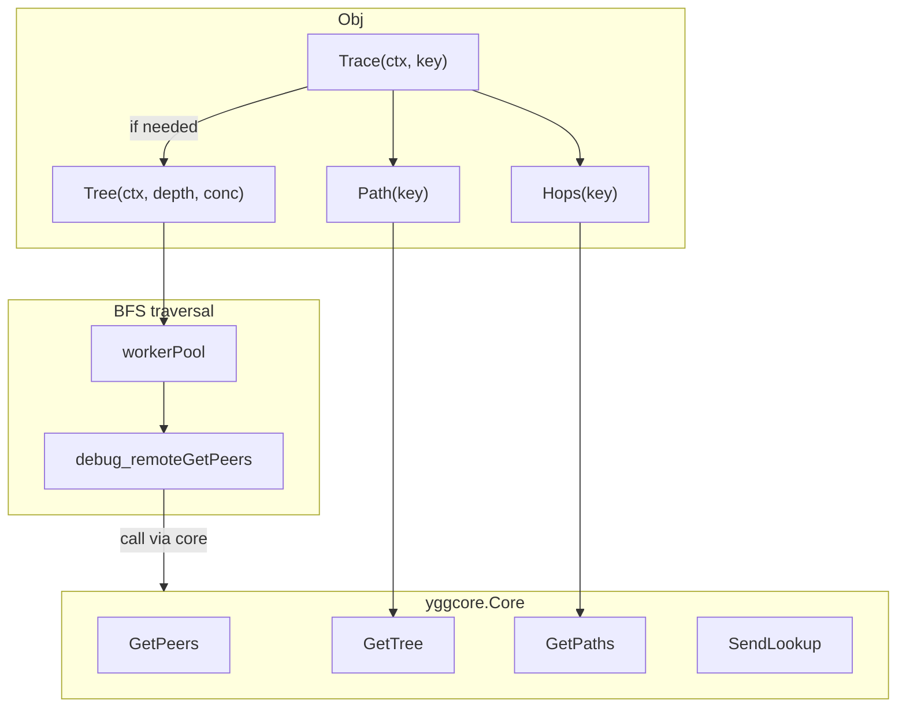
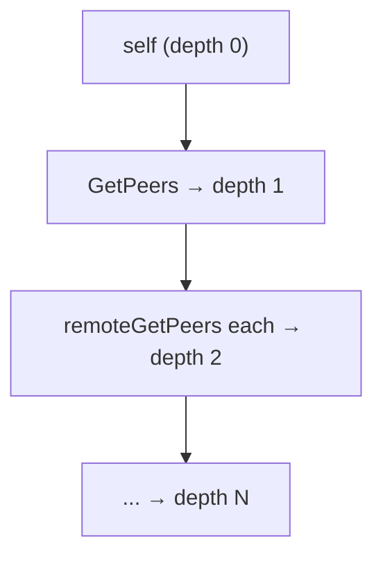
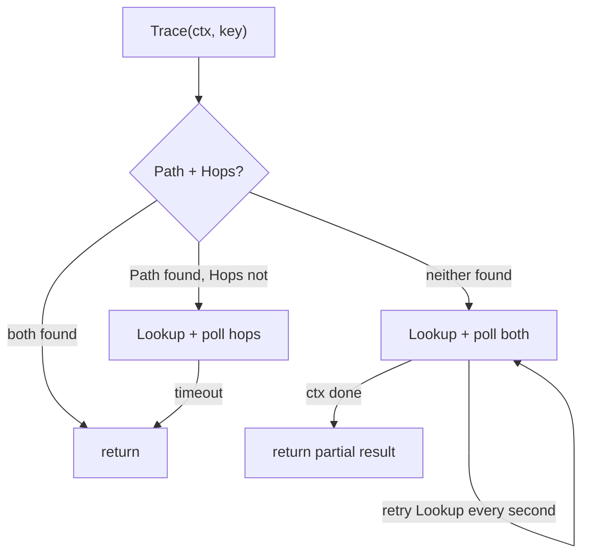

# Probe

Package `probe` builds a bounded peer tree and reads spanning-tree and
pathfinder routes without opening a listening admin socket.

Default hard limits are 1024 peers accepted per remote node, 4096 discovered
nodes, 256 distinct remote flights, and a 1 MiB remote response. Overload returns
partial results with `ErrProbeBusy` where useful.

## Contents

- [Overview](#overview)
- [Initialization](#initialization)
- [Topology exploration](#topology-exploration)
    - [Tree](#tree)
    - [TreeChan](#treechan)
- [Route lookup](#route-lookup)
    - [Path](#path)
    - [Hops](#hops)
    - [Trace](#trace)
- [Node information](#node-information)
- [Resource limits](#resource-limits)
- [Data structures](#data-structures)
- [Errors](#errors)

---

## Overview



---

## Initialization

```go
p, err := probe.New(probe.ConfigObj{Source: coreNode, Logger: logger})
if err != nil {
    return err
}
defer func() { _ = p.Close() }()
```

`Source` is mandatory and provides the narrow `SourceInterface` used by the module. The rest of `ConfigObj` tunes the
logger, crawl timing (`PollInterval`, `LookupRetryEvery`, `MaxDuration`, `RemoteTimeout`) and the
total-node cap (`MaxTotalNodes`); zero values fall back to internal defaults. `RemoteTimeout` defaults to 30 seconds
and a negative value disables the probe-imposed wait timeout. The per-node peer cap and hops-wait timeout stay fixed
package constants. Topology data comes from untrusted remote nodes, so those bounds are not caller knobs.

`New` intercepts the `debug_remoteGetPeers` handler from `ConfigObj.Source` through the narrow `SourceInterface`. This
allows querying remote nodes without a real admin socket.

`Close` rejects new work and waits for every already accepted remote query to finish. This is the standalone-module
contract: accepted work is not abandoned. If the caller needs a bounded wait, use `CloseContext(ctx)`. Its context
bounds only the caller's wait; shutdown continues and a later `Close` or `CloseContext` can still observe completion.

A same-node flight is published before it waits for the global 256-call semaphore, so saturation cannot queue many
identical upstream calls. The module accepts at most 256 distinct flights at once; an additional distinct key returns
`ErrProbeBusy`, while callers for an already accepted key still join its flight. An accepted flight belongs to the
module lifecycle: cancellation of the caller that created it only detaches that caller and cannot poison other
waiters. Once the handler starts, the module owns its slot until the upstream call actually returns. `RemoteTimeout`
releases callers with `ErrRemoteCallTimedOut`, but deliberately does not release the slot or forget the flight early:
the upstream handler has no cancellation API, and pretending it ended would exceed the real concurrency cap. `Close`
waits for it.

Each `Tree` call reads a fresh topology snapshot. There is intentionally no cross-call result cache: mesh peer sets can
change between calls, while the remote call itself is cheap compared with traversal and network latency. A traversal
still deduplicates visited keys and coalesces concurrent requests for the same key. Applications that prefer stale data
may cache the complete `TreeResultObj` at their own freshness boundary.

---

## Topology exploration

### Tree

```go
result, err := p.Tree(ctx, maxDepth, concurrency)
// result.Root is the local root node.
// result.Total is the number of discovered nodes.
// result.Truncated reports whether MaxTotalNodes stopped traversal.
```

BFS traversal of the network from the current node. At each depth level, peers of remote nodes are queried in parallel
via a worker pool.



- `maxDepth`: maximum BFS depth (required and greater than zero)
- `concurrency`: worker-pool size (zero uses 16), clamped to `DefaultMaxConcurrency`
- Nodes that did not respond are marked as `Unreachable`; a node reporting more than `DefaultMaxPeersPerNode` peers
  stays reachable with its peer set truncated to the cap
- Traversal stops at `ConfigObj.MaxTotalNodes` (0 → `DefaultMaxTotalNodes`); `TreeResultObj.Truncated` reports this
  condition
- If distinct-flight admission is saturated, `Tree` returns the successfully built partial result together with
  `ErrProbeBusy`. Busy parents are not marked `Unreachable`, and `Truncated` remains reserved for `MaxTotalNodes`
- Duplicates are filtered by public key

### TreeChan

```go
ch := make(chan probe.TreeProgressObj)
result, err := p.TreeChan(ctx, maxDepth, concurrency, ch)
```

Same as `Tree`, but sends progress to a channel after each depth level:

```go
type TreeProgressObj struct {
    Depth     int
    Found     int
    Total     int
    Done      bool
    Truncated bool
    Limit     int
}
```

On `ErrProbeBusy`, `TreeChan` follows the same partial-result contract and sends a final `Done` progress value before
returning when the caller context still permits it.

---

## Route lookup

### Path

```go
nodes, err := p.Path(key) // [root, ..., target]
```

Returns the path from the spanning-tree root to the target node. The
implementation indexes `core.GetTree()` once and follows parent links from the
target, with a node-count bound that rejects cycles as `ErrNoRoot`.

### Hops

```go
hops, err := p.Hops(key)
```

Returns the port-level route from the pathfinder (`core.GetPaths()`). Requires a prior `Lookup(key)`.

```go
type HopObj struct {
    Key   ed25519.PublicKey
    Port  uint64
    Index int
}
```

### Trace

```go
result, err := p.Trace(ctx, key)
// result.TreePath is the spanning-tree path and may be nil.
// result.Hops is the pathfinder route and may be nil.
```

Comprehensive route lookup. Combines multiple strategies:



- If both are found immediately, Trace returns immediately.
- If the path exists but hops are missing, Trace performs `Lookup` and polls for `HopsWaitTimeout`.
- If neither is found, Trace repeats `Lookup` every `LookupRetryEvery` for the full cycle.
- RTT is populated for intermediate nodes via remote calls
- If RTT enrichment reaches the distinct-flight cap, returns the partial route
  together with `ErrProbeBusy`; unavailable RTT fields remain zero

---

## Node information

| Method           | Returns                   | Description            |
|------------------|---------------------------|------------------------|
| `Self()`         | `yggcore.SelfInfo`        | Information about self |
| `Address()`      | `net.IP`                  | Node IPv6 address      |
| `Subnet()`       | `net.IPNet`               | `/64` subnet           |
| `Peers()`        | `[]yggcore.PeerInfo`      | List of peers          |
| `Sessions()`     | `[]yggcore.SessionInfo`   | Active sessions        |
| `SpanningTree()` | `[]yggcore.TreeEntryInfo` | Spanning tree entries  |
| `Paths()`        | `[]yggcore.PathEntryInfo` | Pathfinder routes      |
| `Lookup(key)`    | Not applicable            | Initiates route lookup |

---

## Resource limits

`MaxTotalNodes` and the crawl timings (poll interval, lookup retry, max duration) are tunable via `ConfigObj`
(zero uses the default below). The per-node peer cap, hops-wait timeout, and concurrency ceiling stay fixed because a
probe is
cheap to re-instantiate and its inputs come from untrusted remote nodes:

| Constant                 | Description                                             | Default |
|--------------------------|---------------------------------------------------------|---------|
| `DefaultMaxPeersPerNode` | Per-node peer cap; excess peers are truncated           | `1024`  |
| `DefaultMaxTotalNodes`   | Maximum discovered nodes in `Tree`, excluding root      | `4096`  |
| `DefaultMaxConcurrency`  | Maximum concurrent remote peer queries                  | `256`   |
| poll interval            | Core polling interval in `Trace`                        | `200ms` |
| lookup retry             | `SendLookup` retry interval in `Trace`                  | `1s`    |
| remote timeout           | Caller wait for one `debug_remoteGetPeers` call         | `30s`   |
| hops wait timeout        | Hops wait timeout when tree path is already found       | `2s`    |
| max duration             | Internal wall-clock cap for `Tree` without ctx deadline | `5m`    |

---

## Data structures

### NodeObj

A node in the topology tree.

| Field         | Type                | Description                            |
|---------------|---------------------|----------------------------------------|
| `Key`         | `ed25519.PublicKey` | Node public key                        |
| `Parent`      | `ed25519.PublicKey` | Parent key                             |
| `Sequence`    | `uint64`            | Sequence number (spanning tree)        |
| `Depth`       | `int`               | Distance from root                     |
| `RTT`         | `time.Duration`     | Response time                          |
| `Unreachable` | `bool`              | Did not respond to request (Tree only) |
| `Children`    | `[]*NodeObj`        | Child nodes                            |

Methods: `Find(key)`, `Flatten()`, `PathTo(key)`.

### TreeResultObj

```go
type TreeResultObj struct {
    Root      *NodeObj
    Total     int
    Truncated bool
    Limit     int
}
```

### TraceResultObj

```go
type TraceResultObj struct {
    TreePath []*NodeObj
    Hops     []HopObj
}
```

---

## Errors

| Variable                     | Description                                            |
|------------------------------|--------------------------------------------------------|
| `ErrSourceRequired`          | Source not provided in `ConfigObj`                     |
| `ErrRemotePeersNotCaptured`  | `debug_remoteGetPeers` handler not intercepted         |
| `ErrMaxDepthRequired`        | `maxDepth` must be > 0                                 |
| `ErrInvalidKeyLength`        | Public key is not 32 bytes                             |
| `ErrKeyNotInTree`            | Key not found in spanning tree                         |
| `ErrNoActivePath`            | No active route in pathfinder                          |
| `ErrRemotePeersDisabled`     | `debug_remoteGetPeers` is unavailable                  |
| `ErrRemoteResponseTooLarge`  | Remote peer message exceeds the size cap               |
| `ErrRemoteCallTimedOut`      | A remote peer query exceeded `RemoteTimeout`           |
| `ErrTreeEmpty`               | Spanning tree entries are empty                        |
| `ErrNoRoot`                  | No self-rooted node in tree                            |
| `ErrLookupTimedOut`          | Route lookup timed out                                 |
| `ErrClosed`                  | Probe closed; remote calls are rejected                |
| `ErrInvalidMaxTotalNodes`    | `MaxTotalNodes` is negative                            |
| `ErrInvalidPollInterval`     | `PollInterval` is negative                             |
| `ErrInvalidLookupRetryEvery` | `LookupRetryEvery` is negative                         |
| `ErrProbeBusy`               | 256 distinct remote query flights are already accepted |
