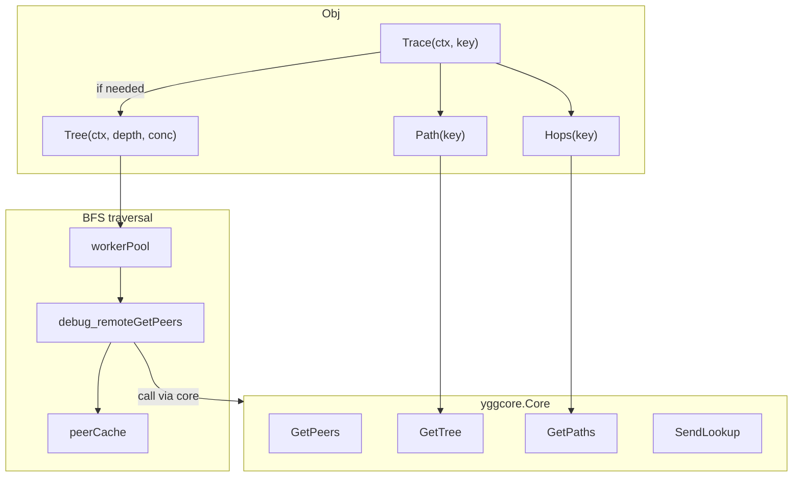
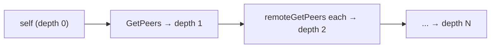
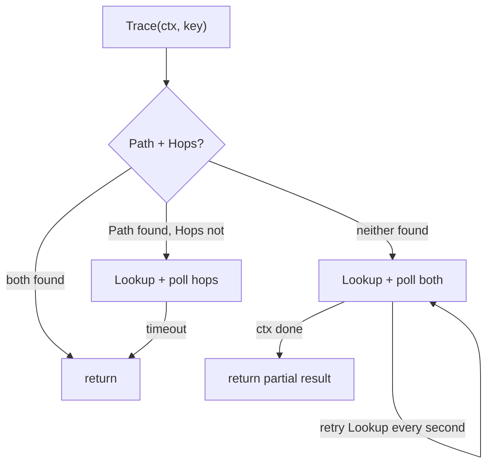

# mod/probe

Yggdrasil network topology exploration. Builds a peer tree via BFS, finds routes through spanning tree and
pathfinder —
without requiring an admin socket.

## Contents

- [Overview](#overview)
- [Initialization](#initialization)
- [Topology exploration](#topology-exploration)
    - [Tree](#tree)
    - [TreeChan](#treechan)
- [Route lookup](#route-lookup)
    - [Path](#path)
    - [Hops](#hops)
    - [Trace](#trace)
- [Node information](#node-information)
- [Caching](#caching)
- [Configurable parameters](#configurable-parameters)
- [Data structures](#data-structures)
- [Errors](#errors)

---

## Overview



---

## Initialization

```go
p, err := probe.New(coreNode, logger)
defer p.Close()
```

Resource limits (per-node peer cap, total-node cap, concurrency, cache TTL, timeouts) are fixed internal defaults:
topology data comes from untrusted remote nodes, so those bounds are package constants rather than caller knobs.

`New` intercepts the `debug_remoteGetPeers` handler from `core.ProbeSourceInterface` via a fake admin socket. This
allows querying
remote nodes without a real admin socket.

`Close` waits for in-flight remote peer queries, then stops the background cache cleanup goroutine.

---

## Topology exploration

### Tree

```go
result, err := p.Tree(ctx, maxDepth, concurrency)
// result.Root      — root node (self)
// result.Total     — total number of discovered nodes
// result.Truncated — true if MaxTotalNodes stopped traversal
```

BFS traversal of the network from the current node. At each depth level, peers of remote nodes are queried in parallel
via a worker pool.



- `maxDepth` — maximum BFS depth (required, > 0)
- `concurrency` — worker pool size (0 → 16 by default)
- `ConfigObj.MaxConcurrency` caps the requested worker pool size
- Nodes that did not respond or exceeded `ConfigObj.MaxPeersPerNode` are marked as `Unreachable`
- Traversal stops at `ConfigObj.MaxTotalNodes`; `TreeResultObj.Truncated` reports this condition
- Duplicates are filtered by public key

### TreeChan

```go
ch := make(chan probe.TreeProgressObj)
result, err := p.TreeChan(ctx, maxDepth, concurrency, ch)
```

Same as `Tree`, but sends progress to a channel after each depth level:

```go
type TreeProgressObj struct {
Depth     int // current level
Found     int // found at this level
Total     int // total found
Done      bool // true on the last message
Truncated bool // true if MaxTotalNodes stopped traversal
Limit     int  // configured MaxTotalNodes
}
```

---

## Route lookup

### Path

```go
nodes, err := p.Path(key) // [root, ..., target]
```

Returns the path from the spanning tree root to the target node. Builds the tree from `core.GetTree()` and searches for
the key recursively.

### Hops

```go
hops, err := p.Hops(key)
```

Returns the port-level route from the pathfinder (`core.GetPaths()`). Requires a prior `Lookup(key)`.

```go
type HopObj struct {
Key   ed25519.PublicKey // nil if port did not resolve
Port  uint64
Index int
}
```

### Trace

```go
result, err := p.Trace(ctx, key)
// result.TreePath — path via spanning tree (may be nil)
// result.Hops     — route via pathfinder (may be nil)
```

Comprehensive route lookup. Combines multiple strategies:



- If both are found immediately — returns right away
- If the path exists but hops are missing — performs `Lookup` and polls with `HopsWaitTimeout`
- If neither is found — full cycle with repeated `Lookup` every `LookupRetryEvery`
- RTT is populated for intermediate nodes via remote calls

---

## Node information

| Method           | Returns                   | Description              |
|------------------|---------------------------|--------------------------|
| `Self()`         | `yggcore.SelfInfo`        | Information about self   |
| `Address()`      | `net.IP`                  | Node IPv6 address        |
| `Subnet()`       | `net.IPNet`               | `/64` subnet             |
| `Peers()`        | `[]yggcore.PeerInfo`      | List of peers            |
| `Sessions()`     | `[]yggcore.SessionInfo`   | Active sessions          |
| `SpanningTree()` | `[]yggcore.TreeEntryInfo` | Spanning tree entries    |
| `Paths()`        | `[]yggcore.PathEntryInfo` | Pathfinder routes        |
| `Lookup(key)`    | —                         | Initiates route lookup   |
| `FlushCache()`   | —                         | Flushes peer query cache |
| `CacheTTL()`     | `time.Duration`           | Current peer cache TTL   |

---

## Caching

Results of `debug_remoteGetPeers` are cached by the node's public key. The cache is automatically cleaned every
configured `CacheTTL/2`.
Unreachable nodes (those that did not respond) are cached as `nil` — a repeated request within the TTL will immediately
return `ErrNodeUnreachable`.

The cleanup goroutine is owned by `Obj` and stops on `Close`.

---

## Resource limits

Topology-probing limits are fixed internal defaults (a probe is cheap to re-instantiate, and its inputs come from
untrusted remote nodes, so the bounds are not caller-tunable):

| Constant                 | Description                                             | Default |
|--------------------------|---------------------------------------------------------|---------|
| `DefaultMaxPeersPerNode` | Per-node peer limit; exceeding it → `Unreachable`       | `1024`  |
| `DefaultMaxTotalNodes`   | Maximum discovered nodes in `Tree`, excluding root      | `4096`  |
| `DefaultMaxConcurrency`  | Maximum concurrent remote peer queries during `Tree`    | `256`   |
| cache TTL                | Peer query cache entry time-to-live                     | `60s`   |
| poll interval            | Core polling interval in `Trace`                        | `200ms` |
| lookup retry             | `SendLookup` retry interval in `Trace`                  | `1s`    |
| hops wait timeout        | Hops wait timeout when tree path is already found       | `2s`    |
| max duration             | Internal wall-clock cap for `Tree` without ctx deadline | `5m`    |

---

## Data structures

### NodeObj

A node in the topology tree.

| Field         | Type                | Description                            |
|---------------|---------------------|----------------------------------------|
| `Key`         | `ed25519.PublicKey` | Node public key                        |
| `Parent`      | `ed25519.PublicKey` | Parent key                             |
| `Sequence`    | `uint64`            | Sequence number (spanning tree)        |
| `Depth`       | `int`               | Distance from root                     |
| `RTT`         | `time.Duration`     | Response time                          |
| `Unreachable` | `bool`              | Did not respond to request (Tree only) |
| `Children`    | `[]*NodeObj`        | Child nodes                            |

Methods: `Find(key)`, `Flatten()`, `PathTo(key)`.

### TreeResultObj

```go
type TreeResultObj struct {
Root      *NodeObj // root node (self)
Total     int      // total discovered nodes
Truncated bool     // true if MaxTotalNodes stopped traversal
Limit     int // configured MaxTotalNodes
}
```

### TraceResultObj

```go
type TraceResultObj struct {
TreePath []*NodeObj // path via spanning tree
Hops     []HopObj  // route via pathfinder
}
```

---

## Errors

| Variable                       | Description                                    |
|--------------------------------|------------------------------------------------|
| `ErrCoreRequired`              | Core not provided to `New`                     |
| `ErrInvalidConfig`             | Per-node peer limit is not positive            |
| `ErrRemotePeersNotCaptured`    | `debug_remoteGetPeers` handler not intercepted |
| `ErrMaxDepthRequired`          | `maxDepth` must be > 0                         |
| `ErrPeersPerNodeLimitExceeded` | Remote node reported too many valid peers      |
| `ErrInvalidKeyLength`          | Public key is not 32 bytes                     |
| `ErrKeyNotInTree`              | Key not found in spanning tree                 |
| `ErrNoActivePath`              | No active route in pathfinder                  |
| `ErrNodeUnreachable`           | Node is unreachable (cached)                   |
| `ErrRemotePeersDisabled`       | `debug_remoteGetPeers` is unavailable          |
| `ErrTreeEmpty`                 | Spanning tree entries are empty                |
| `ErrNoRoot`                    | No root node in tree                           |
| `ErrLookupTimedOut`            | Route lookup timed out                         |
