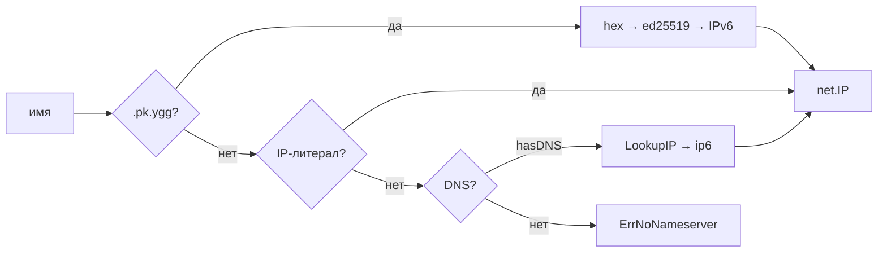

# mod/resolver

Резолвер имён для Yggdrasil. Поддерживает три стратегии разрешения: `.pk.ygg` маппинг публичных ключей, IP-литералы и
DNS-запросы через Yggdrasil-сеть.

## Содержание

- [Обзор](#обзор)
- [Инициализация](#инициализация)
- [Разрешение имён](#разрешение-имён)
    - [Порядок стратегий](#порядок-стратегий)
    - [.pk.ygg маппинг](#pkygg-маппинг)
    - [IP-литералы](#ip-литералы)
    - [DNS](#dns)
- [Ошибки](#ошибки)

---

## Обзор



---

## Инициализация

```go
r := resolver.New(dialer, "200::1:53") // DNS через Yggdrasil
r := resolver.New(dialer, "") // без DNS, только .pk.ygg и литералы
```

| Параметр     | Описание                                              |
|--------------|-------------------------------------------------------|
| `dialer`     | `proxy.ContextDialer` — диалер для DNS-запросов       |
| `nameserver` | Адрес DNS-сервера (`host:port` или `host`, порт → 53) |

Если `nameserver` пустой — DNS-разрешение отключено, работают только `.pk.ygg` и IP-литералы.

Резолвер использует `PreferGo: true` (чистый Go DNS, без cgo).

---

## Разрешение имён

```go
ctx, ip, err := r.Resolve(ctx, "home.abc123def456.pk.ygg")
```

Возвращает `net.IP` и оригинальный `ctx` (для передачи значений через цепочку).

### Порядок стратегий

Стратегии пробуются по убыванию специфичности:

1. **`.pk.ygg`** — если имя заканчивается на `.pk.ygg`
2. **IP-литерал** — если имя парсится как IP-адрес
3. **DNS** — если настроен nameserver

Первая успешная стратегия побеждает.

### .pk.ygg маппинг

Суффикс: `NameMappingSuffix = ".pk.ygg"`

```
<hex-encoded-ed25519-key>.pk.ygg → IPv6 через address.AddrForKey()
```

Поддомены допускаются — используется только последний сегмент перед `.pk.ygg`:

```
subdomain.abc123...def456.pk.ygg → берётся abc123...def456
```

Ключ должен быть ровно 32 байта после hex-декодирования.

### IP-литералы

IPv4 и IPv6 адреса возвращаются как есть:

```
200::1       → net.IP{200::1}
192.168.1.1  → net.IP{192.168.1.1}
```

### DNS

IPv6-резолвинг через настроенный nameserver. Если nameserver не задан — возвращается `ErrNoNameserver`.

```go
r.resolver.LookupIP(ctx, "ip6", name)
```

Возвращает первый найденный адрес. Если адресов нет — `ErrNoAddresses`.

---

## Ошибки

| Переменная            | Описание                     |
|-----------------------|------------------------------|
| `ErrNoNameserver`     | DNS-сервер не настроен       |
| `ErrNoAddresses`      | DNS-запрос не вернул адресов |
| `ErrInvalidKeyLength` | Публичный ключ не 32 байта   |
