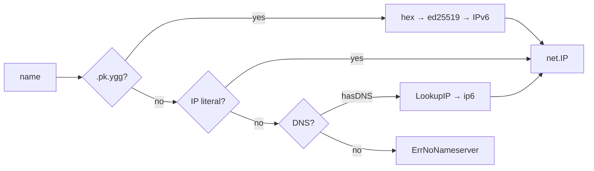

# mod/resolver

Name resolver for Yggdrasil. Supports three resolution strategies: `.pk.ygg` public key mapping, IP literals, and
DNS queries over the Yggdrasil network.

## Contents

- [Overview](#overview)
- [Initialization](#initialization)
- [Name resolution](#name-resolution)
  - [Strategy order](#strategy-order)
  - [.pk.ygg mapping](#pkygg-mapping)
  - [IP literals](#ip-literals)
    - [DNS](#dns)
- [Errors](#errors)

---

## Overview



---

## Initialization

```go
r := resolver.New(resolver.ConfigObj{
    Dialer:     dialer,
    Nameserver: "[200::1]:53", // DNS over Yggdrasil
})
r := resolver.New(resolver.ConfigObj{}) // no DNS, only .pk.ygg and literals
r := resolver.New(resolver.ConfigObj{
Dialer:               dialer,
Nameserver:           "[200::1]:53",
LookupTimeout:   10 * time.Second,
CacheTTL:        30 * time.Second,
CacheMaxEntries: 4096,
})
```

If `nameserver` is empty — DNS resolution is disabled, only `.pk.ygg` and IP literals work.

The resolver uses `PreferGo: true` (pure Go DNS, no cgo).

`ConfigObj` is optional. Defaults are safe for embedded use:

| Field                  | Default | Description                                              |
|------------------------|---------|----------------------------------------------------------|
| `LookupTimeout`        | `10s`   | DNS lookup timeout. `0` — default, `<0` uses hard cap    |
| `CacheTTL`             | `30s`   | Positive DNS cache TTL. `0` — default, `<0` off          |
| `CacheMaxEntries`      | `4096`  | Positive DNS cache cap. `0` — default, `<0` off          |

Concurrency of DNS lookups is bounded by the caller (the SOCKS connection limit) and by singleflight collapsing
duplicate in-flight names, so the resolver has no separate lookup limiter.

---

## Name resolution

```go
ctx, ip, err := r.Resolve(ctx, "a7aa9d653b0259c67a211e7a6ccd281219db1246c75e4ebcf9edbdbdaff55924.pk.ygg")
```

Returns `net.IP` and the original `ctx` (for passing values through the chain).

### Strategy order

Strategies are tried in decreasing order of specificity:

1. **`.pk.ygg`** — if the name ends with `.pk.ygg`
2. **IP literal** — if the name parses as an IP address
3. **DNS** — if a nameserver is configured

The first successful strategy wins.

### .pk.ygg mapping

Suffix: `.pk.ygg`

```
<hex-encoded-ed25519-key>.pk.ygg → IPv6 via address.AddrForKey()
```

Only the canonical `<64hex>.pk.ygg` form is accepted. Subdomains such as `name.<64hex>.pk.ygg` are rejected.
The key must be exactly 32 bytes after hex decoding.

### Settings

`LookupTimeout` and `CacheTTL` are immutable: set them once through `ConfigObj` at `New`. The getters
`LookupTimeout()` and `CacheTTL()` expose the current values; to change them, create a new resolver. `LookupTimeout < 0`
uses the hard safety cap instead of disabling the deadline. `CacheTTL < 0` disables caching entirely. Failed DNS lookups
are cached for a short bounded TTL to avoid repeated timeout amplification while a nameserver is down.

### IP literals

IPv4 and IPv6 addresses are returned as-is:

```
200::1       → net.IP{200::1}
192.168.1.1  → net.IP{192.168.1.1}
```

### DNS

IPv6 resolution via the configured nameserver. If no nameserver is set — `ErrNoNameserver` is returned.

```go
r.resolver.LookupIP(ctx, "ip6", name)
```

Returns the first address found. If no addresses are found — `ErrNoAddresses`.

---

## Errors

| Variable                    | Description                                      |
|-----------------------------|--------------------------------------------------|
| `ErrNoNameserver`           | DNS server is not configured                     |
| `ErrNoAddresses`            | DNS query returned no addresses                  |
| `ErrDialerRequired`         | DNS is configured without a dialer               |
| `ErrInvalidPublicKeyDomain` | `.pk.ygg` public key domain is invalid           |
| `ErrInvalidKeyLength`       | Public key is not 32 bytes                       |
