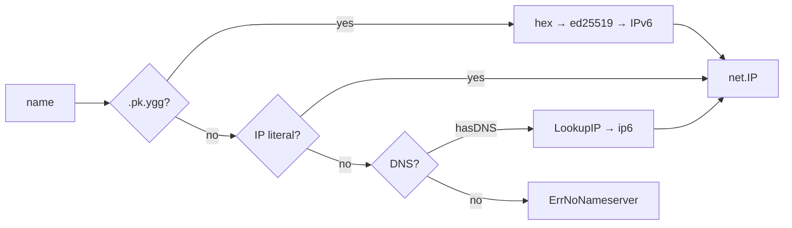

# mod/resolver

Name resolver for Yggdrasil. Supports three resolution strategies: `.pk.ygg` public key mapping, IP literals, and
DNS queries over the Yggdrasil network.

## Contents

- [Overview](#overview)
- [Initialization](#initialization)
- [Name resolution](#name-resolution)
  - [Strategy order](#strategy-order)
  - [.pk.ygg mapping](#pkygg-mapping)
  - [IP literals](#ip-literals)
    - [DNS](#dns)
- [Errors](#errors)

---

## Overview



---

## Initialization

```go
r := resolver.New(dialer, "200::1:53") // DNS over Yggdrasil
r := resolver.New(dialer, "") // no DNS, only .pk.ygg and literals
```

| Parameter    | Description                                           |
|--------------|-------------------------------------------------------|
| `dialer`     | `proxy.ContextDialer` — dialer for DNS queries        |
| `nameserver` | DNS server address (`host:port` or `host`, port → 53) |

If `nameserver` is empty — DNS resolution is disabled, only `.pk.ygg` and IP literals work.

The resolver uses `PreferGo: true` (pure Go DNS, no cgo).

---

## Name resolution

```go
ctx, ip, err := r.Resolve(ctx, "home.abc123def456.pk.ygg")
```

Returns `net.IP` and the original `ctx` (for passing values through the chain).

### Strategy order

Strategies are tried in decreasing order of specificity:

1. **`.pk.ygg`** — if the name ends with `.pk.ygg`
2. **IP literal** — if the name parses as an IP address
3. **DNS** — if a nameserver is configured

The first successful strategy wins.

### .pk.ygg mapping

Suffix: `NameMappingSuffix = ".pk.ygg"`

```
<hex-encoded-ed25519-key>.pk.ygg → IPv6 via address.AddrForKey()
```

Subdomains are allowed — only the last segment before `.pk.ygg` is used:

```
subdomain.abc123...def456.pk.ygg → abc123...def456 is taken
```

The key must be exactly 32 bytes after hex decoding.

### IP literals

IPv4 and IPv6 addresses are returned as-is:

```
200::1       → net.IP{200::1}
192.168.1.1  → net.IP{192.168.1.1}
```

### DNS

IPv6 resolution via the configured nameserver. If no nameserver is set — `ErrNoNameserver` is returned.

```go
r.resolver.LookupIP(ctx, "ip6", name)
```

Returns the first address found. If no addresses are found — `ErrNoAddresses`.

---

## Errors

| Variable              | Description                     |
|-----------------------|---------------------------------|
| `ErrNoNameserver`     | DNS server is not configured    |
| `ErrNoAddresses`      | DNS query returned no addresses |
| `ErrInvalidKeyLength` | Public key is not 32 bytes      |
