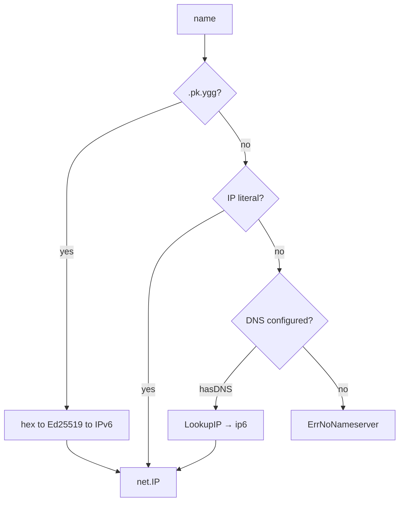

# Resolver

Package `resolver` supports `.pk.ygg` public-key mapping, IP literals, and DNS
queries carried over a caller-supplied Yggdrasil dialer.

The zero configuration resolves key domains and literals without starting DNS.
DNS uses a 10-second default lookup deadline, a 30-second positive cache, a
3-second maximum negative-cache TTL, 4096 cache entries, and at most 256
distinct in-flight names.

## Contents

- [Overview](#overview)
- [Initialization](#initialization)
- [Name resolution](#name-resolution)
  - [Strategy order](#strategy-order)
  - [.pk.ygg mapping](#pkygg-mapping)
  - [IP literals](#ip-literals)
  - [DNS](#dns)
- [Concurrency and cache](#concurrency-and-cache)
- [Shutdown](#shutdown)
- [Errors](#errors)

---

## Overview



---

## Initialization

```go
r, err := resolver.New(resolver.ConfigObj{
    Dialer:         dialer,
    Nameserver:     "[200::1]:53", // DNS over Yggdrasil
    LookupTimeout:   10 * time.Second,
    CacheTTL:        30 * time.Second,
    CacheMaxEntries: 4096,
})
if err != nil {
    return err
}
defer func() { _ = r.Close() }()
```

If `Nameserver` is empty, DNS resolution is disabled and `Dialer` is optional. If `Nameserver` is set, `Dialer` is
mandatory and `New` returns `ErrDialerRequired` before creating an object when it is missing.

The resolver uses `PreferGo: true` (pure Go DNS, no cgo).

The zero `ConfigObj` is valid and resolves only IP literals and `.pk.ygg` names. DNS additionally requires both fields
shown below. Timing and cache settings have safe defaults for embedded use:

| Field             | Default | Description                                                               |
|-------------------|---------|---------------------------------------------------------------------------|
| `Dialer`          | `nil`   | Required when `Nameserver` is non-empty                                   |
| `Nameserver`      | empty   | DNS server address; empty disables DNS                                    |
| `LookupTimeout`   | `10s`   | DNS lookup timeout. `0` uses default; `<0` disables the resolver deadline |
| `CacheTTL`        | `30s`   | Positive DNS cache TTL. `0` uses the default; `<0` disables it            |
| `CacheMaxEntries` | `4096`  | Positive DNS cache cap. `0` uses the default; `<0` disables it            |

---

## Name resolution

```go
ctx, ip, err := r.Resolve(ctx, "a7aa9d653b0259c67a211e7a6ccd281219db1246c75e4ebcf9edbdbdaff55924.pk.ygg")
```

Returns `net.IP` and the original `ctx` (for passing values through the chain).

### Strategy order

Strategies are tried in decreasing order of specificity:

1. **`.pk.ygg`:** if the name ends with `.pk.ygg`
2. **IP literal:** if the name parses as an IP address
3. **DNS:** if a nameserver is configured

The first successful strategy wins.

### .pk.ygg mapping

Suffix: `.pk.ygg`

```
<hex-encoded-ed25519-key>.pk.ygg → IPv6 via address.AddrForKey()
```

Only the canonical `<64hex>.pk.ygg` form is accepted. Subdomains such as `name.<64hex>.pk.ygg` are rejected.
The key must be exactly 32 bytes after hex decoding.

### IP literals

IPv4 and IPv6 addresses are returned as-is:

```
200::1       → net.IP{200::1}
192.168.1.1  → net.IP{192.168.1.1}
```

### DNS

IPv6 resolution uses the configured nameserver. If no nameserver is set, the resolver returns `ErrNoNameserver`.

```go
r.resolver.LookupIP(ctx, "ip6", name)
```

Returns the first Yggdrasil node address (`200::/7`) or routed subnet address (`300::/7`). Other DNS answers are
ignored; if the response has addresses but none belongs to either Yggdrasil form, resolution returns
`ErrNonYggdrasilAddress`. IP literals remain pass-through and are not filtered.

## Concurrency and cache

Callers resolving the same normalized name share one DNS lookup. Canceling one
caller detaches that waiter without canceling work used by others. A new distinct
name beyond the 256-flight cap returns `ErrLookupBusy`; joining an existing
flight remains allowed.

Positive results use `CacheTTL`. Failed lookups use the smaller of `CacheTTL`
and 3 seconds. The cache is bounded but deliberately not LRU: inserting a new
key into a full cache evicts one arbitrary entry, avoiding a second ordering
structure. Returned `net.IP` values are copied, so caller mutation cannot alter
cached results.

All configuration is immutable. Create another resolver to change the dialer,
nameserver, timeout, or cache settings.

## Shutdown

`Close() error` marks the resolver closed, cancels admitted DNS work, and waits
for owned lookup goroutines. It is idempotent. Calls after shutdown return
`ErrClosed`.

---

## Errors

| Variable                    | Description                             |
|-----------------------------|-----------------------------------------|
| `ErrNoNameserver`           | DNS server is not configured            |
| `ErrNoAddresses`            | DNS query returned no addresses         |
| `ErrDialerRequired`         | DNS is configured without a dialer      |
| `ErrInvalidPublicKeyDomain` | `.pk.ygg` public key domain is invalid  |
| `ErrInvalidKeyLength`       | Public key is not 32 bytes              |
| `ErrNonYggdrasilAddress`    | DNS response is not a Yggdrasil address |
| `ErrLookupBusy`             | Too many concurrent distinct lookups    |
| `ErrClosed`                 | Resolver has been closed                |
