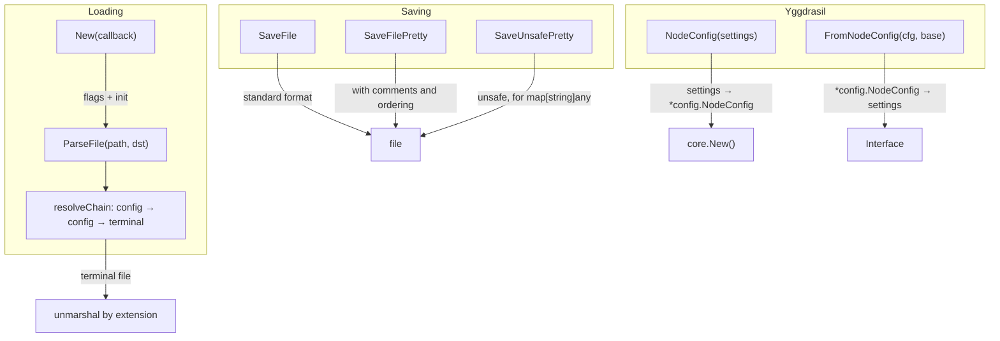
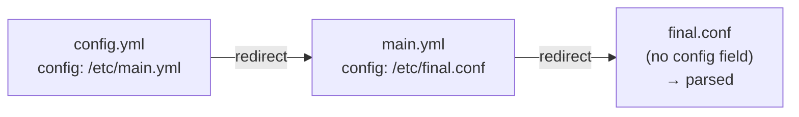

# mod/settings

Loading, parsing, and saving configuration. Supports JSON, YAML, HJSON with redirect chains, comments,
and ordered fields.

## Table of Contents

- [Overview](#overview)
- [Initialization](#initialization)
- [Loading Configuration](#loading-configuration)
    - [ParseFile](#parsefile)
  - [Redirect Chains](#redirect-chains)
- [Saving Configuration](#saving-configuration)
    - [SaveFile](#savefile)
    - [SaveFilePretty](#savefilepretty)
    - [SaveUnsafePretty](#saveunsafepretty)
- [Yggdrasil Integration](#yggdrasil-integration)
    - [NodeConfig](#nodeconfig)
    - [FromNodeConfig](#fromnodeconfig)
- [Helper Functions](#helper-functions)
- [Supported Formats](#supported-formats)

---

## Overview



---

## Initialization

```go
err := settings.New(func (s settings.Interface) error {
// s is ready to use
return runApp(s)
})
```

`New` parses command-line flags and initializes the configuration. If the user requested help/info, it returns
`nil`
without invoking the callback.

---

## Loading Configuration

### ParseFile

```go
err := settings.ParseFile("/etc/ratatoskr/config.yml", dst)
```

Loads configuration from a file. If the file contains a `config` field, it is a redirect, and `ParseFile` follows the
chain until
a terminal file is reached.

### Redirect Chains

A file with a `config` field is a reference to another configuration file. All other fields in a redirect file are
ignored.



Limitations:

- Maximum **32 hops** — protection against infinite chains
- Circular references are detected and return an error
- Only the terminal file (without `config`) is parsed; intermediate files are completely ignored

---

## Saving Configuration

### SaveFile

```go
path, err := settings.SaveFile(src, "/etc/ratatoskr", settings.GoConfExportFormatJson)
```

Standard saving without field ordering or comments. The `config` field is automatically removed from the output
data.

### SaveFilePretty

```go
path, err := settings.SaveFilePretty(src, "/etc/ratatoskr", settings.GoConfExportFormatYml)
```

Saving with human-readable formatting:

- Fields are ordered by `gsettings.FieldOrder`
- Comments from `gsettings.Comments` are injected into the output file
- The `config` field is removed

### SaveUnsafePretty

```go
path, err := settings.SaveUnsafePretty(data, dir, format)
```

Similar to `SaveFilePretty`, but accepts `any` instead of `Interface`. For `map[string]any`, field ordering is applied.
Unsafe because there is no compile-time type checking.

---

## Yggdrasil Integration

### NodeConfig

```go
cfg, err := settings.NodeConfig(s.GetYggdrasil())
```

Creates a `*config.NodeConfig` from settings:

- `key.text` is decoded from hex to bytes
- If `peers.manager.enable == true` — the peer list is cleared (delegated to the manager)
- If `peers.manager.enable == false` — the static list from `peers.url` is used
- Only the first element of `MulticastInterfaces` is mapped

### FromNodeConfig

```go
newSettings := settings.FromNodeConfig(cfg, baseSettings)
```

Creates a new `Interface` from `*config.NodeConfig` and base settings. The base object is not mutated — a copy
is created with the yggdrasil branch overwritten.

---

## Helper Functions

| Function                  | Description                                                  |
|---------------------------|--------------------------------------------------------------|
| `Obj(i Interface)`        | Extracts `*gsettings.Obj` from `Interface` (unsafe cast)     |
| `ValidateDir(path)`       | Validates/creates a directory, returns the absolute path     |
| `ConfigPath(dir, format)` | Builds a path: `dir/GlobalName.ext`                          |
| `FormatExt(format)`       | Format → extension (`.json`, `.yml`, `.conf`)                |
| `StripRootKey(data, key)` | Removes a root-level key from serialized data (line by line) |

---

## Supported Formats

| Extension         | Format |
|-------------------|--------|
| `.json`           | JSON   |
| `.yml`, `.yaml`   | YAML   |
| `.hjson`, `.conf` | HJSON  |
