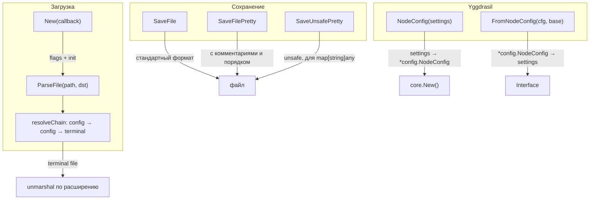
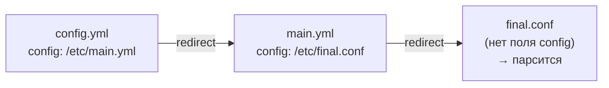

# mod/settings

Загрузка, парсинг и сохранение конфигурации. Поддерживает JSON, YAML, HJSON с цепочками редиректов, комментариями
и упорядоченными полями.

## Содержание

- [Обзор](#обзор)
- [Инициализация](#инициализация)
- [Загрузка конфигурации](#загрузка-конфигурации)
    - [ParseFile](#parsefile)
    - [Цепочки редиректов](#цепочки-редиректов)
- [Сохранение конфигурации](#сохранение-конфигурации)
    - [SaveFile](#savefile)
    - [SaveFilePretty](#savefilepretty)
    - [SaveUnsafePretty](#saveunsafepretty)
- [Интеграция с Yggdrasil](#интеграция-с-yggdrasil)
    - [NodeConfig](#nodeconfig)
    - [FromNodeConfig](#fromnodeconfig)
- [Вспомогательные функции](#вспомогательные-функции)
- [Поддерживаемые форматы](#поддерживаемые-форматы)

---

## Обзор



---

## Инициализация

```go
err := settings.New(func (s settings.Interface) error {
// s готов к использованию
return runApp(s)
})
```

`New` парсит флаги командной строки и инициализирует конфигурацию. Если пользователь запросил help/info — возвращает
`nil`
без вызова колбэка.

---

## Загрузка конфигурации

### ParseFile

```go
err := settings.ParseFile("/etc/ratatoskr/config.yml", dst)
```

Загружает конфигурацию из файла. Если файл содержит поле `config` — это редирект, и `ParseFile` следует по цепочке до
терминального файла.

### Цепочки редиректов

Файл с полем `config` — это ссылка на другой конфигурационный файл. Все остальные поля в файле-редиректе игнорируются.



Ограничения:

- Максимум **32 хопа** — защита от бесконечных цепочек
- Циклические ссылки обнаруживаются и возвращают ошибку
- Только терминальный файл (без `config`) парсится; промежуточные файлы полностью игнорируются

---

## Сохранение конфигурации

### SaveFile

```go
path, err := settings.SaveFile(src, "/etc/ratatoskr", settings.GoConfExportFormatJson)
```

Стандартное сохранение без упорядочивания полей и комментариев. Поле `config` автоматически удаляется из выходных
данных.

### SaveFilePretty

```go
path, err := settings.SaveFilePretty(src, "/etc/ratatoskr", settings.GoConfExportFormatYml)
```

Сохранение с читабельным форматированием:

- Поля упорядочены по `gsettings.FieldOrder`
- Комментарии из `gsettings.Comments` инжектируются в выходной файл
- Поле `config` удаляется

### SaveUnsafePretty

```go
path, err := settings.SaveUnsafePretty(data, dir, format)
```

Аналог `SaveFilePretty`, но принимает `any` вместо `Interface`. Для `map[string]any` применяет упорядочивание полей.
Unsafe потому что нет compile-time проверки типов.

---

## Интеграция с Yggdrasil

### NodeConfig

```go
cfg, err := settings.NodeConfig(s.GetYggdrasil())
```

Создаёт `*config.NodeConfig` из настроек:

- `key.text` декодируется из hex в байты
- Если `peers.manager.enable == true` — список пиров обнуляется (делегируется менеджеру)
- Если `peers.manager.enable == false` — используется статический список из `peers.url`
- Маппится только первый элемент `MulticastInterfaces`

### FromNodeConfig

```go
newSettings := settings.FromNodeConfig(cfg, baseSettings)
```

Создаёт новый `Interface` из `*config.NodeConfig` и базовых настроек. Базовый объект не мутируется — создаётся копия
с перезаписанной веткой yggdrasil.

---

## Вспомогательные функции

| Функция                   | Описание                                                      |
|---------------------------|---------------------------------------------------------------|
| `Obj(i Interface)`        | Извлекает `*gsettings.Obj` из `Interface` (unsafe cast)       |
| `ValidateDir(path)`       | Проверяет/создаёт директорию, возвращает абсолютный путь      |
| `ConfigPath(dir, format)` | Строит путь: `dir/GlobalName.ext`                             |
| `FormatExt(format)`       | Формат → расширение (`.json`, `.yml`, `.conf`)                |
| `StripRootKey(data, key)` | Удаляет root-level ключ из сериализованных данных (построчно) |

---

## Поддерживаемые форматы

| Расширение        | Формат |
|-------------------|--------|
| `.json`           | JSON   |
| `.yml`, `.yaml`   | YAML   |
| `.hjson`, `.conf` | HJSON  |
