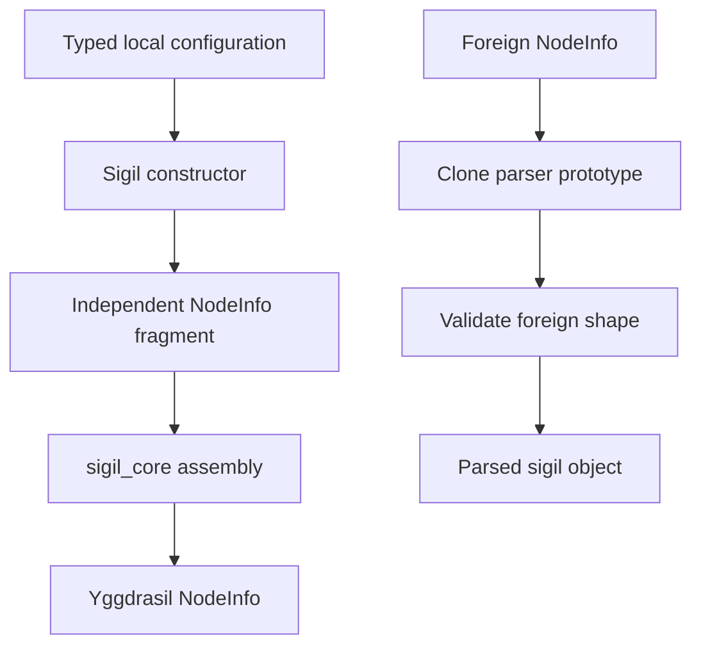

# mod/sigils

Typed, bounded fragments of Yggdrasil NodeInfo. A sigil defines its owned top-level keys, validates foreign JSON-shaped
data, carries parsed values, and produces independent copies across ownership boundaries.

## Contents

- [Data flow](#data-flow)
- [Interface contract](#interface-contract)
- [Creating a sigil](#creating-a-sigil)
- [Registration](#registration)
- [Ownership and concurrency](#ownership-and-concurrency)
- [Built-in sigils](#built-in-sigils)
- [Assembly](#assembly)

## Data flow



Yggdrasil bounds the complete NodeInfo payload to 16 KiB. The budget is shared by the base NodeInfo, every sigil, and
the Ratatoskr metadata key.

## Interface contract

```go
type Interface interface {
    GetName() string
    GetParams() []string
    ParseParams(map[string]any) map[string]any
    Match(map[string]any) bool
    Params() map[string]any
    Clone() Interface
}
```

| Method        | Contract                                               |
|---------------|--------------------------------------------------------|
| `GetName`     | returns a stable name matching `^[a-z0-9._-]{3,32}$`   |
| `GetParams`   | returns all owned top-level NodeInfo keys              |
| `ParseParams` | extracts owned keys and may update receiver data       |
| `Match`       | validates the complete foreign shape without panicking |
| `Params`      | returns an independent NodeInfo fragment               |
| `Clone`       | returns an independent schema and data carrier         |

Foreign NodeInfo is JSON-shaped. Arrays arrive as `[]any`, objects as `map[string]any`, and numbers as `float64`.
Implementations must reject wrong types at every nested level.

## Creating a sigil

A sigil package follows the established layout when each file remains meaningful:

```text
mod/sigils/<name>/
├── values.go
├── func.go
├── obj.go
├── access.go
├── <name>_test.go
└── README.md
```

Required behavior:

1. Bound every collection and string so untrusted NodeInfo cannot cause unbounded allocation.
2. Validate local construction and foreign parsing with the same value rules.
3. Accept actual JSON-decoded types in `Match` and `Parse`.
4. Never mutate caller maps or slices.
5. Deep-copy mutable data in `Params`, typed accessors, and `Clone`.
6. Return `false` or an error for malformed foreign data; never panic.
7. Treat a sigil object as unsynchronized mutable state when `ParseParams` changes it.

Built-ins expose package-level `Name`, `Keys`, `ParseParams`, `Match`, and `Parse` functions, plus `SetParams` and typed
accessors on `Obj`. `SetParams` is a convenience API outside `Interface`; assembly uses `Params` directly.

## Registration

The generator in [`_generate/sigils`](../../_generate/sigils/README.md) discovers sigil directories and generates the
central registry under `target`. Generated files are not edited manually.

Add or rename a sigil by changing its own directory and running:

```bash
go generate .
```

The generator dependency intentionally uses `@latest`. Duplicate sigil names fail generation before a registry is
written.

## Ownership and concurrency

Sigil objects are data carriers, not synchronized stores. `ParseParams` may change the receiver. Do not call it
concurrently with `Params`, `Clone`, or a typed accessor on the same object.

Use `Clone` when two components need independent mutable state. Built-in constructors, accessors, `Params`, and `Clone`
copy all maps and slices. Third-party implementations must provide the same ownership guarantee.

`sigil_core.Obj` is separately synchronized and stores clones of registered sigils.
See [sigil_core](sigil_core/README.md).

## Built-in sigils

| Sigil      | Owned NodeInfo keys                                  | Primary bounds                        | Documentation                  |
|------------|------------------------------------------------------|---------------------------------------|--------------------------------|
| `info`     | `name`, `type`, `location`, `contact`, `description` | 8 contact groups, 8 entries per group | [info](info/README.md)         |
| `inet`     | `inet`                                               | 32 unique addresses                   | [inet](inet/README.md)         |
| `public`   | `public`                                             | 8 groups, 16 URIs per group           | [public](public/README.md)     |
| `services` | `services`                                           | 256 named ports                       | [services](services/README.md) |

The table is an index. Each sigil README contains its exact JSON shape, regular expressions, numeric ranges, parsing
behavior, ownership contract, and examples.

## Assembly

Use [`sigil_core`](sigil_core/README.md) to combine a base NodeInfo map with sigils and maintain the Ratatoskr metadata
key:

```go
builder, errs := sigil_core.New(baseNodeInfo, infoSigil, servicesSigil)
if len(errs) != 0 {
    return errors.Join(errs...)
}
nodeInfo := builder.NodeInfo()
```

`sigils.MergeParams` is the lower-level helper for a single fragment. It copies the top-level map and rejects key
conflicts.
