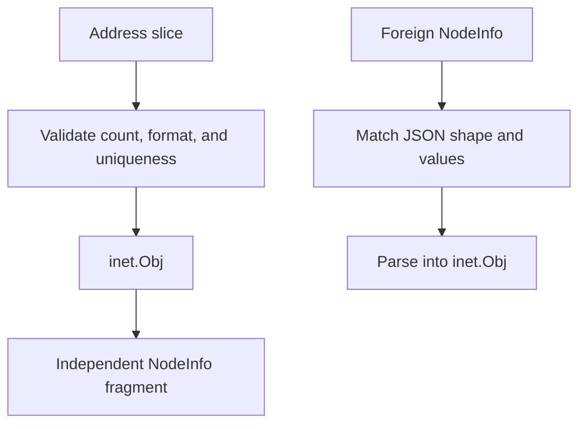

# inet sigil

The `inet` sigil publishes up to 32 public Internet addresses associated with a Yggdrasil node. It accepts hostnames,
IPv4 or IPv6 text, and URI-like address strings that match its bounded character set.

## Contents

- [NodeInfo shape](#nodeinfo-shape)
- [Validation](#validation)
- [Construction](#construction)
- [Foreign NodeInfo](#foreign-nodeinfo)
- [Ownership and concurrency](#ownership-and-concurrency)
- [API](#api)
- [Example](#example)

## NodeInfo shape

The sigil owns the top-level `inet` key:

```json
{
  "inet": [
    "example.com",
    "203.0.113.10",
    "2001:db8::10"
  ]
}
```



## Validation

| Constraint         | Value                                        |
|--------------------|----------------------------------------------|
| Address count      | 1 to 32                                      |
| Address length     | 4 to 256 bytes                               |
| Allowed characters | `a-z`, `A-Z`, `0-9`, `.`, `_`, `:`, `/`, `-` |
| Duplicates         | rejected                                     |

The exact expression is `^[a-zA-Z0-9._:/-]{4,256}$`. This is syntax validation, not DNS resolution or IP parsing.
Brackets, whitespace, query strings, and non-ASCII characters are rejected.

## Construction

```go
inetSigil, err := inet.New([]string{
    "edge.example.com",
    "203.0.113.10",
})
if err != nil {
    return err
}
```

`New` validates and copies the slice. Later mutations of the input do not affect the object.

## Foreign NodeInfo

JSON decoding produces `[]any` containing strings. `Match` and `Parse` also accept the native `[]string` form produced
by local Go code.

- `Match` returns `false` for a missing key, an empty list, a wrong type, a non-string element, an invalid address, a
  duplicate, or more than 32 entries.
- package-level `ParseParams` extracts the `inet` key without validation;
- package-level `Parse` validates the extracted value and returns an error on malformed data;
- `(*Obj).ParseParams` returns the extracted fragment and updates the receiver only when the complete value is valid.

## Ownership and concurrency

`New`, `Addrs`, `Params`, and `Clone` return or retain independent slices. `SetParams` copies the top-level NodeInfo map
through `sigils.MergeParams` and fails when `inet` already exists.

`Obj` is a mutable data carrier because `ParseParams` can replace its data. Do not call it concurrently with `Addrs`,
`Params`, or `Clone` on the same object. Clone the object before sharing independent mutable state.

## API

| API                                | Contract                                  |
|------------------------------------|-------------------------------------------|
| `Name()`                           | returns `"inet"`                          |
| `Keys()`                           | returns `[]string{"inet"}`                |
| `New([]string)`                    | validates and copies local data           |
| `Match(map[string]any)`            | validates foreign shape and values        |
| `Parse(map[string]any)`            | returns a validated object                |
| `ParseParams(map[string]any)`      | extracts the owned key                    |
| `(*Obj).Addrs()`                   | returns a copied address slice            |
| `(*Obj).Params()`                  | returns a copied NodeInfo fragment        |
| `(*Obj).SetParams(map[string]any)` | merges into a copied map                  |
| `(*Obj).Clone()`                   | returns an independent `sigils.Interface` |

`Obj` implements [`sigils.Interface`](../README.md#interface-contract).

## Example

```go
sigil, err := inet.New([]string{"edge.example.com"})
if err != nil {
    return err
}

nodeInfo, err := sigil.SetParams(map[string]any{"role": "edge"})
if err != nil {
    return err
}

parsed, err := inet.Parse(nodeInfo)
if err != nil {
    return err
}
fmt.Println(parsed.Addrs())
```
