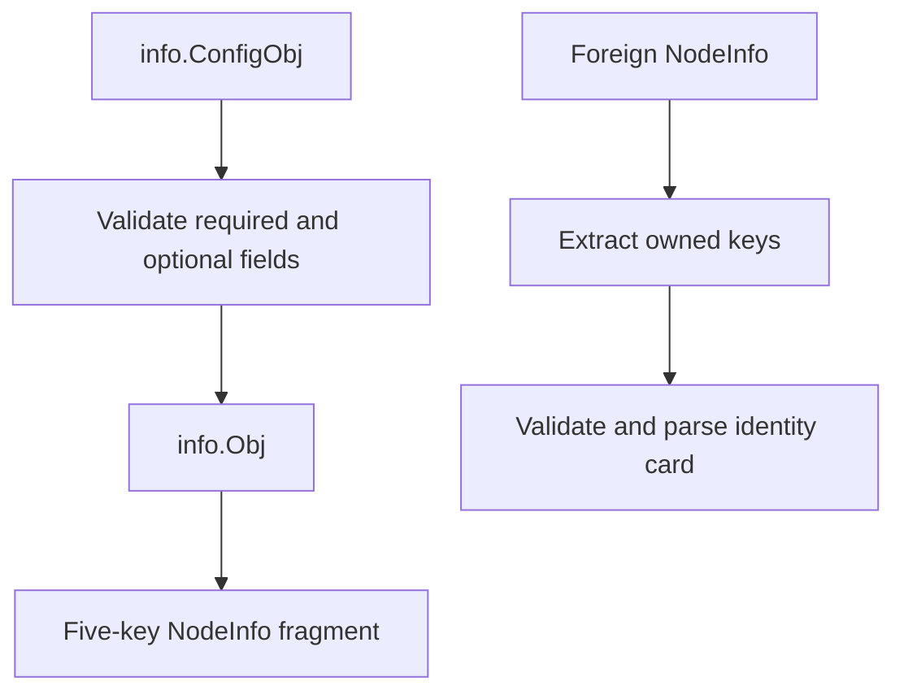

# info sigil

The `info` sigil publishes a bounded node identity card. Unlike the other built-ins, it owns five top-level NodeInfo
keys rather than a nested `info` object.

## Contents

- [NodeInfo shape](#nodeinfo-shape)
- [Configuration and validation](#configuration-and-validation)
- [Construction](#construction)
- [Foreign NodeInfo](#foreign-nodeinfo)
- [Ownership and concurrency](#ownership-and-concurrency)
- [API](#api)
- [Example](#example)

## NodeInfo shape

```json
{
  "name": "edge.example.net",
  "type": "router",
  "location": "Warsaw, Poland",
  "contact": {
    "email": [
      "admin@example.net"
    ]
  },
  "description": "Public relay node"
}
```



## Configuration and validation

| Field         | Required     | Constraint                                             |
|---------------|--------------|--------------------------------------------------------|
| `Name`        | yes          | `^[a-z0-9._-]{4,64}$`                                  |
| `Type`        | yes          | `^[a-z0-9.-]{2,32}$`                                   |
| `Location`    | no           | 2 to 514 printable runes, no leading or trailing space |
| `Description` | no           | 2 to 514 printable runes, no leading or trailing space |
| `Contacts`    | no           | at most 8 groups with at most 8 contacts each          |
| contact group | when present | `^[a-z0-9.-]{2,32}$`                                   |
| contact value | when present | 3 to 258 printable runes, no leading or trailing space |

Empty optional strings and a nil contact map are omitted from NodeInfo. Empty contact groups are rejected.

## Construction

```go
infoSigil, err := info.New(info.ConfigObj{
    Name:     "edge.example.net",
    Type:     "router",
    Location: "Warsaw, Poland",
    Contacts: map[string][]string{
        "email": {"admin@example.net"},
    },
})
if err != nil {
    return err
}
```

`New` validates all fields and deep-copies the contact map.

## Foreign NodeInfo

`name` and `type` must both be present as strings. Optional text values must also be strings. JSON contacts must have
the shape `map[string]any` to `[]any` to `string`; native `map[string][]string` is accepted for local data.

- package-level `ParseParams` extracts the five owned keys and ignores unrelated data;
- `Match` validates the complete identity card;
- `Parse` returns an error for missing, malformed, or out-of-range fields;
- `(*Obj).ParseParams` returns the extracted keys and replaces current data only after full validation.

## Ownership and concurrency

`New`, `Info`, `Params`, and `Clone` deep-copy the contact map and slices. `SetParams` copies the top-level NodeInfo map
and fails if any populated info key already exists.

`Obj` is not synchronized. `ParseParams` is a mutation and must not run concurrently with `Info`, `Params`, or `Clone`
on the same object.

## API

| API                                | Contract                                  |
|------------------------------------|-------------------------------------------|
| `Name()`                           | returns `"info"`                          |
| `Keys()`                           | returns all five owned keys               |
| `New(ConfigObj)`                   | validates and copies local data           |
| `Match(map[string]any)`            | validates a foreign identity card         |
| `Parse(map[string]any)`            | returns a validated object                |
| `ParseParams(map[string]any)`      | extracts owned keys                       |
| `(*Obj).Info()`                    | returns a deep copy of `ConfigObj`        |
| `(*Obj).Params()`                  | returns a copied NodeInfo fragment        |
| `(*Obj).SetParams(map[string]any)` | merges populated keys into a copied map   |
| `(*Obj).Clone()`                   | returns an independent `sigils.Interface` |

`Obj` implements [`sigils.Interface`](../README.md#interface-contract).

## Example

```go
sigil, err := info.New(info.ConfigObj{
    Name: "edge.example.net",
    Type: "router",
})
if err != nil {
    return err
}

nodeInfo, err := sigil.SetParams(map[string]any{"operator": "example"})
if err != nil {
    return err
}

parsed, err := info.Parse(nodeInfo)
if err != nil {
    return err
}
fmt.Println(parsed.Info().Name)
```
