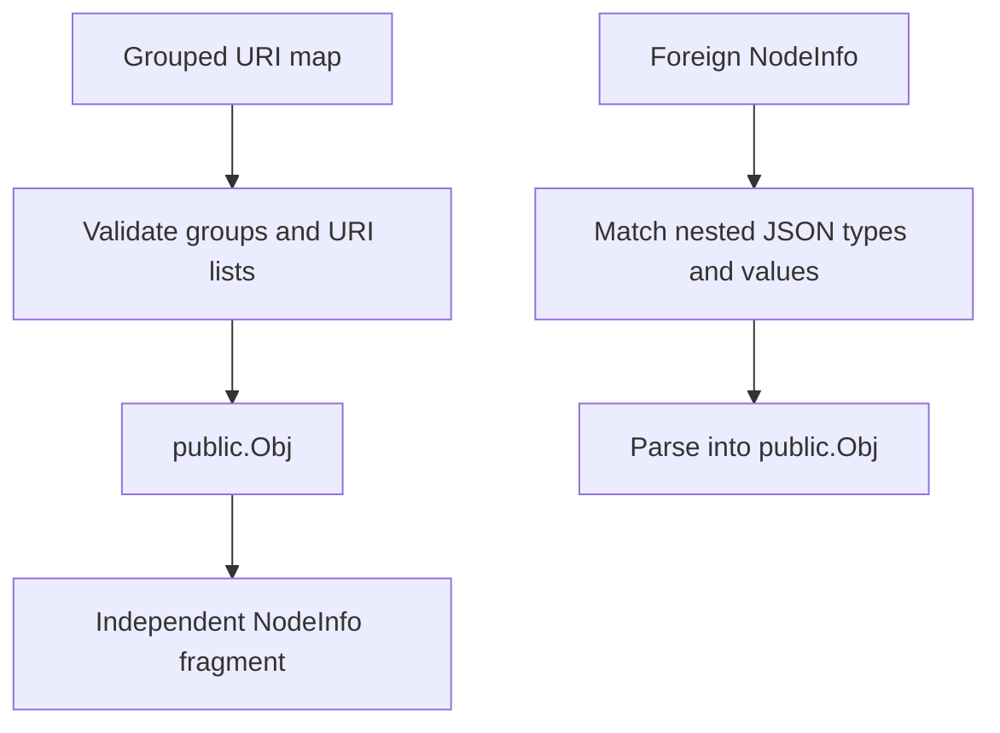

# public sigil

The `public` sigil publishes peering URIs grouped by network or transport label. It is bounded to 8 groups and 16 URIs
per group.

## Contents

- [NodeInfo shape](#nodeinfo-shape)
- [Validation](#validation)
- [Construction](#construction)
- [Foreign NodeInfo](#foreign-nodeinfo)
- [Ownership and concurrency](#ownership-and-concurrency)
- [API](#api)
- [Example](#example)

## NodeInfo shape

```json
{
  "public": {
    "internet": [
      "tls://203.0.113.10:443",
      "tcp://[2001:db8::10]:8443"
    ],
    "tor": [
      "socks://example.onion:9001"
    ]
  }
}
```



## Validation

| Constraint     | Value                            |
|----------------|----------------------------------|
| Groups         | 1 to 8                           |
| Group name     | `^[a-z0-9]{2,16}$`               |
| URIs per group | 1 to 16                          |
| URI length     | 8 to 256 bytes                   |
| URI characters | `a-z`, `A-Z`, `0-9`, `+._/:@[]-` |

The URI expression is `^[a-zA-Z0-9+._/:@\[\]-]{8,256}$`. It bounds and filters advertised text but does not parse the
URI or verify reachability.

## Construction

```go
publicSigil, err := public.New(map[string][]string{
    "internet": {
        "tls://203.0.113.10:443",
        "tcp://[2001:db8::10]:8443",
    },
})
if err != nil {
    return err
}
```

`New` copies the map and every URI slice.

## Foreign NodeInfo

JSON decoding produces `map[string]any` whose values are `[]any` strings. Local `map[string][]string` data is also
accepted.

- `Match` validates every group and URI;
- package-level `ParseParams` extracts only `public`;
- package-level `Parse` rejects missing or malformed data;
- `(*Obj).ParseParams` changes the receiver only after full validation.

An empty map or group does not match. A single wrong nested type rejects the complete sigil.

## Ownership and concurrency

`New`, `Peers`, `Params`, and `Clone` deep-copy the map and its slices. `SetParams` returns a copied top-level NodeInfo
map and rejects an existing `public` key.

`Obj` is not synchronized. `ParseParams` must not run concurrently with readers on the same object. Use `Clone` for
independent ownership.

## API

| API                                | Contract                                  |
|------------------------------------|-------------------------------------------|
| `Name()`                           | returns `"public"`                        |
| `Keys()`                           | returns `[]string{"public"}`              |
| `New(map[string][]string)`         | validates and copies local data           |
| `Match(map[string]any)`            | validates foreign nested data             |
| `Parse(map[string]any)`            | returns a validated object                |
| `ParseParams(map[string]any)`      | extracts the owned key                    |
| `(*Obj).Peers()`                   | returns a deep copy of grouped URIs       |
| `(*Obj).Params()`                  | returns a copied NodeInfo fragment        |
| `(*Obj).SetParams(map[string]any)` | merges into a copied map                  |
| `(*Obj).Clone()`                   | returns an independent `sigils.Interface` |

`Obj` implements [`sigils.Interface`](../README.md#interface-contract).

## Example

```go
sigil, err := public.New(map[string][]string{
    "internet": {"tls://203.0.113.10:443"},
})
if err != nil {
    return err
}

for group, uris := range sigil.Peers() {
    fmt.Println(group, uris)
}
```
