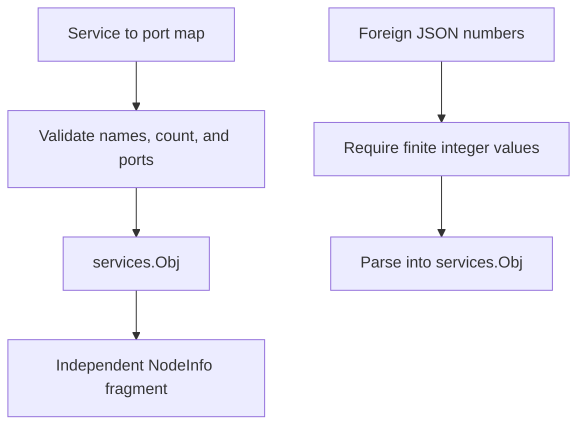

# services sigil

The `services` sigil advertises named TCP or UDP service ports reachable through Yggdrasil. It stores at most 256
entries.

## Contents

- [NodeInfo shape](#nodeinfo-shape)
- [Validation](#validation)
- [Construction](#construction)
- [Foreign NodeInfo](#foreign-nodeinfo)
- [Ownership and concurrency](#ownership-and-concurrency)
- [API](#api)
- [Example](#example)

## NodeInfo shape

```json
{
  "services": {
    "http": 80,
    "ssh": 22,
    "mumble": 64738
  }
}
```



## Validation

| Constraint   | Value                |
|--------------|----------------------|
| Services     | 1 to 256             |
| Service name | `^[a-z0-9_-]{2,32}$` |
| Port         | 1 to 65535           |

Names are labels, not protocol declarations. Applications decide whether a named port uses TCP, UDP, or both.

## Construction

```go
servicesSigil, err := services.New(map[string]uint16{
    "http": 80,
    "ssh":  22,
})
if err != nil {
    return err
}
```

The constructor rejects empty maps, zero ports, invalid names, and more than 256 entries. It copies the input map.

## Foreign NodeInfo

Numbers decoded into `map[string]any` use `float64`. A foreign port matches only when it is finite, integral, and in the
range 1 to 65535. `NaN`, infinity, fractions, zero, negative values, larger values, and Go `int` values are rejected.
Native `map[string]uint16` data is accepted for local use.

- package-level `Match` validates the complete map;
- package-level `ParseParams` extracts `services`;
- package-level `Parse` returns a validated object;
- `(*Obj).ParseParams` updates the receiver only when every entry is valid.

## Ownership and concurrency

`New`, `Services`, `Params`, and `Clone` return or retain independent maps. `SetParams` copies the top-level NodeInfo
map and rejects an existing `services` key.

`Obj` is not synchronized. Do not update it with `ParseParams` while another goroutine reads it. Clone before assigning
mutable ownership to another component.

## API

| API                                | Contract                                  |
|------------------------------------|-------------------------------------------|
| `Name()`                           | returns `"services"`                      |
| `Keys()`                           | returns `[]string{"services"}`            |
| `New(map[string]uint16)`           | validates and copies local data           |
| `Match(map[string]any)`            | validates names and JSON-number ports     |
| `Parse(map[string]any)`            | returns a validated object                |
| `ParseParams(map[string]any)`      | extracts the owned key                    |
| `(*Obj).Services()`                | returns a copied service map              |
| `(*Obj).Params()`                  | returns a copied NodeInfo fragment        |
| `(*Obj).SetParams(map[string]any)` | merges into a copied map                  |
| `(*Obj).Clone()`                   | returns an independent `sigils.Interface` |

`Obj` implements [`sigils.Interface`](../README.md#interface-contract).

## Example

```go
sigil, err := services.New(map[string]uint16{
    "http": 80,
    "ssh":  22,
})
if err != nil {
    return err
}

for name, port := range sigil.Services() {
    fmt.Printf("%s: %d\n", name, port)
}
```
