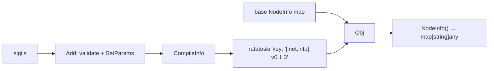

# mod/sigils/sigil_core

Sigil registration, assembly, and metadata management for local NodeInfo.

Takes a base `map[string]any` (NodeInfo) and a set of sigils, validates and merges them, and maintains the `ratatoskr`
metadata key that lists active sigils and the library version.

## Obj

```go
obj, errs := sigil_core.New(nodeInfo, sigils...)
```

Creates an `Obj` from a base NodeInfo map and optional sigils. If `nodeInfo` is `nil`, an empty map is used. Errors are
non-fatal: each failed sigil is skipped, the rest are applied normally.

| Method      | Signature                          | Description                                                        |
|-------------|------------------------------------|--------------------------------------------------------------------|
| `NodeInfo`  | `() map[string]any`                | Returns the assembled map ready for `yggcore.SetNodeInfo`          |
| `Sigils`    | `() map[string]sigils.Interface`   | Returns registered sigils                                          |
| `Add`       | `(sg ...sigils.Interface) []error` | Registers sigils, writes keys into map, updates ratatoskr metadata |
| `Get`       | `(name string) sigils.Interface`   | Returns sigil by name or `nil`                                     |
| `Del`       | `(name string) error`              | Removes sigil, its keys, and updates ratatoskr metadata            |
| `String`    | `() string`                        | Human-readable summary                                             |
| `LenSigils` | `() int`                           | Number of registered sigils                                        |
| `LenLocal`  | `() int`                           | Number of keys in assembled NodeInfo                               |
| `Len`       | `() int`                           | `LenSigils() + LenLocal()`                                         |

`Add` validates each sigil name, checks for duplicates, calls `SetParams` to merge keys into the internal map, and
updates the `ratatoskr` metadata key via `CompileInfo`.

`Del` removes the sigil's param keys from the map and recompiles the metadata key.

## Package-level functions

| Function      | Signature                              | Description                                                |
|---------------|----------------------------------------|------------------------------------------------------------|
| `CompileInfo` | `(map[string]sigils.Interface) string` | Assembles the ratatoskr metadata string from sigil names   |
| `ParseInfo`   | `(string) (string, []string, error)`   | Parses a ratatoskr info string into version and sigil list |

### Metadata format

```
[sigil1,sigil2] v0.1.3
```

Sigil names are sorted alphabetically. The version comes from `target.GlobalVersion`.


