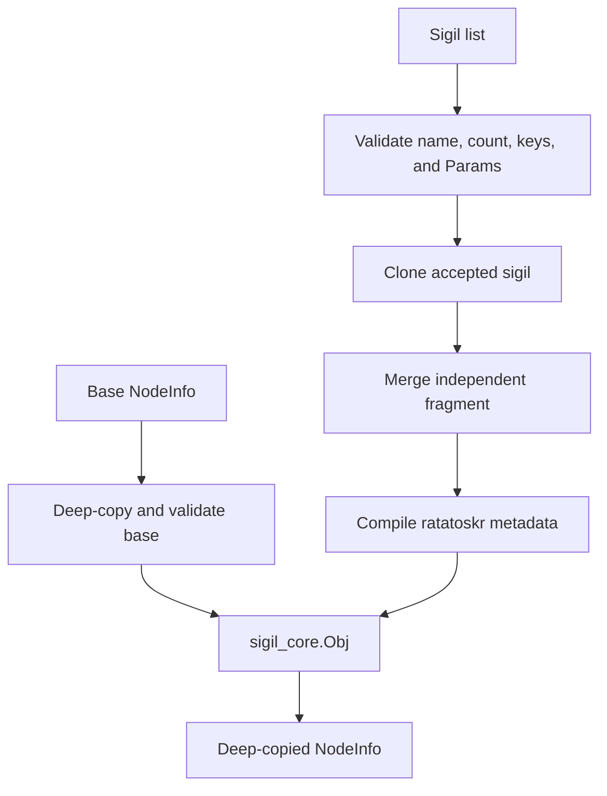

# mod/sigils/sigil_core

Concurrency-safe registration and assembly of sigils into local NodeInfo. The object owns copies of the base map and
every registered sigil and maintains the `ratatoskr` metadata key.

## Contents

- [Assembly flow](#assembly-flow)
- [Construction](#construction)
- [Registry operations](#registry-operations)
- [Ownership and concurrency](#ownership-and-concurrency)
- [Metadata](#metadata)
- [Limits and errors](#limits-and-errors)
- [Example](#example)

## Assembly flow



## Construction

```go
builder, errs := sigil_core.New(baseNodeInfo, sigils...)
```

`New` deep-copies the base NodeInfo and processes every sigil independently. Invalid entries are skipped and returned as
separate errors; valid entries remain available in the returned object. A nil base becomes an empty map.

This partial-result contract lets callers choose strict or permissive handling:

```go
builder, errs := sigil_core.New(baseNodeInfo, configuredSigils...)
if len(errs) != 0 {
    return errors.Join(errs...)
}
nodeInfo := builder.NodeInfo()
```

## Registry operations

| Method      | Contract                                                                  |
|-------------|---------------------------------------------------------------------------|
| `NodeInfo`  | returns a deep copy of assembled data                                     |
| `Sigils`    | returns a new map containing cloned sigils                                |
| `Add`       | validates, clones, merges, and updates metadata; returns per-entry errors |
| `Get`       | returns a clone or nil                                                    |
| `Del`       | removes a sigil, populated keys, and its metadata name                    |
| `LenSigils` | returns registered sigil count                                            |
| `LenLocal`  | returns assembled NodeInfo key count, including metadata                  |
| `Len`       | returns `LenSigils() + LenLocal()`                                        |
| `String`    | returns the metadata key and value                                        |

`Del` removes keys present in the stored sigil's current `Params`. An optional key that the sigil did not populate is
preserved when it came from the base NodeInfo.

## Ownership and concurrency

`Obj` serializes registry mutation with `sync.RWMutex`. Its methods may be called concurrently.

Ownership boundaries are stronger than the lock alone:

- base NodeInfo is deep-copied;
- each accepted sigil is cloned before storage;
- sigil `Params` is deep-copied before merge;
- `NodeInfo`, `Sigils`, and `Get` return independent data.

A third-party sigil whose `Clone` returns nil is rejected. Cyclic or deeper-than-64-level NodeInfo data is rejected
through [`internal/common.CloneNodeInfo`](../../../internal/common/README.md#nodeinfo-ownership).

## Metadata

The top-level `ratatoskr` key has this format:

```text
[inet,info,services] v1.0.0
```

Names are sorted and deduplicated. An empty explicit version falls back to the generated Ratatoskr version.

| Function             | Contract                                                |
|----------------------|---------------------------------------------------------|
| `CompileInfo`        | compiles registry names with the current version        |
| `CompileInfoVersion` | compiles registry names with a supplied version         |
| `CompileInfoNames`   | copies, sorts, and deduplicates a name slice            |
| `ParseInfo`          | parses an optional prefix, bracketed names, and version |

`ParseInfo` accepts at most 64 unique sigil names. Each name must satisfy `sigils.ValidateName`. The version is limited
to 64 printable ASCII characters.

## Limits and errors

- no more than 64 sigils can be registered;
- duplicate names are rejected;
- a key conflict with base NodeInfo or another sigil rejects that sigil;
- nil sigils and invalid names are rejected;
- cyclic or excessively deep parameters are rejected;
- `Add` continues after an invalid entry and returns all collected errors;
- `Del` returns an error when the name is absent.

## Example

```go
identity, err := info.New(info.ConfigObj{
    Name: "edge.example.net",
    Type: "router",
})
if err != nil {
    return err
}

servicesList, err := services.New(map[string]uint16{"http": 80})
if err != nil {
    return err
}

builder, errs := sigil_core.New(
    map[string]any{"operator": "example"},
    identity,
    servicesList,
)
if len(errs) != 0 {
    return errors.Join(errs...)
}

nodeInfo := builder.NodeInfo()
```
