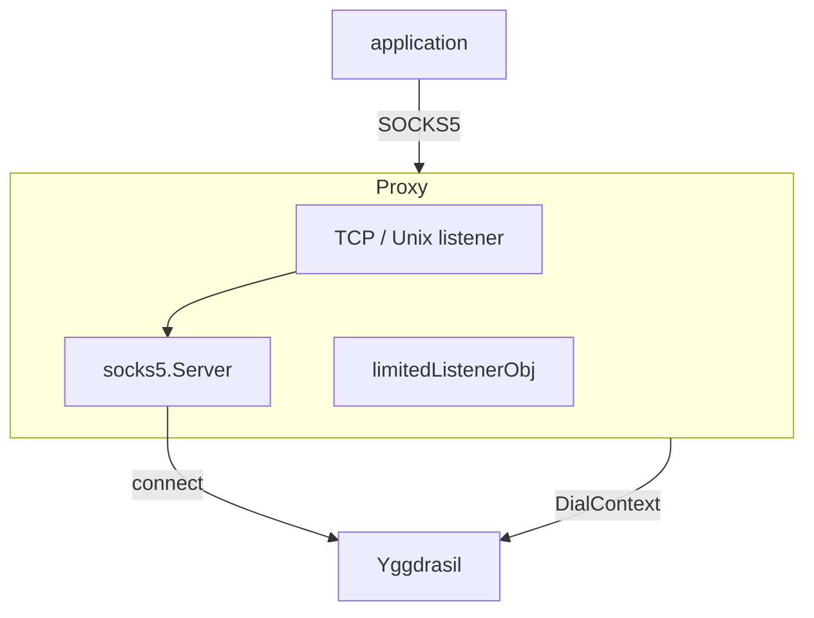
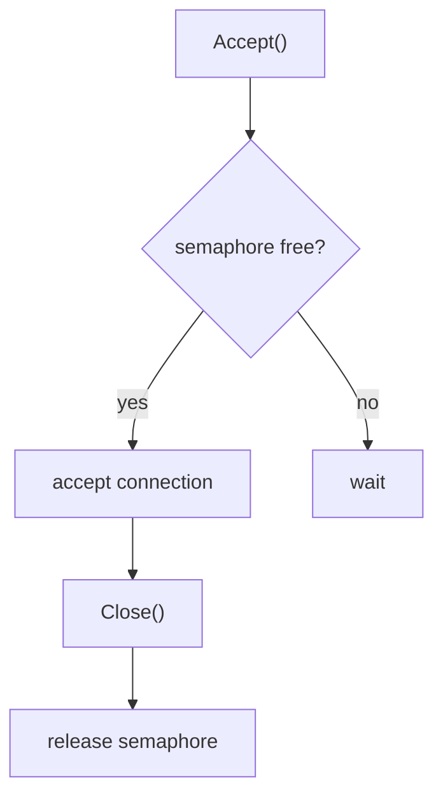
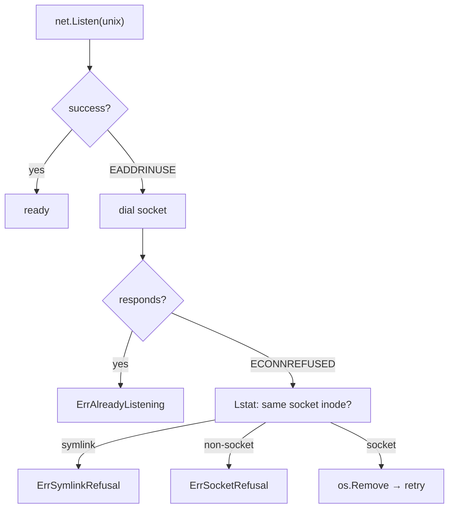

# SOCKS5 server

Package `socks` exposes a caller-supplied Yggdrasil dialer through SOCKS5 over
TCP or a private Unix socket.

Defaults are 256 accepted connections, 1024 UDP targets per server, 128 targets
per session, 64 queued packets and 64 KiB per target, a 10-second handshake and
dial timeout, and a 5-minute TCP idle timeout. The per-principal UDP target limit
is intentionally unlimited unless configured.

## Contents

- [Overview](#overview)
- [Initialization](#initialization)
- [Runtime control](#runtime-control)
- [TCP and Unix socket](#tcp-and-unix-socket)
- [Connection limiting](#connection-limiting)
- [Unix socket handling](#unix-socket-handling)
- [Errors](#errors)

---

## Overview



The application connects to a SOCKS5 proxy (TCP or Unix socket), the proxy resolves the address via the provided
`NameResolver`
and establishes a connection through the Yggdrasil dialer.

---

## Initialization

```go
s, err := socks.New(socks.ConfigObj{
    Network:                              node,
    Addr:                                 "127.0.0.1:1080",
    Resolver:                             resolver,
    Logger:                               logger,
    MaxConnections:                       100,
    HandshakeTimeout:                     10 * time.Second,
    DialTimeout:                          10 * time.Second,
    TunnelIdleTimeout:                    5 * time.Minute,
    MaxAssociateTargetsPerSession:         128,
    MaxAssociateTargetsPerPrincipal:       64,
    MaxAssociateQueuedPacketsPerTarget:    64,
    MaxAssociateQueuedBytesPerTarget:      64 << 10,
    Credentials:                           credentials,
})
if err != nil {
    return err
}
defer func() { _ = s.Close() }()
```

Creates and starts a SOCKS5 proxy. Close it with `Close`. Startup binds the
listener before launching workers, so a bind failure leaves no background work
behind. A handle used through `Start` remains disabled and may be retried after
the address conflict is fixed.

---

## Runtime control

```go
s.IsEnabled() // true
s.Addr()      // "127.0.0.1:1080"
s.IsUnix()    // false

s.SetMaxConnections(512)

err := s.Close() // stop and clean up
```

| Method                 | Description                          |
|------------------------|--------------------------------------|
| `Close()`              | Stops the proxy; idempotent          |
| `Addr()`               | Current listening address            |
| `IsUnix()`             | `true` if listening on a Unix socket |
| `IsEnabled()`          | `true` if the proxy is running       |
| `SetMaxConnections(n)` | Updates the active connection limit  |

`MaxConnections` is the only runtime-mutable setting. Timeouts and UDP ASSOCIATE queue limits are immutable: set them
through `ConfigObj` at `Start`. `TunnelIdleTimeout` uses a 5 minute safe default when set to `0`; use a negative value
only when idle tunnels must stay open indefinitely.

---

## TCP and Unix socket

The listener type is determined by the address:

| Address                             | Type        |
|-------------------------------------|-------------|
| `127.0.0.1:1080`                    | TCP         |
| `[::1]:1080`                        | TCP         |
| `/run/user/1000/ratatoskr/ygg.sock` | Unix socket |
| `./private/local.sock`              | Unix socket |

An address starting with `/` or `.` selects a Unix socket. Every other address selects TCP.

---

## Connection limiting

The listener is always wrapped in a `limitedListenerObj` backed by a `common.DynamicLimitObj`, a runtime-adjustable
semaphore, so `SetMaxConnections` can change the limit while the proxy runs. `MaxConnections: 0` uses the safe default
(`256`); a negative value makes the limit unlimited, and `Accept` never blocks on it.

UDP ASSOCIATE targets are bounded to 1024 per server and 128 per session by default. The per-principal limit is
optional and unlimited by default; set `MaxAssociateTargetsPerPrincipal` to isolate an authenticated user or source IP.
A negative `MaxAssociateTargetsPerSession` disables only the per-session cap. Each server also owns its bounded worker
pool, so load or credentials on one embedded proxy cannot consume another proxy's quota or queue.

The ASSOCIATE relay idle deadline refreshes after a valid, unfragmented datagram from the accepted client or a reverse
response. Malformed and fragmented datagrams do not keep the relay alive.

Each established target has its own writer goroutine. A blocked target therefore cannot stop packets for other targets
in the same ASSOCIATE session. Its queue is bounded by both packet count (64 by default) and actual payload bytes
(64 KiB by default). A packet that would exceed either limit is dropped only for that target and increments
`Snapshot().DroppedAssociatePackets`. Packets arriving while that target is still resolving or dialing are also counted
as drops. Set a queue limit below zero only for an explicit unbounded-memory deployment.

The upstream SOCKS server resolves a domain-form client address before creating an ASSOCIATE session. A broken custom
resolver that returns no IP is rejected with `RepHostUnreachable` instead of creating a session that can never accept a
datagram. A reverse response whose SOCKS header would push it beyond the maximum UDP payload is dropped and counted;
the target remains usable for later packets.

`Snapshot()` also reports active, pending, and rejected targets. Counters are cumulative and are not reset by reads.



- `Accept` blocks when the limit is reached
- `Close` releases the slot exactly once (`sync.Once`)
- Repeated `Close` calls are safe

---

## Unix socket handling

On startup with a Unix socket, stale files are handled:



- If a live process holds the socket, startup fails.
- The parent directory must exist, must not be a symlink, and must be private (`0700` or stricter)
- A stale socket is removed only after `ECONNREFUSED` and a same-inode check
- Symlinks and other non-socket paths are refused, never removed (`ErrSymlinkRefusal` / `ErrSocketRefusal`)
- Socket permissions are fixed at `0600`

On `Close`, the Unix socket file is automatically removed.

---

## Errors

| Variable                  | Description                                    |
|---------------------------|------------------------------------------------|
| `ErrAlreadyEnabled`       | `New` called while the proxy is already open   |
| `ErrAlreadyListening`     | Unix socket is held by another process         |
| `ErrAssociateTargetLimit` | UDP ASSOCIATE target limit reached             |
| `ErrInvalidAddress`       | Empty or invalid listen address                |
| `ErrNetworkRequired`      | `Start` called without a `Network` dialer      |
| `ErrResolverRequired`     | Domain target used without an allowed resolver |
| `ErrSymlinkRefusal`       | Refusal to remove a symlink (safety measure)   |
| `ErrSocketRefusal`        | Refusal to remove a non-socket path (safety)   |
| `ErrUnsafeSocketDir`      | Unix socket parent directory is not private    |
| `ErrSocketChanged`        | Socket path changed during the stale probe     |
