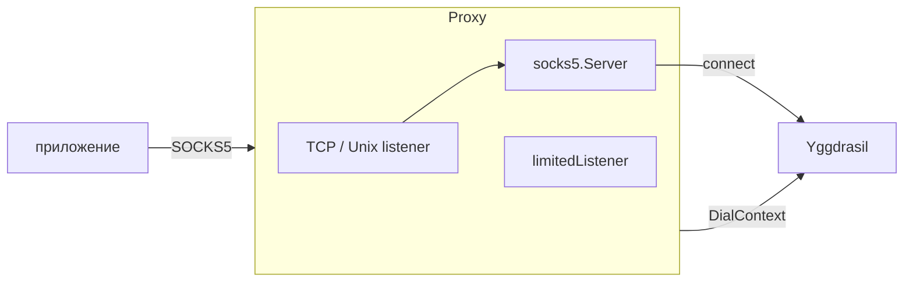
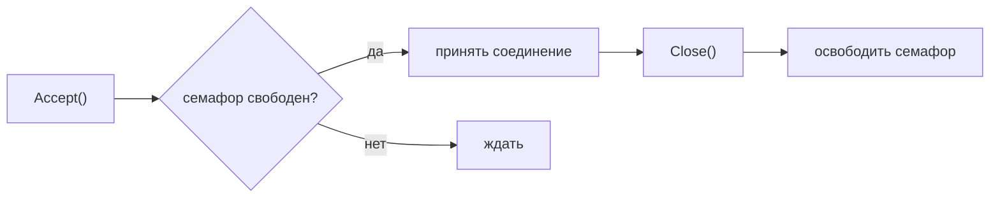
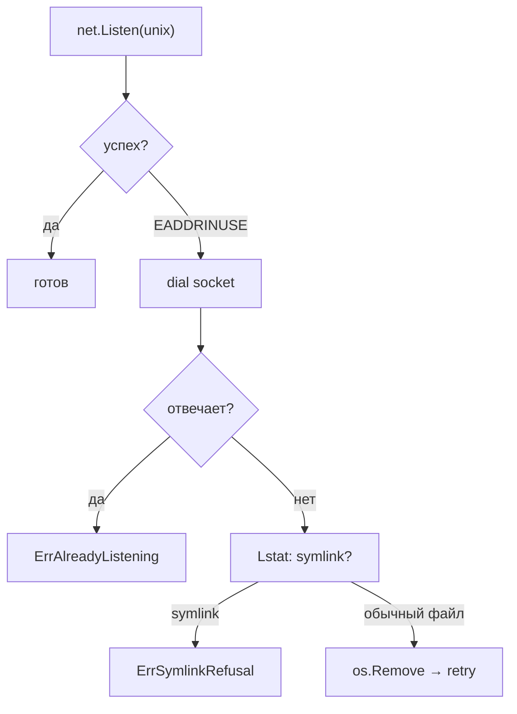

# mod/socks

SOCKS5-прокси поверх Yggdrasil. Позволяет обычным приложениям выходить в сеть Yggdrasil через стандартный
SOCKS5-протокол.

## Содержание

- [Обзор](#обзор)
- [Инициализация](#инициализация)
- [Включение и выключение](#включение-и-выключение)
- [TCP и Unix socket](#tcp-и-unix-socket)
- [Ограничение соединений](#ограничение-соединений)
- [Обработка Unix socket](#обработка-unix-socket)
- [Ошибки](#ошибки)

---

## Обзор



Приложение подключается к SOCKS5-прокси (TCP или Unix socket), прокси резолвит адрес через заданный `NameResolver`
и устанавливает соединение через Yggdrasil-диалер.

---

## Инициализация

```go
s := socks.New(node) // node — proxy.ContextDialer (обычно core.Obj)
```

Создаёт SOCKS5-прокси, но не запускает его. Для старта нужен `Enable`.

---

## Включение и выключение

```go
err := s.Enable(socks.EnableConfigObj{
Addr:           "127.0.0.1:1080", // или "/tmp/ygg.sock"
Resolver:       resolver,         // резолвер имён (.pk.ygg, DNS)
Verbose:        false, // логирование каждого соединения
Logger:          logger,
MaxConnections: 100, // 0 — без ограничений
})

s.IsEnabled() // true
s.Addr()   // "127.0.0.1:1080"
s.IsUnix() // false

err := s.Disable() // остановка, очистка
```

| Метод         | Описание                                  |
|---------------|-------------------------------------------|
| `Enable(cfg)` | Запускает прокси; ошибка если уже запущен |
| `Disable()`   | Останавливает прокси; идемпотентен        |
| `Addr()`      | Текущий адрес прослушивания               |
| `IsUnix()`    | `true` если слушает Unix socket           |
| `IsEnabled()` | `true` если прокси запущен                |

Поддерживается цикл `Enable → Disable → Enable`.

---

## TCP и Unix socket

Тип листенера определяется по адресу:

| Адрес            | Тип         |
|------------------|-------------|
| `127.0.0.1:1080` | TCP         |
| `[::1]:1080`     | TCP         |
| `/tmp/ygg.sock`  | Unix socket |
| `./local.sock`   | Unix socket |

Правило: адрес начинается с `/` или `.` → Unix socket, иначе TCP.

---

## Ограничение соединений

При `MaxConnections > 0` листенер оборачивается в `limitedListener` с семафором на базе буферизованного канала.



- `Accept` блокируется если достигнут лимит
- `Close` освобождает слот ровно один раз (`sync.Once`)
- Повторный `Close` безопасен

---

## Обработка Unix socket

При старте на Unix socket обрабатываются старые файлы:



- Если сокет занят живым процессом — ошибка
- Если сокет «мёртвый» — удаляется и пересоздаётся
- Симлинки не удаляются (защита от атак)

При `Disable` Unix socket файл автоматически удаляется.

---

## Ошибки

| Переменная            | Описание                                 |
|-----------------------|------------------------------------------|
| `ErrAlreadyEnabled`   | `Enable` вызван на уже запущенном прокси |
| `ErrAlreadyListening` | Unix socket занят другим процессом       |
| `ErrSymlinkRefusal`   | Отказ удалять симлинк (защита)           |
