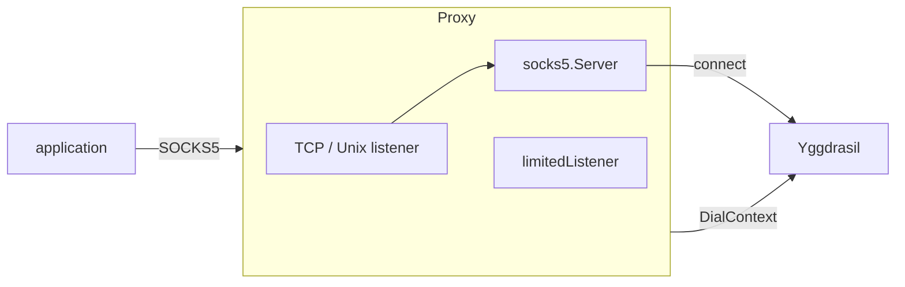
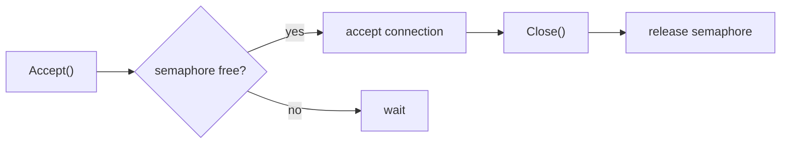

# mod/socks

SOCKS5 proxy over Yggdrasil. Allows regular applications to access the Yggdrasil network via the standard
SOCKS5 protocol.

## Contents

- [Overview](#overview)
- [Initialization](#initialization)
- [Enabling and disabling](#enabling-and-disabling)
- [TCP and Unix socket](#tcp-and-unix-socket)
- [Connection limiting](#connection-limiting)
- [Unix socket handling](#unix-socket-handling)
- [Errors](#errors)

---

## Overview



The application connects to a SOCKS5 proxy (TCP or Unix socket), the proxy resolves the address via the provided
`NameResolver`
and establishes a connection through the Yggdrasil dialer.

---

## Initialization

```go
s := socks.New(node) // node — proxy.ContextDialer (usually core.Obj)
```

Creates a SOCKS5 proxy but does not start it. Call `Enable` to start.

---

## Enabling and disabling

```go
err := s.Enable(socks.EnableConfigObj{
Addr:           "127.0.0.1:1080", // or "/tmp/ygg.sock"
Resolver:       resolver,         // name resolver (.pk.ygg, DNS)
Verbose:        false, // log every connection
Logger:          logger,
MaxConnections: 100, // 0 — unlimited
})

s.IsEnabled() // true
s.Addr()   // "127.0.0.1:1080"
s.IsUnix() // false

err := s.Disable() // stop and clean up
```

| Method        | Description                                |
|---------------|--------------------------------------------|
| `Enable(cfg)` | Starts the proxy; error if already running |
| `Disable()`   | Stops the proxy; idempotent                |
| `Addr()`      | Current listening address                  |
| `IsUnix()`    | `true` if listening on a Unix socket       |
| `IsEnabled()` | `true` if the proxy is running             |

The `Enable → Disable → Enable` cycle is supported.

---

## TCP and Unix socket

The listener type is determined by the address:

| Address          | Type        |
|------------------|-------------|
| `127.0.0.1:1080` | TCP         |
| `[::1]:1080`     | TCP         |
| `/tmp/ygg.sock`  | Unix socket |
| `./local.sock`   | Unix socket |

Rule: if the address starts with `/` or `.` — Unix socket, otherwise TCP.

---

## Connection limiting

When `MaxConnections > 0`, the listener is wrapped in a `limitedListener` with a semaphore based on a buffered channel.



- `Accept` blocks when the limit is reached
- `Close` releases the slot exactly once (`sync.Once`)
- Repeated `Close` calls are safe

---

## Unix socket handling

On startup with a Unix socket, stale files are handled:


- If the socket is held by a live process — error
- If the socket is stale — it is removed and recreated
- Symlinks are not removed (protection against attacks)

On `Disable`, the Unix socket file is automatically removed.

---

## Errors

| Variable              | Description                                  |
|-----------------------|----------------------------------------------|
| `ErrAlreadyEnabled`   | `Enable` called on an already running proxy  |
| `ErrAlreadyListening` | Unix socket is held by another process       |
| `ErrSymlinkRefusal`   | Refusal to remove a symlink (safety measure) |
